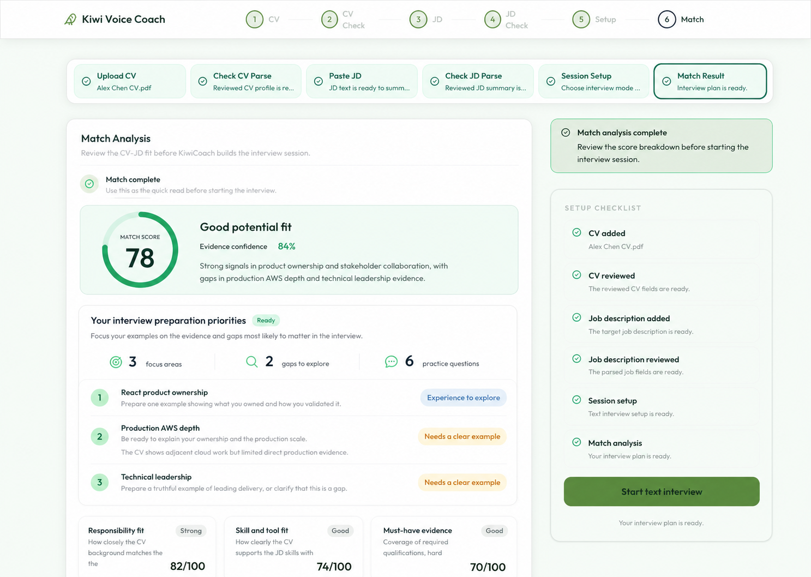
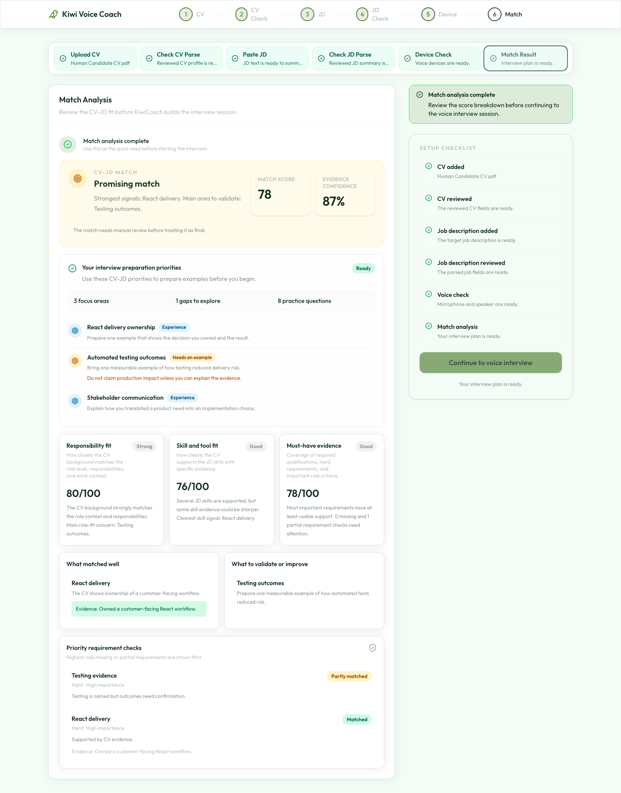

# Kiwi Match UI 優化計畫

狀態：local implementation complete；mocked human browser flow passed，real-provider/production validation pending

日期：2026-07-26 NZST

對應目標：[Kiwi Match → Interview Preparation Optimization Goal](jobsync-match-optimization-goal.md)

對應規格：[Kiwi Match → Interview Preparation Optimization Spec](jobsync-match-optimization-spec.md)

## 產品主線

Analyze 的任務不是改善 CV，而是把 Match evidence 轉成 targeted interview preparation：

```text
確認 CV / JD / Session setup
  -> Generate match analysis
  -> 真實 Match streaming progress
  -> 完整 Match result 立即可讀
  -> Interview preparation priorities
  -> Start interview
```

不加入：

- `Improve your CV for this role`
- ATS keywords / tailoring tips
- `fast` / `detail` mode 或 selector
- 第二套 Match score 或 question planner

## 使用者問題

目前 `AnalyzePage` 將 Match 和 interview plan 連續等待，造成：

- 使用者不知道 Match 真正進行到哪一步；
- Match 已完成時，畫面仍可能因 question preparation 保持 loading；
- evidence、gap 和 requirement details 很完整，但「面試先準備什麼」不夠靠前；
- input failure 沒有穩定指出應修復 CV 或 JD。

本 UI 優化只處理 Analyze 頁的 Match result workflow，不做全站 redesign。

## 先鎖定不能動的區域

下列是 current UI 與其他頁面共用或既有流程權威，本方案不改：

| Locked boundary | Current source | 原因 |
| --- | --- | --- |
| 全站 Header | `frontend/src/components/layout/AppHeader.jsx` | 多頁共用，不為 Match 改 navigation 或高度 |
| 頂部六步產品進度 | `frontend/src/components/layout/StepProgress.jsx` | 全站主流程，不改步驟、順序或文案 |
| Analyze 六個 setup cards | `frontend/src/components/analyze/AnalysisWorkflowShell.jsx` | 控制 CV/JD/Session setup/Match 導航，不重排 |
| Desktop 主欄 + 380px 右欄 | `frontend/src/pages/AnalyzePage.jsx` | 保持 `xl:grid-cols-[minmax(0,1fr)_380px]` |
| 右側 action rail 位置 | `frontend/src/components/analyze/AnalyzeActionsCard.jsx` | Prerequisite、Text/Voice readiness 與 primary action 的既有權威 |
| Common UI primitives | `frontend/src/components/common/Card.jsx`、`Button.jsx`、`StatusBanner.jsx` | 多頁共用；只重用，不改 global behavior |
| Shared loading component | `frontend/src/components/common/LoadingInsightPanel.jsx` | ReportPage 也在使用；Match 另建 local progress，不改 shared timer behavior |
| Global tokens | `frontend/src/index.css` | 保持 light mint、forest text、olive accent、glass surface 和 Outfit typography |
| Detailed Match evidence | `frontend/src/components/analyze/AnalysisStatusCard.jsx` | 保留 score、evidence、gaps、role map、requirement checks，不移出 canonical result card |
| Preparation privacy | Existing session/pool sanitizers | 不顯示完整 question pool、evidence ID、coverage、ranking 或 private proof metadata |

### 可以改的 Analyze-local 區域

- `AnalyzePage` 的 Match / plan state orchestration；
- `AnalysisStatusCard` 的 loading presentation 和完成後資訊順序；
- `ProofStrategyReviewPanel` 的視覺層級與 candidate-safe內容；
- `AnalyzeActionsCard` 的當前狀態 copy 和 primary action transition；
- 新的 Analyze-only `MatchProgressPanel` / `MatchInputErrorPanel`。

## UI 圖

下圖是 desktop completed state 的配置計畫。它以 current Analyze 頁為底，只改主 Match card 內部層級；Header、兩組步驟、雙欄比例與右側 rail 都保持原位。



下圖是 2026-07-26 Playwright human flow 從實際 React 頁面產生的 completed state；同一條測試接著點擊 `Continue to voice interview` 並確認 Voice Interview 的 start action 可見。



## Desktop 版面

```text
+----------------------------------------------------------------+----------------------+
| Shared AppHeader + shared top StepProgress (locked)                                    |
+----------------------------------------------------------------+----------------------+
| Analyze six-step workflow shell (locked order)                                         |
+----------------------------------------------------------------+----------------------+
| Main column                                                     | 380px action rail    |
|                                                                 |                      |
| AnalysisStatusCard                                              | StatusBanner         |
|  1. Match complete header                                       | Setup checklist      |
|  2. Overall Match summary                                       | Current plan status  |
|  3. Your interview preparation priorities                       | Primary action       |
|  4. Score explanation cards                                     | Helper copy          |
|  5. What matched well / What to validate                         |                      |
|  6. Evidence strength / Role Evidence / Requirement checks       |                      |
+----------------------------------------------------------------+----------------------+
```

右欄不複製完整 progress 或 Match result。它只回答：現在能不能開始，以及下一個 action 是什麼。

## Match 與 Plan 分離狀態

### Match state

```yaml
matchUiState:
  status: idle|connecting|running|completed|failed
  requestId: string|null
  currentStage: string|null
  completedStages: [string]
  error:
    code: string
    message: string
    retryable: boolean
    repairTarget: cv|jd|match|null
  result: MatchAnalyzeResult|null
```

### Interview preparation state

```yaml
interviewPlanUiState:
  status: idle|preparing|ready|degraded|failed
  summary:
    focusAreaCount: integer
    gapCount: integer
    questionCount: integer
    focusAreas: [CandidateSafeFocusArea]
  sessionId: string|null
  error:
    message: string
    retryable: boolean
```

規則：

- 只有 canonical persisted `match_completed` 可以啟動 preparation。
- Match completed 後立即 render result，不等待 plan。
- Plan preparing/failed 不會讓 Match 回到 skeleton。
- Retry plan 不重新執行有效 Match。
- Streaming UI 不推測 partial score 或百分比。

## State A：Match 執行中

`AnalysisStatusCard` 內以 Analyze-specific progress 取代 timer-driven Match 提示：

```text
Match Analysis

✓ Checking your inputs
✓ Reviewing role requirements
● Matching your CV evidence
○ Quality-checking the match
○ Saving your analysis
○ Preparing your interview focus

Matching your CV evidence…
Checking which role requirements are supported by your reviewed CV.
```

| Backend stage | Candidate label |
| --- | --- |
| `input_validation` | Checking your inputs |
| `role_fit_gate` | Reviewing role requirements |
| `cv_load` / `cache_lookup` | Preparing your reviewed CV |
| `evidence_match` | Matching your CV evidence |
| `quality_review` | Quality-checking the match |
| `persistence` | Saving your analysis |
| `question_filter` | Finalising your Match |
| `complete` | Match analysis complete |

Progress rules：

- 只顯示 completed、active、pending、skipped、failed；
- 不顯示百分比；
- cache hit / skipped 依 backend event 如實呈現；
- 沒有新 event 時停在最後一個真實 stage，不輪播假 stage；
- candidate copy 不出現 embedding、critic、provider、cache key、prompt 或 internal service name。

右欄保持原位置，primary button disabled，顯示一行 current stage，不複製整份 step list。

## State B：Match completed，Preparation preparing

Main：

- 立即顯示完整 Match summary 和 details；
- 在 summary 下方放 `Preparing your interview focus` panel；
- panel 只顯示正在建立 focus，不顯示 fake question count。

Right rail：

```text
Preparing your interview session…
Your saved Match is ready. We’re preparing the question focus.
```

使用者清楚知道 Match 已完成，只是下一步還在準備。

## State C：Match completed，Preparation ready

### 主內容順序

1. Match complete header
2. Overall Match summary
3. Your interview preparation priorities
4. Existing score cards
5. What matched well / What to validate
6. Existing evidence strength、role evidence map、requirement checks

### Overall Match summary

保留現有：

- Match score；
- decision；
- evidence confidence；
- candidate-facing summary。

不更改 score semantics，也不加入另一個 readiness score。

### Your interview preparation priorities

這是現有 `ProofStrategyReviewPanel` 的強化版，不是新 question planner。

Header：

```text
Your interview preparation priorities                  Ready
Focus your examples on the evidence and gaps most likely to matter in the interview.
```

Counters：

```text
3 focus areas      2 gaps to explore      6 practice questions
```

Focus rows：

```text
React product ownership                         Experience to explore
Prepare one example showing what you owned and how you validated it.

Production AWS depth                            Needs a clear example
Be ready to explain your ownership and the production scale.
Risk: Your CV shows adjacent cloud work but limited direct production evidence.

Technical leadership                            Needs a clear example
Prepare a truthful example of leading delivery, or clarify that this is a gap.
```

只允許：

- `kind`：evidence 或 gap；
- candidate-facing `label`；
- existing `preparationHint`；
- candidate-safe `risk`；
- focus/gap/question counts。

禁止：

- 完整 prepared question text；
- evidence/question/coverage IDs；
- proof points、rank trace、weights；
- schema names、role-intent 或 semantic scorer terminology；
- 推測或編造候選人經歷。

### Detailed evidence

現有 score explanation、matched evidence、gaps/risks、evidence strength、Role Evidence Map 和 requirement checks 保持原內容與可查證性，只排在 preparation priorities 後面。

## State D：Preparation degraded / failed

### Degraded

Match 保持完整。Preparation panel 顯示已能安全提供的 focus summary，以及 plain-language limitation；右欄依既有 readiness policy 決定能否開始。

### Failed

Match 保持完整。右欄顯示：

```text
We couldn’t prepare the interview session.
[ Retry interview preparation ]
```

這個 action 不重新跑 Match。

## Input repair UI

可修復輸入錯誤必須指出來源：

```text
We couldn’t read enough usable text from this job description.

The content may contain broken formatting or unsupported characters.
Review the job description and try again.

[ Review job description ]
```

| Error code | UI action |
| --- | --- |
| `NO_CONTENT` | 返回相應 CV/JD input |
| `TOO_SHORT` | 說明需要更完整內容，返回相應 review step |
| `TOO_LONG` | 要求縮短或移除無關內容 |
| `CORRUPTED` | 說明可能存在 broken formatting/unsupported characters |
| `ROLE_FIT_REVIEW_REQUIRED` | 返回 JD Review |
| `MATCH_FAILED` | 顯示 `Try again` |
| `PERSISTENCE_FAILED` | 不顯示 complete；使用同一 request ID 重試 |

## 右側 Action Rail

| 狀態 | 顯示 |
| --- | --- |
| Match 前 | Existing setup checklist + `Generate match analysis`；沒有 mode selector |
| Match running | `Analysis in progress` + one-line current stage；button disabled |
| Match complete / plan preparing | `Preparing your interview session…`；Match result stays visible |
| Plan ready | `Start text interview` 或 existing voice action |
| Plan degraded | Existing readiness warning + allowed action |
| Plan failed | `Retry interview preparation`；不 rerun Match |

Right rail 的位置、寬度、setup checklist ownership 和 Text/Voice action 規則都不變。

## Responsive

### Desktop

- 保留 current `max-w-7xl` 和 380px 右欄。
- Progress/result 使用主欄寬度。
- Focus priorities 使用單欄 rows，避免多層 card。

### Tablet

- Action rail 依 current breakpoint 移到主內容後。
- Progress 與 focus rows 直向排列。
- Score summary 可維持 current responsive grid。

### Mobile

- 保留 existing sticky primary action。
- Running 時 sticky area 只顯示 current status + one-line helper。
- Focus row 依序顯示 label、kind、hint、risk。
- 不讓 sticky action 遮住 Match details。

## Visual direction

延續 current Kiwi：

- background：light mint；
- main text：dark forest；
- primary accent：muted olive/emerald；
- surfaces：white translucent glass；
- typography：current Outfit stack；
- shape：current rounded cards and compact pills。

用 typography、spacing、divider 和 very light tint 建立層級，避免 nested card wall。Preparation priorities 應比 score details 靠前，但不能比 Match summary 更像另一個產品。

## Accessibility

- Progress 使用文字 + icon，不只靠顏色。
- Current stage 使用 `aria-live="polite"`，避免每個小 event 打斷 screen reader。
- Terminal error 使用 `role="alert"`。
- Disabled action 搭配 helper copy。
- Focus rows 和 retry action keyboard accessible。
- Loading motion obeys `prefers-reduced-motion`。

## Implementation checklist

### UI-P0：Shared-boundary regression lock（完成）

- 為 Header、top steps、workflow order、380px rail 和 shared loading usage 建立/補足 snapshot or behavior checks。
- 確認 `LoadingInsightPanel` 仍可供 ReportPage 使用且未被 Match-specific logic 修改。

### UI-P1：State and transport（完成；durable retry/idempotency 仍屬 backend follow-up）

- 分離 `matchUiState` 和 `interviewPlanUiState`。
- 接入 Match stream parser/reducer。
- 保留 JSON fallback。
- 只有 persisted `match_completed` 觸發 preparation。

### UI-P2：Real Match progress and repair（完成 first slice）

- 新增 Analyze-only `MatchProgressPanel` / step map。
- 實作 completed、active、pending、skipped、failed。
- 實作 CV/JD repair-targeted errors。

### UI-P3：Preparation-priority hierarchy（完成）

- Match completed 立即 render result。
- 強化 `ProofStrategyReviewPanel` 為 `Your interview preparation priorities`。
- 使用 existing safe focus/hint/risk/count data。
- 將 score/evidence details 保留在同一 `AnalysisStatusCard` 下方。

### UI-P4：Action rail state（完成）

- 保持 380px position and setup ownership。
- 加入 Match running、plan preparing、ready/degraded/failed copy/actions。
- Plan retry 不 rerun Match。

### UI-P5：Responsive、accessibility and visual verification（desktop human fixture 完成；tablet/mobile manual review pending）

- Desktop/tablet/mobile + keyboard checks。
- Reduced-motion、screen reader status、sticky overlap verification。
- Browser screenshot 與 current shared pages regression review。

## Verification

Focused frontend tests：

- stream events 正確更新 progress，duplicate/stale sequence 不重複更新；
- `match_completed` 前不產生 interview plan；
- Match completed 後 plan loading 不隱藏 result；
- plan retry 不重新跑 Match；
- candidate summary 只顯示 allowlist；
- full question/evidence/rank private fields 不 render；
- input error 導向正確 review step；
- shared Header/steps/loading behavior 未改；
- mobile sticky action 不遮住內容。

Implementation 後最小 commands：

```bash
cd frontend
npm run test:all
npm run lint
npm run quality:all
```

Browser/human checks：

- 正常 streaming → Match completed → preparation ready；
- corrupted CV/JD repair flow；
- stream disconnect/retry；
- Match complete + plan failed；
- desktop、tablet、mobile；
- ReportPage shared loading 沒有 regression；
- candidate copy 不洩漏 private/internal fields。

## Acceptance Criteria

- 使用者只看到一個 `Generate match analysis`，沒有 mode selector。
- Analyze 不顯示 ATS、tailoring 或 `Improve your CV for this role`。
- Match running 顯示 backend 真實 stage，沒有 fake percentage/partial score。
- Match completed 立即顯示 canonical result，不等待 interview plan。
- Preparation ready 顯示 focus/gap/question counts、hint 和 risk。
- Full prepared questions 和 private artifacts 不進 candidate UI。
- 右欄位置與 Text/Voice action ownership 不變。
- Header、top steps、workflow cards、common primitives、shared loading 和其他頁面不受影響。
- Desktop、tablet、mobile、keyboard flow 可用。

## Non-goals

- 不改 Match score、decision、evidence-strength 或 critic authority。
- 不做 Fast Match、ATS optimizer、CV rewrite 或 resume tailoring。
- 不顯示 partial score、token、prompt、chain-of-thought 或 private question plan。
- 不 redesign 其他頁面或 global design system。
- 不因 UI 計畫新增 dependency。
- 本文件的 implemented screenshot 代表 mocked API desktop browser flow 已完成；不代表 real-provider、production rollout、tablet/mobile manual review 或真實裝置 voice session。

## Current source map

- Page orchestration：`frontend/src/pages/AnalyzePage.jsx`
- Workflow shell：`frontend/src/components/analyze/AnalysisWorkflowShell.jsx`
- Match result：`frontend/src/components/analyze/AnalysisStatusCard.jsx`
- Preparation summary：`frontend/src/components/analyze/ProofStrategyReviewPanel.jsx`
- Action rail：`frontend/src/components/analyze/AnalyzeActionsCard.jsx`
- Match view model：`frontend/src/utils/matchResultViewModel.js`
- Shared header/progress：`frontend/src/components/layout/AppHeader.jsx`、`StepProgress.jsx`
- Shared primitives：`frontend/src/components/common/`
- Global visual tokens：`frontend/src/index.css`

證據狀態：2026-07-26 local implementation 已接入 canonical Match SSE、Match/plan state separation、preparation priorities 和 Voice entry；backend full mock-safe gate 653 tests、Match 57/57、frontend quality 59 files / 321 tests + build、兩端 lint 与 mocked Playwright human flow 已通過。Real AI、production、tablet/mobile manual review 與真實音訊 session 尚未驗證。
