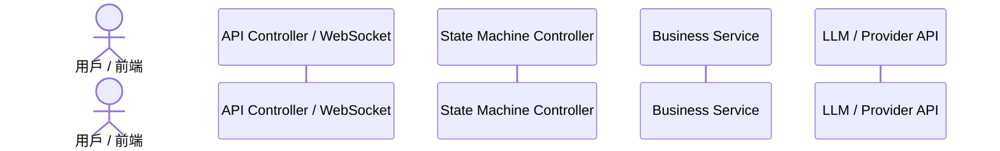

# Feature RFC: [Feature 名稱]

> **文件狀態**：[Draft / Under Review / Approved / Deprecated]  
> **系統成熟度 (Readiness Level)**：[Prototype / Single-EC2 Staging Candidate / Production-Ready]  
> **核心模組路徑**：`backend/src/...`, `frontend/src/...`  
> **Git 演進 Commit 追蹤**：[Commit SHA, PR #]  
> **主要負責人 / 日期**：[Author / Date]  

---

## 1. 演進軌跡與背景動機 (Genesis & Evolution Trace)

### 1.1 零基礎生活白話比喻 (Layman Analogy for Beginners)
> 💡 **小白導讀**：用日常生活中的例子來理解這個功能（例如：速食店得來速、郵局掛號信、餐廳排隊號碼牌）。

### 1.2 基於 Git 歷史的從 0 到 1 演進歷程
* **初始最簡版本 (Baseline v0)**：描述最初最簡實現方式（對應 Git 歷史初期 Commit / PR）。
* **遭遇的痛點與瓶頸 (Pain Points & Bottlenecks)**：真實測試中遇到的問題（格式損壞、延遲過高 > 3s、記憶體洩漏、資安漏洞）。
* **現行架構 (Current Version)**：演進後的現行架構與對應 Commit/PR 變更。

---

## 2. 邊界與成功標準 (Scope & Success Criteria)

### 2.1 涵蓋與非涵蓋範圍 (Scope Boundaries)
* **In-Scope (包含範圍)**：本 Feature 嚴格執行的功能。
* **Out-of-Scope / Non-Goals (排除範圍)**：本 Feature 故意不做或留待未來範疇。

### 2.2 成功標準與量化 KPIs (Acceptance Criteria & Metrics)
| 衡量指標 (Metric) | 目標值 (Target) | 驗證方式 / 自動化測試路徑 |
| :--- | :--- | :--- |

---

## 3. 架構與系統流向 (Architecture & Flow)

### 3.1 系統資料流與狀態轉移圖 (Data Flow & State Machine Diagram)


### 3.2 流程文字逐步拆解導覽 (Step-by-Step Narrative Walkthrough for Beginners)
> 💡 **小白講述指引**：看著圖講不出話？照著下面這幾步唸，就能順暢向面試官說明資料流向：
1. **第一步（發起請求）**：用戶在前端...
2. **第二步（控制器驗證）**：Gateway 中間件接收到請求後...
3. **第三步（核心邏輯執行）**：Service 層進行...
4. **第四步（結果傳回與渲染）**：最後傳回前端...

---

## 4. 微觀工程與程式碼替代方案對比 (Micro-SE & Code Trade-off Matrix)

### 4.1 關鍵函數 / 邏輯區塊：[函數或模組名稱]
* **現行程式碼位置**：[`path/to/file.js:L10-L30`](file:///absolute/path/to/file.js#L10-L30)

#### 現行真實程式碼 (Current Real Code Snippet)
```javascript
// 必須貼出本專案真實檔案的 Code Snippet，禁止使用偽代碼或佔位符！
```

#### 【逐行白話文解讀 (Line-by-Line Explanation for Beginners)】
* **第 1 行**：...
* **第 2 行**：...
* **第 3 行**：...

#### 替代寫法 A (Alternative Pattern A)
```javascript
// 替代寫法 A
```

#### 微觀工程對比矩陣 (Micro Trade-off Analysis)
| 對比維度 | 現行寫法 | 替代寫法 A |
| :--- | :--- | :--- |
| **時間複雜度 (Time)** | $O(N)$ | $O(N^2)$ |
| **空間與 GC 壓力 (Memory)** | 低 | 高 |
| **防禦性與邊界 (Boundary)** | 完美防衛 | 容易出錯 |
| **可讀性與維護性 (Readability)**| 高 | 差 |

---

## 5. 爆炸半徑與失敗矩陣 (Blast Radius & Failure Matrix)

### 5.1 影響範圍與依賴關係 (Blast Radius)
### 5.2 失敗路徑與降級機制 (Failure Modes & Fallbacks)

---

## 6. 運維與回滾步驟 (Incident Response & Rollback Runbook)

### 6.1 除錯與日誌起點 (Debugging & Observability)
### 6.2 緊急回滾流程 (Rollback SOP)

---

## 7. 轉碼新人面試實戰對攻劇本 (Career-Switcher Interview Q&A Defense Script)

> 💡 **說明**：面試官提問時，轉碼新人**直接用以下白話口語**回答，無需任何 AI 協助。

### 7.1 30 秒大白話 Core Pitch (口語化台詞)
> *"面試官您好，這個功能簡單來說就像...。我們最開始是用...，但後來發現...。所以現在我們改成了...，這樣做的好處是..."*

### 7.2 面試官追問實戰劇本 (Verbatim Defense Script)
* **面試官問**：「你這裡為什麼不用 A 寫法而要用現行寫法？」
  - **回答**：「因為在 JavaScript 中，如果用 A 寫法，會遇到...，而現行寫法可以...」
