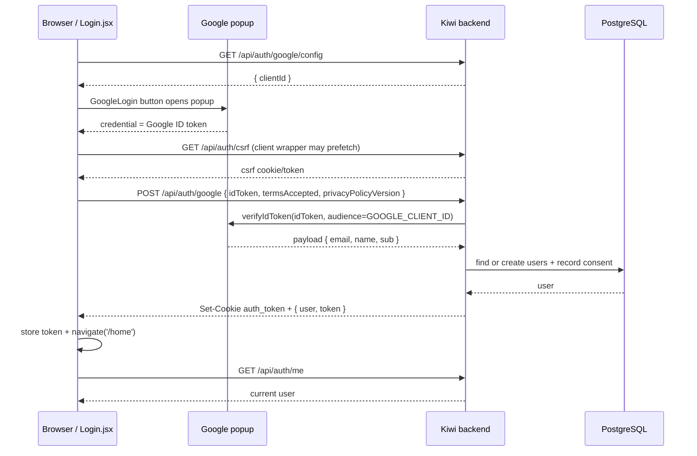

# Google Login：最簡單的 Code Truth

這份文件只回答一條流程：

> 使用者按 Google 按鈕後，前端呼叫什麼、後端驗證什麼、登入狀態放在哪裡，以及回到網站後怎麼判斷已登入。

## 先講最重要的判斷

目前這個專案**不是**傳統的「後端 redirect 到 Google，再由後端 callback」流程。

目前使用的是：

```text
Google popup（由 @react-oauth/google 開啟）
    -> Google 回傳 ID token 給前端
    -> 前端 POST ID token 到 Kiwi backend
    -> backend 用 GOOGLE_CLIENT_ID 驗證 ID token
    -> backend 建立 / 找到使用者
    -> backend 發自己的 JWT + auth_token cookie
    -> 前端導向 /home
    -> ProtectedRoute 呼叫 /auth/me 確認登入狀態
```

### 一個容易搞錯的地方

目前沒有使用 `GOOGLE_CLIENT_SECRET`。`.env.example` 只有 `GOOGLE_CLIENT_ID` 和 `JWT_SECRET`（`backend/.env.example:22-23`）。

- `GOOGLE_CLIENT_ID`：不是秘密，用來識別「這個 ID token 是發給哪個 Google client」。前端可以拿到它。
- `GOOGLE_CLIENT_SECRET`：傳統 OAuth Authorization Code flow 才常用；目前這條 Google Identity Services ID-token flow 沒有用到。
- `JWT_SECRET`：真正由 Kiwi backend 使用的秘密，用來簽發 Kiwi 自己的登入 JWT；不可放前端。

## 先看完整流程圖



## Step 1：前端啟動時先拿 Client ID

### 1.1 `main.jsx` 是前端入口

`frontend/src/main.jsx:44-55` 的 `bootstrap` 先呼叫 `getGoogleClientConfig()`，拿到 `clientId` 後才 render app：

```js
const data = await getGoogleClientConfig();
renderApp(data.clientId);
```

`renderApp` 在 `frontend/src/main.jsx:28-35` 把 client ID 放進：

```jsx
<GoogleOAuthProvider clientId={clientId}>
  <App />
</GoogleOAuthProvider>
```

這個 provider 讓 `Login.jsx` 裡的 `<GoogleLogin />` 知道要向哪個 Google client 要 credential。

### 1.2 前端呼叫哪個 API

`frontend/src/api/authApi.js:20-23`：

```js
GET /api/auth/google/config
```

API client 會把 `/auth/google/config` 變成 `/api/auth/google/config`，因為 `frontend/src/api/client.js:12` 定義 API namespace 是 `/api`，`buildApiUrl` 在 `:108-112` 組合 URL。

### 1.3 後端回傳什麼

`backend/src/api/routes/authRoutes.js:25-29` 註冊 route：

```js
router.get('/google/config', googleClientConfig);
```

`backend/src/controllers/authController.js:108-118`：

```js
return successResponse(
  res,
  { clientId: process.env.GOOGLE_CLIENT_ID },
  'Google client config loaded'
);
```

所以第一個 API 只回傳 public client ID，不會回傳 `JWT_SECRET` 或任何 Google secret。

## Step 2：使用者按下 Google 按鈕

### 2.1 Login page 有哪些狀態

`frontend/src/pages/Login.jsx:22-27` 定義：

```js
const [isAgreed, setIsAgreed] = useState(false);
const [error, setError] = useState('');
const [isSubmitting, setIsSubmitting] = useState(false);
```

使用者沒有勾選 privacy terms 時，按鈕在 UI 上會被 disabled-like 顯示（`:135-146`），而且 `handleSuccess` 仍會再次檢查（`:49-53`）。

### 2.2 Google popup 是誰開的

`Login.jsx:137-145` 使用：

```jsx
<GoogleLogin
  onSuccess={handleSuccess}
  onError={handleError}
  useOneTap={false}
/>
```

這代表目前沒有自己寫 `window.open(...)`，也沒有後端 `/callback`。popup / Google UI 由 `@react-oauth/google` 套件負責；成功後套件把 `credentialResponse.credential` 傳給 `handleSuccess`。

### 2.3 成功回呼拿到的是什麼

`handleSuccess`（`Login.jsx:49-72`）只接受有 `credential` 的 response：

```js
if (!credentialResponse?.credential) {
  setError('Login failed. Missing Google credential.');
  return;
}
```

這個 `credential` 是 Google ID token。此時前端尚未登入 Kiwi；它只是拿到一張「Google 說這個人是誰」的 token，還要送給 Kiwi backend 驗證。

## Step 3：前端把 Google ID token 送給 backend

### 3.1 `handleSuccess` 呼叫哪個 helper

`Login.jsx:60-70`：

```js
await loginWithGoogle(
  credentialResponse.credential,
  { termsAccepted: isAgreed }
);
navigate('/home', { replace: true });
```

### 3.2 `loginWithGoogle` 的 request body

`frontend/src/api/authApi.js:43-58`：

```js
POST /api/auth/google
{
  idToken: credentialResponse.credential,
  termsAccepted: true,
  privacyPolicyVersion: 'privacy_act_2020_v1'
}
```

它設定 `credentials: 'include'`，並在成功後做：

```js
storeAuthToken(data.token);
```

`apiClient`（`frontend/src/api/client.js:177-211`）會：

1. 加 `Content-Type: application/json`；
2. 帶上 browser cookie；
3. 如果 localStorage 已有 Kiwi token，加入 `Authorization: Bearer ...`；
4. 把 object `JSON.stringify` 後 `fetch`；
5. 回傳 response 裡的 `data`。

有一個容易漏掉的細節：`POST` 是 unsafe method，而登入前 localStorage 還沒有 Kiwi token，所以 `buildCsrfHeaders`（`client.js:143-154`）可能會先呼叫 `GET /api/auth/csrf`，拿到 CSRF cookie/token，再送出 `POST /api/auth/google`。不過 backend 的 `csrfProtection` 對 `/auth/google` 有明確 bypass（`backend/src/middleware/csrfMiddleware.js:44-69`），所以 Google token exchange 本身不依賴既有登入 session。

## Step 4：backend 收到 `/auth/google` 後做什麼

### 4.1 route 與 middleware

`backend/src/api/routes/authRoutes.js:25-29`：

```js
router.post('/google', authRateLimit, googleLogin);
```

所有 API 先經過 `backend/src/api.js:64-69`：

```js
api.use(cors(corsOptions));
api.use(express.json({ limit: '2mb' }));
api.use(optionalAuth);
api.use(csrfProtection);
```

Google login 的 CSRF 特例在 `backend/src/middleware/csrfMiddleware.js:44-69`：`POST /auth/google` 不要求先有 CSRF token，因為這正是建立登入狀態的 request。前端 wrapper 仍可能預先取得 CSRF token，但 backend 不會用它阻擋這個 route。

它仍然受到 `authRateLimit` 保護。

### 4.2 controller 讀取 request body

`backend/src/controllers/authController.js:131-154` 讀：

```js
const {
  idToken,
  termsAccepted = false,
  privacyPolicyVersion = authService.CURRENT_PRIVACY_POLICY_VERSION,
} = req.body;
```

接著依序檢查：

1. 沒有 `idToken` → 400；
2. 沒有接受 terms → 400；
3. backend 沒有 `GOOGLE_CLIENT_ID` → 500；
4. 呼叫 Google token verification。

### 4.3 backend 如何使用 Client ID

`backend/src/controllers/authController.js:28` 建立 Google verifier：

```js
const getGoogleClient = () =>
  new OAuth2Client(process.env.GOOGLE_CLIENT_ID);
```

真正驗證在 `:151-157`：

```js
const ticket = await getGoogleClient().verifyIdToken({
  idToken,
  audience: process.env.GOOGLE_CLIENT_ID,
});

const payload = ticket.getPayload();
const { email, name, sub } = payload;
```

這裡的 `audience` 檢查很重要：它確認 token 是發給本專案的 Google Client ID，而不是另一個 app 的 token。

backend 只取 `email`、`name`、`sub`；沒有從 Google 取得 Gmail、Drive 等額外 API permission。

## Step 5：找到或建立 Kiwi user

### 5.1 controller 呼叫 service

`authController.js:159-170`：

```js
const user = await authService.findOrCreateGoogleUser({
  email,
  name,
  googleSub: sub,
  termsAccepted,
  policyVersion: privacyPolicyVersion,
});
const token = generateToken(user.id);
```

### 5.2 service 的實際 database 邏輯

`backend/src/services/authService.js:49-110` 的 `findOrCreateGoogleUser`：

1. 再次檢查 `termsAccepted`；
2. 將 email trim + lowercase；
3. `SELECT * FROM users WHERE email = $1 AND deleted_at IS NULL`（`:60-64`）；
4. 找到既有 user：更新 name、`google_sub`、policy version、consent time、last login；
5. 找不到：建立新的 user，`auth_provider = 'google'`、`account_status = 'active'`；
6. 兩種情況都呼叫 `recordConsent`，寫入 `user_consents`（`:34-41`）。

目前 user identity 的主流程是 email lookup；`google_sub` 會被保存，但 source 中沒有用 `google_sub` 作為主要 lookup key。

## Step 6：backend 建立 Kiwi 登入狀態

### 6.1 Kiwi JWT

`authController.js:170` 呼叫 `generateToken(user.id)`。

`backend/src/services/authTokenService.js:11-25`：

```js
const JWT_EXPIRES_IN = '30d';

export const generateAuthToken = (id) =>
  jwt.sign({ id }, getJwtSecret(), { expiresIn: JWT_EXPIRES_IN });
```

`getJwtSecret` 使用 `JWT_SECRET`（`:13-18`）。這是 Kiwi 自己簽的 token，和 Google ID token 是兩個不同東西：

| Token | 由誰簽 | 用途 |
|---|---|---|
| Google ID token | Google | 讓 backend 驗證 Google 身份 |
| Kiwi JWT | Kiwi backend + `JWT_SECRET` | 後續 API 識別 Kiwi user |

### 6.2 Cookie + response body

`authController.js:32-38` 的 cookie 設定：

```js
{
  httpOnly: true,
  sameSite: production ? 'none' : 'lax',
  secure: production,
  maxAge: 30 days,
  path: '/'
}
```

`authController.js:172-180` 同時做兩件事：

```js
res.cookie('auth_token', token, cookieOptions);

return successResponse(res, {
  user: serializeUser(user),
  token,
}, 'Google login successful');
```

因此目前是 **cookie + bearer token 雙軌**：

- cookie：HTTP-only，瀏覽器會自動帶上；
- response token：前端 `storeAuthToken` 存進 `localStorage`，之後 `apiClient` 可用 `Authorization: Bearer ...`。

這是目前 source 的實際行為，不是單純「只用 cookie」。

## Step 7：登入後前端如何知道已登入

### 7.1 Login page 導向 `/home`

`Login.jsx:63-65` 在 `/api/auth/google` 成功後：

```js
navigate('/home', { replace: true });
```

`frontend/src/App.jsx:56-64` 把 `/home` 放在 `ProtectedRoute` 裡，而且 `/home` 會 redirect 到 `/dashboard`。

### 7.2 `ProtectedRoute` 不是看 React local state

`frontend/src/components/auth/ProtectedRoute.jsx:29-60` 每次進入 protected route 都呼叫：

```js
await getCurrentUser();
```

成功：

```js
setAuthState({ checked: true, isAuthenticated: true });
```

失敗：

```jsx
<Navigate to="/login" replace />
```

所以「登入狀態」的真正判定不是 `isSubmitting === false`，也不是只看 localStorage；是 backend `/auth/me` 驗證目前 request 帶來的 cookie 或 bearer token。

### 7.3 `/auth/me` 如何驗證

`authRoutes.js:28`：

```js
router.get('/me', requireAuth, getMe);
```

`backend/src/middleware/authMiddleware.js:50-59` 先從 `auth_token` cookie 取 token；如果沒有，再看 `Authorization: Bearer ...`。

`verifyAuthToken`（`authMiddleware.js:43-44`）呼叫 `authTokenService.verifyAuthToken`；驗證成功後把 `req.user = { id: payload.id }`（`:67-78`）。

`getMe`（`authController.js:86-99`）再以 `req.user.id` 查 PostgreSQL user，回傳：

```js
{
  user: {
    id,
    email,
    full_name
  }
}
```

### 7.4 Dashboard 顯示誰

`frontend/src/pages/HomePage.jsx:95-125` 再呼叫一次 `getCurrentUser()`，把回傳的 `full_name/email` 放進畫面 state，並在 UI 內標示 `loginProvider: 'google'`。

目前 `serializeUser` 沒有回傳 Google picture，所以 HomePage 不會從 backend 得到 Google avatar；這是 source-confirmed behavior。

## 最短版：如果你自己重寫這個 feature

你可以把它拆成下面 8 個小函數：

### 前端

```js
// 1. app 啟動時取得 public client id
const { clientId } = await GET('/api/auth/google/config');

// 2. 用 client id 初始化 Google provider
<GoogleOAuthProvider clientId={clientId}>
  <Login />
</GoogleOAuthProvider>

// 3. Google popup 成功後取得 idToken
const onGoogleSuccess = ({ credential: idToken }) =>
  POST('/api/auth/google', { idToken, termsAccepted: true });

// 4. backend 成功後回首頁
navigate('/home');

// 5. 進 protected page 時確認 session
await GET('/api/auth/me');
```

### backend

```js
// 6. 驗證 Google ID token
const ticket = await new OAuth2Client(GOOGLE_CLIENT_ID).verifyIdToken({
  idToken,
  audience: GOOGLE_CLIENT_ID,
});

// 7. 建立或找到本地 user
const user = await findOrCreateUser(ticket.getPayload());

// 8. 簽自己的 JWT，設定 cookie
const token = jwt.sign({ id: user.id }, JWT_SECRET, { expiresIn: '30d' });
res.cookie('auth_token', token, cookieOptions);
res.json({ user, token });
```

## 目前 source evidence 對照表

| 你想知道的問題 | 實際 source |
|---|---|
| 前端何時拿 Client ID？ | `frontend/src/main.jsx:44-55` |
| Google 按鈕在哪裡？ | `frontend/src/pages/Login.jsx:135-146` |
| popup 成功後拿到什麼？ | `frontend/src/pages/Login.jsx:49-72` |
| 前端 POST 哪個 API？ | `frontend/src/api/authApi.js:43-58` |
| backend route？ | `backend/src/api/routes/authRoutes.js:25-29` |
| 如何驗證 Google token？ | `backend/src/controllers/authController.js:131-169` |
| Client ID 用在哪裡？ | `backend/src/controllers/authController.js:28`, `:151-154` |
| 使用者寫進哪裡？ | `backend/src/services/authService.js:60-109` |
| Kiwi JWT 怎麼簽？ | `backend/src/services/authTokenService.js:11-25` |
| cookie 怎麼設定？ | `backend/src/controllers/authController.js:30-38`, `:170-180` |
| 後續 request 怎麼驗證？ | `backend/src/middleware/authMiddleware.js:50-102` |
| 前端怎麼知道登入？ | `frontend/src/components/auth/ProtectedRoute.jsx:29-60` |

## 邊界與目前未宣稱的部分

### Source 已確認

- 現在是 Google popup + ID token exchange，不是 backend OAuth callback。
- backend 驗證 `audience === GOOGLE_CLIENT_ID`。
- Kiwi user 會寫入 PostgreSQL，consent 會寫入 `user_consents`。
- 登入成功同時設定 HttpOnly cookie，並把 token 回傳給前端保存。
- protected pages 以 `/auth/me` 作為登入判定。

相關 robustness evidence：`backend/tests/robustness/server/authFallbackRobustness.test.js:12-59` 覆蓋 bearer fallback，以及 Google login token exchange 不要求 CSRF cookie。

### 本文件沒有宣稱

- 沒有 live Google credentials / browser run，就不能宣稱 production popup 一定成功。
- 沒有宣稱 `GOOGLE_CLIENT_SECRET` 存在或被使用；目前 source 顯示沒有這個變數。
- 沒有宣稱登出會撤銷 Google 授權；目前 `logout` 主要是清除 Kiwi `auth_token` cookie，前端也清理 stored token（`authController.js:194-200`、`authApi.js:66-75`）。

本次是 docs-only source review；沒有改 runtime code，也沒有執行 live authentication。
