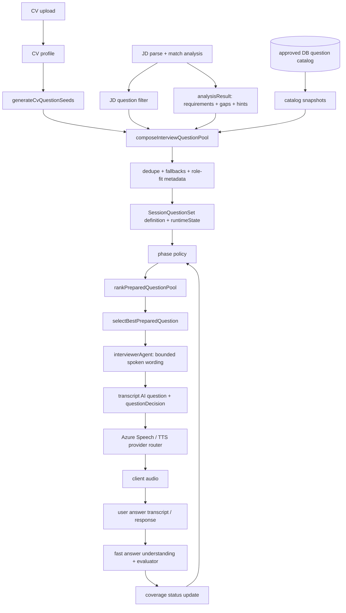

# Question Set Pipeline Code Truth

> 這是一份以目前 repository source code 為準的 implementation guide。它回答：CV、JD、match gap、資料庫 question catalog 如何變成一次 interview 的 question set；回答如何掛回題目；下一題如何選；最後如何交給 Azure Speech。文中的行號是本次盤點時的 source evidence，不是產品需求的替代品。

## 先講結論

目前不是「把四個 array 串起來，然後 `questionIndex + 1`」。實際上有三層：

1. **候選題產生層**：CV seeds、legacy/match plan、JD requirement validation、match gaps、approved catalog snapshots、scenario/fallback。
2. **canonical question set 層**：去重、補齊 role-fit coverage、建立 immutable definition、建立 runtime coverage state，並存到 `InterviewPlan.sessionQuestionSet`。
3. **每一 turn 的執行層**：依 phase、coverage 狀態、answer evidence、mode、novelty、role-fit/gap risk 排序，選 root question；若需要，另建 follow-up。題目先由 deterministic controller 選，LLM 只負責 bounded naturalisation；Azure Speech 是最後的 delivery boundary。

因此，使用者的回答不是直接改寫 question object 的 `text`。回答會被存成 transcript / response，經過 answer understanding 和 evaluator，然後更新 question set 的 target coverage status；下一輪再使用這個 runtime state 重新篩選與排序。

## 一張圖看完整資料流



## Source map：每個階段的入口、輸出、持久化

| 階段 | 主要入口 | 輸入 | 主要輸出 | 目前持久化位置 |
|---|---|---|---|---|
| CV question seed | `generateCvQuestionSeeds` | `cvProfile`, `cvFileId`, `userId` | `CvQuestionSeed[]` | Mongo `CvQuestionSeed` |
| JD filter | `buildJdQuestionFilter` | active CV seeds + parsed JD / match hints | filter decisions | Mongo `JdQuestionFilter` |
| match / base plan | `buildQuestionPoolFromAnalysis` | `analysisResult`, settings | opening、motivation、technical、behavioural、wrap-up candidates | 先是 plan payload，之後映射成 pool item |
| DB catalog | `loadApprovedQuestionCatalogItems` → `buildCatalogQuestionSnapshots` | approved catalog records + role/level/signals | private catalog snapshot items | session pool / canonical set |
| aggregation | `buildInterviewQuestionPoolItems` | 上述所有來源 | normalized `InterviewQuestionPoolItem[]` | Mongo `InterviewQuestionPoolItem` |
| canonical set | `buildSessionQuestionSet` / `persistSessionQuestionSet` | normalized pool items + settings | immutable definition + runtime state | Mongo `InterviewPlan.sessionQuestionSet` |
| selection | `applySessionQuestionSetSelectionPolicy` → `rankPreparedQuestionPool` → `selectBestPreparedQuestion` | pool + transcript + evaluator + runtime coverage | selected root candidate + rank trace | pool asked state + decision trace |
| answer attachment | `saveInterviewAnswer*`, `appendTranscriptTurn`, evaluator | text / voice transcript + latest question | response row, transcript user turn, evaluation | PostgreSQL response + session transcript + Mongo evaluator record |
| speech delivery | `synthesizeSpeech` / stream path | final spoken text | audio buffer / base64 / chunks | transcript metadata + optional local audio archive |

## 1. CV upload 後，CV question pool 是怎麼建立的

### 1.1 HTTP 入口先完成 CV parse，再建立 seed

`backend/src/controllers/uploadController.js:47-62` 做檔案驗證、文字抽取、spaCy signal、`buildCvProfile`；`uploadController.js:96-116` 把 CV document 存好後呼叫 `refreshCvQuestionSeeds`，而 helper 在 `uploadController.js:30-44` 呼叫 `generateCvQuestionSeeds`。

也就是：

```js
const cvProfile = buildCvProfile(text, { parserMetadata, nlpSignals });
await attachDocumentContent({ cvProfile, ... });
await generateCvQuestionSeeds({ userId, cvFileId: fileId, cvProfile });
```

這裡的 `cvProfile` 不是 question set；它只是 seed generator 的 input。

### 1.2 `CvQuestionSeed` 的 object 定義

`backend/src/services/questions/cvQuestionSeedService.js:18-62` 的 `buildSeed` 會建立下列核心欄位：

```js
{
  userId,
  cvFileId,
  seedId,                 // stableQuestionId('cvseed', ...)
  schemaVersion: 'v1',
  sourceStage: 'cv_parse',
  sourceType,             // cv_project / cv_skill / cv_behavioural / ...
  topic,
  category,
  competency: topic,
  questionIntent,
  draftQuestion,
  fallbackText: draftQuestion,
  evidenceRefs,
  evidenceSummary,
  expectedSignal,
  riskTags,
  priorityWeight,
  confidence,
  status: 'active',
  generationMethod: 'deterministic'
}
```

這表示一個 CV seed 同時保存「要問什麼」和「為什麼可以問」的 evidence pointer。它不是單純的字串 question bank。

### 1.3 seed 類型與現成 helper

`cvQuestionSeedService.js:65-176` 目前把 CV evidence 分成：

- `extractProjectSeeds`：最多四個 project；問 implementation 和 personal ownership，expected signals 是 `personal_ownership`、`technical_depth`、`result_or_impact`。
- `extractCapabilitySeeds`：最多六個 capability；問 concrete example、decision/trade-off、validation。
- `extractBehaviouralSeeds`：behavioural capability 加上 teamwork / communication / ownership 的 default；問 STAR-like evidence。
- `extractAchievementSeeds`：量化成果；問個人行動與成果如何量測。
- `extractTransitionSeed`：只有偵測到 career direction / transition 才建立。

`buildCvQuestionSeedCandidates`（`cvQuestionSeedService.js:178-214`）先用 topic/category/intent/project tag 去重；如果完全沒有 seed，建立一個 `cv_experience` fallback。`generateCvQuestionSeeds`（`:216-227`）會先把同一 CV 的舊 seed 標成 `superseded`，再按 `{ userId, cvFileId, seedId }` upsert；`getCvQuestionSeeds`（`:230-235`）只取 owner、CV、status 符合的 records，按 priority 排序。

## 2. JD parse 如何影響 CV 題目

### 2.1 JD filter 不是重新產生全部題目

canonical match 在 `backend/src/services/match/matchAnalysisExecutionService.js:77-102` 呼叫 `buildJdQuestionFilter`。`buildJdProfile`（`backend/src/services/questions/jdQuestionFilterService.js:11-37`）從 requirement checks、parsed JD、`questionPlanHints` 彙整：

```js
{
  roleCanonical,
  roleFamily,
  roleLevel,
  companyName,
  mustHaveRequirements,
  prioritySkills,
  behaviouralFocus,
  companyValues,
  cultureFitDimensions
}
```

`countTagMatches`（`:40-52`）是目前主要的 deterministic overlap helper：比較 seed 的 `skillTags/topic/evidenceSummary` 與 JD `prioritySkills` 的 normalized tokens。

### 2.2 每個 CV seed 會得到一個 filter decision

`decideSeed`（`jdQuestionFilterService.js:72-95`）目前規則是：

- 低 confidence、沒有 JD match、又不是 behavioural → `suppress`。
- 命中 priority skill 或 priority topic → `boost`，必要時 `adapt`。
- `adapt` 會由 `buildAdaptedText`（`:63-70`）把題目改成 JD 相關角度；這是 wording adaptation，不是改 CV evidence。
- behavioural seed 即使不是 top JD match 也 `keep`。

`applyJdFilterToCvSeeds`（`:97-112`）產出 `decisions` 和 boosted/suppressed/adapted/kept id lists。`buildJdQuestionFilter`（`:115-145`）把這個結果存成 `JdQuestionFilter`，之後 composer 依 `seedId` 找 decision。

## 3. Match result 自己提供哪些題目

`backend/src/services/session/sessionShared.js:126-177` 的 `buildQuestionPoolFromAnalysis` 先建立兩個固定入口：

- `self_intro` / `opening`
- `company_motivation` / `motivation`

接著 `:179-239` 依 `questionPlanHints.mustProbeSkills` 和 mode config 的 `minTechnicalQuestions`，對每個 skill 建立 core + follow-up；題目包含 `matchedRequirementId`、`matchedSkill`、`sourceType`、`generationReason`、`confidence`、`planPriority`。`sessionShared.js:241-280` 再建立 behavioural root + follow-up，最後 `:282-284` 加 wrap-up。

這是「分析結果產生的 base plan」，不是最後執行時一定照順序問的 list。最後要經過 canonical set policy 和 ranker。

## 4. Match gap、JD requirement、以及 requirement qualification 的處理

### 4.1 JD requirement validation items

`buildRequirementItems`（`backend/src/services/questions/questionPoolComposerService.js:419-483`）逐項讀 `analysisResult.requirementChecks`，先用 `isJobDescriptionSectionHeading` 排除「Responsibilities」「About us」這類 section heading，再用 `inferRequirementQuestionStrategy` 決定：

- qualification / credential 類型可被排除，因為它們不是 interview 中要靠敘述驗證的 competency；
- behavioural requirement 生成 behavioural evidence 題；
- technical requirement 生成 technical evidence 題。

建立出的 normalized item 會使用 `sourceStage: 'match_validation'`、`sourceType: 'jd_requirement'`、`linkedJdRequirement`、`requirementId`、`expectedSignal`、priority/coverage/risk weights。

### 4.2 match gaps

`buildGapItems`（`questionPoolComposerService.js:485-530`）最多取五個 `analysisResult.gaps`。每個 gap 變成：

```js
{
  sourceStage: 'match_gap',
  sourceType: 'match_gap',
  questionIntent: 'risk_probe',
  matchGapId,
  expectedSignal: ['gap_validation', 'adjacent_experience', 'ownership'],
  priorityWeight: 0.8,
  coverageWeight: 0.82,
  riskWeight: 0.9
}
```

text mode 可以顯示 internal gap wording；voice mode 會透過 `resolveVoiceGapTopic` 避免把 `possible gap`、`score risk` 這類內部控制語言直接念給使用者（`:487-510`）。

## 5. Database question set 是什麼

### 5.1 catalog record 的定義

Mongo model `backend/src/db/models/questionCatalogItemModel.js:3-27` 定義 global catalog record。重要欄位：

```js
{
  catalogQuestionId,
  catalogVersion,
  lifecycle,             // draft / approved / deprecated / disabled
  questionFamily,
  questionType,
  competency,
  category,
  targetLevels,
  roleEligibility,
  promptVariants,
  expectedSignals,
  followUpPolicy,
  ambiguityPolicy,
  selectionPolicy,
  reportDimensions,
  humanReview,
  accessScope: 'global_catalog'
}
```

`loadApprovedQuestionCatalogItems`（`backend/src/services/questions/questionCatalogRepository.js:28-43`）只會在 Mongo ready 且 lifecycle 是 `approved` 時載入；優先嘗試 catalog version preference，無可用版本就回 `inactive` 或 `catalog_unavailable`。所以「DB 有題目」不等於「本次可以使用」。

### 5.2 catalog item 如何變成 session-private snapshot

`buildCatalogQuestionSnapshots`（`backend/src/services/questions/questionCatalogSelectionService.js:204-269`）先跑 `resolveCatalogQuestionEligibility`，再選 target-level prompt variant。通過後會建立 session-scoped item：

```js
{
  questionId: stableQuestionId('catalogq', [sessionId, version, catalogQuestionId]),
  schemaVersion: 'v4',
  sourceStage: 'catalog',
  sourceType: 'question_catalog',
  questionRole: 'root_question',
  text,
  expectedSignal,
  catalogQuestionId,
  catalogVersion,
  catalogLifecycle,
  testedSignals,
  eligibilityReason,
  selectionPolicy,
  coverageSlot,
  ambiguityMode,
  reportDimensions
}
```

這一步的目的，是把 global catalog 的版本與 eligibility 決策 snapshot 到本次 session；之後 session 不應重新解釋同一個 global record。

## 6. 四種來源如何彙整成一份 question set

### 6.1 canonical aggregation function

`buildInterviewQuestionPoolItems`（`backend/src/services/questions/questionPoolComposerService.js:646-677`）是最直接的答案：

```js
const baseItems = buildQuestionPoolFromAnalysis(analysisResult, settings)
  .map(mapLegacyQuestion);
const seedItems = cvSeeds
  .filter(seed => jdDecision(seed)?.decision !== 'suppress')
  .map(mapSeedQuestion);
const requirementItems = buildRequirementItems(analysisResult, context);
const gapItems = buildGapItems(analysisResult, context, { deliveryMode });
const catalogSnapshots = buildCatalogQuestionSnapshots(...);

return validatePreparedQuestionPool(
  ensureMinimumFallbacks(
    dedupePool([
      ...baseItems,
      ...requirementItems,
      ...seedItems,
      ...gapItems,
      ...catalogSnapshots.items,
      ...scenarioPolicyItem
    ])
  )
);
```

`mapLegacyQuestion`（`:279-298`）和 `mapSeedQuestion`（`:300-322`）都走 `buildBaseItem`，所以不同來源最後具有同一個 normalized shape。

### 6.2 `buildBaseItem` 是 feature 的主要 object factory

`buildBaseItem`（`:190-277`）建立 canonical pool item。它會：

1. 以 `stableQuestionId('poolq', [sessionId, sourceStage, sourceType, category, topic, questionIntent, text])` 產生穩定 `questionId`；
2. 寫入 `sourceStage/sourceType/category/stage/topic/competency/questionIntent`；
3. 寫入 `text/fallbackText/spokenDraft`；
4. 寫入 `expectedSignal/evidenceNeed/constraints/followUpStrategies`；
5. 寫入 priority、coverage、risk、mode compatibility；
6. 寫入 CV/JD/gap/role-fit/catalog metadata；
7. 最後產生 `assessmentKey` 和 `questionFingerprint`。

對應的 Mongo schema 是 `backend/src/db/models/interviewQuestionPoolItemModel.js:4-90`。因此，如果要不用 AI 手寫一個新題目，通常不是只加 `text`；至少要能填出 `sourceStage`、`sourceType`、`category`、`topic`、`questionIntent`、`expectedSignal`、weights，以及可去重的 identity。

### 6.3 去重規則

`dedupePool`（`questionPoolComposerService.js:549-573`）忽略空題目，以 `assessmentKey` 或 `questionFingerprint` 判斷 duplicate；衝突時依 `sourcePriority` 選 winner，但透過 `mergeQuestionEvidence` 合併 CV evidence、JD requirement、expected signals、evidence need。這不是單純 `new Set(text)`。

`questionDeduplicationService.js:28-78` 定義 question fields、fingerprint、assessment key；`questionDeduplicationService.js:153-207` 再針對 transcript 做 novelty / near-duplicate filter。

### 6.4 compose 的持久化順序

`composeInterviewQuestionPool`（`questionPoolComposerService.js:706-790`）的實際順序是：

1. 沒有 `userId/sessionId` → 回空陣列。
2. 若已有 `SessionQuestionSet` → 直接 restore canonical items，不重新生成。
3. 否則若已有 stored pool → 直接使用。
4. 同時載入 active CV seeds、JD filter、company values profile（`:737-741`）。
5. 呼叫 `buildInterviewQuestionPoolItems`。
6. 套用 user interview memory policy，再套用 `buildRoleFitQuestionPool`（`:756-777`）。
7. 先 persist canonical `SessionQuestionSet`，再把 canonical items restore 回 `InterviewQuestionPoolItem`（`:779-789`）。

這個「先 canonical，再 restore」順序很重要：`SessionQuestionSet` 是 session 的 authority；`InterviewQuestionPoolItem` 是可排序、可標記 asked 的 materialized pool。

### 6.5 catalog 不可用與題目不足時的 fallback

`prepareInterviewQuestionPool`（`backend/src/services/questions/questionPoolPreparationService.js:266-397`）會：

- catalog load 失敗時保留 `catalog_unavailable`，不直接讓整個 pool 消失；
- `assessQuestionPoolReadiness`（`:201-232`）檢查 unique root 數量及 proof strategy coverage；
- 題目不足時最多生成 `MAX_RESERVE_QUESTIONS = 3` 的 bounded LLM reserve，限制在既有 preparation goals、允許的 category/focus，之後仍經 novelty filter。

所以 LLM reserve 是 capacity fallback，不是任意讓模型自由重寫整個 question pool。

## 7. canonical `SessionQuestionSet` 的定義

`buildSessionQuestionSet`（`backend/src/services/questions/sessionQuestionSetService.js:308-345`）把 pool snapshot 成：

```js
{
  schemaVersion: 'session_question_set_v1',
  definition: {
    selectionPolicyVersion: 'question_selection_policy_v1',
    sessionId,
    userId,
    settings: { questionLimit, focusArea, seniorityLevel },
    items: [...immutableSnapshotItems],
    questionMap: { [questionId]: { targetId, labels, ... } },
    targetContracts: {
      [targetId]: { questionIds, expectedSignals, ... }
    },
    turnSlots: [...],
    decisionTraceContract: { ... }
  },
  runtimeState: {
    schemaVersion: 'question_runtime_state_v1',
    coverageStateMachineVersion: 'question_coverage_state_v1',
    revision: 0,
    coverageByTargetId: { ...status = 'unseen' },
    decisionsByTurn: []
  }
}
```

`turnSlots`（`sessionQuestionSetService.js:129-157`）目前把第一題固定為 `warm_up`，最後一題固定為 `closing`，中間依序落在 `evidence_foundation`、`evidence_depth`、`tradeoff_stress`。`persistSessionQuestionSet`（`:361-384`）以 schema 不存在的 optimistic condition 寫入 `InterviewPlan.sessionQuestionSet`。

`InterviewPlan` 的欄位證據在 `backend/src/db/models/interviewPlanModel.js:46-75`；同一份 model 仍保留 legacy `questionPool`，但 canonical runtime 使用的是 `sessionQuestionSet`。

## 8. 每一 turn 如何選出真正要問的題目

### 8.1 phase policy 先做硬限制

`applySessionQuestionSetSelectionPolicy`（`sessionQuestionSetService.js:190-243`）先依 turn slot 決定：

- requested follow-up 在 warm-up/closing 不合法時，改成 root；
- phase 不符的題目 → `phase_ineligible`；
- target 已是 `answered_strong`、`blocked`、`asked_unconfirmed` 等 → 排除；
- 排除原因會保留在 decision trace。

這就是為什麼「下一題」不是單純取陣列下一個 index。

### 8.2 ranker 的實際分數

`rankPreparedQuestionPool`（`questionPoolRankerService.js:208-270`）先建 transcript history、做 novelty filter、排除 suppressed/expired/未 approved catalog，再處理 catalog reservation / max asked。核心 `scorePoolItem`（`:57-205`）的 base score 是：

```text
priorityWeight * 0.30
+ coverageWeight * 0.20
+ riskWeight * 0.15
+ modeFit * 0.15
+ missingEvidenceFit * 0.10
+ freshness * 0.05
+ timeFit * 0.05
+ selectedTopicFit
+ validationFit
- repetitionPenalty
- answeredPenalty
```

再加 role-fit boosts（must-cover、gap risk、evidence map strength、proof angle、hiring logic）與 evidence overuse penalty。每題會產生 `rankTrace`，包含 score、components、reasons、penalties、matched signals、catalog/coverage metadata。

`selectBestPreparedQuestion`（`:272-275`）最後只取 active、score 至少 `0.25`、且沒有 mode mismatch 的第一個候選。

### 8.3 orchestrator 怎麼決定 root 或 follow-up

`buildInterviewTurnPlan`（`backend/src/services/questions/interviewTurnOrchestratorService.js:286-445`）的實際順序是：

1. `buildCheapAnswerSignals`（`:95-132`）從最近答案提取 token count、project/technology mentions、missing evidence。
2. `getSessionQuestionSet` + `getQuestionTurnSlot` 取得 canonical phase。
3. 讀 `getPreparedQuestionPool`、套 phase policy、rank root candidates。
4. 若 action 需要 follow-up，建立 `followUpContext`：parent question、root id、follow-up depth、missing evidence target。
5. `buildFollowUpVsNextRootComparison` 決定繼續追問或先換 root。
6. root 才能使用 prepared pool item；follow-up 不會把下一個 prepared root 消耗掉。

`toRootCandidate`（`:169-206`）把 pool item 映射成 controller 可以交給 agent 的 candidate object，包含 question id、spoken text、evidence need、catalog/coverage metadata。

## 9. interviewer agent 如何把 canonical item 轉成可問的文字

`runInterviewerAgent`（`backend/src/services/agents/interviewerAgent.js:90-167`）先呼叫 `buildInterviewTurnPlan`，再將 selected root candidate 映射為 question（`:43-87`）。如果是 follow-up 或特殊 action，會用 question builder 建立 bounded question；之後執行 mode guard 和 `normalizeQuestionIntent`。

### 9.1 LLM 在哪裡介入

`interviewerAgent.js:346-378` 呼叫 `runBoundedQuestionMicroPlanning`，只把 selected question、planning frame、focus area 交給 bounded naturalisation；失敗就回到 base/fallback text。`questionDecision` 在 `:479-523` 保存 selected angle、evidence used、risk flags、dedup trace、catalog/selection policy、rank trace。

因此目前邏輯是：

```text
deterministic candidate selection
  -> bounded LLM wording (optional)
  -> interview-mode guard
  -> wording polish
  -> transcript novelty check
  -> fallback / alternative candidate if duplicate
```

`questionDeduplicationService.js:153-207` 會拒絕 duplicate/near-duplicate model output；若 base question 也重複，agent 會嘗試 alternative root，否則以 `no_unique_question_remaining` 結束（`interviewerAgent.js:379-451`）。

## 10. 題目如何寫入 transcript，回答如何加回來

### 10.1 AI 題目不是只回傳給前端

`masterAiService.js:930-998` 在 interviewer output 完成後：

1. `buildQuestionTranscriptMetadata`（`:303-352`）判斷 `turnType` 和 `countsAsQuestion`，並建立 assessment key / fingerprint / catalog / coverage metadata。
2. countable question 才呼叫 `createInterviewQuestion`，把題目寫入 PostgreSQL `interview_questions`；`sessionQuestionService.js:24-54` 定義 insert/upsert。
3. `appendTranscriptTurn` 把 AI 題目及完整 `questionDecision`、rankTrace、sourcePolicy、preparedQuestionId、parent/root ids、base/spoken text 寫入 session transcript。
4. prepared root 題目會透過 `persistPreparedRootQuestionSelection`（`masterAiService.js:370-423`, `:947-955`）更新 pool asked state 與 canonical `decisionsByTurn`。

`buildQuestionTranscriptMetadata` 對 repair、clarification、transcript confirmation 設 `countsAsQuestion: false`；這避免修復訊息被誤算成 interview question。

### 10.2 text answer 的 input path

`replyInterview`（`backend/src/controllers/interviewTurnController.js:19-68`）先：

```js
const cleanAnswer = normalizeInterviewAnswer(answer);
await saveInterviewAnswer(sessionId, cleanAnswer);
const nextTurnResult = await runTask({
  taskType: 'interview_next_turn',
  payload: { answer: cleanAnswer, clientTurnId }
});
```

`normalizeInterviewAnswer`（`interviewSessionService.js:30-35`）只做 trim + empty validation。`saveInterviewAnswer`（`:91-108`）先找 latest question，然後：

- `appendTranscriptTurn` 寫一個 `{ role: 'user', text, metadata: { inputMode: 'text' } }`；
- `saveInterviewAnswerWithDetails` 寫 response row。

`createInterviewResponse`（`sessionQuestionService.js:82-118`）將回答寫入 PostgreSQL `interview_responses`，包含 `question_id`、`transcript_text`、redacted text、response mode、word count、provider payload 等。這就是「回答加到 question」的實際方式：以 `question_id` 關聯 response，而不是把 answer append 到 pool item 的 text。

### 10.3 voice answer 的 input path

`processRealtimeVoiceTurn`（`backend/src/services/voice/realtimeVoiceTurnService.js:170-347`）先 normalize transcript、跑 confidence/transcript review gate、再用 `appendTranscriptTurn` 與 `saveInterviewAnswerWithDetails` 寫入：

- raw / normalized transcript；
- ASR provider、language、confidence、VAD；
- transcript corrections / N-best / review decision；
- `answeredQuestionId`、`preparedQuestionId`、`catalogQuestionId`、parent/root ids。

`realtimeVoiceTurnService.js:255-323` 明確保存 `rawTranscriptImmutable: true`；低信心且需要 confirmation 時，不直接拿未確認答案去 scoring。

## 11. 使用者回答如何影響下一題

### 11.1 local answer understanding

`extractFastAnswerUnderstanding`（`backend/src/services/aiControl/fastAnswerUnderstandingService.js:404-510`）不是把答案丟回 question text，而是建立 understanding object：

```js
{
  source: 'local_js',
  parserVersion: 'role_agnostic_v2',
  intent,
  answerCompleteness,       // thin / partial / strong
  answerStats,
  coreEvidence: { starSignals, missing, evidenceStrength, ... },
  roleAlignment: { matchedRequirements, matchedCvEvidence, matchedGaps, unresolvedGaps, ... },
  followUpRecommendation,
  keyFacts,
  technologies,
  metrics,
  ownershipSignals,
  frictionSignals
}
```

其 helper 會以 deterministic lexicon 找 technologies、ownership verbs、evidence terms、metrics、friction、role vocabulary，並推導 missing evidence（`:319-330`, `:404-446`）。

### 11.2 evaluator 將回答轉成 evidence status

`evaluateInterviewTurn`（`backend/src/services/aiControl/interviewEvaluatorService.js:372-506`）以 current topic、latest answer、required skills、answer understanding 建立：

- `evidenceGainScore`；
- `evidenceStatus`: `EXACT_MATCH`、`PARTIAL_TRANSFER`、`EXPLICIT_NO_EXPERIENCE`、`INSUFFICIENT_EVIDENCE`；
- `misunderstandingFlag`、`skillDenial`、`gapClosure`、`suggestedNextMode`；
- `successStatus` 和 planner signals。

### 11.3 canonical coverage state machine

`sessionQuestionSetService.js:8-48` 定義 coverage statuses 和合法 transitions。`recordSessionQuestionSelection`（`:507-542`）把被選的 root target 設成 `asked_unconfirmed`，並記錄每 turn 的 decision。

`resolveAcceptedAnswerStatus`（`:544-558`）目前對 evaluator 結果的映射是：

| evaluator 結果 | coverage status |
|---|---|
| misunderstanding | 不更新（回傳 `null`，需要 repair/clarification） |
| explicit no experience / denial | `blocked` |
| exact match + score ≥ 0.7 + usable | `answered_strong` |
| partial transfer + score ≥ 0.45 | `answered_partial` |
| 其他可接受回答 | `answered_weak` |

`buildAcceptedAnswerCoverageUpdates`（`:590-624`）先找 transcript 最近一個 prepared root 的 `preparedQuestionId`，再從 canonical `questionMap` 找 target。strong answer 甚至可能以至少兩個 target terms 的 deterministic overlap，對尚未問過但明確被涵蓋的 target 寫 implicit coverage。`recordAcceptedAnswerCoverage`（`:626-657`）才真正以 optimistic runtime mutation 寫回 `InterviewPlan.sessionQuestionSet.runtimeState`。

master controller 在 `masterAiService.js:594-618` 於每輪 evaluator 後呼叫 `recordAcceptedAnswerCoverage`；之後 `buildDecisionContext`、action selection、interviewer agent 讀取新的 coverage state。

## 12. Azure Speech 如何拿到最後題目

### 12.1 final spoken text 的來源

agent output 同時保留：

- `nextQuestion`：base/fallback question；
- `displayText`：經 bounded naturalisation、guard、polish 後的 spoken text；
- `questionDecision.baseQuestionText` / `spokenQuestionText`：trace 用欄位。

`masterAiService.js:957-997` 將 `displayText` 寫到 AI transcript，並把 base/spoken text 一併放進 metadata。因此 TTS 應該讀 `displayText` / `assistantText`，不是重新從 CV 或 JD 生成另一題。

### 12.2 provider router 與 Azure adapter

`backend/src/services/voice/ttsProviderRouter.js:12-28` 把 `azure` / `azure_speech` 映射到 `azureSpeechService.synthesizeSpeech`；`:32-70` 依 provider order 呼叫並在 server error 時 fallback。

`azureSpeechService.js:115-170` 的 `synthesizeSpeech`：

1. 驗證 text 非空；
2. `issueAccessToken` 取得 / cache Azure Speech token（`:50-78`）；
3. `buildSsml` 將 text + voice name escape 後放入 SSML（`:41-48`）；
4. POST 到 Azure TTS URL，帶 `X-Microsoft-OutputFormat`；
5. 讀 response arrayBuffer 成 `audioBuffer`，回傳 `contentType: 'audio/mpeg'`、voice、format、provider。

### 12.3 text response、sentence stream、duplex voice

- 非 stream voice：`realtimeVoiceTurnService.js:367-468` 取 `agentResult.displayText`，呼叫 injected `synthesizeAssistantSpeech`，再把 audio buffer base64 放入 `assistantAudio`；controller 在 `interviewVoiceController.js:16-52` 回 JSON。
- sentence stream：`interviewVoiceController.js:55-130` 的 `onSentence` 每句呼叫 `synthesizeSpeech`，以 SSE `type: 'audio'`、base64、index、text 傳出。
- duplex voice：`ttsStreamQueue.js:4-44` 呼叫 `streamSynthesizeSpeech`，每 chunk 發 `type: 'tts_audio_chunk'`；provider router 目前只對 ElevenLabs/test 提供真正 streaming，Azure 走 full synthesis fallback（`ttsProviderRouter.js:72-97`）。

這表示「Azure Speech 念題」是 delivery stage，不參與題目選擇、coverage 評分或答案判斷。

## 13. 一個可手寫的 concrete example

假設輸入：

```js
// CV profile
{
  evidenceProfile: {
    sections: {
      projects: [{
        title: 'Order API',
        technologies: ['Node.js', 'PostgreSQL'],
        summary: 'Reduced checkout latency by 30%'
      }]
    }
  }
}

// JD / match
{
  parsedJdProfile: { prioritySkills: ['Node.js', 'observability'] },
  requirementChecks: [{ requirementId: 'req-node', skill: 'Node.js', category: 'technical' }],
  gaps: [{ id: 'gap-observability', topic: 'observability evidence' }]
}
```

目前 code 的結果會大致沿著這條鏈走：

```text
cvQuestionSeedService
  -> cv_project seed(topic=Node.js, expectedSignal=[ownership, depth, impact])
jdQuestionFilterService
  -> boost / adapt seed if Node.js matches JD priority
questionPoolComposerService
  -> jd_requirement item for req-node
  -> match_gap item for observability evidence
  -> dedupe by assessmentKey/fingerprint
roleSpecificPracticePlannerService
  -> attach proofPointId / coverageContractIds / recommendedEvidenceIds
sessionQuestionSetService
  -> targetContracts + warm_up/core/closing turn slots
questionPoolRankerService
  -> score gap/validation/mode/freshness/coverage and choose one
interviewerAgent
  -> naturalise selected text, preserve baseQuestionText and spokenQuestionText
masterAiService
  -> persist AI question + preparedQuestionId
Azure Speech
  -> synthesize displayText into audio/mpeg
```

注意：`observability` gap 不會因為回答提到 `Node.js` 就自動消失；只有 evaluator 判斷回答對應到 target、再由 `recordAcceptedAnswerCoverage` 寫入 coverage state，下一輪才會反映。

## 14. 如果要不用 AI 自己新增一題，最小實作單位是什麼

不要只新增：

```js
{ text: 'Tell me about Node.js.' }
```

至少要決定：

```js
{
  sourceStage: 'cv_seed' | 'match_validation' | 'match_gap' | 'catalog' | 'fallback',
  sourceType: 'cv_skill' | 'jd_requirement' | 'match_gap' | 'question_catalog',
  category: 'technical' | 'behavioural' | 'opening' | 'closing',
  stage,
  topic,
  competency,
  questionIntent,
  text,
  fallbackText,
  expectedSignal: ['personal_ownership', 'validation_method', 'result_or_impact'],
  evidenceNeed,
  priorityWeight,
  coverageWeight,
  riskWeight,
  linkedCvEvidence,
  linkedJdRequirement,
  matchGapId,
  questionRole: 'root_question',
  maxFollowUps,
  followUpStrategies,
  modeCompatibility,
  assessmentKey,
  questionFingerprint
}
```

實際上應優先呼叫既有 factory / mapper：`buildBaseItem`、`mapSeedQuestion`、`buildRequirementItems`、`buildGapItems`，再讓 `dedupePool`、`buildRoleFitQuestionPool`、`buildSessionQuestionSet` 接手。這樣新題目才會進入同一套 identity、coverage、rank trace、transcript、TTS 流程。

## 15. Evidence boundary：哪些已由 source 確認，哪些仍不是本文件的聲稱

### 已由 source code 確認

- 使用者關心的四種主要來源（CV、JD、match gap、DB catalog）都在 `buildInterviewQuestionPoolItems` 彙整；另外還有 analysis base plan、scenario、fallback 等補充來源。
- pool item 有明確 schema、source、evidence、weights、identity、catalog metadata。
- canonical session question set 會 snapshot 題目，並保留 coverage state / turn decision trace。
- answer 以 `question_id` 關聯 response，並以 transcript metadata / evaluator 更新 coverage，不改寫題目 text。
- root selection 會經 phase policy、novelty filter、ranker、minimum score。
- bounded LLM naturalises selected question；Azure Speech 只做 TTS delivery。

### 目前不能從這份 source-only 文件宣稱

- 沒有實際 Azure credentials 時，不能宣稱 live Azure synthesis 成功。
- 沒有 browser / human run 時，不能宣稱使用者一定聽到正確音訊或達到 latency target。
- catalog `approved` records 不代表所有環境都有 Mongo data；loader 明確允許 `inactive` / `catalog_unavailable`。
- `companyValues` / `roleFitProfile` 會被載入並透過 role-fit planner 影響 coverage metadata，但不是每個 company value 都必然直接生成一題；是否有可問題目取決於 role-fit artifacts 與 pool coverage。

## 16. 直接對應的測試 evidence

以下測試檔案對應本文件的主要 contract；本次只新增文件，沒有執行產品測試：

- `backend/tests/robustness/questions/cvQuestionSeedService.test.js`：CV seed 來源與 fallback。
- `backend/tests/robustness/questions/jdQuestionFilterService.test.js`：boost / adapt / keep / suppress。
- `backend/tests/robustness/questions/questionPoolComposerService.test.js`：source aggregation、canonical restore、dedupe、reconciliation。
- `backend/tests/robustness/questions/questionPoolPreparationService.test.js`：catalog degradation、bounded reserve、readiness。
- `backend/tests/robustness/questions/sessionQuestionSetService.test.js`：turn slots、coverage transition、selection decision trace。
- `backend/tests/robustness/questions/questionPoolRankerService.test.js`：score、novelty、mode、asked state。
- `backend/tests/robustness/questions/interviewerPreparedPoolRuntime.test.js`：prepared root runtime selection。
- `backend/tests/robustness/questions/interviewTurnOrchestratorService.test.js`：root/follow-up、phase policy、candidate ranking。
- `backend/tests/robustness/questions/questionMetadataPersistence.test.js`：question metadata persistence。
- `backend/tests/robustness/voice/realtimeVoiceTurnMocked.test.js`：voice answer → next question → TTS payload。
- `backend/tests/robustness/voice/ttsProviderRouter.test.js`、`providerRouterFailover.test.js`：provider order / fallback。

本檔案是 **source-grounded documentation**；它不是 live/provider/human verification，也沒有在本次 turn 宣稱 PASS。
