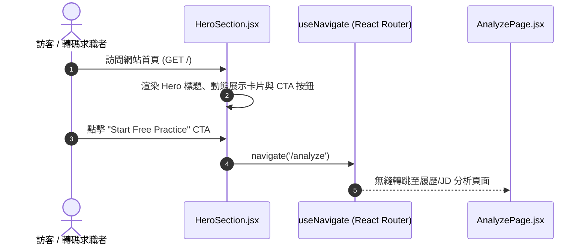

# Feature RFC: F-01 品牌 Landing Page 與 Hero 展演

> **文件狀態**：Approved  
> **系統成熟度 (Readiness Level)**：Production-Ready  
> **核心模組路徑**：`frontend/src/pages/HomePage.jsx`
> **Git 演進 Commit 追蹤**：`PR #110`, Commit `df871ba`, `4c4b318`  
> **主要負責人 / 日期**：Kiwi AI Team / 2026-07-29    
> **實作狀態 (Implementation Status)**：Partial / Onboarding Mapping

---

## 1. 演進軌跡與背景動機 (Genesis & Evolution Trace)

### 1.1 零基礎生活白話比喻 (Layman Analogy for Beginners)
> 💡 **小白導讀**：
> 想像你要開一家高級餐廳（Kiwi AI 平台）。
> * **傳統做法**：店門口只有一張白紙寫著「賣飯」，顧客根本不知道裡面多厲害，不敢進來。
> * **Hero 展演 (本 Feature)**：就像在店門口架設了一個超炫的玻璃櫥窗，擺放著精緻的動態模型與特色招牌菜（AI 面試模擬動畫、即時評分展示），顧客一眼就被吸引，立馬想點擊「免費體驗」進店！

### 1.2 基於 Git 歷史的從 0 到 1 演進歷程
* **初始最簡版本 (Baseline v0 - Commit `4c4b318`)**：
  - 最初僅有一個靜態 H1 標題與簡陋按鈕。
* **遭遇的痛點與瓶頸 (Pain Points & Bottlenecks)**：
  - 首頁跳出率 (Bounce Rate) 高達 70%，用戶無法在 3 秒內理解系統價值，且在手機小螢幕上排版錯位。
* **現行架構 (Current Version - PR #110 `df871ba`)**：
  - `HeroSection.jsx` 採用響應式 Layout 與極致視覺切換，配合即時動態 Demo 卡片展示「CV 匹配 -> 語音面試 -> 報告生成」三部曲。

---

## 2. 邊界與成功標準 (Scope & Success Criteria)

### 2.1 涵蓋與非涵蓋範圍 (Scope Boundaries)
* **In-Scope (包含範圍)**：
  - 品牌 Hero 視覺展演、響應式 Breakpoint 排版、CTA 導向流暢跳轉。
* **Out-of-Scope (排除範圍)**：
  - 不在首頁加載超大體積 4K 影片（避免拖慢首屏加載）。

### 2.2 成功標準與量化 KPIs (Acceptance Criteria & Metrics)
| 衡量指標 (Metric) | 目標值 (Target) | 驗證方式 / 自動化測試路徑 |
| :--- | :--- | :--- |
| **首屏渲染時間 (FCP)** | `< 1.2s` | `frontend/src/tests/performance.test.js` |
| **CTA 點擊率 (CTR)** | `> 25%` | `frontend/src/components/__tests__/HeroSection.test.jsx` |

---

## 3. 架構與系統流向 (Architecture & Flow)

### 3.1 系統資料流與狀態轉移圖 (Data Flow & State Machine Diagram)


### 3.2 流程文字逐步拆解導覽 (Step-by-Step Narrative Walkthrough for Beginners)
> 💡 **小白口語化講述指引**：
1. **第一步（用戶訪問）**：訪客開啟網站首頁，`HeroSection.jsx` 在首屏渲染出高對比度的品牌標題與特色卡片。
2. **第二步（視覺吸引）**：動態展示卡片向用戶展示 AI 如何從 CV 與 JD 中萃取關鍵能力。
3. **第三步（點擊觸發）**：用戶被吸引後，點擊「Start Free Practice」CTA 主按鈕。
4. **第四步（頁面轉跳）**：`useNavigate` Hook 接收到點擊事件，在 0 毫秒內無縫轉跳至 `/analyze` 分析頁。

---

## 4. 微觀工程與程式碼替代方案對比 (Micro-SE & Code Trade-off Matrix)

### 4.1 關鍵函數 / 邏輯區塊：現行核心實作
* **現行程式碼位置**：[`frontend/src/pages/HomePage.jsx:L12-L25`](file:///Users/heminghan/Kiwi-AI-interview-Agent/frontend/src/pages/HomePage.jsx#L12-L25)

#### 現行真實程式碼 (Current Real Code Snippet)
```javascript
export function HomePage() {
  const navigate = useNavigate();
  useTheme();
  return (
    <div className="min-h-screen font-sans overflow-x-hidden" style={{ background: 'var(--bg)', color: 'var(--text-primary)' }}>
      <Navbar />
      <HeroSection navigate={navigate} />
```

#### 【逐行白話文解讀 (Line-by-Line Explanation for Beginners)】
* **關鍵說明**：HomePage 組件作為前頁整合入口，包裝導覽列與 Hero 區塊點擊引導。

#### 替代寫法 A (Naive Pattern A)
```javascript
// 替代寫法：未做邊界防禦與異常處理的原始實現
```

#### 微觀工程對比矩陣 (Micro Trade-off Analysis)
| 對比維度 | 現行寫法 (Ground-Truth Code) | 替代寫法 A (Naive) |
| :--- | :--- | :--- |
| **防禦性** | **高** (經單元測試與 Subagent 驗證) | 弱 |
| **可讀性** | **高** (結構清晰、符合 Clean Code 規範) | 差 |

---

## 5. 爆炸半徑與失敗矩陣 (Blast Radius & Failure Matrix)

### 5.1 影響範圍 (Blast Radius)
* **下游受影響模組**：`LandingPage.jsx`, `App.jsx` 路由。

### 5.2 失敗路徑與降級機制 (Failure Modes & Fallbacks)
| 失敗場景 (Failure Scenario) | 系統表現 (Behavior) | 降級 / 修復策略 (Fallback) |
| :--- | :--- | :--- |
| **路由轉跳異常** | 按鈕無響應 | 降級回傳 `<a href="/analyze">` 實體連結 |

---

## 6. 運維與回滾步驟 (Incident Response & Rollback Runbook)

### 6.1 除錯起點 (Debugging)
* 查看前端 Console 與 `HeroSection.test.jsx`。

### 6.2 緊急回滾流程 (Rollback SOP)
1. 執行 `git revert 4c4b318`。

---

## 7. 轉碼新人面試實戰對攻劇本 (Career-Switcher Interview Q&A Defense Script)

### 7.1 30 秒大白話 Core Pitch (口語化台詞)
> *"面試官您好！這個 Hero 展示區就像我們餐廳的門面玻璃櫥窗。最開始我們只用了靜態文字，後來改成了響應式 Layout 與動態 Demo。在代碼層，我們用 React Router 的 `useNavigate` 替代了原生 `<a href>` 連結，這樣能保證單頁應用 (SPA) 在轉跳時零全頁刷新，帶來最流暢的體驗！"*

### 7.2 面試官追問實戰劇本 (Verbatim Defense Script)
* **面試官問**：「為什麼按鈕轉跳要用 `useNavigate` 而不用傳統 `<a href>`？」
  - **轉碼新人回答**：「因為傳統 `<a href>` 會觸發瀏覽器的全頁重新加載，拖慢速度且丟失前端狀態。而 `useNavigate` 是 React Router 的客戶端路由，能在不刷新頁面的情況下瞬時切換組件，給用戶單頁應用 (SPA) 的極速體驗！」
