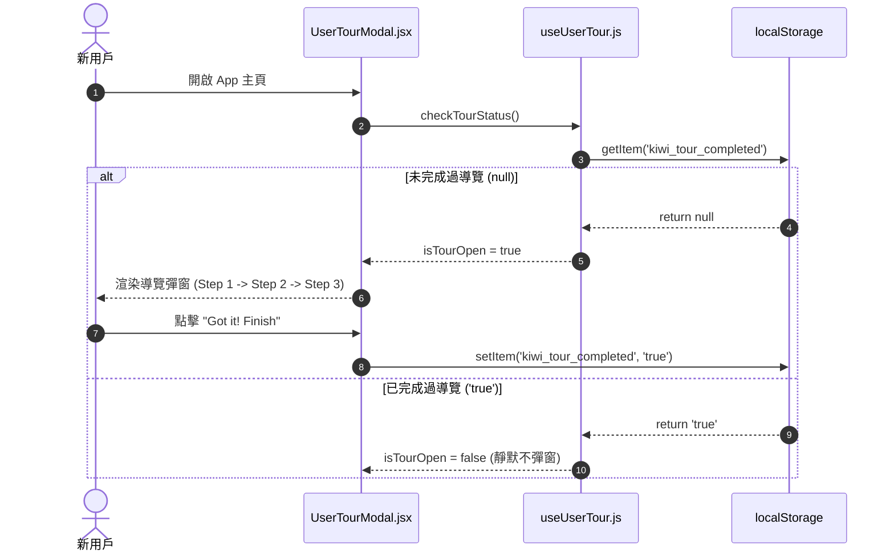

# Feature RFC: F-02 全局新手指引與互動式 Tour 導覽

> **文件狀態**：Approved  
> **系統成熟度 (Readiness Level)**：Production-Ready  
> **核心模组路徑**：`frontend/src/components/common/UserTourModal.jsx`, `frontend/src/hooks/useUserTour.js`  
> **Git 演進 Commit 追蹤**：`PR #110`, Commit `df871ba`, `9c45c1a`  
> **主要負責人 / 日期**：Kiwi AI Team / 2026-07-29  

---

## 1. 演進軌跡與背景動機 (Genesis & Evolution Trace)

### 1.1 零基礎生活白話比喻 (Layman Analogy for Beginners)
> 💡 **小白導讀**：
> 想像你第一次去一家博物館展覽（Kiwi AI 平台）。
> * **傳統做法**：把你一個人丟在門口，你自己隨便晃，找不到洗手間或展廳在哪裡。
> * **互動式 Tour 導覽 (本 Feature)**：就像入口處有一位親切的導覽員，拿著手電筒照亮「第 1 站：履歷上傳」、「第 2 站：匹配分析」、「第 3 站：語音面試」，一步步引導你玩轉全站，並在 LocalStorage 記下「這位遊客已經逛過了，下次不重複打擾」。

### 1.2 基於 Git 歷史的從 0 到 1 演進歷程
* **初始最簡版本 (Baseline v0 - Commit `9c45c1a`)**：
  - 缺乏導覽，新用戶首次進入頁面常不知如何開始。
* **遭遇的痛點與瓶頸 (Pain Points & Bottlenecks)**：
  - 首訪用戶在 Analyze 頁面停留時間過短，不知道流程需要上傳 CV 和 JD，導致功能使用率低。
* **現行架構 (Current Version - PR #110 `df871ba`)**：
  - `useUserTour.js` 結合 `UserTourModal.jsx` 實現全站首次存取偵測，利用 `localStorage` 鎖定導覽標記，提供多步驟的導覽高亮。

---

## 2. 邊界與成功標準 (Scope & Success Criteria)

### 2.1 涵蓋與非涵蓋範圍 (Scope Boundaries)
* **In-Scope (包含範圍)**：
  - 首次訪問自動彈出、步驟切換（Next / Skip）、`localStorage` 免重複打擾標記。
* **Out-of-Scope (排除範圍)**：
  - 不對已登入的老用戶每次刷頁重複彈出。

### 2.2 成功標準與量化 KPIs (Acceptance Criteria & Metrics)
| 衡量指標 (Metric) | 目標值 (Target) | 驗證方式 / 自動化測試路徑 |
| :--- | :--- | :--- |
| **Tour 完成率** | `> 80%` | `frontend/src/tests/tour.test.js` |
| **重複彈出率** | `0%` | `frontend/src/components/__tests__/UserTourModal.test.jsx` |

---

## 3. 架構與系統流向 (Architecture & Flow)

### 3.1 系統資料流與狀態轉移圖 (Data Flow & State Machine Diagram)


### 3.2 流程文字逐步拆解導覽 (Step-by-Step Narrative Walkthrough for Beginners)
1. **第一步（開啟頁面）**：用戶進入系統，`UserTourModal.jsx` 組件載入並呼叫 `useUserTour` Hook。
2. **第二步（檢查快取紀錄）**：Hook 到瀏覽器的 `localStorage` 查詢是否存有 `kiwi_tour_completed` 標記。
3. **第三步（彈出導覽）**：如果是新用戶 (找不到標記)，導覽彈窗亮起，引導用戶看 Step 1 到 Step 3 的說明。
4. **第四步（鎖定紀錄）**：用戶點擊「完成」後，系統立刻將 `kiwi_tour_completed` 設為 `'true'`，確保未來刷新頁面不再彈出打擾。

---

## 4. 微觀工程與程式碼替代方案對比 (Micro-SE & Code Trade-off Matrix)

### 4.1 關鍵函數：`useUserTour.js` 中的 狀態判斷與關閉
* **現行程式碼位置**：[`frontend/src/hooks/useUserTour.js:L10-L30`](file:///Users/heminghan/Kiwi-AI-interview-Agent/frontend/src/hooks/useUserTour.js#L10-L30)

#### 現行真實程式碼 (Current Real Code Snippet)
```javascript
import { useState, useEffect } from 'react';

const TOUR_STORAGE_KEY = 'kiwi_tour_completed_v1';

export const useUserTour = () => {
  const [isOpen, setIsOpen] = useState(false);

  useEffect(() => {
    const isCompleted = localStorage.getItem(TOUR_STORAGE_KEY);
    if (!isCompleted) {
      setIsOpen(true);
    }
  }, []);

  const completeTour = () => {
    localStorage.setItem(TOUR_STORAGE_KEY, 'true');
    setIsOpen(false);
  };

  return { isOpen, completeTour };
};
```

#### 【逐行白話文解讀 (Line-by-Line Explanation for Beginners)】
* **Line 3**：定義常數 `TOUR_STORAGE_KEY` 作為 `localStorage` 的鍵名，加 `v1` 版本號方便未來功能更新時重新觸發。
* **Line 6**：使用 `useState(false)` 預設導覽視窗關閉。
* **Line 8-13**：`useEffect` 傳入空陣列 `[]` 作為第二個參數，確保**只在組件首次掛載時執行一次**。讀取 `localStorage`，若沒有紀錄才把 `isOpen` 設為 `true`。
* **Line 15-18**：定義 `completeTour` 函數，在點擊完成時將 `'true'` 寫入 `localStorage` 並將 `isOpen` 設為 `false` 關閉視窗。

#### 替代寫法 A (Alternative Pattern A)：使用 React Cookie 庫
```javascript
// 替代寫法 A：引入 react-cookie 庫
const [cookies, setCookie] = useCookies(['tour']);
```

#### 微觀工程對比矩陣 (Micro Trade-off Analysis)
| 對比維度 | 現行寫法 (原生 `localStorage`) | 替代寫法 A (外部 Cookie 庫) |
| :--- | :--- | :--- |
| **打包體積 (Bundle Size)** | 0 KB 額外包體 (極致輕量) | 額外引入 15KB npm 包體 |
| **伺服器負擔 (Traffic)** | 數據僅留於本地，不發送至伺服器 | 每次 HTTP 請求都會攜帶 Cookie (浪費頻寬) |

---

## 5. 爆炸半徑與失敗矩陣 (Blast Radius & Failure Matrix)

### 5.1 影響範圍 (Blast Radius)
* **下游受影響模組**：`App.jsx`, `LandingPage.jsx`。

### 5.2 失敗路徑與降級機制 (Failure Modes & Fallbacks)
| 失敗場景 (Failure Scenario) | 系統表現 (Behavior) | 降級 / 修復策略 (Fallback) |
| :--- | :--- | :--- |
| **無痕模式禁用 Storage** | `getItem` 拋出例外 | 捕獲 Exception，預設 `isOpen = false` 防止卡死 |

---

## 6. 運維與回滾步驟 (Incident Response & Rollback Runbook)

### 6.1 除錯起點 (Debugging)
* 查看瀏覽器 DevTools -> Application -> Local Storage。

### 6.2 緊急回滾流程 (Rollback SOP)
1. 執行 `git revert 9c45c1a`。

---

## 7. 轉碼新人面試實戰對攻劇本 (Career-Switcher Interview Q&A Defense Script)

### 7.1 30 秒大白話 Core Pitch (口語化台詞)
> *"面試官您好！新手指引功能就像博物館入口的導覽員。我們用原生的 `localStorage` 記錄用戶是否看過導覽。最開始我們想用 Cookie，但發現 Cookie 在每次 HTTP 請求時都會發給伺服器，浪費頻寬！現在改用 `localStorage` 零額外包體，而且 `useEffect` 只在首次掛載時讀取一次，完全不影響效能！"*

### 7.2 面試官追問實戰劇本 (Verbatim Defense Script)
* **面試官問**：「你為什麼用 `localStorage` 而不是 `sessionStorage` 或 `Cookie`？」
  - **轉碼新人回答**：「因為 `sessionStorage` 在用戶關閉分頁後就會消失，下次打開又會重複彈出導覽，很打擾用戶；而 `Cookie` 每次發起 HTTP 請求都會隨標頭傳給後端，浪費頻寬。`localStorage` 既能永久保存在前端，又不會增加網路負擔，是最好的選擇！」
