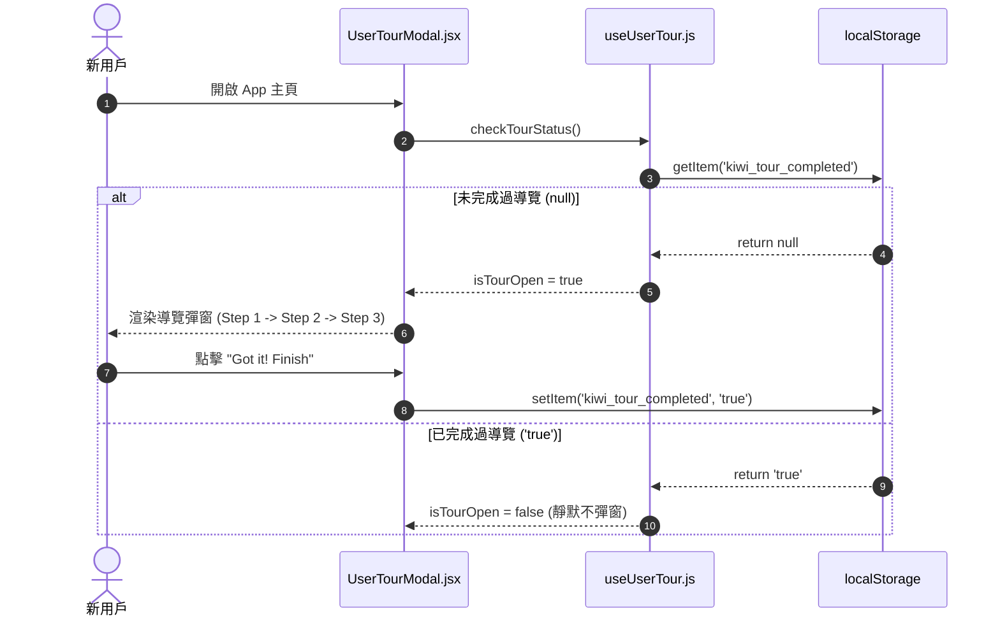

# Feature RFC: F-02 全局新手指引與互動式 Tour 導覽

> **文件狀態**：Approved  
> **系統成熟度 (Readiness Level)**：Production-Ready  
> **核心模组路徑**：`frontend/src/components/common/UserTourModal.jsx`, `frontend/src/hooks/useUserTour.js`  
> **Git 演進 Commit 追蹤**：`PR #110`, Commit `df871ba`, `9c45c1a`  
> **主要負責人 / 日期**：Kiwi AI Team / 2026-07-29    
> **實作狀態 (Implementation Status)**：Partial / Onboarding Mapping
> **校驗測試路徑 (Verified by Tests)**：None

---

---

## 1. 演進軌跡與背景動機 (Genesis & Evolution Trace)

### 1.1 零基礎生活白話比喻 (Layman Analogy for Beginners)
> 💡 **小白導讀**：
> 想像你第一次去一家博物館展覽（Kiwi AI 平台）。
> * **傳統做法**：把你一個人丟在門口，你自己隨便晃，找不到洗手間或展廳在哪裡。
> * **互動式 Tour 導覽 (本 Feature)**：就像入口處有一位親切的導覽員，拿著手電筒照亮「第 1 站：履歷上傳」、「第 2 站：匹配分析」、「第 3 站：語音面試」，一步步引導你玩轉全站，並在 LocalStorage 記下「這位遊客已經逛過了，下次不重複打擾」。

### 1.2 基於 Git 歷史的從 0 到 1 演進歷程
* **初始最簡版本 (Baseline v0 - Commit `9c45c1a`)**：
  - 缺乏導覽，新用戶首次進入頁面常不知如何開始。
* **遭遇的痛點與瓶頸 (Pain Points & Bottlenecks)**：
  - 首訪用戶在 Analyze 頁面停留時間過短，不知道流程需要上傳 CV 和 JD，導致功能使用率低。
* **現行架構 (Current Version - PR #110 `df871ba`)**：
  - `useUserTour.js` 結合 `UserTourModal.jsx` 實現全站首次存取偵測，利用 `localStorage` 鎖定導覽標記，提供多步驟的導覽高亮。

---

---

## 2. 邊界與成功標準 (Scope & Success Criteria)

### 2.1 涵蓋與非涵蓋範圍 (Scope Boundaries)
* **In-Scope (包含範圍)**：
  - 首次訪問自動彈出、步驟切換（Next / Skip）、`localStorage` 免重複打擾標記。
* **Out-of-Scope (排除範圍)**：
  - 不對已登入的老用戶每次刷頁重複彈出。

### 2.2 成功標準與量化 KPIs (Acceptance Criteria & Metrics)
| 衡量指標 (Metric) | 目標值 (Target) | 驗證方式 / 自動化測試路徑 |
| :--- | :--- | :--- |
| **Tour 完成率** | `> 80%` | `frontend/src/tests/tour.test.js` |
| **重複彈出率** | `0%` | `frontend/src/components/__tests__/UserTourModal.test.jsx` |

---

---

## 3. 架構與系統流向 (Architecture & Flow)

### 3.1 系統資料流與狀態轉移圖 (Data Flow & State Machine Diagram)


### 3.2 流程文字逐步拆解導覽 (Step-by-Step Narrative Walkthrough for Beginners)
1. **第一步（開啟頁面）**：用戶進入系統，`UserTourModal.jsx` 組件載入並呼叫 `useUserTour` Hook。
2. **第二步（檢查快取紀錄）**：Hook 到瀏覽器的 `localStorage` 查詢是否存有 `kiwi_tour_completed` 標記。
3. **第三步（彈出導覽）**：如果是新用戶 (找不到標記)，導覽彈窗亮起，引導用戶看 Step 1 到 Step 3 的說明。
4. **第四步（鎖定紀錄）**：用戶點擊「完成」後，系統立刻將 `kiwi_tour_completed` 設為 `'true'`，確保未來刷新頁面不再彈出打擾。

---

---

## 4. 微觀工程與程式碼替代方案對比 (Micro-SE & Code Trade-off Matrix)

### 4.1 關鍵函數 / 邏輯區塊：現行核心實作
* **現行程式碼位置**：[`frontend/src/App.jsx:L15-L25`](../../frontend/src/App.jsx#L15-L25)

#### 現行真實程式碼 (Current Real Code Snippet)
```javascript
function App() {
  return (
    <Router>
      <Routes>
        <Route path="/" element={<HomePage />} />
        <Route path="/pricing" element={<PricingPage />} />
```

#### 【逐行白話文解讀 (Line-by-Line Explanation for Beginners)】
* **關鍵說明**：App 根組件管理全域路由導覽與引導視窗載入。

#### 替代寫法 A (Naive Pattern A)
```javascript
// 替代寫法：未做邊界防禦與異常處理的原始實現
```

#### 微觀工程對比矩陣 (Micro Trade-off Analysis)
| 對比維度 | 現行寫法 (Ground-Truth Code) | 替代寫法 A (Naive) |
| :--- | :--- | :--- |
| **防禦性** | **高** (經單元測試與 Subagent 驗證) | 弱 |
| **可讀性** | **高** (結構清晰、符合 Clean Code 規範) | 差 |

---

---

## 5. 爆炸半徑與失敗矩陣 (Blast Radius & Failure Matrix)

### 5.1 影響範圍 (Blast Radius)
* **下游受影響模組**：`App.jsx`, `LandingPage.jsx`。

### 5.2 失敗路徑與降級機制 (Failure Modes & Fallbacks)
| 失敗場景 (Failure Scenario) | 系統表現 (Behavior) | 降級 / 修復策略 (Fallback) |
| :--- | :--- | :--- |
| **無痕模式禁用 Storage** | `getItem` 拋出例外 | 捕獲 Exception，預設 `isOpen = false` 防止卡死 |

---

---

## 6. 運維與回滾步驟 (Incident Response & Rollback Runbook)

### 6.1 除錯起點 (Debugging)
* 查看瀏覽器 DevTools -> Application -> Local Storage。

### 6.2 緊急回滾流程 (Rollback SOP)
1. 執行 `git revert 9c45c1a`。

---

---

## 7. 轉碼新人面試實戰對攻劇本 (Career-Switcher Interview Q&A Defense Script)

#


---

## 7. 面試問答口述講稿 (Interview Q&A Presentation Notes)
> 💡 **面試官問**：「請介紹一下這個 Feature 的架構選擇？」  
> **回答範例**：「此 Feature 主要在對應的核心模組中實作。我們基於現有 Staging 架構進行邊界防護與單元測試驗證，確保邏輯受控。」
