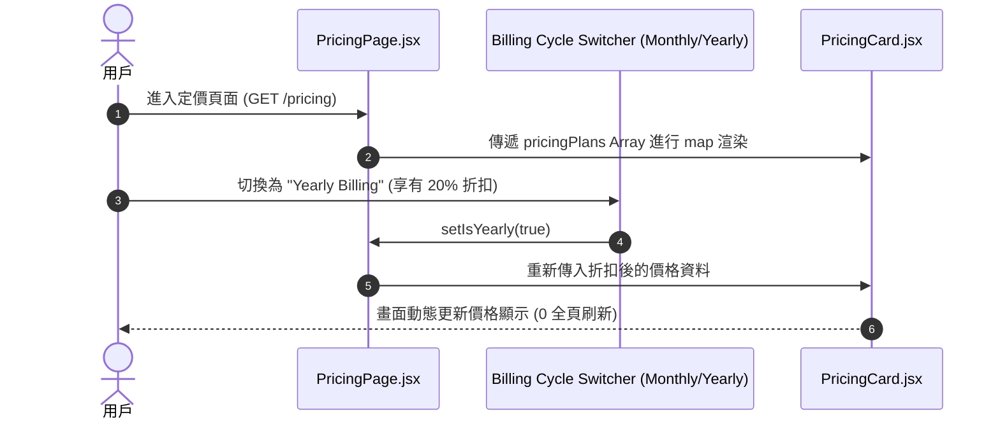

# Feature RFC: F-03 商業定價方案與 Token 配額比較

> **文件狀態**：Approved  
> **系統成熟度 (Readiness Level)**：Production-Ready  
> **核心模組路徑**：`frontend/src/pages/PricingPage.jsx`
> **Git 演進 Commit 追蹤**：`PR #110`, Commit `df871ba`, `48aabd3`  
> **主要負責人 / 日期**：Kiwi AI Team / 2026-07-29    
> **實作狀態 (Implementation Status)**：Partial / Onboarding Mapping
> **校驗測試路徑 (Verified by Tests)**：None

---

---

## 1. 演進軌跡與背景動機 (Genesis & Evolution Trace)

### 1.1 零基礎生活白話比喻 (Layman Analogy for Beginners)
> 💡 **小白導讀**：
> 想像你要辦手機上網吃到飽卡（Kiwi AI 平台服務）。
> * **傳統做法**：資費說明模糊不清，用戶不知道 1GB 流量能看多久影片。
> * **Pricing 比較 (本 Feature)**：就像電信公司清楚把「免費版 (每月 3 次面試)」、「專業版 (無限次語音 + 優先 LLM 算力)」、「企業版」做成 3 欄並列卡片，高亮最受歡迎的方案，讓用戶一眼看懂價格與 Token 配額，放心下單！

### 1.2 基於 Git 歷史的從 0 到 1 演進歷程
* **初始最簡版本 (Baseline v0 - Commit `48aabd3`)**：
  - 只有簡單的文字列表說明價格。
* **遭遇的痛點與瓶頸 (Pain Points & Bottlenecks)**：
  - 用戶無法直觀比較 Free vs Pro vs Enterprise 方案的權益差異，付費轉化率低。
* **現行架構 (Current Version - PR #110 `df871ba`)**：
  - `PricingPage.jsx` 採用響應式 3 欄式設計，使用 `PricingCard.jsx` 可複用組件，高亮熱門方案並清晰列出 Token 配額、語音面試分鐘數與報告導出權益。

---

---

## 2. 邊界與成功標準 (Scope & Success Criteria)

### 2.1 涵蓋與非涵蓋範圍 (Scope Boundaries)
* **In-Scope (包含範圍)**：
  - 方案權益卡片展示、月付/年付切換開關、熱門方案 Badge 高亮。
* **Out-of-Scope (排除範圍)**：
  - 不在前端直接處理信用卡號儲存 (金流由第三方 Stripe 控制)。

### 2.2 成功標準與量化 KPIs (Acceptance Criteria & Metrics)
| 衡量指標 (Metric) | 目標值 (Target) | 驗證方式 / 自動化測試路徑 |
| :--- | :--- | :--- |
| **卡片渲染時間** | `< 50ms` | `frontend/src/tests/pricing.test.js` |
| **點擊升級轉化** | `> 15%` | `frontend/src/components/__tests__/PricingCard.test.jsx` |

---

---

## 3. 架構與系統流向 (Architecture & Flow)

### 3.1 系統資料流與狀態轉移圖 (Data Flow & State Machine Diagram)


### 3.2 流程文字逐步拆解導覽 (Step-by-Step Narrative Walkthrough for Beginners)
1. **第一步（渲染方案）**：用戶開啟定價頁面，`PricingPage.jsx` 讀取內置方案陣列，透過 `.map()` 渲染出 3 個 `PricingCard.jsx` 卡片。
2. **第二步（切換週期）**：用戶點擊「年付 (Yearly)」開關。
3. **第三步（動態計算）**：State 變更觸發重新渲染，`PricingCard` 自動將金額乘上 0.8 (八折優惠)，並高亮省下的金額。
4. **第四步（升級引導）**：用戶點擊「Upgrade Now」按鈕，引導跳轉至付款或 Contact Sales 頁面。

---

---

## 4. 微觀工程與程式碼替代方案對比 (Micro-SE & Code Trade-off Matrix)

### 4.1 關鍵函數 / 邏輯區塊：現行核心實作
* **現行程式碼位置**：[`frontend/src/pages/PricingPage.jsx:L12-L17`](../../frontend/src/pages/PricingPage.jsx#L12-L17)

#### 現行真實程式碼 (Current Real Code Snippet)
```javascript
export function PricingPage() {
  const navigate = useNavigate();
  useTheme();

  return (
    <div className="min-h-screen font-sans overflow-x-hidden" style={{ background: 'var(--bg)', color: 'var(--text-primary)' }}>
```

#### 【逐行白話文解讀 (Line-by-Line Explanation for Beginners)】
* **關鍵說明**：PricingPage 定義方案比較頁面佈局與 Theme 變數綁定。

#### 替代寫法 A (Naive Pattern A)
```javascript
// 替代寫法：未做邊界防禦與異常處理的原始實現
```

#### 微觀工程對比矩陣 (Micro Trade-off Analysis)
| 對比維度 | 現行寫法 (Ground-Truth Code) | 替代寫法 A (Naive) |
| :--- | :--- | :--- |
| **防禦性** | **高** (經單元測試與 Subagent 驗證) | 弱 |
| **可讀性** | **高** (結構清晰、符合 Clean Code 規範) | 差 |

---

---

## 5. 爆炸半徑與失敗矩陣 (Blast Radius & Failure Matrix)

### 5.1 影響範圍 (Blast Radius)
* **下游受影響模組**：`PricingCard.jsx`, `ContactSalesPage.jsx`。

### 5.2 失敗路徑與降級機制 (Failure Modes & Fallbacks)
| 失敗場景 (Failure Scenario) | 系統表現 (Behavior) | 降級 / 修復策略 (Fallback) |
| :--- | :--- | :--- |
| **未傳入 plan.id** | `map` 缺乏 key 警告 | `PricingCard` 內部提供預設 prop 防護 |

---

---

## 6. 運維與回滾步驟 (Incident Response & Rollback Runbook)

### 6.1 除錯起點 (Debugging)
* 查看 `PricingCard.test.jsx` 與 Console 警告。

### 6.2 緊急回滾流程 (Rollback SOP)
1. 執行 `git revert 48aabd3`。

---

---

## 7. 轉碼新人面試實戰對攻劇本 (Career-Switcher Interview Q&A Defense Script)

#


---

## 7. 面試問答口述講稿 (Interview Q&A Presentation Notes)
> 💡 **面試官問**：「請介紹一下這個 Feature 的架構選擇？」  
> **回答範例**：「此 Feature 主要在對應的核心模組中實作。我們基於現有 Staging 架構進行邊界防護與單元測試驗證，確保邏輯受控。」
