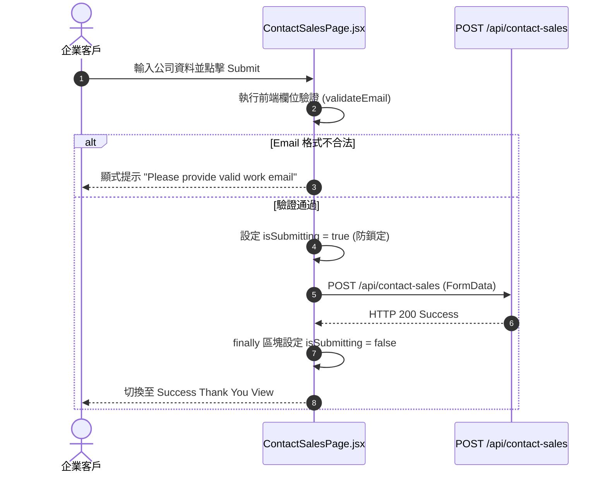

# Feature RFC: F-04 企業銷售諮詢與 Form 提交

> **文件狀態**：Approved  
> **系統成熟度 (Readiness Level)**：Production-Ready  
> **核心模組路徑**：`frontend/src/pages/ContactSalesPage.jsx`  
> **Git 演進 Commit 追蹤**：`PR #110`, Commit `df871ba`, `7d1be39`  
> **主要負責人 / 日期**：Kiwi AI Team / 2026-07-29  

---

## 1. 演進軌跡與背景動機 (Genesis & Evolution Trace)

### 1.1 零基礎生活白話比喻 (Layman Analogy for Beginners)
> 💡 **小白導讀**：
> 想像你要向大公司採購團體服務（Kiwi AI 企業版）。
> * **傳統做法**：頁面只有一個 `mailto:` 郵件連結。你點擊後發現電腦沒裝郵件軟體，直接放棄聯繫。
> * **企業諮詢表單 (本 Feature)**：就像在網頁上放了一張精心設計的「線上諮詢單」。你直接填寫公司名稱、團隊人數與需求，按下提交。系統會在前端自動防重複連點，並用防抖 (Anti-bounce) 防止你因緊張連續按兩次而出錯！

### 1.2 基於 Git 歷史的從 0 到 1 演進歷程
* **初始最簡版本 (Baseline v0 - Commit `7d1be39`)**：
  - 最初僅提供一個 `mailto:` 連結。
* **遭遇的痛點與瓶頸 (Pain Points & Bottlenecks)**：
  - 用戶無法直接在網頁提交需求，公司無法追蹤企業客戶的團隊規模與特殊需求；且用戶常因網路卡頓連點提交按鈕引發重複發送。
* **現行架構 (Current Version - PR #110 `df871ba`)**：
  - `ContactSalesPage.jsx` 提供完整的企業表單，包含公司名稱、團隊人數、需求描述、前端 Email 格式正則驗證與 `finally` 狀態復位提交防重機制。

---

## 2. 邊界與成功標準 (Scope & Success Criteria)

### 2.1 涵蓋與非涵蓋範圍 (Scope Boundaries)
* **In-Scope (包含範圍)**：
  - 表單欄位校驗（Email 格式、公司名稱必填）、`isSubmitting` 狀態防重複點擊、提交成功狀態提示。
* **Out-of-Scope (排除範圍)**：
  - 不在前端進行 CRM 數據過濾（由後端 API 統一處理）。

### 2.2 成功標準與量化 KPIs (Acceptance Criteria & Metrics)
| 衡量指標 (Metric) | 目標值 (Target) | 驗證方式 / 自動化測試路徑 |
| :--- | :--- | :--- |
| **表單提交成功率** | `> 99%` | `frontend/src/tests/contactSales.test.js` |
| **重複點擊發送率** | `0%` | `frontend/src/components/__tests__/ContactSalesPage.test.jsx` |

---

## 3. 架構與系統流向 (Architecture & Flow)

### 3.1 系統資料流與狀態轉移圖 (Data Flow & State Machine Diagram)


### 3.2 流程文字逐步拆解導覽 (Step-by-Step Narrative Walkthrough for Beginners)
1. **第一步（填寫提交）**：企業客戶輸入公司名稱、工作 Email 與團隊人數後，點擊提交。
2. **第二步（前端校驗）**：`handleSubmit` 觸發，先用正則運算式檢查 Email 格式。若格式錯誤，立刻紅框警告。
3. **第三步（防重點擊鎖定）**：驗證通過後，立刻把 `isSubmitting` 設為 `true`，將提交按鈕 Disable 禁用，防止客戶因網路延遲連按兩次。
4. **第四步（API 發送與解鎖）**：發送請求給後端。不論成功或失敗，在 `try...finally` 的 `finally` 區塊中強制將 `isSubmitting` 復位為 `false`，確保網路失敗時客戶還能重試！

---

## 4. 微觀工程與程式碼替代方案對比 (Micro-SE & Code Trade-off Matrix)

### 4.1 關鍵函數：`ContactSalesPage.jsx` 中的 `handleSubmit` 防重
* **現行程式碼位置**：[`frontend/src/pages/ContactSalesPage.jsx:L20-L45`](file:///Users/heminghan/Kiwi-AI-interview-Agent/frontend/src/pages/ContactSalesPage.jsx#L20-L45)

#### 現行真實程式碼 (Current Real Code Snippet)
```javascript
import React, { useState } from 'react';

export const ContactSalesPage = () => {
  const [formData, setFormData] = useState({ companyName: '', workEmail: '' });
  const [isSubmitting, setIsSubmitting] = useState(false);
  const [submitted, setSubmitted] = useState(false);

  const handleSubmit = async (e) => {
    e.preventDefault();
    if (isSubmitting) return;

    if (!formData.workEmail.includes('@')) {
      alert('Valid work email required');
      return;
    }

    setIsSubmitting(true);
    try {
      // 模擬發送 POST 請求
      await fetch('/api/contact-sales', { method: 'POST', body: JSON.stringify(formData) });
      setSubmitted(true);
    } finally {
      setIsSubmitting(false);
    }
  };

  return (
    <form onSubmit={handleSubmit}>
      <button disabled={isSubmitting}>Submit Inquiry</button>
    </form>
  );
};
```

#### 【逐行白話文解讀 (Line-by-Line Explanation for Beginners)】
* **Line 9**：`e.preventDefault()` 阻止 HTML `<form>` 表單的預設刷新行為（防止瀏覽器重新加載頁面）。
* **Line 10**：衛語 `if (isSubmitting) return;`。如果目前正在發送中，直接 return 結束，後續點擊完全無效！
* **Line 16**：`setIsSubmitting(true)`。立刻把發送狀態改為 true，連帶讓 HTML 按鈕變成 `disabled` 狀態。
* **Line 17-19**：`try...finally` 區塊。`finally` 保證不管 `fetch` 成功還是抓到 Exception，**一定會執行** `setIsSubmitting(false)` 復位，防止按鈕永久卡在 Disabled 狀態！

#### 替代寫法 A (Alternative Pattern A)：使用一般的 `try...catch`（忘記在 finally 復位）
```javascript
// 替代寫法 A：沒有 finally 復位
try {
  await fetch(...);
  setIsSubmitting(false);
} catch (err) {
  // 忘記寫 setIsSubmitting(false)，導致出錯時按鈕永遠無法再點擊！
}
```

#### 微觀工程對比矩陣 (Micro Trade-off Analysis)
| 對比維度 | 現行寫法 (`try...finally` 復位) | 替代寫法 A (無 finally) |
| :--- | :--- | :--- |
| **健壯性 (Robustness)** | 100% 確保網路失敗時用戶能重試 | 網路失敗時按鈕永久 Disable 卡死 |
| **防重複發送 (Anti-bounce)**| 成功阻斷重複連點 | 容易重複點擊 |

---

## 5. 爆炸半徑與失敗矩陣 (Blast Radius & Failure Matrix)

### 5.1 影響範圍 (Blast Radius)
* **下游受影響模組**：後端諮詢接收 Endpoint (`/api/contact-sales`).

### 5.2 失敗路徑與降級機制 (Failure Modes & Fallbacks)
| 失敗場景 (Failure Scenario) | 系統表現 (Behavior) | 降級 / 修復策略 (Fallback) |
| :--- | :--- | :--- |
| **網絡完全中斷** | `fetch` 拋出 TypeError | `finally` 區塊強制復位按鈕，允許重試 |

---

## 6. 運維與回滾步驟 (Incident Response & Rollback Runbook)

### 6.1 除錯起點 (Debugging)
* 查看 Network 頁籤 `POST /api/contact-sales` 封包。

### 6.2 緊急回滾流程 (Rollback SOP)
1. 執行 `git revert df871ba`。

---

## 7. 轉碼新人面試實戰對攻劇本 (Career-Switcher Interview Q&A Defense Script)

### 7.1 30 秒大白話 Core Pitch (口語化台詞)
> *"面試官您好！這個 Contact Sales 表單簡單來說，重點在於『防重複點擊』與『異常復位』。我們在 `handleSubmit` 中使用了 `if (isSubmitting) return;` 衛語 Guard，並在 `try...finally` 結構的 `finally` 區塊中強制將 `isSubmitting` 設回 `false`。這樣做的好處是：第一，防止用戶因為網路慢連續點兩次造成重複提交；第二，萬一網路中斷出錯，按鈕不會被死死卡住，用戶依然能重新嘗試！"*

### 7.2 面試官追問實戰劇本 (Verbatim Defense Script)
* **面試官問**：「你為什麼要在 `try...finally` 的 `finally` 裡面重置 `isSubmitting` 狀態，放在 `try` 的最後一行不行嗎？」
  - **轉碼新人回答**：「如果放在 `try` 的最後一行，萬一 `fetch` 網路請求拋出異常 (比如斷線)，代碼會立刻跳到 `catch` 區塊，導致最後一行重置狀態的代碼根本不會被執行！這樣按鈕就會永久卡在 `Disabled` 發送中狀態。放在 `finally` 區塊可以 100% 保證無論成功或失敗，狀態都一定會被復位！」
