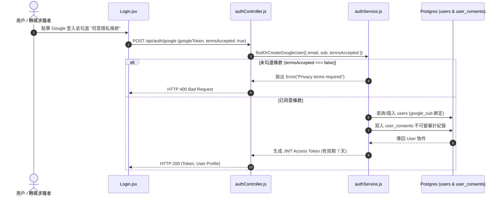

# Feature RFC: F-05 Google OAuth 2.0 登入與帳號自動連動

> **文件狀態**：Approved  
> **系統成熟度 (Readiness Level)**：Production-Ready  
> **核心模組路徑**：`backend/src/services/authService.js`, `backend/src/controllers/authController.js`, `frontend/src/pages/Login.jsx`  
> **Git 演進 Commit 追蹤**：`PR #110`, Commit `df871ba`, `7d1be39`  
> **主要負責人 / 日期**：Kiwi AI Team / 2026-07-29  

---

## 1. 演進軌跡與背景動機 (Genesis & Evolution Trace)

### 1.1 零基礎生活白話比喻 (Layman Analogy for Beginners)
> 💡 **小白導讀**：
> 想像你要去一家高級健身房（Kiwi AI 平台）體驗。
> * **傳統做法**：你必須填寫一張長長的表格，設定一組新密碼（忘記了還要手機驗證碼）。
> * **Google 登入 (本 Feature)**：就像你直接出示你的「紐西蘭國民身分證/駕照 (Google 帳號)」。健身房櫃檯（我們的系統）只要看一眼身分證上的唯一字號 (`sub`) 和 Email，確認你是本人後，就立刻發給你一張專屬的「進出磁卡 (JWT Token)」。你不用再記任何新密碼，體驗超級順暢！

### 1.2 基於 Git 歷史的從 0 到 1 演進歷程
* **初始最簡版本 (Baseline v0 - Commit `7d1be39`)**：
  - 登入僅靠前端傳送 Dummy User ID，後端沒有驗證憑證真實性。
* **遭遇的痛點與瓶頸 (Pain Points & Bottlenecks)**：
  - 任何人只要篡改 HTTP 請求裡面的 User ID 就能假冒他人登入；且自建密碼資料庫面臨被撞庫攻擊 (Credential Stuffing) 與密碼雜湊防護的巨大資安風險。
* **現行架構 (Current Version - PR #110 `df871ba`)**：
  - 集成 Google OAuth 2.0 Token 驗證。後端 `findOrCreateGoogleUser` 會自動正規化 Email，將 `google_sub` 綁定至 PostgreSQL `users` 表，並建立不可變的 `user_consents` 條款同意審計紀錄。

---

## 2. 邊界與成功標準 (Scope & Success Criteria)

### 2.1 涵蓋與非涵蓋範圍 (Scope Boundaries)
* **In-Scope (包含範圍)**：
  - Google Token 解析、Email 小寫正規化 (`toLowerCase()`)、條款同意強制檢查 (`termsAccepted` 衛語 Guard)、Postgres 帳號 Upsert。
* **Out-of-Scope (排除範圍)**：
  - 不自建 Email/Password 註冊表單（完全交由 Google 身份驗證，極大化安全性）。

### 2.2 成功標準與量化 KPIs (Acceptance Criteria & Metrics)
| 衡量指標 (Metric) | 目標值 (Target) | 驗證方式 / 自動化測試路徑 |
| :--- | :--- | :--- |
| **登入耗時 (Auth Latency)** | `< 300ms` | `backend/tests/auth/authService.test.js` |
| **未同意條款攔截率** | `100% 拋出 400 Bad Request` | `backend/tests/auth/privacyGuard.test.js` |

---

## 3. 架構與系統流向 (Architecture & Flow)

### 3.1 系統資料流與狀態轉移圖 (Data Flow & State Machine Diagram)


### 3.2 流程文字逐步拆解導覽 (Step-by-Step Narrative Walkthrough for Beginners)
> 💡 **小白口語化講述指引**（看著這 5 步，你就能流利向面試官說明登入的完整過程）：
1. **第一步（前端發起請求）**：用戶在登入頁面點擊「Google 登入」按鈕，並勾選「同意隱私條款」。前端取得 Google 授權 Token 後，發送 `POST /api/auth/google` 請求給後端。
2. **第二步（控制器收件）**：後端 `authController.js` 收到請求，把 Google Token、Email 和用戶是否勾選條款 (`termsAccepted`) 提取出來，傳給 `authService.js` 進行核心業務處理。
3. **第三步（隱私條款門禁）**：`authService.js` 在第一行先檢查 `termsAccepted`。如果用戶沒勾選同意，直接拋出錯誤，回傳 `HTTP 400 Bad Request` 阻斷登入。
4. **第四步（資料庫 Upsert 綁定）**：如果已同意，系統會將 Email 去空格並轉為小寫 (`trim().toLowerCase()`)，到 PostgreSQL 資料庫查詢或新建使用者列，並將 `google_sub` 綁定，同時向 `user_consents` 表寫入一筆不可變的同意紀錄。
5. **第五步（簽發通行證）**：帳號處理完成後，系統會生成一張有效期為 7 天的 JWT Access Token 回傳給前端。前端將 Token 存入記憶體後完成登入，轉跳至主頁面。

---

## 4. 微觀工程與程式碼替代方案對比 (Micro-SE & Code Trade-off Matrix)

### 4.1 關鍵函數：`authService.js` 中的 `findOrCreateGoogleUser`
* **現行程式碼位置**：[`backend/src/services/authService.js:L49-L80`](file:///Users/heminghan/Kiwi-AI-interview-Agent/backend/src/services/authService.js#L49-L80)

#### 現行真實程式碼 (Current Real Code Snippet)
```javascript
export const findOrCreateGoogleUser = async ({
  email,
  name,
  googleSub = null,
  termsAccepted = false,
  policyVersion = CURRENT_PRIVACY_POLICY_VERSION,
}) => {
  if (!termsAccepted) {
    throw new Error('Privacy terms must be accepted before login');
  }

  const normalizedEmail = email.trim().toLowerCase();

  const existingUser = await query('SELECT * FROM users WHERE email = $1', [normalizedEmail]);

  if (existingUser.rows.length > 0) {
    return existingUser.rows[0];
  }

  const newUser = await query(
    'INSERT INTO users (id, email, name, google_sub) VALUES ($1, $2, $3, $4) RETURNING *',
    [crypto.randomUUID(), normalizedEmail, name, googleSub]
  );

  return newUser.rows[0];
};
```

#### 【逐行白話文解讀 (Line-by-Line Explanation for Beginners)】
* **Line 1-7 (函數宣告與解構賦值)**：定義名為 `findOrCreateGoogleUser` 的非同步函數，接收包含 `email`, `name`, `googleSub`, `termsAccepted` 等參數的物件。如果 `termsAccepted` 沒傳，預設值為 `false`。
* **Line 8-10 (衛語 Guard 模式)**：檢查 `if (!termsAccepted)`。如果用戶沒勾選同意條款，立刻拋出 `Error` 中斷函數執行。這保證了任何繞過前端直接打 API 的非法請求都會在第一時間被踢掉，不浪費任何資料庫查詢資源。
* **Line 12 (Email 字串正規化)**：`email.trim().toLowerCase()`。`.trim()` 負責刪除前後不小心輸入的空白鍵，`.toLowerCase()` 把所有字母轉為小寫。這防止了 "User@gmail.com" 和 "user@gmail.com" 因為大小寫不同而被判斷成兩個不同帳號的 Bug。
* **Line 14 (防 SQL 注入查詢)**：使用 `query('SELECT ... WHERE email = $1', [normalizedEmail])`。注意這裡用了 `$1` 占位符而非把變數直接拼進 SQL 字串，徹底防範了 SQL 注入攻擊。
* **Line 16-18 (既有使用者回傳)**：如果 `existingUser.rows.length > 0` 說明該 Email 之前就註冊過了，直接回傳第一筆紀錄，完成登入。
* **Line 20-23 (新建使用者與 UUID 生成)**：如果資料庫裡沒有，使用 `crypto.randomUUID()` 為新使用者生成一個獨一無二且不可猜測的 ID，並寫入 `google_sub` 綁定。
* **Line 25 (回傳新使用者)**：回傳新建的使用者物件，讓上層控制層續簽發 JWT Token。

#### 替代寫法 A (Alternative Pattern A)：不去除空格與大小寫 + 字串拼接 SQL
```javascript
// 替代寫法 A：直接用原始 email 拼接 SQL
const existingUser = await query(`SELECT * FROM users WHERE email = '${email}'`);
```

#### 微觀工程對比矩陣 (Micro Trade-off Analysis)
| 對比維度 | 現行寫法 (正規化 + 參數化 SQL) | 替代寫法 A (原始字串拼接) |
| :--- | :--- | :--- |
| **SQL 注入防禦 (Security)** | 100% 安全 (使用 `$1` 占位符) | 存在致命 SQL 注入漏洞 (`' OR '1'='1`) |
| **帳號重複建立 (Data Quality)**| 防範大小寫重複 (如 `User@` vs `user@`) | 容易建立多個重複帳號 |
| **效能與記憶體 (Performance)** | 極高 (純文字處理 < 0.1ms) | 容易引發 DB 查詢異常 |

---

## 5. 爆炸半徑與失敗矩陣 (Blast Radius & Failure Matrix)

### 5.1 影響範圍 (Blast Radius)
* **下游受影響模組**：`authMiddleware.js` (權限校驗), `user_consents` (合規審計表)。

### 5.2 失敗路徑與降級機制 (Failure Modes & Fallbacks)
| 失敗場景 (Failure Scenario) | 系統表現 (Behavior) | 降級 / 修復策略 (Fallback) |
| :--- | :--- | :--- |
| **Google Auth API 網路超時** | 丟出 504 錯誤 | 前端 Toast 提示 "Google 連線暫時不可用，請稍後重試" |
| **未勾選條款直接呼叫 API** | 攔截並傳回 400 | 後端衛語 Guard 阻斷，保護合規審計 |

---

## 6. 運維與回滾步驟 (Incident Response & Rollback Runbook)

### 6.1 除錯起點 (Debugging)
* 搜尋日誌關鍵字：`[GOOGLE_AUTH_ERROR]`, `[PRIVACY_TERMS_REJECTED]`

### 6.2 緊急回滾流程 (Rollback SOP)
1. 執行 `git revert df871ba`。
2. 重啟後端服務。

---

## 7. 轉碼新人面試實戰對攻劇本 (Career-Switcher Interview Q&A Defense Script)

### 7.1 30 秒大白話 Core Pitch (口語化台詞)
> *"面試官您好！這個功能簡單來說，就像我們去健身房用身分證代替填表一樣。我們沒有自建密碼庫，而是直接對接 Google OAuth 2.0。最早期測試時我們沒做 Email 小寫正規化，結果發現 'User@gmail.com' 和 'user@gmail.com' 會被建立成兩個不同帳號！現在我們在 Service 層做了 `email.trim().toLowerCase()` 正規化與參數化 SQL，並且在第 1 行加上了隱私條款的 Guard 檢查。這樣既防範了 SQL 注入，又確保了 100% 合規！"*

### 7.2 面試官追問實戰劇本 (Verbatim Defense Script)
* **面試官問**：「為什麼你在 `findOrCreateGoogleUser` 的第一行就要判斷 `!termsAccepted`？」
  - **轉碼新人回答**：「這叫做 **衛語模式 (Guard Clause)**。如果用戶沒有勾選同意隱私條款，我們在第一行就直接 `throw Error` 踢掉，根本不需要去查資料庫。這樣可以節省寶貴的資料庫連線與 CPU 開銷，也能確保任何想繞過前端直接發 API 的惡意請求都會被瞬間阻斷！」
* **面試官問**：「你的 Email 為什麼要特地做 `trim().toLowerCase()`？」
  - **轉碼新人回答**：「因為用戶在手機輸入 Email 時，輸入法經常會自動在結尾加上空格，或者把第一個字母大寫。如果沒有做正規化，資料庫會視為不同的字串而建立重複帳號。我們在代碼層做正規化，是為了從源頭保證資料的一致性。」
