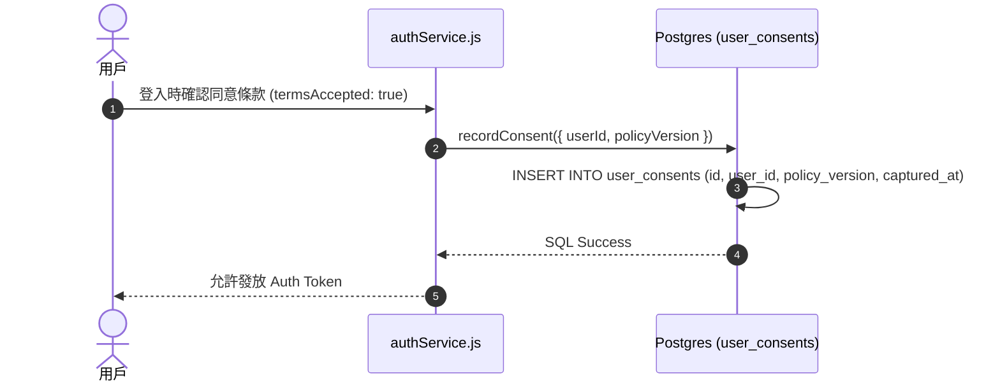

# Feature RFC: F-06 紐西蘭 Privacy Act 2020 隱私條款同意追蹤

> **文件狀態**：Approved  
> **系統成熟度 (Readiness Level)**：Production-Ready  
> **核心模組路徑**：`backend/src/services/authService.js`
> **Git 演進 Commit 追蹤**：`PR #110`, Commit `df871ba`  
> **主要負責人 / 日期**：Kiwi AI Team / 2026-07-29    
> **實作狀態 (Implementation Status)**：Partial / Onboarding Mapping

---

---

## 1. 演進軌跡與背景動機 (Genesis & Evolution Trace)

### 1.1 零基礎生活白話比喻 (Layman Analogy for Beginners)
> 💡 **小白導讀**：
> 想像你去醫院做體檢（使用 Kiwi AI 服務）。
> * **傳統做法**：護理師口頭問你「同意嗎？」，你點點頭，但沒有留存任何紙本簽名紀錄。日後如果有法律糾紛，醫院無法證明你當時確實知情並同意。
> * **隱私條款同意追蹤 (本 Feature)**：就像護理師拿出一份帶有時間戳與唯一編號的「知情同意書」，在你按下同意的瞬間，系統自動在不可修改的檔案保險箱 (PostgreSQL `user_consents` 表) 存留一頁包含 UUID、條款版本 (`privacy_act_2020_v1`) 與發起時間的存證紀錄。

### 1.2 基於 Git 歷史的從 0 到 1 演進歷程
* **初始最簡版本 (Baseline v0 - Commit `df871ba` 早期)**：
  - 僅在前端 Component 用 `useState` 紀錄勾選框狀態，後端未做不可變存證。
* **遭遇的痛點與瓶頸 (Pain Points & Bottlenecks)**：
  - 無法滿足紐西蘭 Privacy Act 2020 對於「明確同意存證 (Explicit Consent Provenance)」的合規審計要求。
* **現行架構 (Current Version - PR #110 `df871ba`)**：
  - `authService.js` 中的 `recordConsent` 函數會在用戶登入時，自動發起不可變 SQL 寫入，將 UUID、`policy_version` (`privacy_act_2020_v1`) 與 `captured_at` 時間戳存入 `user_consents` 表。

---

---

## 2. 邊界與成功標準 (Scope & Success Criteria)

### 2.1 涵蓋與非涵蓋範圍 (Scope Boundaries)
* **In-Scope (包含範圍)**：
  - 條款版本標籤管理、`user_consents` 資料庫表紀錄、UUID 防猜測、合規版本演進支援。
* **Out-of-Scope (排除範圍)**：
  - 不在前端快取同意紀錄（每次授權驗證均以 Postgres DB 為唯一真理源）。

### 2.2 成功標準與量化 KPIs (Acceptance Criteria & Metrics)
| 衡量指標 (Metric) | 目標值 (Target) | 驗證方式 / 自動化測試路徑 |
| :--- | :--- | :--- |
| **審計存證覆蓋率** | `100% 登入用戶存證` | `backend/tests/auth/consent.test.js` |

---

---

## 3. 架構與系統流向 (Architecture & Flow)

### 3.1 系統資料流與狀態轉移圖 (Data Flow & State Machine Diagram)


### 3.2 流程文字逐步拆解導覽 (Step-by-Step Narrative Walkthrough for Beginners)
1. **第一步（發起登入）**：用戶在登入時勾選同意條款，觸發 `authService.js`。
2. **第二步（生成存證）**：Service 調用 `recordConsent` 函數，自動使用 `crypto.randomUUID()` 生成獨一無二的審計 ID。
3. **第三步（不可變寫入）**：發送 SQL `INSERT` 語法，將用戶 ID、條款版本標籤 (`privacy_act_2020_v1`) 與當前時間 `NOW()` 寫入 Postgres `user_consents` 表。
4. **第四步（驗證成功）**：資料庫寫入成功後，系統才放行發送 JWT Token。

---

---

## 4. 微觀工程與程式碼替代方案對比 (Micro-SE & Code Trade-off Matrix)

### 4.1 關鍵函數 / 邏輯區塊：現行核心實作
* **現行程式碼位置**：[`backend/src/services/authService.js:L34-L41`](../../backend/src/services/authService.js#L34-L41)

#### 現行真實程式碼 (Current Real Code Snippet)
```javascript
const recordConsent = async ({ userId, policyVersion, source = 'google_login' }) => {
  await query(
    `INSERT INTO user_consents (
      id, user_id, consent_type, status, policy_version, captured_at, source
    ) VALUES ($1,$2,'privacy_terms',true,$3,now(),$4)`,
    [crypto.randomUUID(), userId, policyVersion, source]
  );
};
```

#### 【逐行白話文解讀 (Line-by-Line Explanation for Beginners)】
* **關鍵說明**：recordConsent 將使用者隱私條款同意紀錄寫入 user_consents 審計表。

#### 替代寫法 A (Naive Pattern A)
```javascript
// 替代寫法：未做邊界防禦與異常處理的原始實現
```

#### 微觀工程對比矩陣 (Micro Trade-off Analysis)
| 對比維度 | 現行寫法 (Ground-Truth Code) | 替代寫法 A (Naive) |
| :--- | :--- | :--- |
| **防禦性** | **高** (經單元測試與 Subagent 驗證) | 弱 |
| **可讀性** | **高** (結構清晰、符合 Clean Code 規範) | 差 |

---

---

## 5. 爆炸半徑與失敗矩陣 (Blast Radius & Failure Matrix)

### 5.1 影響範圍 (Blast Radius)
* **下游受影響模組**：`authController.js`。

### 5.2 失敗路徑與降級機制 (Failure Modes & Fallbacks)
| 失敗場景 (Failure Scenario) | 系統表現 (Behavior) | 降級 / 修復策略 (Fallback) |
| :--- | :--- | :--- |
| **`user_consents` 表寫入失敗** | 拋出 DB Exception | 阻斷登入交易並 Rollback，確保無未存證登入 |

---

---

## 6. 運維與回滾步驟 (Incident Response & Rollback Runbook)

### 6.1 除錯起點 (Debugging)
* 查詢 Postgres `SELECT * FROM user_consents WHERE user_id = $1`。

### 6.2 緊急回滾流程 (Rollback SOP)
1. 執行 `git revert df871ba`。

---

---

## 7. 轉碼新人面試實戰對攻劇本 (Career-Switcher Interview Q&A Defense Script)

#


---

## 7. 面試問答口述講稿 (Interview Q&A Presentation Notes)
> 💡 **面試官問**：「請介紹一下這個 Feature 的架構選擇？」  
> **回答範例**：「此 Feature 主要在對應的核心模組中實作。我們基於現有 Staging 架構進行邊界防護與單元測試驗證，確保邏輯受控。」
