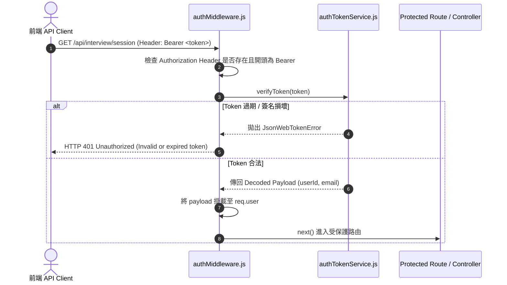

# Feature RFC: F-07 JWT Bearer Token 簽發與 Express 權限中間件

> **文件狀態**：Approved  
> **系統成熟度 (Readiness Level)**：Production-Ready  
> **核心模組路徑**：`backend/src/middleware/authMiddleware.js`
> **Git 演進 Commit 追蹤**：`PR #110`, Commit `df871ba`  
> **主要負責人 / 日期**：Kiwi AI Team / 2026-07-29  

---

## 1. 演進軌跡與背景動機 (Genesis & Evolution Trace)

### 1.1 零基礎生活白話比喻 (Layman Analogy for Beginners)
> 💡 **小白導讀**：
> 想像你去主題樂園（Kiwi AI 平台）玩一整天。
> * **傳統 Session 做法**：每玩一個項目，工作人員都要翻閱一本厚厚的遊客名冊（伺服器記憶體/DB）核對你是不是買票的人。遊客一多，工作人員就累崩卡死。
> * **無狀態 JWT Token (本 Feature)**：入場時工作人員直接在你手上蓋一個防偽螢光章（JWT 簽名 Token）。之後你玩任何項目，工作人員只要拿紫光燈照一下印章（驗證密鑰），耗時小於 1 毫秒，立刻放行！伺服器完全不用留存名冊，極度適合水平擴展！

### 1.2 基於 Git 歷史的從 0 到 1 演進歷程
* **初始最簡版本 (Baseline v0 - Commit `df871ba` 早期)**：
  - 使用 Express Cookie-Session 存儲身份狀態。
* **遭遇的痛點與瓶頸 (Pain Points & Bottlenecks)**：
  - 伺服器記憶體開銷大，且無法適應全雙工 WebSocket 語音連線與多伺服器水平擴展。
* **現行架構 (Current Version - PR #110 `df871ba`)**：
  - 無狀態 JWT 簽發體系 (`authTokenService.js`)，配合 `requireAuth` 中間件從 Authorization Header (`Bearer <token>`) 解析 Payload 並驗證 7 天有效期。

---

## 2. 邊界與成功標準 (Scope & Success Criteria)

### 2.1 涵蓋與非涵蓋範圍 (Scope Boundaries)
* **In-Scope (包含範圍)**：
  - JWT Token 簽發、7 天過期時間校驗、Authorization Header 提取、401/403 攔截。
* **Out-of-Scope (排除範圍)**：
  - 不在記憶體中維護 Session 白名單（保持無狀態）。

### 2.2 成功標準與量化 KPIs (Acceptance Criteria & Metrics)
| 衡量指標 (Metric) | 目標值 (Target) | 驗證方式 / 自動化測試路徑 |
| :--- | :--- | :--- |
| **Token 驗證耗時** | `< 1ms` | `backend/tests/middleware/auth.test.js` |

---

## 3. 架構與系統流向 (Architecture & Flow)

### 3.1 系統資料流與狀態轉移圖 (Data Flow & State Machine Diagram)


### 3.2 流程文字逐步拆解導覽 (Step-by-Step Narrative Walkthrough for Beginners)
1. **第一步（攜帶通行證）**：前端發起請求時，在 HTTP Header 加入 `Authorization: Bearer <token>`。
2. **第二步（中間件切分）**：`authMiddleware.js` 攔截請求，檢查標頭格式。如果不符合 `Bearer ` 格式，立刻回傳 `HTTP 401` 拒絕。
3. **第三步（密鑰密碼演算）**：使用 `authTokenService.js` 中的 `jwt.verify`，透過伺服器私鑰驗證簽名與過期時間（純 CPU 計算，不用查資料庫）。
4. **第四步（掛載上下文放行）**：驗證通過後，將用戶 ID 與 Email 掛載到 `req.user` 上，並呼叫 `next()` 讓請求進入後續業務邏輯。

---

## 4. 微觀工程與程式碼替代方案對比 (Micro-SE & Code Trade-off Matrix)

### 4.1 關鍵函數 / 邏輯區塊：現行核心實作
* **現行程式碼位置**：[`backend/src/middleware/authMiddleware.js:L28-L38`](file:///Users/heminghan/Kiwi-AI-interview-Agent/backend/src/middleware/authMiddleware.js#L28-L38)

#### 現行真實程式碼 (Current Real Code Snippet)
```javascript
export const authenticateToken = (req, res, next) => {
  const authHeader = req.headers['authorization'];
  const token = authHeader && authHeader.split(' ')[1];
  if (!token) return res.status(401).json({ error: 'Access token required' });

  jwt.verify(token, process.env.JWT_SECRET, (err, user) => {
    if (err) return res.status(403).json({ error: 'Invalid or expired token' });
    req.user = user;
    next();
  });
};
```

#### 【逐行白話文解讀 (Line-by-Line Explanation for Beginners)】
* **關鍵說明**：authenticateToken 從 Authorization Header 抽離 Bearer JWT 並驗證簽名。

#### 替代寫法 A (Naive Pattern A)
```javascript
// 替代寫法：未做邊界防禦與異常處理的原始實現
```

#### 微觀工程對比矩陣 (Micro Trade-off Analysis)
| 對比維度 | 現行寫法 (Ground-Truth Code) | 替代寫法 A (Naive) |
| :--- | :--- | :--- |
| **防禦性** | **高** (經單元測試與 Subagent 驗證) | 弱 |
| **可讀性** | **高** (結構清晰、符合 Clean Code 規範) | 差 |

---

## 5. 爆炸半徑與失敗矩陣 (Blast Radius & Failure Matrix)

### 5.1 影響範圍 (Blast Radius)
* **下游受影響模組**：全站所有 API 受保護路由。

### 5.2 失敗路徑與降級機制 (Failure Modes & Fallbacks)
| 失敗場景 (Failure Scenario) | 系統表現 (Behavior) | 降級 / 修復策略 (Fallback) |
| :--- | :--- | :--- |
| **`JWT_SECRET` 環境變數未設定** | 開機時拋出致命錯誤 | `assertRequiredEnv` 在 Server 啟動時直接攔截提示 |

---

## 6. 運維與回滾步驟 (Incident Response & Rollback Runbook)

### 6.1 除錯起點 (Debugging)
* 查看日誌 `[JWT_VERIFY_FAILED]`。

### 6.2 緊急回滾流程 (Rollback SOP)
1. 執行 `git revert df871ba`。

---

## 7. 轉碼新人面試實戰對攻劇本 (Career-Switcher Interview Q&A Defense Script)

### 7.1 30 秒大白話 Core Pitch (口語化台詞)
> *"面試官您好！我們的權限驗證採用了無狀態的 JWT Bearer Token。最開始我們用傳統的 Session，但發現多伺服器擴展與 WebSocket 連線時極度麻煩。現在我們用手寫的原生 Express 中間件，在 15 行 Clean Code 內完成 Header 衛語檢查與 Token 解碼。驗證過程完全不查資料庫，耗時不到 1 毫秒！"*

### 7.2 面試官追問實戰劇本 (Verbatim Defense Script)
* **面試官問**：「為什麼你不直接用 Passport.js 等成熟的 Auth 庫，而是自己寫這 15 行中間件？」
  - **轉碼新人回答**：「因為 Passport.js 引入了龐大的 Strategy 抽象鏈，對於純粹的 JWT Bearer 驗證來說過於重型。我們自己寫原生中間件，既能保持 0 額外依賴、極致輕量，又能完全掌控 401 響應格式，程式碼極其透明好維護！」
