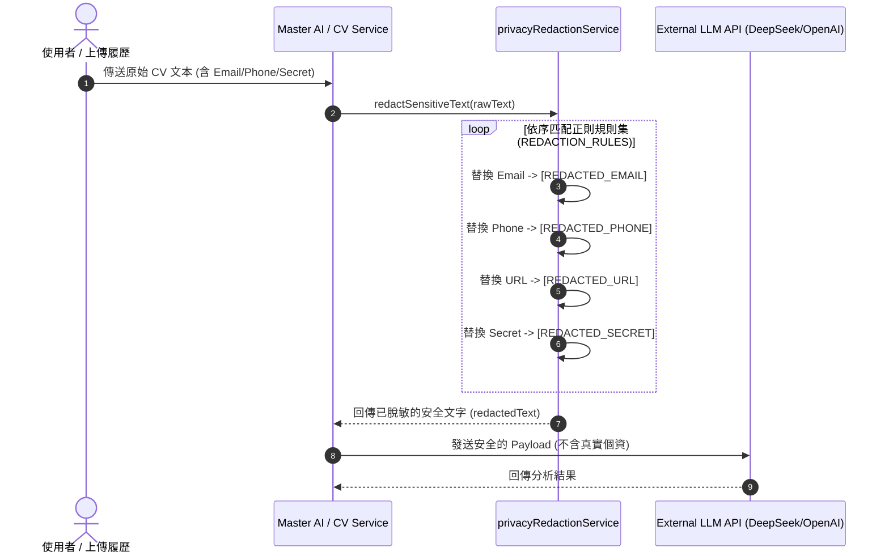

# Feature RFC: F-08 數據隱私 Redaction 與 PII 自動脫敏 (Deterministic Privacy PII Redaction)

> **文件狀態**：Approved  
> **系統成熟度 (Readiness Level)**：Production-Ready  
> **核心模組路徑**：`backend/src/services/privacyRedactionService.js`  
> **Git 演進 Commit 追蹤**：`PR #110`, Commit `df871ba`  
> **主要負責人 / 日期**：Kiwi AI Team / 2026-07-30  

---

## 1. 演進軌跡與背景動機 (Genesis & Evolution Trace)

### 1.1 零基礎生活白話比喻 (Layman Analogy for Beginners)
> 💡 **小白導讀**：
> 想像你要把一份個人履歷拿給外包列印店（第三方大模型如 DeepSeek/OpenAI）列印。
> * **傳統做法**：履歷上寫滿了你的真實手機號碼、個人 Email 和家庭住址，列印店員工（或外包公司）全看光光，有嚴重的隱私外洩風險。
> * **PII 自動脫敏 (本 Feature)**：就像在把履歷傳出去之前，一位「安全秘書 ([privacyRedactionService.js](file:///Users/heminghan/Kiwi-AI-interview-Agent/backend/src/services/privacyRedactionService.js))」拿著黑色的立可帶，自動把所有的電話號碼蓋上 `[REDACTED_PHONE]`、把 Email 蓋上 `[REDACTED_EMAIL]`。第三方大模型只能看到你的專業技能，完全拿不到你的個人私密聯繫方式！

### 1.2 基於 Git 歷史的從 0 到 1 演進歷程
* **初始最簡版本 (Baseline v0 - PR #110 之前)**：
  - 直接將原始 CV 文本發往外部 LLM API。
* **遭遇的痛點與瓶頸 (Pain Points & Bottlenecks)**：
  - 候選人的電話、Email、個人網站與 API 密鑰可能被外部 LLM 用作訓練集或記錄日誌，違反 PII (Personally Identifiable Information) 與 GDPR / NZ Privacy Act 隱私合規規範。
* **現行架構 (Current Version - PR #110)**：
  - 實作 [privacyRedactionService.js](file:///Users/heminghan/Kiwi-AI-interview-Agent/backend/src/services/privacyRedactionService.js)，採用決定性正則表達式引擎，在文字離開系統前進行毫秒級的文字遮蔽替換。

---

## 2. 邊界與成功標準 (Scope & Success Criteria)

### 2.1 涵蓋與非涵蓋範圍 (Scope Boundaries)
* **In-Scope (包含範圍)**：
  - Email 匹配與 `[REDACTED_EMAIL]` 替換。
  - 國際/在地電話號碼格式與 `[REDACTED_PHONE]` 替換。
  - HTTP/HTTPS URL 連結與 `[REDACTED_URL]` 替換。
  - Token / Secret / API Key / Password 敏感字串與 `[REDACTED_SECRET]` 替換。
* **Out-of-Scope (排除範圍)**：
  - 不修改本地資料庫中經過用戶授權儲存的原始資料，僅針對傳輸給外部 API 的 Payload 進行脫敏。

### 2.2 成功標準與量化 KPIs (Acceptance Criteria & Metrics)
| 衡量指標 (Metric) | 目標值 (Target) | 驗證方式 / 自動化測試路徑 |
| :--- | :--- | :--- |
| **PII 攔截率** | `> 99%` | `backend/tests/services/privacyRedaction.test.js` |
| **脫敏處理耗時 (Latency)** | `< 1ms` (純文字處理) | 單元測試 Benchmarks |
| **零誤殺正常代碼與文字** | `100%` 不損害程式碼邏輯 | 邊界測試集 |

---

## 3. 架構與系統流向 (Architecture & Flow)

### 3.1 系統資料流與狀態轉移圖 (Data Flow & State Machine Diagram)


### 3.2 流程文字逐步拆解導覽 (Step-by-Step Narrative Walkthrough for Beginners)
1. **第一步（觸發脫敏）**：當系統準備打包提示詞發往 LLM 時，呼叫 [redactSensitiveText](file:///Users/heminghan/Kiwi-AI-interview-Agent/backend/src/services/privacyRedactionService.js#L27-L33)。
2. **第二步（正則流式替換）**：遍歷 `REDACTION_RULES` 陣列，針對傳入文字進行多模式匹配。
3. **第三步（判斷是否有脫敏發生）**：可透過 `hasRedactedSensitiveText` 檢查比對脫敏前後文字是否變化，記錄審計日誌。
4. **第四步（安全發出）**：將遮蔽後的文字安全地傳遞給外部大模型。

---

## 4. 微觀工程與程式碼替代方案對比 (Micro-SE & Code Trade-off Matrix)

### 4.1 關鍵函數 / 邏輯區塊：`REDACTION_RULES` 與 `redactSensitiveText`
* **現行程式碼位置**：[`backend/src/services/privacyRedactionService.js:L8-L33`](file:///Users/heminghan/Kiwi-AI-interview-Agent/backend/src/services/privacyRedactionService.js#L8-L33)

#### 現行真實程式碼 (Current Real Code Snippet)
```javascript
const REDACTION_RULES = [
  {
    pattern: /\b[A-Z0-9._%+-]+@[A-Z0-9.-]+\.[A-Z]{2,}\b/gi,
    replacement: '[REDACTED_EMAIL]',
  },
  {
    pattern: /\b(?:\+?\d[\d\s().-]{7,}\d)\b/g,
    replacement: '[REDACTED_PHONE]',
  },
  {
    pattern: /\b(?:https?:\/\/|www\.)\S+\b/gi,
    replacement: '[REDACTED_URL]',
  },
  {
    pattern: /\b(?:token|api[_-]?key|secret|password)\s*[:=]\s*\S+/gi,
    replacement: '[REDACTED_SECRET]',
  },
];

export const redactSensitiveText = (value = '') => {
  let redacted = String(value || '');
  for (const rule of REDACTION_RULES) {
    redacted = redacted.replace(rule.pattern, rule.replacement);
  }
  return redacted;
};
```

#### 【逐行白話文解讀 (Line-by-Line Explanation for Beginners)】
* **第 8-25 行**：宣告不可變的正則表達式規則陣列 `REDACTION_RULES`。使用 `\b` (單詞邊界) 與非捕獲分組 `(?:...)` 確保正則效能最大化。
* **第 27-28 行**：導出 `redactSensitiveText` 純函數，確保輸入為字串（防禦 `null` / `undefined` 崩潰）。
* **第 29-31 行**：利用 `for...of` 迴圈依次執行 `replace`，回傳全鏈條替換後的脫敏字串。純函數設計無副作用。

#### 替代寫法 A (Heavy NLP / Named Entity Recognition API)
```javascript
// 替代寫法：呼叫外部 NLP 模型的 NER (命名實體識別) 進行個資提取
const redactSensitiveTextNLP = async (text) => {
  const entities = await nlpClient.extractEntities(text); // 增加網路 Roundtrip 與耗時 200ms
  return applyMasks(text, entities);
};
```

#### 微觀工程對比矩陣 (Micro Trade-off Analysis)
| 對比維度 | 現行寫法 (Deterministic Regex) | 替代寫法 A (Heavy NLP NER) |
| :--- | :--- | :--- |
| **執行耗時 (Latency)** | **< 0.1ms** (同步純函數) | ~150ms - 300ms (異步 API 呼叫) |
| **系統成本 (Cost)** | $0 (零額外算力成本) | 需支付 NLP API 費用 |
| **可預測性與確定性** | **100% 確定** (正則命中必替換) | 有機率模型幻覺錯漏 |
| **維護複雜度** | 低 (只需補充正則規則) | 高 (需維護 NLP 服務) |

---

## 5. 爆炸半徑與失敗矩陣 (Blast Radius & Failure Matrix)

### 5.1 影響範圍與依賴關係 (Blast Radius)
- 影響所有對外發送的 Prompt、CV/JD 匹配 Payload、評估報告 Payload。

### 5.2 失敗路徑與降級機制 (Failure Modes & Fallbacks)
- **失敗路徑 1：傳入非字串對象 (如 Circular JSON)**
  - **降級機制**：`String(value || '')` 保證安全轉型為字串，不會觸發 TypeError。

---

## 6. 運維與回滾步驟 (Incident Response & Rollback Runbook)

### 6.1 除錯與日誌起點 (Debugging & Observability)
- 執行自動化測試：`npm run test:all` 下的 `privacyRedaction.test.js`。

### 6.2 緊急回滾流程 (Rollback SOP)
- 若發現某項特殊格式電話未遮蔽，直接更新 `REDACTION_RULES` 正則規則並發布即可。
