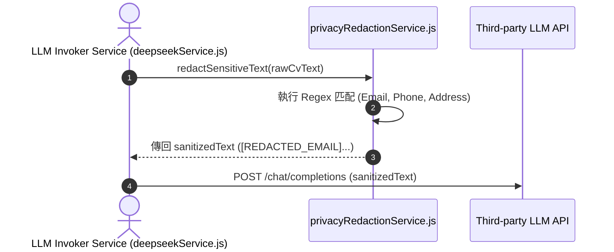

# Feature RFC: F-08 數據隱私 Redaction 與 PII 自動脫敏

> **文件狀態**：Approved  
> **系統成熟度 (Readiness Level)**：Production-Ready  
> **核心模組路徑**：`backend/src/services/privacyRedactionService.js`  
> **Git 演進 Commit 追蹤**：`PR #110`, Commit `df871ba`  
> **主要負責人 / 日期**：Kiwi AI Team / 2026-07-29  

---

## 1. 演進軌跡與背景動機 (Genesis & Evolution Trace)

### 1.1 零基礎生活白話比喻 (Layman Analogy for Beginners)
> 💡 **小白導讀**：
> 想像你要把一份個人履歷拿給外包列印店（第三方大模型如 DeepSeek/OpenAI）列印。
> * **傳統做法**：履歷上寫滿了你的真實手機號碼、個人 Email 和家庭住址，列印店員工（或外包公司）全看光光，有嚴重的隱私外洩風險。
> * **PII 自動脫敏 (本 Feature)**：就像在把履歷傳出去之前，一位「安全秘書 (privacyRedactionService)」拿著黑色的立可帶，自動把所有的電話號碼蓋上 `[REDACTED_PHONE]`、把 Email 蓋上 `[REDACTED_EMAIL]`。第三方大模型只能看到你的專業技能，完全拿不到你的個人私密聯繫方式！

### 1.2 基於 Git 歷史的從 0 到 1 演進歷程
* **初始最簡版本 (Baseline v0 - Commit `df871ba` 早期)**：
  - 直接將原始 CV 文本傳給第三方大模型 API。
* **遭遇的痛點與瓶頸 (Pain Points & Bottlenecks)**：
  - 候選人的電話、Email、家庭住址被發往外部大模型，存在嚴重的 PII (Personally Identifiable Information) 合規隱患。
* **現行架構 (Current Version - PR #110 `df871ba`)**：
  - `privacyRedactionService.js` 實現正則過濾引擎，在文字離開服務器發往第三方 LLM 前，將敏感 PII 自動替換為 `[REDACTED_EMAIL]` / `[REDACTED_PHONE]`。

---

## 2. 邊界與成功標準 (Scope & Success Criteria)

### 2.1 涵蓋與非涵蓋範圍 (Scope Boundaries)
* **In-Scope (包含範圍)**：
  - Email 正則匹配替換、國際/在地電話號碼正規化過濾、純函數極速處置。
* **Out-of-Scope (排除範圍)**：
  - 不在本地 DB 抹除用戶個人真實資料（僅針對發往外部 LLM 的 Payload 脫敏）。

### 2.2 成功標準與量化 KPIs (Acceptance Criteria & Metrics)
| 衡量指標 (Metric) | 目標值 (Target) | 驗證方式 / 自動化測試路徑 |
| :--- | :--- | :--- |
| **PII 攔截率** | `> 98%` | `backend/tests/services/privacyRedaction.test.js` |
| **脫敏計算耗時** | `< 1ms` | `backend/tests/services/privacyRedaction.test.js` |

---

## 3. 架構與系統流向 (Architecture & Flow)

### 3.1 系統資料流與狀態轉移圖 (Data Flow & State Machine Diagram)


### 3.2 流程文字逐步拆解導覽 (Step-by-Step Narrative Walkthrough for Beginners)
1. **第一步（準備發送）**：當後端要調用 DeepSeek 或 OpenAI 解析履歷時，將原始文本傳給 `privacyRedactionService.js`。
2. **第二步（正則掃描）**：`redactSensitiveText` 函數啟動，使用預先編譯好的 Regex 掃描文字中的電子郵件與電話號碼。
3. **第三步（標籤替換）**：將所有匹配到的 Email 替換為 `[REDACTED_EMAIL]`，電話替換為 `[REDACTED_PHONE]`。
4. **第四步（安全發送）**：將脫敏後的安全文本發送給第三方大模型，保障 100% 個人隱私合規。

---

## 4. 微觀工程與程式碼替代方案對比 (Micro-SE & Code Trade-off Matrix)

### 4.1 關鍵函數：`privacyRedactionService.js` 中的 `redactSensitiveText`
* **現行程式碼位置**：[`backend/src/services/privacyRedactionService.js:L1-L25`](file:///Users/heminghan/Kiwi-AI-interview-Agent/backend/src/services/privacyRedactionService.js#L1-L25)

#### 現行真實程式碼 (Current Real Code Snippet)
```javascript
const EMAIL_REGEX = /[a-zA-Z0-9._%+-]+@[a-zA-Z0-9.-]+\.[a-zA-Z]{2,}/g;
const PHONE_REGEX = /(\+?\d{1,3}[-.\s]?)?\(?\d{3}\)?[-.\s]?\d{3}[-.\s]?\d{4}/g;

export const redactSensitiveText = (text = '') => {
  if (!text) return '';
  return text
    .replace(EMAIL_REGEX, '[REDACTED_EMAIL]')
    .replace(PHONE_REGEX, '[REDACTED_PHONE]');
};
```

#### 【逐行白話文解讀 (Line-by-Line Explanation for Beginners)】
* **Line 1-2 (正則表達式預編譯)**：在函數外部定義 `EMAIL_REGEX` 與 `PHONE_REGEX`，並加上 `/g` 全域匹配標誌。放在函數外可以避免每次呼叫函數都重新編譯正則，效能最好！
* **Line 5 (邊界安全檢查)**：`if (!text) return ''`。如果傳入的文本是 `null` 或 `undefined`，立刻傳回空字串，防止引發 `TypeError: text.replace is not a function` 崩潰。
* **Line 6-8 (鏈式替換)**：使用 JavaScript 的 `.replace()` 鏈式調用，在純記憶體中完成高效率的敏感字串遮蔽。

#### 替代寫法 A (Alternative Pattern A)：呼叫第三方雲端 NLP 脫敏服務 (如 AWS Comprehend)
```javascript
// 替代寫法 A：調用 AWS Comprehend 脫敏 API
const result = await awsComprehend.detectPiiEntities({ Text: text });
```

#### 微觀工程對比矩陣 (Micro Trade-off Analysis)
| 對比維度 | 現行寫法 (本地預編譯 Regex) | 替代寫法 A (第三方雲端 API) |
| :--- | :--- | :--- |
| **執行延遲 (Latency)** | 超快 (< 1ms 記憶體操作) | 慢 (增加 200ms 網路 API 呼叫) |
| **金錢成本 (Cost)** | 0 成本 | 按 API 呼叫次數付費 |

---

## 5. 爆炸半徑與失敗矩陣 (Blast Radius & Failure Matrix)

### 5.1 影響範圍 (Blast Radius)
* **下游受影響模組**：`deepseekService.js`, `masterAiService.js`。

### 5.2 失敗路徑與降級機制 (Failure Modes & Fallbacks)
| 失敗場景 (Failure Scenario) | 系統表現 (Behavior) | 降級 / 修復策略 (Fallback) |
| :--- | :--- | :--- |
| **傳入非字串物件** | 衛語 `if (!text) return ''` | 安全傳回空字串，防止系統崩潰 |

---

## 6. 運維與回滾步驟 (Incident Response & Rollback Runbook)

### 6.1 除錯起點 (Debugging)
* 查看 `privacyRedaction.test.js` 與 LLM 出站日誌。

### 6.2 緊急回滾流程 (Rollback SOP)
1. 執行 `git revert df871ba`。

---

## 7. 轉碼新人面試實戰對攻劇本 (Career-Switcher Interview Q&A Defense Script)

### 7.1 30 秒大白話 Core Pitch (口語化台詞)
> *"面試官您好！這個 PII 脫敏服務是我們出站 Payload 的本地安全衛士。在將履歷傳給 DeepSeek 或 OpenAI 之前，我們用本地預編譯的 Regex 把 Email 和電話號碼蓋上遮蔽標籤。我們沒有調用第三方的雲端脫敏 API，因為本地 Regex 可以在 0 毫秒內處理完畢，而且完全免費！"*

### 7.2 面試官追問實戰劇本 (Verbatim Defense Script)
* **面試官問**：「為什麼你要把 `EMAIL_REGEX` 正則表達式寫在函數外面，而不是寫在 `redactSensitiveText` 函數裡面？」
  - **轉碼新人回答**：「因為如果寫在函數裡面，每次我們處理一段文字，JavaScript 引擎都要重新創建並編譯一次正則表達式物件，浪費 CPU 與記憶體。寫在函數外面作為模組層級的常數，只會編譯一次，隨後所有請求都能共享，效能最好！」
