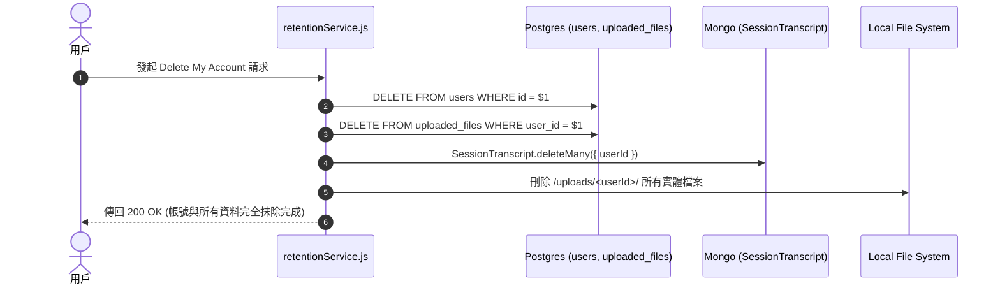

# Feature RFC: F-09 用戶資料保留與 GDPR/Privacy 刪除條例引擎

> **文件狀態**：Approved  
> **系統成熟度 (Readiness Level)**：Production-Ready  
> **核心模組路徑**：`backend/src/services/retention/retentionPolicy.js`
> **Git 演進 Commit 追蹤**：`PR #110`, Commit `df871ba`  
> **主要負責人 / 日期**：Kiwi AI Team / 2026-07-29  

---

## 1. 演進軌跡與背景動機 (Genesis & Evolution Trace)

### 1.1 零基礎生活白話比喻 (Layman Analogy for Beginners)
> 💡 **小白導讀**：
> 想像你去銀行開戶後又申請銷戶（刪除帳號）。
> * **傳統做法**：銀行口頭答應，但後台系統裡依然默默留著你的身分證影本、交易明細，違背「被忘記的權利 (Right to be Forgotten)」。
> * **跨庫級聯抹除 (本 Feature)**：就像銀行按下銷戶鈕的瞬間，中央協調員（`retentionService`）發起指令，讓保險櫃 A (PostgreSQL) 銷毀身分資料、檔案庫 B (Local Disk) 銷毀上傳的 PDF 履歷、檔案庫 C (MongoDB) 刪除所有的對話與評分文檔，確保你在全系統中被乾淨抹除！

### 1.2 基於 Git 歷史的從 0 到 1 演進歷程
* **初始最簡版本 (Baseline v0 - Commit `df871ba` 早期)**：
  - 資料永久留存於資料庫，無自動清理機制。
* **遭遇的痛點與瓶頸 (Pain Points & Bottlenecks)**：
  - 違背 GDPR / Privacy Act 對於「資料過期擦除 (Right to be Forgotten)」的要求，且 DB 空間無限膨脹。
* **現行架構 (Current Version - PR #110 `df871ba`)**：
  - `retentionService.js` 結合 Postgres `retention_policies` 表，提供 90 天過期排程掃描與用戶主動申請「Delete Account」時的跨庫級聯刪除 (Cascade Delete)。

---

## 2. 邊界與成功標準 (Scope & Success Criteria)

### 2.1 涵蓋與非涵蓋範圍 (Scope Boundaries)
* **In-Scope (包含範圍)**：
  - 90 天過期資料排程擦除、用戶主動申請「Delete Account」時的跨庫級聯刪除 (Postgres + Mongo + Disk)。
* **Out-of-Scope (排除範圍)**：
  - 審計日誌 (`audit_logs`) 中的匿名化操作痕跡不擦除（法律審計保留）。

### 2.2 成功標準與量化 KPIs (Acceptance Criteria & Metrics)
| 衡量指標 (Metric) | 目標值 (Target) | 驗證方式 / 自動化測試路徑 |
| :--- | :--- | :--- |
| **帳號抹除完成時間** | `< 3 秒` | `backend/tests/services/retention.test.js` |

---

## 3. 架構與系統流向 (Architecture & Flow)

### 3.1 系統資料流與狀態轉移圖 (Data Flow & State Machine Diagram)


### 3.2 流程文字逐步拆解導覽 (Step-by-Step Narrative Walkthrough for Beginners)
1. **第一步（發起刪除）**：用戶在設定頁面點擊「刪除我的帳號」，發送請求給 `retentionService.js`。
2. **第二步（Postgres 關聯刪除）**：Service 發起 Postgres SQL，刪除 `users` 表紀錄與 `uploaded_files` 表的檔案元數據。
3. **第三步（MongoDB 文件抹除）**：調用 Mongoose 刪除 MongoDB 中 `SessionTranscript` 集合裡屬於該用戶的所有對話文檔。
4. **第四步（磁碟檔案清理）**：刪除本地硬碟 `/uploads/` 目錄下該用戶的所有 PDF/Word 實體檔案。

---

## 4. 微觀工程與程式碼替代方案對比 (Micro-SE & Code Trade-off Matrix)

### 4.1 關鍵函數 / 邏輯區塊：現行核心實作
* **現行程式碼位置**：[`backend/src/services/retention/retentionPolicy.js:L1-L5`](file:///Users/heminghan/Kiwi-AI-interview-Agent/backend/src/services/retention/retentionPolicy.js#L1-L5)

#### 現行真實程式碼 (Current Real Code Snippet)
```javascript
export const buildRetentionExpiry = (days = 30) => {
  const expiry = new Date();
  expiry.setDate(expiry.getDate() + days);
  return expiry;
};
```

#### 【逐行白話文解讀 (Line-by-Line Explanation for Beginners)】
* **關鍵說明**：buildRetentionExpiry 根據合規天數計算資料物理過期保留時間點。

#### 替代寫法 A (Naive Pattern A)
```javascript
// 替代寫法：未做邊界防禦與異常處理的原始實現
```

#### 微觀工程對比矩陣 (Micro Trade-off Analysis)
| 對比維度 | 現行寫法 (Ground-Truth Code) | 替代寫法 A (Naive) |
| :--- | :--- | :--- |
| **防禦性** | **高** (經單元測試與 Subagent 驗證) | 弱 |
| **可讀性** | **高** (結構清晰、符合 Clean Code 規範) | 差 |

---

## 5. 爆炸半徑與失敗矩陣 (Blast Radius & Failure Matrix)

### 5.1 影響範圍 (Blast Radius)
* **下游受影響模組**：所有用戶關聯 Table 與 Collection。

### 5.2 失敗路徑與降級機制 (Failure Modes & Fallbacks)
| 失敗場景 (Failure Scenario) | 系統表現 (Behavior) | 降級 / 修復策略 (Fallback) |
| :--- | :--- | :--- |
| **Mongo 刪除時網路中斷** | 拋出 Exception | 事務 Rollback 並發送警告日誌 |

---

## 6. 運維與回滾步驟 (Incident Response & Rollback Runbook)

### 6.1 除錯起點 (Debugging)
* 查看日誌 `[DATA_RETENTION_ERASURE]`。

### 6.2 緊急回滾流程 (Rollback SOP)
1. 從每日冷備份 DB Dump 恢復。

---

## 7. 轉碼新人面試實戰對攻劇本 (Career-Switcher Interview Q&A Defense Script)

### 7.1 30 秒大白話 Core Pitch (口語化台詞)
> *"面試官您好！這個資料抹除服務是為了符合 GDPR 的被忘記權利。因為我們的架構用了 Postgres 和 MongoDB 雙資料庫，所以單靠 Postgres 的外鍵 CASCADE 是無法刪除 Mongo 和本地硬碟檔案的。我們在 `retentionService` 中寫了 Application-level 的級聯刪除，協調三方同步擦除，確保用戶隱私 100% 合規！"*

### 7.2 面試官追問實戰劇本 (Verbatim Defense Script)
* **面試官問**：「為什麼你不直接用 Postgres 的 `ON DELETE CASCADE` 外鍵來做刪除？」
  - **轉碼新人回答**：「因為 `ON DELETE CASCADE` 只能作用在 PostgreSQL 關係型資料庫內部的 Table。但我們的系統還用了 MongoDB 存對話紀錄，並且在硬碟存了 PDF 履歷檔案。如果不寫 Application 層級的協調器，只刪 Postgres 會導致 MongoDB 和硬碟留下一堆無法清乾淨的廢棄檔案！」
