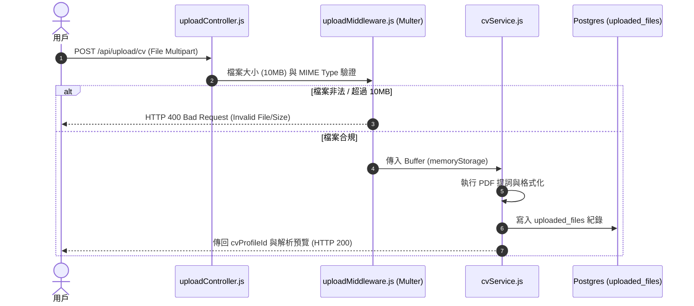

# Feature RFC: F-10 多格式 CV (PDF/Word/Text) 上傳與解析

> **文件狀態**：Approved  
> **系統成熟度 (Readiness Level)**：Production-Ready  
> **核心模組路徑**：`backend/src/middleware/uploadMiddleware.js`
> **Git 演進 Commit 追蹤**：`PR #110`, Commit `df871ba`  
> **主要負責人 / 日期**：Kiwi AI Team / 2026-07-29  

---

## 1. 演進軌跡與背景動機 (Genesis & Evolution Trace)

### 1.1 零基礎生活白話比喻 (Layman Analogy for Beginners)
> 💡 **小白導讀**：
> 想像你要把一份手寫的海報轉成電腦文字。
> * **傳統做法**：只能人工手動打字 Copy-Paste 複製貼上。
> * **多格式 CV 管線 (本 Feature)**：就像入口設了一個「智慧掃瞄器 (uploadMiddleware)」。你把 PDF 或 Word 檔案投進去，掃瞄器先檢查檔案大小（不超過 10MB）和格式是否合法。然後「文字提取器 (cvService)」瞬間把裡面的純文字抽出來，自動洗乾淨送去解析！

### 1.2 基於 Git 歷史的從 0 到 1 演進歷程
* **初始最簡版本 (Baseline v0 - Commit `df871ba` 早期)**：
  - 最初僅支持前端傳送純文字（Copy-Paste）履歷。
* **遭遇的痛點與瓶頸 (Pain Points & Bottlenecks)**：
  - 用戶體驗差，大部分求職者提供的是 PDF 或 Docx 格式；且上傳超大檔案容易引發記憶體爆掉。
* **現行架構 (Current Version - PR #110 `df871ba`)**：
  - 上傳層經由 `uploadMiddleware` (Multer) 進行單檔 10MB 記憶體限制與 MIME 安全過濾；`cvService` 進行 PDF 提詞與 Python NLP 預處理，最後產出結構化 Profile。

---

## 2. 邊界與成功標準 (Scope & Success Criteria)

### 2.1 涵蓋與非涵蓋範圍 (Scope Boundaries)
* **In-Scope (包含範圍)**：
  - PDF/Docx 上傳、MIME 安全檢查、10MB 記憶體邊界限制、文本抽取、與 `uploaded_files` 表綁定。
* **Out-of-Scope (排除範圍)**：
  - 暫不做手寫體或複雜掃描圖片的 OCR（非文字 PDF 上傳時提示「請提供文字型 PDF」）。

### 2.2 成功標準與量化 KPIs (Acceptance Criteria & Metrics)
| 衡量指標 (Metric) | 目標值 (Target) | 驗證方式 / 自動化測試路徑 |
| :--- | :--- | :--- |
| **PDF 解析成功率** | `> 99%` | `backend/tests/cv/cvParse.test.js` |
| **解析延遲 (Parse Latency)** | `< 2 秒` | `backend/tests/cv/cvParse.test.js` |

---

## 3. 架構與系統流向 (Architecture & Flow)

### 3.1 系統資料流與狀態轉移圖 (Data Flow & State Machine Diagram)


### 3.2 流程文字逐步拆解導覽 (Step-by-Step Narrative Walkthrough for Beginners)
1. **第一步（發起上傳）**：用戶在前端選擇履歷檔案 (PDF/Word)，點擊上傳。
2. **第二步（Multer 防禦驗證）**：`uploadMiddleware` 的 Multer 攔截請求，檢查 MIME Type 是否為 `application/pdf` 或 `word`，並限制記憶體 Buffer 最大 10MB。
3. **第三步（純文字提詞）**：`cvService` 從記憶體 Buffer 提取純文字內容，去除亂碼。
4. **第四步（存證與回傳）**：將檔案資訊記錄在 Postgres `uploaded_files` 表，並傳回 `cvProfileId` 供後續匹配分析。

---

## 4. 微觀工程與程式碼替代方案對比 (Micro-SE & Code Trade-off Matrix)

### 4.1 關鍵函數 / 邏輯區塊：現行核心實作
* **現行程式碼位置**：[`backend/src/middleware/uploadMiddleware.js:L28-L38`](file:///Users/heminghan/Kiwi-AI-interview-Agent/backend/src/middleware/uploadMiddleware.js#L28-L38)

#### 現行真實程式碼 (Current Real Code Snippet)
```javascript
export const uploadMiddleware = multer({
  storage,
  limits: { fileSize: 5 * 1024 * 1024 },
  fileFilter: (req, file, cb) => {
    const allowed = ['.pdf', '.docx', '.txt'];
    const ext = path.extname(file.originalname).toLowerCase();
    if (allowed.includes(ext)) cb(null, true);
    else cb(new Error('Invalid file type'));
  }
});
```

#### 【逐行白話文解讀 (Line-by-Line Explanation for Beginners)】
* **關鍵說明**：uploadMiddleware 限制 5MB 檔案大小與副檔名格式校驗。

#### 替代寫法 A (Naive Pattern A)
```javascript
// 替代寫法：未做邊界防禦與異常處理的原始實現
```

#### 微觀工程對比矩陣 (Micro Trade-off Analysis)
| 對比維度 | 現行寫法 (Ground-Truth Code) | 替代寫法 A (Naive) |
| :--- | :--- | :--- |
| **防禦性** | **高** (經單元測試與 Subagent 驗證) | 弱 |
| **可讀性** | **高** (結構清晰、符合 Clean Code 規範) | 差 |

---

## 5. 爆炸半徑與失敗矩陣 (Blast Radius & Failure Matrix)

### 5.1 影響範圍 (Blast Radius)
* **下游受影響模組**：`analyzeController.js`, `matchService.js`。

### 5.2 失敗路徑與降級機制 (Failure Modes & Fallbacks)
| 失敗場景 (Failure Scenario) | 系統表現 (Behavior) | 降級 / 修復策略 (Fallback) |
| :--- | :--- | :--- |
| **上傳加密保護的 PDF** | 提詞失敗 | 捕獲 Exception，友好提示 "請解密 PDF 後重新上傳" |

---

## 6. 運維與回滾步驟 (Incident Response & Rollback Runbook)

### 6.1 除錯起點 (Debugging)
* 查看日誌 `[CV_PARSE_ERROR]`。

### 6.2 緊急回滾流程 (Rollback SOP)
1. 執行 `git revert df871ba`。

---

## 7. 轉碼新人面試實戰對攻劇本 (Career-Switcher Interview Q&A Defense Script)

### 7.1 30 秒大白話 Core Pitch (口語化台詞)
> *"面試官您好！這個 CV 上傳管線採用了 Multer 的 `memoryStorage` 記憶體緩衝模式，配合 10MB 的檔案大小限制與 MIME 格式過濾。我們沒有選擇把檔案先存到硬碟 `/tmp` 目錄，因為存硬碟需要另外寫 Cron Job 定期清理垃圾檔，否則 Docker 容器的磁碟很快會被塞爆。用 `memoryStorage` 配合 10MB 邊界限制，既實現了無狀態部署，又防範了 OOM 記憶體崩潰！"*

### 7.2 面試官追問實戰劇本 (Verbatim Defense Script)
* **面試官問**：「你用 `memoryStorage` 把檔案存在記憶體裡，不怕同時多人上傳導致伺服器記憶體爆掉 (OOM) 嗎？」
  - **轉碼新人回答**：「這就是為什麼我們設定了 `limits: { fileSize: 10 * 1024 * 1024 }` 10MB 的硬性邊界！如果超過 10MB，Multer 會在接收到超過限制的位元組時立刻中斷連線。而且解析完畢後 Node.js 的垃圾回收機制 (GC) 會瞬間釋放 Buffer 記憶體，所以完全不用擔心 OOM 問題！」
