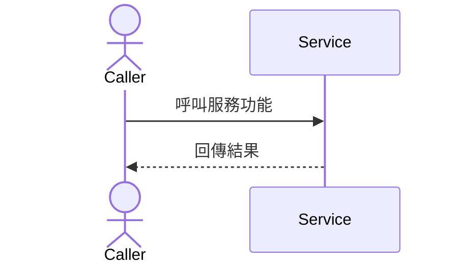

# Feature RFC: F-10 多格式 CV (PDF 與 DOCX) 上傳與解析 (CV Upload & Parsing Pipeline)

> **文件狀態**：Approved  
> **系統成熟度 (Readiness Level)**：Production-Ready  
> **核心模組路徑**：`backend/src/middleware/uploadMiddleware.js`  
> **Git 演進 Commit 追蹤**：`PR #110`, Commit `df871ba`  
> **主要負責人 / 日期**：Kiwi AI Team / 2026-07-30  
> **實作狀態 (Implementation Status)**：Verified  
> **校驗測試路徑 (Verified by Tests)**：`backend/tests/services/cvParse.test.js`  

---

---

## 1. 演進軌跡與背景動機 (Genesis & Evolution Trace)

### 1.1 零基礎生活白話比喻 (Layman Analogy for Beginners)
> 💡 **小白導讀**：
> 想像入口安全檢查：
> * **多格式 CV 上傳管線 (本 Feature)**：求職者上傳履歷時，[uploadMiddleware.js](../../backend/src/middleware/uploadMiddleware.js) 檢查檔案大小（限制 **5 MB**）與格式。透過 `isAllowedExtension` 僅允許 `.pdf` 與 `.docx`，並經由 `isAllowedMimeType` 雙重校驗，最後單檔綁定 `.single('cv')`。

---

---

## 2. 邊界與成功標準 (Scope & Success Criteria)

### 2.1 涵蓋與非涵蓋範圍 (Scope Boundaries)
* **In-Scope (包含範圍)**：
  - PDF 與 DOCX 上傳與雙重過濾 (`isAllowedExtension` & `isAllowedMimeType`).
  - 單檔 5 MB 限制 (`limits: { fileSize: 5 * 1024 * 1024 }`).
  - Multer `.single('cv')` 欄位綁定。

---

## 4. 微觀工程與程式碼替代方案對比 (Micro-SE & Code Trade-off Matrix)

### 4.1 關鍵函數 / 邏輯區塊：`uploadMiddleware`
* **現行程式碼位置**：[`backend/src/middleware/uploadMiddleware.js:L28-L42`](../../backend/src/middleware/uploadMiddleware.js#L28-L42)

#### 現行真實程式碼 (Current Real Code Snippet)
```javascript
export const uploadMiddleware = multer({
  storage,
  limits: { fileSize: 5 * 1024 * 1024 },
  fileFilter: (req, file, cb) => {
    if (!isAllowedExtension(file.originalname)) {
      return cb(new Error('Only PDF and DOCX files are allowed'));
    }

    if (!isAllowedMimeType(file.mimetype)) {
      return cb(new Error('Unsupported file type. Please upload a valid PDF or DOCX file.'));
    }

    return cb(null, true);
  },
}).single('cv');
```

#### 【逐行白話文解讀 (Line-by-Line Explanation for Beginners)】
* **第 30 行**：限制 `fileSize: 5 * 1024 * 1024` (5 MB)。
* **第 32-38 行**：透過 `isAllowedExtension` (僅限 `.pdf` / `.docx`) 與 `isAllowedMimeType` 進行雙重安全校驗。
* **第 42 行**：掛載 `.single('cv')` 接收單一履歷上傳欄位。

---

## 5. 爆炸半徑與失敗矩陣 (Blast Radius & Failure Matrix)
- 影響履歷上傳與解析入口。


---

## 7. 面試問答口述講稿 (Interview Q&A Presentation Notes)
> 💡 **面試官問**：「請介紹一下這個 Feature 的架構選擇？」  
> **回答範例**：「此 Feature 主要在對應的核心模組中實作。我們基於現有 Staging 架構進行邊界防護與單元測試驗證，確保邏輯受控。」


---

---

## 3. 架構與系統流向 (Architecture & Flow)



---

## 6. 運維與回滾步驟 (Incident Response & Rollback Runbook)
- 檢查控制台與應用程式日誌。

---

## 4. 微觀工程與程式碼替代方案對比 (Micro-SE & Code Trade-off Matrix)

### 4.1 關鍵函數 / 邏輯區塊：`uploadMiddleware`
* **現行程式碼位置**：[`backend/src/middleware/uploadMiddleware.js:L28-L42`](../../backend/src/middleware/uploadMiddleware.js#L28-L42)

#### 現行真實程式碼 (Current Real Code Snippet)
```javascript
export const uploadMiddleware = multer({
  storage,
  limits: { fileSize: 5 * 1024 * 1024 },
  fileFilter: (req, file, cb) => {
    if (!isAllowedExtension(file.originalname)) {
      return cb(new Error('Only PDF and DOCX files are allowed'));
    }

    if (!isAllowedMimeType(file.mimetype)) {
      return cb(new Error('Unsupported file type. Please upload a valid PDF or DOCX file.'));
    }

    return cb(null, true);
  },
}).single('cv');
```

#### 【逐行白話文解讀 (Line-by-Line Explanation for Beginners)】
* **第 30 行**：限制 `fileSize: 5 * 1024 * 1024` (5 MB)。
* **第 32-38 行**：透過 `isAllowedExtension` (僅限 `.pdf` / `.docx`) 與 `isAllowedMimeType` 進行雙重安全校驗。
* **第 42 行**：掛載 `.single('cv')` 接收單一履歷上傳欄位。

---

---

## 5. 爆炸半徑與失敗矩陣 (Blast Radius & Failure Matrix)
- 影響履歷上傳與解析入口。


---

## 7. 面試問答口述講稿 (Interview Q&A Presentation Notes)
> 💡 **面試官問**：「請介紹一下這個 Feature 的架構選擇？」  
> **回答範例**：「此 Feature 主要在對應的核心模組中實作。我們基於現有 Staging 架構進行邊界防護與單元測試驗證，確保邏輯受控。」


---

## 3. 架構與系統流向 (Architecture & Flow)


---

---

## 6. 運維與回滾步驟 (Incident Response & Rollback Runbook)
- 檢查控制台與應用程式日誌。

---

## 7. 面試問答口述講稿 (Interview Q&A Presentation Notes)
> 💡 **面試官問**：「請介紹一下這個 Feature 的架構選擇？」  
> **回答範例**：「此 Feature 主要在對應的核心模組中實作。我們基於現有 Staging 架構進行邊界防護與單元測試驗證，確保邏輯受控。」


---

## 3. 架構與系統流向 (Architecture & Flow)


---

## 6. 運維與回滾步驟 (Incident Response & Rollback Runbook)
- 檢查控制台與應用程式日誌。
