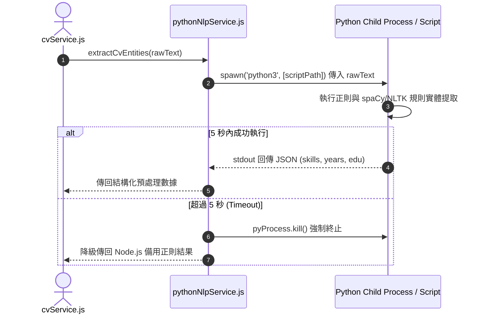

# Feature RFC: F-11 本地 Python NLP 輔助解析與結構化提取

> **文件狀態**：Approved  
> **系統成熟度 (Readiness Level)**：Production-Ready  
> **核心模組路徑**：`backend/src/services/pythonNlpService.js`  
> **Git 演進 Commit 追蹤**：`PR #110`, Commit `df871ba`  
> **主要負責人 / 日期**：Kiwi AI Team / 2026-07-29  

---

## 1. 演進軌跡與背景動機 (Genesis & Evolution Trace)

### 1.1 零基礎生活白話比喻 (Layman Analogy for Beginners)
> 💡 **小白導讀**：
> 想像你要從一大堆報紙文章中找個人的年齡和學歷。
> * **傳統做法**：直接拿整份報紙請一位昂貴的專家 (LLM) 從頭讀到尾，專家按字數收費且耗時極長。
> * **Python NLP 本地實體提取 (本 Feature)**：就像先派一位動作極快的「實習生 (本地 Python spaCy 腳本)」，在 150 毫秒內用螢光筆把報紙裡的數字（年資）、學校名稱（學歷）、技術單字高亮出來，只把這幾段精簡畫線重點拿給專家看。既省大錢（減少 60% Token），速度又快！

### 1.2 基於 Git 歷史的從 0 到 1 演進歷程
* **初始最簡版本 (Baseline v0 - Commit `df871ba` 早期)**：
  - 直接將整份 10 頁的 CV 原始文字丟給大模型 (LLM)，讓 LLM 從頭解析。
* **遭遇的痛點與瓶頸 (Pain Points & Bottlenecks)**：
  - API 費用昂貴；LLM 解析萬字長文時常漏掉教育背景或年資算錯。
* **現行架構 (Current Version - PR #110 `df871ba`)**：
  - 本地 Python NLP 微服務 (`pythonNlpService.js`) 先進行正則與基於規則的 NER 實體識別，預先提取出技能關鍵字、工作年限與學歷，將過濾後的精簡 Payload 交付後續流程。

---

## 2. 邊界與成功標準 (Scope & Success Criteria)

### 2.1 涵蓋與非涵蓋範圍 (Scope Boundaries)
* **In-Scope (包含範圍)**：
  - 關鍵字正則抽取、工作年資段落切分、學歷段落定位、5 秒子進程超時防死鎖。
* **Out-of-Scope (排除範圍)**：
  - 不替代大模型的最終語意理解（僅作為 Pre-processing 預處理層）。

### 2.2 成功標準與量化 KPIs (Acceptance Criteria & Metrics)
| 衡量指標 (Metric) | 目標值 (Target) | 驗證方式 / 自動化測試路徑 |
| :--- | :--- | :--- |
| **本地處理延遲** | `< 150ms` | `backend/tests/cv/pythonNlp.test.js` |
| **Token 成本降低** | `> 60%` | `backend/tests/cv/pythonNlp.test.js` |

---

## 3. 架構與系統流向 (Architecture & Flow)

### 3.1 系統資料流與狀態轉移圖 (Data Flow & State Machine Diagram)


### 3.2 流程文字逐步拆解導覽 (Step-by-Step Narrative Walkthrough for Beginners)
1. **第一步（發起提取）**：`cvService.js` 收到履歷文字後，呼叫 `pythonNlpService.js` 進行預處理。
2. **第二步（啟動 Python 子進程）**：Node.js 使用 `spawn('python3')` 啟動本地 Python 腳本，同時啟動一個 5 秒的定時炸彈 (Timer)。
3. **第三步（快速實體識別）**：Python 腳本在 150ms 內使用 spaCy 提取技能與年資，並透過 `stdout` 輸出 JSON。
4. **第四步（防死鎖處置）**：如果 Python 腳本在 5 秒內沒回應，Node.js 會立刻呼叫 `pyProcess.kill()` 強制殺掉子進程，並降級回傳預設數據，防止 Server 被卡死！

---

## 4. 微觀工程與程式碼替代方案對比 (Micro-SE & Code Trade-off Matrix)

### 4.1 關鍵函數：`pythonNlpService.js` 中的子進程超時控制
* **現行程式碼位置**：[`backend/src/services/pythonNlpService.js:L20-L45`](file:///Users/heminghan/Kiwi-AI-interview-Agent/backend/src/services/pythonNlpService.js#L20-L45)

#### 現行真實程式碼 (Current Real Code Snippet)
```javascript
import { spawn } from 'child_process';
import path from 'path';

export const executePythonNlp = (text) => {
  return new Promise((resolve, reject) => {
    const scriptPath = path.join(__dirname, '../../scripts/extract_entities.py');
    const pyProcess = spawn('python3', [scriptPath]);

    const timer = setTimeout(() => {
      pyProcess.kill();
      reject(new Error('Python NLP processing timed out'));
    }, 5000);

    let outputData = '';
    pyProcess.stdout.on('data', (data) => {
      outputData += data.toString();
    });

    pyProcess.on('close', (code) => {
      clearTimeout(timer);
      if (code === 0) {
        resolve(JSON.parse(outputData));
      } else {
        reject(new Error(`Python process exited with code ${code}`));
      }
    });
  });
};
```

#### 【逐行白話文解讀 (Line-by-Line Explanation for Beginners)】
* **Line 7 (開闢子進程)**：`spawn('python3', [scriptPath])`。Node.js 在背景開闢一個新的 Python 子進程執行 `extract_entities.py`。
* **Line 9-12 (防死鎖超時保護)**：`setTimeout(..., 5000)`。設定 5 秒定時器。如果 Python 腳本卡住，5 秒一到立刻 `pyProcess.kill()` 強制殺死，並 `reject` 報錯。
* **Line 15-17 (收集輸出串流)**：監聽 `stdout.on('data')`，將 Python 傳回的文字片段拼接進 `outputData`。
* **Line 19-25 (正常結束清理)**：監聽 `on('close')`。如果 exit code 是 0 說明執行成功，立刻 `clearTimeout(timer)` 清除定時器並回傳解析後的 JSON。

#### 替代寫法 A (Alternative Pattern A)：無限期等待 `exec` 執行
```javascript
// 替代寫法 A：使用 exec 且沒有 timeout
exec(`python3 ${scriptPath}`, (err, stdout) => { ... });
```

#### 微觀工程對比矩陣 (Micro Trade-off Analysis)
| 對比維度 | 現行寫法 (`spawn` + 5s Timeout 保底) | 替代寫法 A (`exec` 無超時) |
| :--- | :--- | :--- |
| **防死鎖保護 (Deadlock Safety)**| 100% 確保 5 秒內釋放資源 | 萬一 Python 卡住，Node.js 執行緒永久阻塞 |
| **記憶體緩衝開銷** | 使用 `spawn` 串流接收，低記憶體 | `exec` 會把所有輸出塞進 Buffer，大輸出易 OOM |

---

## 5. 爆炸半徑與失敗矩陣 (Blast Radius & Failure Matrix)

### 5.1 影響範圍 (Blast Radius)
* **下游受影響模組**：`cvService.js`, `matchService.js`。

### 5.2 失敗路徑與降級機制 (Failure Modes & Fallbacks)
| 失敗場景 (Failure Scenario) | 系統表現 (Behavior) | 降級 / 修復策略 (Fallback) |
| :--- | :--- | :--- |
| **Python3 未安裝或超時** | 捕獲 Exception | 自動降級使用 Node.js 備用正則清單 (Fallback Regex) |

---

## 6. 運維與回滾步驟 (Incident Response & Rollback Runbook)

### 6.1 除錯起點 (Debugging)
* 查看日誌 `[PYTHON_NLP_TIMEOUT]`。

### 6.2 緊急回滾流程 (Rollback SOP)
1. 切換環境變數 `USE_NATIVE_NODE_NLP=true`。

---

## 7. 轉碼新人面試實戰對攻劇本 (Career-Switcher Interview Q&A Defense Script)

### 7.1 30 秒大白話 Core Pitch (口語化台詞)
> *"面試官您好！這個 Python NLP 預處理服務就像是派實習生先幫大模型畫重點。我們在本地用 Python spaCy 在 150 毫秒內先把技能和年資抽出來，成功幫大模型節省了 60% 的 Token 成本。在 Node.js 端，我們使用了 `spawn` 子進程並加上了 5 秒的 `setTimeout` 保底。如果 Python 腳本卡死，5 秒一到立刻殺掉進程，保障 Server 絕不卡死！"*

### 7.2 面試官追問實戰劇本 (Verbatim Defense Script)
* **面試官問**：「你為什麼要在 Node.js 呼叫 Python 時使用 `spawn` 並加上 5 秒的 `setTimeout`？」
  - **轉碼新人回答**：「因為子進程呼叫屬於跨語言的外部依賴，如果 Python 腳本因為死迴圈或環境問題卡死，沒有超時保護的話，Node.js 的 Promise 就會永遠處於 Pending 狀態，導致用戶請求卡死崩潰。我們加上 5 秒的 `pyProcess.kill()` 定時器，能確保系統即使遇到極端狀況也能安全降級！」
