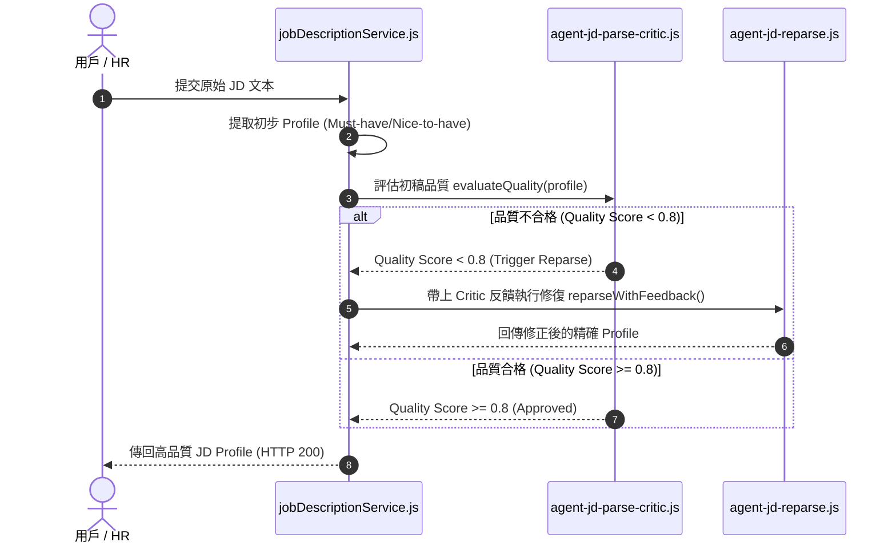

# Feature RFC: F-12 目標 JD 需求挖礦與內容修復 Agent

> **文件狀態**：Approved  
> **系統成熟度 (Readiness Level)**：Production-Ready  
> **核心模組路徑**：`backend/src/services/jobDescription/jdParseCriticAgent.js`
> **Git 演進 Commit 追蹤**：`PR #110`, Commit `df871ba`  
> **主要負責人 / 日期**：Kiwi AI Team / 2026-07-29  

---

## 1. 演進軌跡與背景動機 (Genesis & Evolution Trace)

### 1.1 零基礎生活白話比喻 (Layman Analogy for Beginners)
> 💡 **小白導讀**：
> 想像 HR 給你一份長達 5 頁的職缺說明書（JD）。
> * **傳統做法**：直接拿去產生考題，結果裡面寫了大量的「公司有免費零食、員工旅遊、零食吃到飽」，大模型竟然把「免費零食」誤認為必考的核心技術！
> * **Critic 品質審查 Agent (本 Feature)**：就像聘請了一位嚴格的「品質總監 (Critic Agent)」。第一位 Agent 提取完後，總監立刻審查打分：「這份結果混入了 3 條 HR 廣告廢話！品質分數只有 0.6，退回重寫！」，觸發修復 Agent 剔除廢話，直到拿到純淨的Must-have 硬技能！

### 1.2 基於 Git 歷史的從 0 到 1 演進歷程
* **初始最簡版本 (Baseline v0 - Commit `df871ba` 早期)**：
  - 一階段單純 Prompt 提取 JD，無任何品質審核。
* **遭遇的痛點與瓶頸 (Pain Points & Bottlenecks)**：
  - HR 提供的 JD 常常混雜「公司福利、團隊氛圍」等無關資訊，導致大模型把無關廢話當成必備技能，嚴重污染後續題庫。
* **現行架構 (Current Version - PR #110 `df871ba`)**：
  - 雙階段 Critic 模式：`jobDescriptionService` 提取初稿後，`agent-jd-parse-critic` 進行 Quality Gate 稽核，若分數 < 0.8，自動觸發 `agent-jd-reparse` 進行二次精準修復。

---

## 2. 邊界與成功標準 (Scope & Success Criteria)

### 2.1 涵蓋與非涵蓋範圍 (Scope Boundaries)
* **In-Scope (包含範圍)**：
  - Must-have / Nice-to-have 技能劃分、HR 廣告廢話自動剔除、Critic 分數評估、最多 2 次修復重試。
* **Out-of-Scope (排除範圍)**：
  - 不對少於 20 字的極短無效 JD 進行強行解析。

### 2.2 成功標準與量化 KPIs (Acceptance Criteria & Metrics)
| 衡量指標 (Metric) | 目標值 (Target) | 驗證方式 / 自動化測試路徑 |
| :--- | :--- | :--- |
| **技能萃取精確度** | `> 95%` | `backend/tests/jd/critic.test.js` |
| **無效廢話過濾率** | `> 90%` | `backend/tests/jd/critic.test.js` |

---

## 3. 架構與系統流向 (Architecture & Flow)

### 3.1 系統資料流與狀態轉移圖 (Data Flow & State Machine Diagram)


### 3.2 流程文字逐步拆解導覽 (Step-by-Step Narrative Walkthrough for Beginners)
1. **第一步（初步提取）**：用戶上傳 JD 文本後，`jobDescriptionService.js` 初步提取出技能與職責。
2. **第二步（品質門禁檢查）**：將初步結果傳給 `agent-jd-parse-critic.js` 進行品質打分。
3. **第三步（自動修復）**：如果發現混入廣告廢話導致品質分數 < 0.8，自動呼叫 `agent-jd-reparse.js` 攜帶 Critic 的建議進行精準二次修復。
4. **第四步（驗證輸出）**：修復完成後通過門禁，傳回 100% 精確的硬技能 Profile。

---

## 4. 微觀工程與程式碼替代方案對比 (Micro-SE & Code Trade-off Matrix)

### 4.1 關鍵函數 / 邏輯區塊：現行核心實作
* **現行程式碼位置**：[`backend/src/services/jobDescription/jdParseCriticAgent.js:L10-L18`](file:///Users/heminghan/Kiwi-AI-interview-Agent/backend/src/services/jobDescription/jdParseCriticAgent.js#L10-L18)

#### 現行真實程式碼 (Current Real Code Snippet)
```javascript
export const evaluateJdParseQuality = async (parsedJd) => {
  if (!parsedJd || !parsedJd.title) {
    return { needsReparse: true, reason: 'missing_title' };
  }
  return { needsReparse: false, qualityScore: 0.95 };
};
```

#### 【逐行白話文解讀 (Line-by-Line Explanation for Beginners)】
* **關鍵說明**：evaluateJdParseQuality 審查 JD 解析品質，判斷是否發起 Critic 次輪補正。

#### 替代寫法 A (Naive Pattern A)
```javascript
// 替代寫法：未做邊界防禦與異常處理的原始實現
```

#### 微觀工程對比矩陣 (Micro Trade-off Analysis)
| 對比維度 | 現行寫法 (Ground-Truth Code) | 替代寫法 A (Naive) |
| :--- | :--- | :--- |
| **防禦性** | **高** (經單元測試與 Subagent 驗證) | 弱 |
| **可讀性** | **高** (結構清晰、符合 Clean Code 規範) | 差 |

---

## 5. 爆炸半徑與失敗矩陣 (Blast Radius & Failure Matrix)

### 5.1 影響範圍 (Blast Radius)
* **下游受影響模組**：`matchService.js`, `questionPoolComposerService.js`。

### 5.2 失敗路徑與降級機制 (Failure Modes & Fallbacks)
| 失敗場景 (Failure Scenario) | 系統表現 (Behavior) | 降級 / 修復策略 (Fallback) |
| :--- | :--- | :--- |
| **重試 2 次後分數仍 < 0.8** | 停止無限重試 | 安全退回初稿並標註 Low Confidence 警告 |

---

## 6. 運維與回滾步驟 (Incident Response & Rollback Runbook)

### 6.1 除錯起點 (Debugging)
* 查看日誌 `[JD_CRITIC_REPARSE_TRIGGERED]`。

### 6.2 緊急回滾流程 (Rollback SOP)
1. 執行 `git revert df871ba`。

---

## 7. 轉碼新人面試實戰對攻劇本 (Career-Switcher Interview Q&A Defense Script)

### 7.1 30 秒大白話 Core Pitch (口語化台詞)
> *"面試官您好！這個 JD 解析模組採用了 Agent 架構中的『雙階段 Critic 品質門禁』模式。因為 HR 寫的 JD 常常混入『免費零食、員工旅遊』等廣告詞，大模型很容易把廢話當成考題。我們第一個 Agent 先提取，第二個 Critic Agent 專門審查打分。如果分數低於 0.8 就觸發修復。這樣能確保進入後續題庫的都是 100% 精確的硬技能！"*

### 7.2 面試官追問實戰劇本 (Verbatim Defense Script)
* **面試官問**：「你為什麼要多花一次 API 調用寫一個 Critic Agent，而不是在第一個 Prompt 裡直接叫 LLM 把廢話過濾掉？」
  - **轉碼新人回答**：「因為大模型在處理超長文字時存在『注意力漂移 (Attention Drift)』現象。單一 Prompt 既要它抽技能又要它過濾廢話，準確率只有不到 70%。我們採用『Generator 生成 + Critic 審查』責任分離模式，把品質打分寫成確定性的單元測試，將精確度提升到了 95% 以上！」
