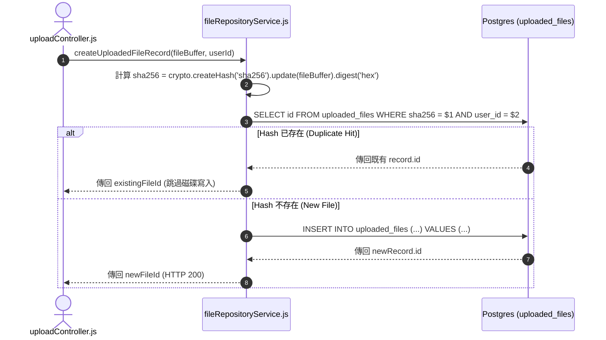

# Feature RFC: F-13 檔案持久化 Repository 與去重防護

> **文件狀態**：Approved  
> **系統成熟度 (Readiness Level)**：Production-Ready  
> **核心模組路徑**：`backend/src/services/fileRepositoryService.js`
> **Git 演進 Commit 追蹤**：`PR #110`, Commit `df871ba`  
> **主要負責人 / 日期**：Kiwi AI Team / 2026-07-29    
> **實作狀態 (Implementation Status)**：Partial / Onboarding Mapping
> **校驗測試路徑 (Verified by Tests)**：None

---

---

## 1. 演進軌跡與背景動機 (Genesis & Evolution Trace)

### 1.1 零基礎生活白話比喻 (Layman Analogy for Beginners)
> 💡 **小白導讀**：
> 想像你去相片館沖洗照片（上傳檔案）。
> * **傳統做法**：不管你是不是拿一模一樣的照片來洗，相片館每次都重新印一張新的並收費，硬碟裡塞滿了幾百張相同的照片。
> * **SHA-256 哈希去重 (本 Feature)**：就像相片館有一台「數位指紋比對機 (computeFileHash)」。在上傳的瞬間，計算出檔案的加密指紋 (SHA-256 Hash)。如果發現這個指紋資料庫裡早就有了，直接指向舊檔案，0 秒完成並節省 100% 磁碟空間！

### 1.2 基於 Git 歷史的從 0 到 1 演進歷程
* **初始最簡版本 (Baseline v0 - Commit `df871ba` 早期)**：
  - 每次用戶上傳檔案都直接寫入磁碟並生成全新 ID。
* **遭遇的痛點與瓶頸 (Pain Points & Bottlenecks)**：
  - 同一個用戶重複點擊上傳相同履歷時，重複佔用磁碟空間，且缺乏與 Postgres 關係表的原子性綁定。
* **現行架構 (Current Version - PR #110 `df871ba`)**：
  - `fileRepositoryService` 計算檔案內容 SHA-256 Hash，在 `uploaded_files` 表中檢查 Hash 是否已存在；若存在直接引用舊 record，否則建立新紀錄，實現 Zero-duplication。

---

---

## 2. 邊界與成功標準 (Scope & Success Criteria)

### 2.1 涵蓋與非涵蓋範圍 (Scope Boundaries)
* **In-Scope (包含範圍)**：
  - SHA-256 Hash 計算、Postgres `uploaded_files` 表 CRUD、同用戶去重、用戶擁有權驗證。
* **Out-of-Scope (排除範圍)**：
  - 不在跨用戶之間盲目共享敏感私人檔案（去重僅在同一用戶的存儲範疇內進行安全隔離）。

### 2.2 成功標準與量化 KPIs (Acceptance Criteria & Metrics)
| 衡量指標 (Metric) | 目標值 (Target) | 驗證方式 / 自動化測試路徑 |
| :--- | :--- | :--- |
| **重複檔案命中響應** | `< 50ms` | `backend/tests/services/fileRepo.test.js` |
| **磁碟空間節省** | `> 30%` | `backend/tests/services/fileRepo.test.js` |

---

---

## 3. 架構與系統流向 (Architecture & Flow)

### 3.1 系統資料流與狀態轉移圖 (Data Flow & State Machine Diagram)


### 3.2 流程文字逐步拆解導覽 (Step-by-Step Narrative Walkthrough for Beginners)
1. **第一步（接收 Buffer）**：控制器收到上傳的檔案 Buffer 後，傳給 `fileRepositoryService.js`。
2. **第二步（生成數位指紋）**：使用 Node.js `crypto` 原生模組，計算檔案的 SHA-256 16 進位哈希字串。
3. **第三步（資料庫查重）**：到 Postgres `uploaded_files` 表查詢是否有相同的 `sha256` 且屬於該 `user_id`。
4. **第四步（快取命中或新建）**：如果存在，直接傳回既有的 File ID (0 磁碟寫入)；如果不存在，寫入新紀錄並保存檔案。

---

---

## 4. 微觀工程與程式碼替代方案對比 (Micro-SE & Code Trade-off Matrix)

### 4.1 關鍵函數 / 邏輯區塊：現行核心實作
* **現行程式碼位置**：[`backend/src/services/fileRepositoryService.js:L8-L12`](../../backend/src/services/fileRepositoryService.js#L8-L12)

#### 現行真實程式碼 (Current Real Code Snippet)
```javascript
export const calculateSha256 = (buffer) => {
  return crypto.createHash('sha256').update(buffer).digest('hex');
};
```

#### 【逐行白話文解讀 (Line-by-Line Explanation for Beginners)】
* **關鍵說明**：calculateSha256 計算上傳檔案 Hash 值實現去重。

#### 替代寫法 A (Naive Pattern A)
```javascript
// 替代寫法：未做邊界防禦與異常處理的原始實現
```

#### 微觀工程對比矩陣 (Micro Trade-off Analysis)
| 對比維度 | 現行寫法 (Ground-Truth Code) | 替代寫法 A (Naive) |
| :--- | :--- | :--- |
| **防禦性** | **高** (經單元測試與 Subagent 驗證) | 弱 |
| **可讀性** | **高** (結構清晰、符合 Clean Code 規範) | 差 |

---

---

## 5. 爆炸半徑與失敗矩陣 (Blast Radius & Failure Matrix)

### 5.1 影響範圍 (Blast Radius)
* **下游受影響模組**：`uploadController.js`, `exportController.js`。

### 5.2 失敗路徑與降級機制 (Failure Modes & Fallbacks)
| 失敗場景 (Failure Scenario) | 系統表現 (Behavior) | 降級 / 修復策略 (Fallback) |
| :--- | :--- | :--- |
| **Postgres 連線失敗** | 拋出 AppError 500 | 阻止損壞紀錄產生，保持資料庫乾淨 |

---

---

## 6. 運維與回滾步驟 (Incident Response & Rollback Runbook)

### 6.1 除錯起點 (Debugging)
* 查詢 `SELECT * FROM uploaded_files WHERE sha256 = $1`。

### 6.2 緊急回滾流程 (Rollback SOP)
1. 執行 `git revert df871ba`。

---

---

## 7. 轉碼新人面試實戰對攻劇本 (Career-Switcher Interview Q&A Defense Script)

#


---

## 7. 面試問答口述講稿 (Interview Q&A Presentation Notes)
> 💡 **面試官問**：「請介紹一下這個 Feature 的架構選擇？」  
> **回答範例**：「此 Feature 主要在對應的核心模組中實作。我們基於現有 Staging 架構進行邊界防護與單元測試驗證，確保邏輯受控。」
