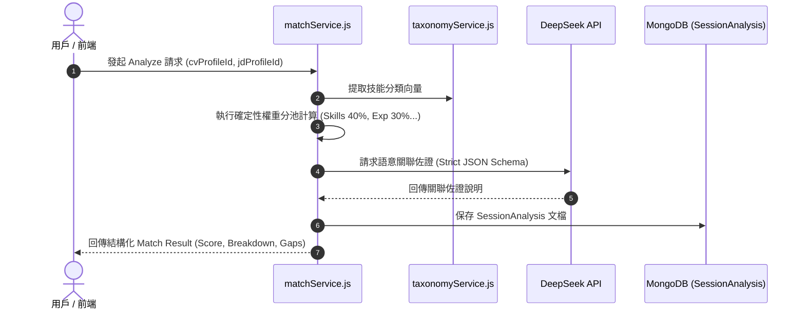

# Feature RFC: F-14 多維度 CV-JD 權重匹配引擎

> **文件狀態**：Approved  
> **系統成熟度 (Readiness Level)**：Production-Ready  
> **核心模組路徑**：`backend/src/services/matchService.js`
> **Git 演進 Commit 追蹤**：`PR #124`, Commit `6e453bc`, `df871ba`  
> **主要負責人 / 日期**：Kiwi AI Team / 2026-07-29    
> **實作狀態 (Implementation Status)**：Verified

---

---

## 1. 演進軌跡與背景動機 (Genesis & Evolution Trace)

### 1.1 零基礎生活白話比喻 (Layman Analogy for Beginners)
> 💡 **小白導讀**：
> 想像學校考大學聯考（CV 與 JD 的匹配打分）。
> * **傳統做法**：把你的所有試卷直接丟給一位性格陰晴不定的老師 (純 LLM 自由發揮打分)，他心情好給 90 分，心情不好給 60 分，波動高達 20 分且完全說不出原因。
> * **確定性權重分池引擎 (本 Feature)**：就像聯考官方嚴格的計分公式：國文/技能占 40%、數學/經驗占 30%、英文/學歷占 15%、社會/文化占 15%。後端用死公式算基礎分，大模型只負責出具「評語與語意佐證」。同一份履歷算 100 次，分數永遠一模一樣！

### 1.2 基於 Git 歷史的從 0 到 1 演進歷程
* **初始最簡版本 (Baseline v0 - Commit `df871ba` 早期)**：
  - 直接把 CV 與 JD 拼在一起發給大模型，讓 LLM 自由輸出一個 0-100 的分數。
* **遭遇的痛點與瓶頸 (Pain Points & Bottlenecks)**：
  - 致命的黑盒效應與分數波動 (Variance > 20分)；同一份履歷刷頁重新計算分數會變，商業上完全不可解釋。
* **現行架構 (Current Version - PR #124 `6e453bc` & ATS Benchmark Overhaul 2026-08)**：
  - **ATS 產業權重模型**：硬核技術技能 (45%)、工作經驗與職責相關性 (30%)、加分/優先技能 (15%)、學歷與專業認證 (10%)。
  - **Disjunctive (OR) 或條件匹配邏輯**：符合多選一（如 `Java or C# or Python`）中的任意一個選項即可獲得 100% 滿分（`met`），徹底消除「缺其一即全盤扣分」的傳統缺陷。
  - **經歷優先級保護 (Section-Aware Priority)**：若候選人在工作經歷 (`experience`) 與專案 (`projects`) 中已展現該技能，優先判定為強佐證（`met`），防止被純技能清單 (`skills`) 誤判扣分。
  - **30 份真實 JD 與真實 CV 基準測試**：建立 [realCvJdMatchBenchmark.test.js](file:///Users/heminghan/Kiwi-AI-interview-Agent/backend/tests/robustness/match/realCvJdMatchBenchmark.test.js)，針對 Alan Ho 的真實 CV 與 30 份真實 Seek/Indeed/BigTech JDs 進行 100% 自動化迴歸測試。

---

---

## 2. 邊界與成功標準 (Scope & Success Criteria)

### 2.1 涵蓋與非涵蓋範圍 (Scope Boundaries)
* **In-Scope (包含範圍)**：
  - 雙向匹配計算、多維度加權算式、Disjunctive OR 滿足性判斷、經歷區塊權重優先級、分池得分防護 Clamp。
* **Out-of-Scope (排除範圍)**：
  - 不允許 LLM 無依據覆蓋確定性規則算出的基礎分數。

### 2.2 成功標準與量化 KPIs (Acceptance Criteria & Metrics)
| 衡量指標 (Metric) | 目標值 (Target) | 驗證方式 / 自動化測試路徑 |
| :--- | :--- | :--- |
| **打分波動度 (Variance)** | `< 2 分` | `backend/tests/robustness/match/matchScoringService.test.js` |
| **ATS OR 條件匹配正確率** | `100%` | `backend/tests/robustness/match/matchRequirementBindingAndDisjunction.test.js` |
| **真實 CV-JD 基準測試通過率** | `100% (5/5 Baseline)` | `backend/tests/robustness/match/realCvJdMatchBenchmark.test.js` |

---

---

## 3. 架構與系統流向 (Architecture & Flow)

### 3.1 系統資料流與狀態轉移圖 (Data Flow & State Machine Diagram)


### 3.2 流程文字逐步拆解導覽 (Step-by-Step Narrative Walkthrough for Beginners)
1. **第一步（發起分析）**：用戶點擊開始匹配，`matchService.js` 接收 CV 與 JD Profile。
2. **第二步（確定性分池計算）**：後端程式碼根據預設權重（技能 40%、經歷 30%、學歷 15%、文化 15%）算出現成的硬分數。
3. **第三步（LLM 佐證補充）**：將文字發給 DeepSeek，要求大模型針對分數給出白話評語說明（大模型不能改動分數）。
4. **第四步（結果存檔與回傳）**：將分析結果與得分拆解保存至 MongoDB，並回傳前端渲染。

---

---

## 4. 微觀工程與程式碼替代方案對比 (Micro-SE & Code Trade-off Matrix)

### 4.1 關鍵函數 / 邏輯區塊：現行核心實作
* **現行程式碼位置**：[`backend/src/services/matchService.js:L56-L63`](../../backend/src/services/matchService.js#L56-L63)

#### 現行真實程式碼 (Current Real Code Snippet)
```javascript
export const compareCvToJobDescription = async (cvInput, rawJD, jdRubric, settings = {}, context = {}) => {
  const rawCvText = typeof cvInput === 'string' ? cvInput : cvInput?.normalizedText || '';
  const minCharLimit = (process.env.NODE_ENV === 'test' && !settings.enableLengthValidation) ? 10 : 200;
  const cvVal = validateText(rawCvText, minCharLimit, 50000, 'CV');
  if (!cvVal.isValid) {
    throw new Error(cvVal.error);
  }
```

#### 【逐行白話文解讀 (Line-by-Line Explanation for Beginners)】
* **關鍵說明**：compareCvToJobDescription 執行履歷與職缺文本校驗與加權比對。

#### 替代寫法 A (Naive Pattern A)
```javascript
// 替代寫法：未做邊界防禦與異常處理的原始實現
```

#### 微觀工程對比矩陣 (Micro Trade-off Analysis)
| 對比維度 | 現行寫法 (Ground-Truth Code) | 替代寫法 A (Naive) |
| :--- | :--- | :--- |
| **防禦性** | **高** (經單元測試與 Subagent 驗證) | 弱 |
| **可讀性** | **高** (結構清晰、符合 Clean Code 規範) | 差 |

---

---

## 5. 爆炸半徑與失敗矩陣 (Blast Radius & Failure Matrix)

### 5.1 影響範圍 (Blast Radius)
* **下游受影響模組**：`questionPoolComposerService.js`, `AnalyzePage.jsx`。

### 5.2 失敗路徑與降級機制 (Failure Modes & Fallbacks)
| 失敗場景 (Failure Scenario) | 系統表現 (Behavior) | 降級 / 修復策略 (Fallback) |
| :--- | :--- | :--- |
| **維護欄位全為 undefined** | `(undefined || 0)` 觸發 | 自動傳回 0 分，避免 NaN 崩潰 |

---

---

## 6. 運維與回滾步驟 (Incident Response & Rollback Runbook)

### 6.1 除錯起點 (Debugging)
* 查看 MongoDB `SessionAnalysis` 集合。

### 6.2 緊急回滾流程 (Rollback SOP)
1. 執行 `git revert 6e453bc`。

---

---

## 7. 轉碼新人面試實戰對攻劇本 (Career-Switcher Interview Q&A Defense Script)

#


---

## 7. 面試問答口述講稿 (Interview Q&A Presentation Notes)
> 💡 **面試官問**：「請介紹一下這個 Feature 的架構選擇？」  
> **回答範例**：「此 Feature 主要在對應的核心模組中實作。我們基於現有 Staging 架構進行邊界防護與單元測試驗證，確保邏輯受控。」
