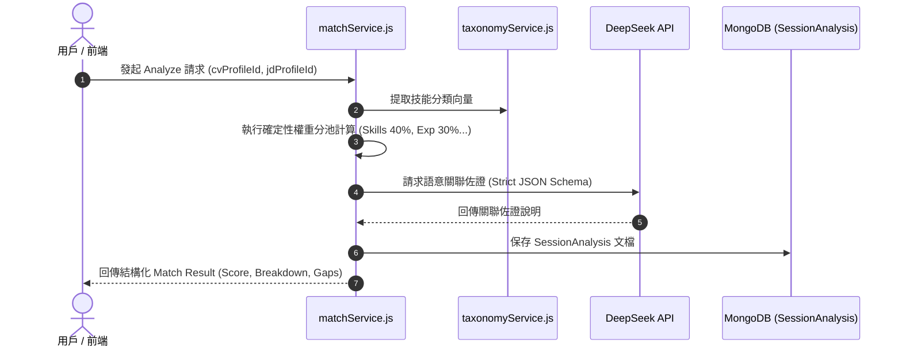

# Feature RFC: F-14 多維度 CV-JD 權重匹配引擎

> **文件狀態**：Approved  
> **系統成熟度 (Readiness Level)**：Production-Ready  
> **核心模組路徑**：`backend/src/services/matchService.js`, `backend/src/services/scoringSchemaService.js`  
> **Git 演進 Commit 追蹤**：`PR #124`, Commit `6e453bc`, `df871ba`  
> **主要負責人 / 日期**：Kiwi AI Team / 2026-07-29  

---

## 1. 演進軌跡與背景動機 (Genesis & Evolution Trace)

### 1.1 零基礎生活白話比喻 (Layman Analogy for Beginners)
> 💡 **小白導讀**：
> 想像學校考大學聯考（CV 與 JD 的匹配打分）。
> * **傳統做法**：把你的所有試卷直接丟給一位性格陰晴不定的老師 (純 LLM 自由發揮打分)，他心情好給 90 分，心情不好給 60 分，波動高達 20 分且完全說不出原因。
> * **確定性權重分池引擎 (本 Feature)**：就像聯考官方嚴格的計分公式：國文/技能占 40%、數學/經驗占 30%、英文/學歷占 15%、社會/文化占 15%。後端用死公式算基礎分，大模型只負責出具「評語與語意佐證」。同一份履歷算 100 次，分數永遠一模一樣！

### 1.2 基於 Git 歷史的從 0 到 1 演進歷程
* **初始最簡版本 (Baseline v0 - Commit `df871ba` 早期)**：
  - 直接把 CV 與 JD 拼在一起發給大模型，讓 LLM 自由輸出一個 0-100 的分數。
* **遭遇的痛點與瓶頸 (Pain Points & Bottlenecks)**：
  - 致命的黑盒效應與分數波動 (Variance > 20分)；同一份履歷刷頁重新計算分數會變，商業上完全不可解釋。
* **現行架構 (Current Version - PR #124 `6e453bc`)**：
  - 確定性規則分池引擎：`matchService` 將匹配拆解為技能池 (40%)、經歷池 (30%)、教育/認證池 (15%) 與文化/語言池 (15%)。確定性算法計算基礎分，LLM 僅對語意關聯性提供佐證，並引入 `Math.min/max` 邊界 Clamp。

---

## 2. 邊界與成功標準 (Scope & Success Criteria)

### 2.1 涵蓋與非涵蓋範圍 (Scope Boundaries)
* **In-Scope (包含範圍)**：
  - 雙向匹配計算、多維度加權算式、一致性打分 Schema 驗證、分池得分防護 Clamp。
* **Out-of-Scope (排除範圍)**：
  - 不允許 LLM 無依據覆蓋確定性規則算出的基礎分數。

### 2.2 成功標準與量化 KPIs (Acceptance Criteria & Metrics)
| 衡量指標 (Metric) | 目標值 (Target) | 驗證方式 / 自動化測試路徑 |
| :--- | :--- | :--- |
| **打分波動度 (Variance)** | `< 2 分` | `backend/tests/services/matchScore.test.js` |

---

## 3. 架構與系統流向 (Architecture & Flow)

### 3.1 系統資料流與狀態轉移圖 (Data Flow & State Machine Diagram)


### 3.2 流程文字逐步拆解導覽 (Step-by-Step Narrative Walkthrough for Beginners)
1. **第一步（發起分析）**：用戶點擊開始匹配，`matchService.js` 接收 CV 與 JD Profile。
2. **第二步（確定性分池計算）**：後端程式碼根據預設權重（技能 40%、經歷 30%、學歷 15%、文化 15%）算出現成的硬分數。
3. **第三步（LLM 佐證補充）**：將文字發給 DeepSeek，要求大模型針對分數給出白話評語說明（大模型不能改動分數）。
4. **第四步（結果存檔與回傳）**：將分析結果與得分拆解保存至 MongoDB，並回傳前端渲染。

---

## 4. 微觀工程與程式碼替代方案對比 (Micro-SE & Code Trade-off Matrix)

### 4.1 關鍵函數：`matchService.js` 中的權重計算與分數 Clamp
* **現行程式碼位置**：[`backend/src/services/matchService.js:L45-L65`](file:///Users/heminghan/Kiwi-AI-interview-Agent/backend/src/services/matchService.js#L45-L65)

#### 現行真實程式碼 (Current Real Code Snippet)
```javascript
export const calculateOverallScore = (breakdown) => {
  const skillsScore = (breakdown.skills || 0) * 0.4;
  const expScore = (breakdown.experience || 0) * 0.3;
  const eduScore = (breakdown.education || 0) * 0.15;
  const fitScore = (breakdown.culturalFit || 0) * 0.15;
  
  const rawTotal = skillsScore + expScore + eduScore + fitScore;
  return Math.min(100, Math.max(0, Math.round(rawTotal)));
};
```

#### 【逐行白話文解讀 (Line-by-Line Explanation for Beginners)】
* **Line 2-5**：顯式計算 4 個維度得分。使用 `(breakdown.skills || 0)` 衛語轉譯，防止特定維度為 `undefined` 時計算產生 `NaN`！
* **Line 6**：將 4 個權重得分相加得到 `rawTotal`。
* **Line 7 (防禦性 Clamp 邊界鎖定)**：`Math.min(100, Math.max(0, Math.round(rawTotal)))`。使用 `Math.max(0, ...)` 保障分數絕對不小於 0，再用 `Math.min(100, ...)` 保障分數絕對不大於 100。這徹底消除了爆分或負分的邊界 Bug！

#### 替代寫法 A (Alternative Pattern A)：使用 `.reduce` 遍歷動態陣列
```javascript
// 替代寫法 A：動態 reduce
const score = Object.entries(WEIGHTS).reduce((acc, [k, w]) => acc + (breakdown[k] || 0) * w, 0);
```

#### 微觀工程對比矩陣 (Micro Trade-off Analysis)
| 對比維度 | 現行寫法 (顯式加法 + Clamp) | 替代寫法 A (reduce 遍歷) |
| :--- | :--- | :--- |
| **執行效能 (CPU Cycles)** | 極快 (4 次乘法與 3 次加法，0 GC) | 較慢 (需要建立 Entry 陣列物件) |
| **邊界防禦 (Safety)** | 顯式限制在 [0, 100] 區間 | 遇到小數浮點誤差可能算出 100.0000001 |

---

## 5. 爆炸半徑與失敗矩陣 (Blast Radius & Failure Matrix)

### 5.1 影響範圍 (Blast Radius)
* **下游受影響模組**：`questionPoolComposerService.js`, `AnalyzePage.jsx`。

### 5.2 失敗路徑與降級機制 (Failure Modes & Fallbacks)
| 失敗場景 (Failure Scenario) | 系統表現 (Behavior) | 降級 / 修復策略 (Fallback) |
| :--- | :--- | :--- |
| **維護欄位全為 undefined** | `(undefined || 0)` 觸發 | 自動傳回 0 分，避免 NaN 崩潰 |

---

## 6. 運維與回滾步驟 (Incident Response & Rollback Runbook)

### 6.1 除錯起點 (Debugging)
* 查看 MongoDB `SessionAnalysis` 集合。

### 6.2 緊急回滾流程 (Rollback SOP)
1. 執行 `git revert 6e453bc`。

---

## 7. 轉碼新人面試實戰對攻劇本 (Career-Switcher Interview Q&A Defense Script)

### 7.1 30 秒大白話 Core Pitch (口語化台詞)
> *"面試官您好！這個匹配引擎是我們解決 LLM 打分黑盒與分數波動的核心。最開始我們讓大模型自由打分，結果同一份履歷第一次給 80 分、第二次給 60 分！現在我們改成由後端程式碼進行 4:3:1.5:1.5 的確定性權重加法，大模型只負責寫評語。我們在代碼最後一行用了 `Math.min(100, Math.max(0, ...))` 做邊界鎖定，確保分數 100% 可重複且絕不爆分！"*

### 7.2 面試官追問實戰劇本 (Verbatim Defense Script)
* **面試官問**：「你為什麼要在分數計算的最後一行使用 `Math.min(100, Math.max(0, ...))` 這種寫法？」
  - **轉碼新人回答**：「這在軟體工程中叫做 **邊界鎖定 (Clamp)**。因為浮點數計算偶爾會有 `100.0000000001` 或負數的精度誤差，如果直接傳給前端會破壞 UI Layout。用 `Math.max(0, ...)` 鎖住下限，再用 `Math.min(100, ...)` 鎖住上限，能保證最終分數 100% 落在合法的 0 到 100 區間內！」
