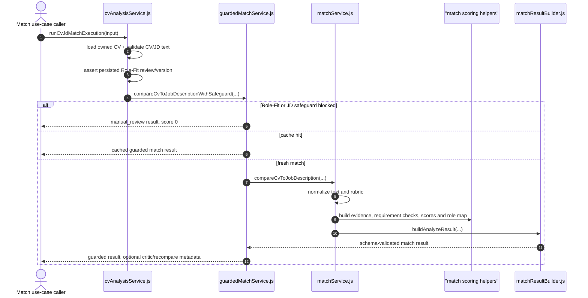

# Feature RFC: F-14 多維度 CV-JD 權重匹配引擎

> **文件狀態**：Approved  
> **系統成熟度 (Readiness Level)**：Partial
> **核心模組路徑**：`backend/src/services/cv/cvAnalysisService.js`, `backend/src/services/match/guardedMatchService.js`, `backend/src/services/matchService.js`, `backend/src/services/match/matchResultBuilder.js`
> **Git 演進 Commit 追蹤**：歷史 `PR #124` / `6e453bc`; current source snapshot `a89e6eba` (2026-08-02); latest relevant scoring/evidence change `75cce1a`
> **主要負責人 / 日期**：Kiwi AI Team / 2026-08-02
> **實作狀態 (Implementation Status)**：Partial
> **校驗測試路徑 (Verified by Tests)**：`backend/tests/robustness/match/matchScoringService.test.js`, `backend/tests/robustness/match/matchRequirementBindingAndDisjunction.test.js`, `backend/tests/robustness/match/guardedMatchHumanReviewRobustness.test.js`, `backend/tests/robustness/match/roleFitMatchCutover.test.js`, `backend/tests/robustness/match/realCvJdMatchBenchmark.test.js`

---

---

## 1. 演進軌跡與背景動機 (Genesis & Evolution Trace)

### 1.1 零基礎生活白話比喻 (Layman Analogy for Beginners)
> 💡 **小白導讀**：
> 想像學校考大學聯考（CV 與 JD 的匹配打分）。
> * **傳統做法**：把你的所有試卷直接丟給一位性格陰晴不定的老師 (純 LLM 自由發揮打分)，他心情好給 90 分，心情不好給 60 分，波動高達 20 分且完全說不出原因。
> * **確定性權重分池引擎 (本 Feature)**：就像聯考官方嚴格的計分公式：國文/技能占 40%、數學/經驗占 30%、英文/學歷占 15%、社會/文化占 15%。後端用死公式算基礎分，大模型只負責出具「評語與語意佐證」。同一份履歷算 100 次，分數永遠一模一樣！

### 1.2 基於 Git 歷史的從 0 到 1 演進歷程
* **初始最簡版本 (Baseline v0 - Commit `df871ba` 早期)**：
  - 直接把 CV 與 JD 拼在一起發給大模型，讓 LLM 自由輸出一個 0-100 的分數。
* **遭遇的痛點與瓶頸 (Pain Points & Bottlenecks)**：
  - 致命的黑盒效應與分數波動 (Variance > 20分)；同一份履歷刷頁重新計算分數會變，商業上完全不可解釋。
* **現行架構（historical summary；目前 source truth 見 1.5）**：
  - Match 不再由單一 LLM 直接決定總分；外層先做 ownership、input validation、Role-Fit review 與 JD safeguard gate，再進入 matcher。
  - Score breakdown 由 rubric 提供的 macro/micro/requirement criteria 與 weights 計算；本 RFC 不再宣稱一組固定的 45/30/15/10 或 40/30/15/15 權重，除非該 rubric 與測試明確提供證據。
  - Requirement status 支援 OR/disjunctive child matching、section-aware evidence、explicit technical evidence 與 evidence-strength policy；具體規則以 `matchScoringService.js` 目前實作與 focused tests 為準。
  - `semantic` engine 是設定開啟時的 optional branch，不是所有 Match request 都必然會呼叫 provider。

### 1.3 2026-08-01 解析與證據 hygiene 修正

- JD parser 現在會辨識 `A typical day could include` 作為職責區塊，並把 `It would be a bonus if...` 當成 bonus 容器，而非可評分 requirement。
- `Additional Information`、`Apply now`、雇主行銷與公司價值文案會在 section、requirement 與 role-intent 路徑排除；真正的職責與 bonus child items 仍保留。
- Match 對 `such as`、`or equivalent` 與 OR 型清單逐項檢查；單一已證實的可替代工具可滿足該清單。CV taxonomy 中的顯式 skill evidence 會優先於泛化 semantic overlap。
- 這一輪只證明本機 deterministic regression。它只把已知相關且結束年份早於當年的學歷判為 `met`；明顯未完成、當年結束與未來結束的資料維持 `partial`。學位完成狀態尚未成為結構化、可驗證欄位，且 role-intent source-identity 去重、confidence calibration 與 browser/real-provider 結果仍不是本 RFC 的已驗證結論。

### 1.4 2026-08-01 Match 導航與操作面板收斂

- Analyze 頁面移除重複的 header 1–6 流程指示器。可切換頁面的 stage bar 保留，且每個 stage 只顯示完成／阻擋狀態與既有名稱，不再重複顯示檔名或狀態小字。
- 右側 `Match control` 取代逐項 `Setup checklist`。它只保留當前下一步、既有主操作（產生、重試或開始面試）與已完成時的 `Regenerate match`。
- 這是候選人準備流程的呈現收斂；不改變 CV/JD review gate、voice/text interview mode、舊 Match 在輸入變動時的清空行為，或任何 Match 計分／證據生成邏輯。

### 1.5 Current code-truth snapshot（2026-08-02）

- `runCvJdMatchExecution` 是目前較完整的 application-level boundary：先載入 owner-scoped CV、檢查 CV/JD 可用文字、確認 persisted Role-Fit review，再呼叫 guarded matcher。
- `compareCvToJobDescriptionWithSafeguard` 會先處理 Role-Fit blocked、JD safeguard blocked、artifact cache hit/miss，以及必要時的 critic/recompare；這些不是 `compareCvToJobDescription` 內部的單純 scoring 步驟。
- `compareCvToJobDescription` 會正規化文字與 rubric，建立 CV/evidence/semantic context，計算 macro、micro、requirement checks，建立 role evidence map、score breakdown、transition profile、question hints，最後交給 `buildAnalyzeResult` 驗證與組裝 output。
- `75cce1a` 後的 requirement policy 包含 primary technical evidence rules、retail context hard requirement，以及 evidence strength 優先於 semantic score 的排序調整；舊 RFC 沒有記錄這些規則，故本次補入 code blueprint。
- 本 RFC 不把 `matchService.js` 宣稱為 MongoDB persistence owner。此核心函數回傳 validated match result；實際 persistence 必須由其 caller 的 source 與 test 另行證明。

---

---

## 2. 邊界與成功標準 (Scope & Success Criteria)

### 2.1 涵蓋與非涵蓋範圍 (Scope Boundaries)
* **In-Scope (包含範圍)**：
  - 雙向匹配計算、多維度加權算式、Disjunctive OR 滿足性判斷、經歷區塊權重優先級、分池得分防護 Clamp。
  - 消費已通過 CV/JD review 與 Role-Fit gate 的輸入，並產生可驗證的 match result。
* **Out-of-Scope (排除範圍)**：
  - 不允許 LLM 無依據覆蓋確定性規則算出的基礎分數。
  - CV human-review persistence、JD/Role-Fit review UI/API、JD URL capture 與 company-values enrichment 由 [`F-77`](./F-77-cv-profile-human-review-gate.md)、[`F-78`](./F-78-jd-role-fit-human-review.md)、[`F-79`](./F-79-jd-url-capture-and-analysis.md)、[`F-80`](./F-80-company-values-enrichment.md) 負責；本 RFC 只消費其已通過 gate 的輸入。

### 2.2 成功標準與量化 KPIs (Acceptance Criteria & Metrics)
| 衡量指標 (Metric) | 目標值 (Target) | 驗證方式 / 自動化測試路徑 |
| :--- | :--- | :--- |
| **打分波動度 (Variance)** | `< 2 分` | `backend/tests/robustness/match/matchScoringService.test.js` |
| **ATS OR 條件匹配正確率** | `100%` | `backend/tests/robustness/match/matchRequirementBindingAndDisjunction.test.js` |
| **真實 CV-JD 基準測試通過率** | `100% (5/5 Baseline)` | `backend/tests/robustness/match/realCvJdMatchBenchmark.test.js` |

---

---

### 2.3 Feature Definition & Code Blueprint

本 Feature 的核心目標是把已通過 review/gate 的 CV 與 JD rubric 轉成可追溯的 match result。它不是一個「直接呼叫 LLM 取得分數」的函數；新增 caller 時應優先使用 `runCvJdMatchExecution`，不要跳過 owner、Role-Fit 或 JD safeguard。

#### 2.3.1 Entry points 與輸入 objects

| Entry point | Input | 前置條件 | Output |
| :--- | :--- | :--- | :--- |
| `runCvJdMatchExecution`（`backend/src/services/cv/cvAnalysisService.js`） | `{ cvId, userId, rawJD, jdRubric, settings, performanceTrace, progressReporter }` | `cvId`、`rawJD/jdRubric` 至少一項；`jdRubric.roleFit` 存在；CV/JD 文字通過長度與格式檢查；owner-scoped Role-Fit review version 必須一致 | `{ cvDocument, matchData }` |
| `compareCvToJobDescriptionWithSafeguard`（`backend/src/services/match/guardedMatchService.js`） | `{ normalizedText, cvProfile, evidenceProfile, userId }`, `rawJD`, `jdRubric`, `settings`, `context` | caller 已提供可用 rubric；函數仍會檢查 verified Role-Fit、JD safeguard、cache 與 critic/recompare | guarded match result |
| `compareCvToJobDescription`（`backend/src/services/matchService.js`） | `cvInput`, `rawJD`, `jdRubric`, `settings`, `context` | 內部 matcher boundary；不應被 UI 直接當成完整 review/persistence flow | validated analyze output |

`cvInput` 可以是 normalized CV string，也可以是帶有 `normalizedText`、`cvProfile`、`evidenceProfile` 的 object。`jdRubric` 是 parser/review 產生的 rubric；若要讓 Match 通過外層 gate，它還必須帶有目前 persisted 的 Role-Fit identity/version。

#### 2.3.2 Object 與 helper inventory

| Object / helper | 來源 | 主要責任 | Side effect / reuse boundary |
| :--- | :--- | :--- | :--- |
| `cvDocument` | `getOwnedCvDocumentOrThrow` | 取得指定 user 擁有的 normalized CV/profile | 讀取 persistence；應由 use-case boundary 呼叫 |
| `human-reviewed Role-Fit` | `assertVerifiedCompanyRoleFitReview` | 確認 fingerprint、profile id、review version 與 persisted verified record 一致 | 讀取 persistence；失敗時阻擋 match |
| `humanReviewedJdRubric` | `buildHumanReviewedRubric` | 只有已 human-reviewed 的 blocked JD 才能套用明確 override metadata | 純 object transformation；只由 guarded matcher 使用 |
| `baseRubric` | `normalizeRubric` | 將 raw JD / supplied rubric 轉成 scorer 可使用的 rubric | 可能使用 async parser path；不可假設固定權重 |
| `parsedCvProfile` | `buildCvProfile` 或既有 `cvInput.cvProfile` | 建立／沿用 CV 結構化 profile | in-memory |
| `cvEvidenceProfile` | `buildCvEvidenceProfile` 或既有 evidence profile | 將 CV sections/evidence 轉成可判定的 evidence context | in-memory |
| `semanticEvidenceContext` | `buildSemanticEvidenceContext` + optional `judgeRequirementEvidenceBatch` | semantic engine 開啟時補充 evidence matches/judgements | 可能進入 provider branch；不保證每次執行都呼叫 |
| `requirementChecks` | `buildRequirementChecks` | 逐項產生 `met / partial / not_met` 與 evidence metadata | deterministic rule + optional semantic context |
| `scoreBreakdown` | `calculateScoreBreakdown` 或 semantic capability breakdown | 組合 macro、micro、requirement 分數 | deterministic output；受 rubric/criteria 影響 |
| `roleEvidenceMap` | `buildRoleEvidenceMap` | 將 Role-Fit intent 與 requirement/evidence 連結 | in-memory |
| `matchData` | `buildAnalyzeResult` → `validateAnalyzeOutput` | 組裝 candidate、decision、scores、evidence、diagnostics、hints | returned output；schema validation 是最後一道 boundary |

#### 2.3.3 Execution algorithm（由目前 source 重建的規格 pseudocode）

```text
runCvJdMatchExecution(input):
  require input.cvId
  require input.rawJD or input.jdRubric
  require input.jdRubric.roleFit

  const cvDocument = getOwnedCvDocumentOrThrow({ cvId, userId })
  assertUsableMatchText(cvDocument.normalizedText, 'CV')
  if rawJD exists:
    assertUsableMatchText(rawJD, 'JD')

  assertVerifiedCompanyRoleFitReview({
    userId,
    jdFingerprint: jdRubric.roleFit.jdFingerprint,
    reviewVersion: jdRubric.roleFit.review.version,
    roleFitProfileId: jdRubric.roleFit.id,
  })

  const matchData = compareCvToJobDescriptionWithSafeguard(
    cvDocument profile/evidence,
    rawJD,
    jdRubric,
    settings + user identity,
  )

  return { cvDocument, matchData + sourceSnapshots }

compareCvToJobDescription(cvInput, rawJD, jdRubric, settings, context):
  const rawCvText = read string or cvInput.normalizedText
  validate CV and normalize HTML/whitespace/bullets
  if rawJD is usable:
    validate and normalize JD

  const baseRubric = normalizeRubric(cleanJD or rawJD, jdRubric)
  const parsedCvProfile = reuse supplied profile or buildCvProfile(cleanCvText)
  const cvEvidenceProfile = reuse supplied evidence or buildCvEvidenceProfile(...)

  if semantic engine is enabled:
    build universal role profile and semantic evidence judgements
  else:
    mark semantic steps skipped

  const macroScores = buildMacroScores(...)
  const microScores = buildMicroScores(...)
  const requirementChecks = buildRequirementChecks(...)
  const roleEvidenceMap = buildRoleEvidenceMap(...)
  const scoreBreakdown = calculateScoreBreakdown(...)
  const transitionProfile = buildTransitionProfile(...)
  const explanation = buildExplanation(...)
  const cvAnalysis = buildJdMatchedCvAnalysis(...)
  const questionPlanHints = buildQuestionPlanHints(...)

  return buildAnalyzeResult({ all derived objects })
```

#### 2.3.4 Output contract 與 blocked branches

成功 output 的主要欄位由 `buildAnalyzeResult` 產生：`schemaVersion`、candidate/job identity、`overallScore`、`confidence`、`decision`、`parsedCvProfile`、`parsedJdProfile`、`macroScores`、`microScores`、`requirementChecks`、`scoreBreakdown`、`explanation`、`evidenceMap`、`roleEvidenceMap`、`roleFitDiagnostics`、`sourceSnapshots` 與 `matchingDetails`。

| Branch | 行為 | 是否進入 scorer |
| :--- | :--- | :--- |
| Role-Fit 尚未 verified / version 不一致 | `runCvJdMatchExecution` 在 gate 失敗；或 guarded matcher 回傳 `manual_review`、`overallScore: 0`、`reasonCodes: ['role_fit_review_required']` | 否 |
| JD safeguard blocked 且沒有合法 human-review override | 回傳 `manual_review`、`reasonCodes: ['jd_safeguard_blocked_match']` | 否 |
| cache hit | 回傳已驗證 cache result | 否，使用既有 artifact |
| semantic engine disabled | 跳過 universal role/evidence judge branch，使用 deterministic path | 是 |
| fresh match + critic verdict `revise` | 依 max attempts 進行 bounded recompare | 是，最多受 safeguard policy 限制 |

本 RFC 的 local tests 只證明對應 fixture/mock 的 deterministic、guard、schema 或 branch 行為；不證明 live provider、browser UI、部署後 persistence 或 production readiness。

---

## 3. 架構與系統流向 (Architecture & Flow)

### 3.1 系統資料流與狀態轉移圖 (Data Flow & State Machine Diagram)


### 3.2 流程文字逐步拆解導覽 (Step-by-Step Narrative Walkthrough for Beginners)
1. **第一步（use-case boundary）**：caller 將 `cvId`、`userId`、raw JD/rubric 與 settings 傳給 `runCvJdMatchExecution`。
2. **第二步（input 與 ownership gate）**：載入 owner-scoped CV，驗證 CV/JD 可用文字，並確認 persisted Role-Fit review 的 fingerprint、profile id 與 version 沒有過期。
3. **第三步（guarded match）**：`compareCvToJobDescriptionWithSafeguard` 先處理 Role-Fit block、JD safeguard block、cache hit/miss，以及需要時的 bounded critic/recompare。
4. **第四步（core transformation）**：`compareCvToJobDescription` 正規化文字與 rubric，建立 CV evidence 與 optional semantic context，產生 requirement checks、score breakdown、role evidence map 與 question hints。
5. **第五步（output）**：`buildAnalyzeResult` 組合 schema-validated match result，經 `validateAnalyzeOutput` 後回傳；candidate-facing projection 與 persistence 仍由 caller 另行負責，本 core function 不直接宣稱負責 MongoDB persistence。

---

---

## 4. 微觀工程與程式碼替代方案對比 (Micro-SE & Code Trade-off Matrix)

### 4.1 關鍵函數 / 邏輯區塊：現行核心實作
* **現行程式碼位置**：[`backend/src/services/matchService.js:L56-L68`](../../../backend/src/services/matchService.js#L56-L68)

#### 現行真實程式碼 (Current Real Code Snippet)
```javascript
export const compareCvToJobDescription = async (cvInput, rawJD, jdRubric, settings = {}, context = {}) => {
  const rawCvText = typeof cvInput === 'string' ? cvInput : cvInput?.normalizedText || '';
  const minCharLimit = (process.env.NODE_ENV === 'test' && !settings.enableLengthValidation) ? 10 : 200;
  const cvVal = validateText(rawCvText, minCharLimit, 50000, 'CV');
  if (!cvVal.isValid) {
    throw new AppError(cvVal.error.message, { statusCode: 400, code: cvVal.error.code });
  }
  const cleanCvText = normalizeBullets(normalizeWhitespace(removeHtmlTags(rawCvText)));
```

#### 【逐行白話文解讀 (Line-by-Line Explanation for Beginners)】
* **第 56 行**：接受 string 或含 `normalizedText` 的 CV input。
* **第 58 行**：production 最低文字長度為 200；test 可由設定放寬到 10。
* **第 59-61 行**：透過 `validateText` 檢查 CV；失敗時轉成 HTTP 400 語意的 `AppError`。
* **第 63 行**：移除 HTML、正規化 whitespace 與 bullet，後續 profile/evidence builder 使用這個 clean text。

#### 微觀工程對比矩陣 (Micro Trade-off Analysis)
| 對比維度 | 現行寫法 (Ground-Truth Code) | 不採用的簡化寫法 |
| :--- | :--- | :--- |
| **輸入錯誤** | 將 validation error 轉成帶 status/code 的 `AppError` | 直接丟一般 `Error`，caller 失去 HTTP error contract |
| **文字一致性** | 先移除 HTML、normalise whitespace/bullets | 直接把 raw text 傳給 scorer，容易造成 parser/evidence 差異 |
| **證據邊界** | 後續由 profile/evidence builders 產生可追溯中間物件 | 在 controller 內重寫 scoring 或直接讓 LLM 回傳總分 |

---

---

## 5. 爆炸半徑與失敗矩陣 (Blast Radius & Failure Matrix)

### 5.1 影響範圍 (Blast Radius)
* **直接 caller / 下游**：`backend/src/services/cv/cvAnalysisService.js`、`backend/src/services/match/matchAnalysisExecutionService.js`、frontend `AnalyzePage.jsx`。
* **結果消費者**：question planning、role evidence、interview preparation、candidate-facing match view。
* **不應推論**：核心 matcher 本身不等於 persistence、browser rendering 或 provider availability。

### 5.2 失敗路徑與降級機制 (Failure Modes & Fallbacks)
| 失敗場景 (Failure Scenario) | 系統表現 (Behavior) | 降級 / 修復策略 (Fallback) |
| :--- | :--- | :--- |
| CV 或 JD validation 失敗 | throw `AppError`，由 caller 轉成 bad request | 不進入 scorer |
| owner-scoped Role-Fit review 缺少、過期或 identity 不一致 | 回傳 conflict / `manual_review` block | 重新 summarise 並確認最新 JD review |
| JD safeguard block 且沒有合法 human review override | `overallScore: 0`，reason code `jd_safeguard_blocked_match` | 先完成 JD review |
| semantic branch provider/error | 保留 semantic diagnostics，使用現有 fallback/判定邊界 | 以 local deterministic path 的證據為準 |
| cache miss 或 critic 要求 revise | 執行 bounded fresh match / recompare | 遵守 max attempts，不做無限重試 |

---

---

## 6. 運維與回滾步驟 (Incident Response & Rollback Runbook)

### 6.1 除錯起點 (Debugging)
* 先查看 `performanceTrace` 的 `match_*` step，確認是 input validation、role-fit gate、cache、critic、score build 或 result build 失敗。
* 再依 caller 的 persistence contract 檢查 match artifact；不要把 `matchService.js` 本身當成 MongoDB owner。

### 6.2 緊急回滾流程 (Rollback SOP)
1. 先確認部署中的 source SHA 與受影響的 Match slice。
2. 以該 release 的 scoped commit / PR 執行 approved rollback；`6e453bc` 只保留為歷史演進 reference，不是目前通用 rollback 指令。

---

---

## 7. 轉碼新人面試實戰對攻劇本 (Career-Switcher Interview Q&A Defense Script)

#


---

## 7. 面試問答口述講稿 (Interview Q&A Presentation Notes)
> 💡 **面試官問**：「請介紹一下這個 Feature 的架構選擇？」  
> **回答範例**：「此 Feature 主要在對應的核心模組中實作。我們基於現有 Staging 架構進行邊界防護與單元測試驗證，確保邏輯受控。」
