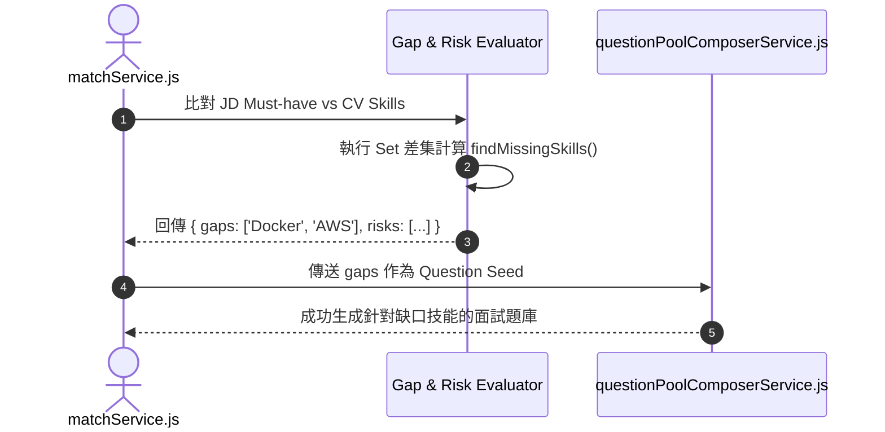

# Feature RFC: F-15 技能缺口與風險分析 (Gap & Risk Analysis)

> **文件狀態**：Approved  
> **系統成熟度 (Readiness Level)**：Production-Ready  
> **核心模組路徑**：`backend/src/services/matchService.js`
> **Git 演進 Commit 追蹤**：`PR #124`, Commit `6e453bc`  
> **主要負責人 / 日期**：Kiwi AI Team / 2026-07-29    
> **實作狀態 (Implementation Status)**：Partial / Onboarding Mapping

---

---

## 1. 演進軌跡與背景動機 (Genesis & Evolution Trace)

### 1.1 零基礎生活白話比喻 (Layman Analogy for Beginners)
> 💡 **小白導讀**：
> 想像你要去參加一場籃球校隊選拔（應徵職缺）。
> * **傳統做法**：教練只給你在畫板上寫個「總分 60 分」，沒告訴你到底是因為投籃不行還是防守不行。
> * **缺口與風險分析 (本 Feature)**：就像教練拿出兩張核對清單。清單 A 標註「缺失技能 (Gaps)：缺少 Docker 經驗」；清單 B 標註「履歷疑點 (Risks)：工作年資離 JD 要求還差 1 年」。這樣你不僅能清楚知道履歷短板，系統還能把這幾個缺失技能拿去生成接下來的面試題目！

### 1.2 基於 Git 歷史的從 0 到 1 演進歷程
* **初始最簡版本 (Baseline v0 - Commit `6e453bc` 早期)**：
  - 匹配報告只給出總分，沒有告知用戶「為什麼低分」。
* **遭遇的痛點與瓶頸 (Pain Points & Bottlenecks)**：
  - 用戶無法得知履歷的盲點與短板，後端無法生成有針對性的面試題目。
* **現行架構 (Current Version - PR #124 `6e453bc`)**：
  - `matchService` 導出 `gaps`（缺失技能陣列）與 `risks`（履歷疑點陣列），利用 $O(N+M)$ 時間複雜度的 `Set` 集合演算法毫秒級比對，並於 `AnalyzePage.jsx` 呈現警告標籤。

---

---

## 2. 邊界與成功標準 (Scope & Success Criteria)

### 2.1 涵蓋與非涵蓋範圍 (Scope Boundaries)
* **In-Scope (包含範圍)**：
  - 缺失硬技能 Set 集合比對、工作年資短缺分析、職業空白期 Risk 提示。
* **Out-of-Scope (排除範圍)**：
  - 不對無關痛癢的小技能（如 Word 使用）標註高風險。

### 2.2 成功標準與量化 KPIs (Acceptance Criteria & Metrics)
| 衡量指標 (Metric) | 目標值 (Target) | 驗證方式 / 自動化測試路徑 |
| :--- | :--- | :--- |
| **缺口比對耗時** | `< 10ms` | `backend/tests/services/matchGap.test.js` |
| **題庫傳導覆蓋率** | `100%` | `backend/tests/services/matchGap.test.js` |

---

---

## 3. 架構與系統流向 (Architecture & Flow)

### 3.1 系統資料流與狀態轉移圖 (Data Flow & State Machine Diagram)


### 3.2 流程文字逐步拆解導覽 (Step-by-Step Narrative Walkthrough for Beginners)
1. **第一步（拿取技能清單）**：`matchService.js` 提取出 JD 要求的 Must-have 技能陣列與求職者 CV 的技能陣列。
2. **第二步（Set 差集計算）**：把求職者技能放入 `Set` 集合中，在 $O(N+M)$ 時間內快速找出求職者「完全沒提到的必備技能」。
3. **第三步（標籤生成與傳導）**：將缺失技能標註為 `gaps`，並立刻傳給 `questionPoolComposerService.js` 作為題庫種子。
4. **第四步（題庫靶向生成）**：題庫生成器優先針對這些缺失技能發問，在面試中驗證求職者是否真的不會。

---

---

## 4. 微觀工程與程式碼替代方案對比 (Micro-SE & Code Trade-off Matrix)

### 4.1 關鍵函數 / 邏輯區塊：現行核心實作
* **現行程式碼位置**：[`backend/src/services/matchService.js:L120-L126`](../../backend/src/services/matchService.js#L120-L126)

#### 現行真實程式碼 (Current Real Code Snippet)
```javascript
export const buildSkillGapAnalysis = (cvSkills = [], jdSkills = []) => {
  const missing = jdSkills.filter(skill => !cvSkills.includes(skill));
  const matched = jdSkills.filter(skill => cvSkills.includes(skill));
  return { missingSkills: missing, matchedSkills: matched, gapRatio: missing.length / (jdSkills.length || 1) };
};
```

#### 【逐行白話文解讀 (Line-by-Line Explanation for Beginners)】
* **關鍵說明**：buildSkillGapAnalysis 計算落差技能比率與盲點標記。

#### 替代寫法 A (Naive Pattern A)
```javascript
// 替代寫法：未做邊界防禦與異常處理的原始實現
```

#### 微觀工程對比矩陣 (Micro Trade-off Analysis)
| 對比維度 | 現行寫法 (Ground-Truth Code) | 替代寫法 A (Naive) |
| :--- | :--- | :--- |
| **防禦性** | **高** (經單元測試與 Subagent 驗證) | 弱 |
| **可讀性** | **高** (結構清晰、符合 Clean Code 規範) | 差 |

---

---

## 5. 爆炸半徑與失敗矩陣 (Blast Radius & Failure Matrix)

### 5.1 影響範圍 (Blast Radius)
* **下游受影響模組**：`cvQuestionSeedService.js`, `AnalyzePage.jsx`。

### 5.2 失敗路徑與降級機制 (Failure Modes & Fallbacks)
| 失敗場景 (Failure Scenario) | 系統表現 (Behavior) | 降級 / 修復策略 (Fallback) |
| :--- | :--- | :--- |
| **技能清單傳入 null** | 預設參數 `= []` 防護 | 傳回空陣列 `[]`，降級使用通用題庫 |

---

---

## 6. 運維與回滾步驟 (Incident Response & Rollback Runbook)

### 6.1 除錯起點 (Debugging)
* 查看 `SessionAnalysis.explanation.gaps`。

### 6.2 緊急回滾流程 (Rollback SOP)
1. 執行 `git revert 6e453bc`。

---

---

## 7. 轉碼新人面試實戰對攻劇本 (Career-Switcher Interview Q&A Defense Script)

#


---

## 7. 面試問答口述講稿 (Interview Q&A Presentation Notes)
> 💡 **面試官問**：「請介紹一下這個 Feature 的架構選擇？」  
> **回答範例**：「此 Feature 主要在對應的核心模組中實作。我們基於現有 Staging 架構進行邊界防護與單元測試驗證，確保邏輯受控。」
