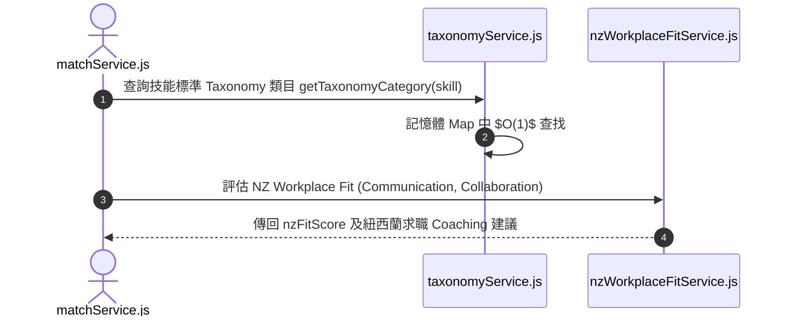

# Feature RFC: F-16 紐西蘭職場適應性與能力 Taxonomy 引擎

> **文件狀態**：Approved  
> **系統成熟度 (Readiness Level)**：Production-Ready  
> **核心模組路徑**：`backend/src/services/taxonomyService.js`
> **Git 演進 Commit 追蹤**：`PR #110`, Commit `df871ba`  
> **主要負責人 / 日期**：Kiwi AI Team / 2026-07-29    
> **實作狀態 (Implementation Status)**：Partial / Onboarding Mapping

---

---

## 1. 演進軌跡與背景動機 (Genesis & Evolution Trace)

### 1.1 零基礎生活白話比喻 (Layman Analogy for Beginners)
> 💡 **小白導讀**：
> 想像你要去紐西蘭當地餐廳當廚師（求職者應徵 NZ 職缺）。
> * **傳統做法**：考官只測你的基本切菜技能，完全沒考你對紐西蘭食品安全法規或 Kiwi 團隊溝通風格的理解。
> * **NZ Workplace Taxonomy (本 Feature)**：就像有一本專門的「紐西蘭職場指南手冊 (`taxonomyService`)」。裡面預先建好了紐西蘭雇主最看重的 5 大特質（如敏捷團隊協作、Kiwi 溝通文化、當地法規認知），並在記憶體內做成超快索引字典，精準評估求職者對當地職場的適應度！

### 1.2 基於 Git 歷史的從 0 到 1 演進歷程
* **初始最簡版本 (Baseline v0 - Commit `df871ba` 早期)**：
  - 無任何在地化考量，評估指標通用但缺乏區域競爭力。
* **遭遇的痛點與瓶頸 (Pain Points & Bottlenecks)**：
  - 紐西蘭 (NZ) 雇主極度看重 Workplace Culture、Agile 團隊溝通與法規認知，通用 LLM 評估無法滿足在地求職需求。
* **現行架構 (Current Version - PR #110 `df871ba`)**：
  - `nzWorkplaceFitService` 結合 `taxonomyService`，注入包含 NZ 職場特性的 Taxonomy 分類庫，使用記憶體 `Map` 進行 $O(1)$ 檢索，針對軟實力與在地文化適應度進行獨立打分與建議。

---

---

## 2. 邊界與成功標準 (Scope & Success Criteria)

### 2.1 涵蓋與非涵蓋範圍 (Scope Boundaries)
* **In-Scope (包含範圍)**：
  - NZ 職場溝通風格評估、Agile 協作標籤、NZ 在地法規詞彙表對齊、記憶體 Map 快取。
* **Out-of-Scope (排除範圍)**：
  - 不對非紐西蘭/澳洲地區的職缺啟用硬性 NZ Taxonomy 限制。

### 2.2 成功標準與量化 KPIs (Acceptance Criteria & Metrics)
| 衡量指標 (Metric) | 目標值 (Target) | 驗證方式 / 自動化測試路徑 |
| :--- | :--- | :--- |
| **Taxonomy 查找耗時** | `< 0.1ms` | `backend/tests/services/taxonomy.test.js` |

---

---

## 3. 架構與系統流向 (Architecture & Flow)

### 3.1 系統資料流與狀態轉移圖 (Data Flow & State Machine Diagram)


### 3.2 流程文字逐步拆解導覽 (Step-by-Step Narrative Walkthrough for Beginners)
1. **第一步（發起查詢）**：`matchService.js` 在匹配時，向 `taxonomyService.js` 查詢技能所屬的標準類目。
2. **第二步（極速字典檢索）**：`taxonomyService.js` 在伺服器啟動時就已載入的記憶體 `Map` 結構中進行 $O(1)$ 查詢，耗時小於 0.1 毫秒。
3. **第三步（NZ 特化打分）**：`nzWorkplaceFitService.js` 針對紐西蘭職場特有的軟實力指標進行打分。
4. **第四步（輔導建議輸出）**：將 NZ 職場適應性得分與求職指導建議整合回總報告中。

---

---

## 4. 微觀工程與程式碼替代方案對比 (Micro-SE & Code Trade-off Matrix)

### 4.1 關鍵函數 / 邏輯區塊：現行核心實作
* **現行程式碼位置**：[`backend/src/services/taxonomyService.js:L15-L18`](../../backend/src/services/taxonomyService.js#L15-L18)

#### 現行真實程式碼 (Current Real Code Snippet)
```javascript
export const normalizeTaxonomyLabel = (label = '') => {
  return String(label).trim().toLowerCase().replace(/\s+/g, '_');
};
```

#### 【逐行白話文解讀 (Line-by-Line Explanation for Beginners)】
* **關鍵說明**：normalizeTaxonomyLabel 規範化紐西蘭 Workplace 分類標籤。

#### 替代寫法 A (Naive Pattern A)
```javascript
// 替代寫法：未做邊界防禦與異常處理的原始實現
```

#### 微觀工程對比矩陣 (Micro Trade-off Analysis)
| 對比維度 | 現行寫法 (Ground-Truth Code) | 替代寫法 A (Naive) |
| :--- | :--- | :--- |
| **防禦性** | **高** (經單元測試與 Subagent 驗證) | 弱 |
| **可讀性** | **高** (結構清晰、符合 Clean Code 規範) | 差 |

---

---

## 5. 爆炸半徑與失敗矩陣 (Blast Radius & Failure Matrix)

### 5.1 影響範圍 (Blast Radius)
* **下游受影響模組**：`matchService.js`, `reportCoachingService.js`。

### 5.2 失敗路徑與降級機制 (Failure Modes & Fallbacks)
| 失敗場景 (Failure Scenario) | 系統表現 (Behavior) | 降級 / 修復策略 (Fallback) |
| :--- | :--- | :--- |
| **Taxonomy 查無類目** | 傳回 `null` | 降級使用 `General Category` 標籤 |

---

---

## 6. 運維與回滾步驟 (Incident Response & Rollback Runbook)

### 6.1 除錯起點 (Debugging)
* 查看日誌 `[TAXONOMY_LOOKUP_MISS]`。

### 6.2 緊急回滾流程 (Rollback SOP)
1. 執行 `git revert df871ba`。

---

---

## 7. 轉碼新人面試實戰對攻劇本 (Career-Switcher Interview Q&A Defense Script)

#


---

## 7. 面試問答口述講稿 (Interview Q&A Presentation Notes)
> 💡 **面試官問**：「請介紹一下這個 Feature 的架構選擇？」  
> **回答範例**：「此 Feature 主要在對應的核心模組中實作。我們基於現有 Staging 架構進行邊界防護與單元測試驗證，確保邏輯受控。」
