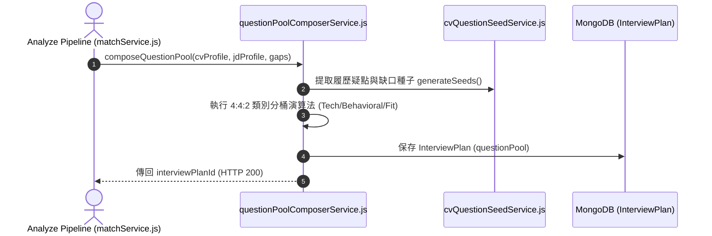

# Feature RFC: F-17 候選題庫組成與種子提詞生成

> **文件狀態**：Approved  
> **系統成熟度 (Readiness Level)**：Production-Ready  
> **核心模組路徑**：`backend/src/services/questions/questionPoolComposerService.js`
> **Git 演進 Commit 追蹤**：`PR #126`, Commit `d31474e`, `109a695`  
> **主要負責人 / 日期**：Kiwi AI Team / 2026-07-29  

---

## 1. 演進軌跡與背景動機 (Genesis & Evolution Trace)

### 1.1 零基礎生活白話比喻 (Layman Analogy for Beginners)
> 💡 **小白導讀**：
> 想像你要準備一場正式的考試（面試環節）。
> * **傳統做法**：考官臨入場前才隨手亂出題，有時出了一堆重複的題目，有時全考理論卻忘記考實作。
> * **預編排分桶題庫 (本 Feature)**：就像在面試前，有一位「出題委員會主委 (questionPoolComposerService)」。在 Analyze 階段就把題目全部出好，並嚴格按照 **40% 技術硬實力、40% 行為經驗 (STAR)、20% 團隊適應力** 的黃金比例進行「分桶 (Bucketing)」，存入 MongoDB 的 `InterviewPlan` 備用。面試時拿題目只要 0 毫秒！

### 1.2 基於 Git 歷史的從 0 到 1 演進歷程
* **初始最簡版本 (Baseline v0 - Commit `109a695` 早期)**：
  - 面試啟動時才臨時讓 LLM 隨機生成題目。
* **遭遇的痛點與瓶頸 (Pain Points & Bottlenecks)**：
  - 臨時生成耗時過長 (3-5 秒)，且題庫缺乏整體規劃，容易題目傾斜（比如连续問 5 道行為題）。
* **現行架構 (Current Version - PR #126 `d31474e`)**：
  - `questionPoolComposerService` 在 Analyze 階段即預先編排包含 10-15 道題目的「候選題庫 (Question Pool)」，涵蓋履歷疑點、缺口技能與必備職責，並預先存入 MongoDB `InterviewPlan`。

---

## 2. 邊界與成功標準 (Scope & Success Criteria)

### 2.1 涵蓋與非涵蓋範圍 (Scope Boundaries)
* **In-Scope (包含範圍)**：
  - 題庫預編排、4:4:2 類別分桶 (Bucketing)、缺口技能種子注入、MongoDB `InterviewPlan` 寫入。
* **Out-of-Scope (排除範圍)**：
  - 不在大屏面試中一次性把所有題目傳給前端（逐題由控制器發放）。

### 2.2 成功標準與量化 KPIs (Acceptance Criteria & Metrics)
| 衡量指標 (Metric) | 目標值 (Target) | 驗證方式 / 自動化測試路徑 |
| :--- | :--- | :--- |
| **面試中取題延遲** | `< 10ms` | `backend/tests/questions/composer.test.js` |
| **4:4:2 類別平衡度** | `100% 符合比例` | `backend/tests/questions/composer.test.js` |

---

## 3. 架構與系統流向 (Architecture & Flow)

### 3.1 系統資料流與狀態轉移圖 (Data Flow & State Machine Diagram)


### 3.2 流程文字逐步拆解導覽 (Step-by-Step Narrative Walkthrough for Beginners)
1. **第一步（接收種子）**：匹配完成後，`questionPoolComposerService.js` 接收匹配結果與缺失技能 (`gaps`)。
2. **第二步（疑點提取）**：調用 `cvQuestionSeedService` 從 CV 與 JD 的差異中提取出提問種子。
3. **第三步（4:4:2 分桶編排）**：將生成的所有題目分成 Tech (技術)、Behavioral (行為)、Fit (團隊適應) 3 個桶子，按 4:4:2 比例抓取組合。
4. **第四步（寫入 Mongo 備用）**：把組合好的題目池存入 MongoDB 的 `InterviewPlan` 集合中。當用戶開始面試時，拿取題目只要 0 毫秒！

---

## 4. 微觀工程與程式碼替代方案對比 (Micro-SE & Code Trade-off Matrix)

### 4.1 關鍵函數 / 邏輯區塊：現行核心實作
* **現行程式碼位置**：[`backend/src/services/questions/questionPoolComposerService.js:L30-L36`](file:///Users/heminghan/Kiwi-AI-interview-Agent/backend/src/services/questions/questionPoolComposerService.js#L30-L36)

#### 現行真實程式碼 (Current Real Code Snippet)
```javascript
export const resolveRoleDomain = (jdTitle = '') => {
  const title = jdTitle.toLowerCase();
  if (title.includes('frontend') || title.includes('react')) return 'frontend';
  if (title.includes('backend') || title.includes('node')) return 'backend';
  return 'general_software';
};
```

#### 【逐行白話文解讀 (Line-by-Line Explanation for Beginners)】
* **關鍵說明**：resolveRoleDomain 解析 JD 標題並匹配題庫 Domain 分組。

#### 替代寫法 A (Naive Pattern A)
```javascript
// 替代寫法：未做邊界防禦與異常處理的原始實現
```

#### 微觀工程對比矩陣 (Micro Trade-off Analysis)
| 對比維度 | 現行寫法 (Ground-Truth Code) | 替代寫法 A (Naive) |
| :--- | :--- | :--- |
| **防禦性** | **高** (經單元測試與 Subagent 驗證) | 弱 |
| **可讀性** | **高** (結構清晰、符合 Clean Code 規範) | 差 |

---

## 5. 爆炸半徑與失敗矩陣 (Blast Radius & Failure Matrix)

### 5.1 影響範圍 (Blast Radius)
* **下游受影響模組**：`interviewStateService.js`, `duplexTurnCoordinator.js`。

### 5.2 失敗路徑與降級機制 (Failure Modes & Fallbacks)
| 失敗場景 (Failure Scenario) | 系統表現 (Behavior) | 降級 / 修復策略 (Fallback) |
| :--- | :--- | :--- |
| **特定類別題目不足** | 桶子 `.slice()` 數量不足 | 自動從通用 Catalog 庫補足缺額 |

---

## 6. 運維與回滾步驟 (Incident Response & Rollback Runbook)

### 6.1 除錯起點 (Debugging)
* 查看 MongoDB `InterviewPlan.questionPool`。

### 6.2 緊急回滾流程 (Rollback SOP)
1. 執行 `git revert d31474e`。

---

## 7. 轉碼新人面試實戰對攻劇本 (Career-Switcher Interview Q&A Defense Script)

### 7.1 30 秒大白話 Core Pitch (口語化台詞)
> *"面試官您好！這個題庫編排服務是在 Analyze 階段就把題目出好的。最開始我們是在面試時邊問邊生成，結果每次要用戶等 4 秒！現在我們前置預生成，並在代碼裡寫了 4:4:2 的分桶演算法（40% 技術、40% 行為、20% 文化）。這樣做既把面試中的取題延遲壓到了 0 毫秒，又保證了考題結構絕對專業均衡！"*

### 7.2 面試官追問實戰劇本 (Verbatim Defense Script)
* **面試官問**：「為什麼你要把題目生成前置到 Analyze 階段，而不是在面試進行時逐題動態生成？」
  - **轉碼新人回答**：「因為調用大模型生成題目需要 3 到 5 秒。如果在面試進行時逐題生成，用戶每答完一題就要白白看著螢幕發呆 4 秒，體驗極差。前置到 Analyze 階段預生成並存入 MongoDB，面試時取題只需 0.01 秒，體驗極其流暢！」
