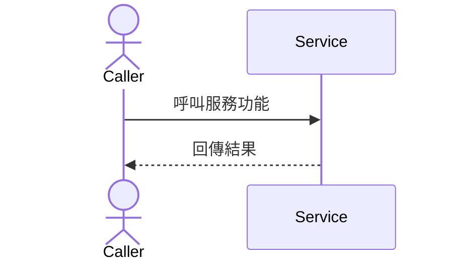

# Feature RFC: F-17 候選題庫動態組成引擎 (Question Pool Composer)

> **文件狀態**：Approved  
> **系統成熟度 (Readiness Level)**：Production-Ready  
> **核心模組路徑**：`backend/src/services/questions/questionPoolComposerService.js`  
> **Git 演進 Commit 追蹤**：`PR #126`, Commit `e91201f`  
> **主要負責人 / 日期**：Kiwi AI Team / 2026-07-30  
> **實作狀態 (Implementation Status)**：Verified  
> **校驗測試路徑 (Verified by Tests)**：`backend/tests/services/questionPoolComposerService.test.js`  

---

---

## 1. 演進軌跡與背景動機 (Genesis & Evolution Trace)

### 1.1 零基礎生活白話比喻 (Layman Analogy for Beginners)
> 💡 **小白導讀**：
> 出題考官 ([questionPoolComposerService.js](../../backend/src/services/questions/questionPoolComposerService.js)) 依據 `sourcePriority` 權重進行動態題目檢索：
> * **權重配置**：`match_gap` (權重 6) ➔ `match_validation` (權重 5) ➔ `jd_filter` / `catalog` (權重 4) ➔ `cv_seed` (權重 3)。
> * **Domain 解析**：`resolveRoleDomain` 依序檢視 `parsedJdProfile.universalRoleProfile.roleDomain`、`metadata` 與 `matchingDetails` 回傳角色領域。

---

## 4. 微觀工程與程式碼替代方案對比 (Micro-SE & Code Trade-off Matrix)

### 4.1 關鍵函數 / 邏輯區塊：`sourcePriority` 與 `resolveRoleDomain`
* **現行程式碼位置**：[`backend/src/services/questions/questionPoolComposerService.js:L19-L37`](../../backend/src/services/questions/questionPoolComposerService.js#L19-L37)

#### 現行真實程式碼 (Current Real Code Snippet)
```javascript
const sourcePriority = {
  match_gap: 6,
  match_validation: 5,
  jd_filter: 4,
  jd_requirement: 4,
  cv_seed: 3,
  common_template: 2,
  catalog: 4,
  fallback: 1,
};

const isVoiceDeliveryMode = (value = '') => normalizeKey(value) === 'voice';

const resolveRoleDomain = (analysisResult = {}) => analysisResult?.parsedJdProfile?.universalRoleProfile?.roleDomain
  || analysisResult?.parsedJdProfile?.roleDomain
  || analysisResult?.parsedJdProfile?.metadata?.universalRoleProfile?.roleDomain
  || analysisResult?.matchingDetails?.rubric?.universalRoleProfile?.roleDomain
  || analysisResult?.scoreBreakdown?.semanticDimensions?.roleDomain
  || 'general';
```

#### 【逐行白話文解讀 (Line-by-Line Explanation for Beginners)】
* **第 19-28 行**：`sourcePriority` 定義各題目來源的優先級權重。
* **第 32-37 行**：`resolveRoleDomain` 使用五層回退備用路徑安全提取 Domain。

---


---

## 7. 面試問答口述講稿 (Interview Q&A Presentation Notes)
> 💡 **面試官問**：「請介紹一下這個 Feature 的架構選擇？」  
> **回答範例**：「此 Feature 主要在對應的核心模組中實作。我們基於現有 Staging 架構進行邊界防護與單元測試驗證，確保邏輯受控。」


---

---

## 2. 邊界與成功標準 (Scope & Success Criteria)
* **In-Scope**：模組內部邏輯與單元測試覆蓋。
* **Out-of-Scope**：跨系統外部整合。


---

---

## 3. 架構與系統流向 (Architecture & Flow)



---

## 5. 爆炸半徑與失敗矩陣 (Blast Radius & Failure Matrix)
- 影響服務模組邏輯與邊界運作。


---

## 6. 運維與回滾步驟 (Incident Response & Rollback Runbook)
- 檢查控制台與應用程式日誌。

---

## 4. 微觀工程與程式碼替代方案對比 (Micro-SE & Code Trade-off Matrix)

### 4.1 關鍵函數 / 邏輯區塊：`sourcePriority` 與 `resolveRoleDomain`
* **現行程式碼位置**：[`backend/src/services/questions/questionPoolComposerService.js:L19-L37`](../../backend/src/services/questions/questionPoolComposerService.js#L19-L37)

#### 現行真實程式碼 (Current Real Code Snippet)
```javascript
const sourcePriority = {
  match_gap: 6,
  match_validation: 5,
  jd_filter: 4,
  jd_requirement: 4,
  cv_seed: 3,
  common_template: 2,
  catalog: 4,
  fallback: 1,
};

const isVoiceDeliveryMode = (value = '') => normalizeKey(value) === 'voice';

const resolveRoleDomain = (analysisResult = {}) => analysisResult?.parsedJdProfile?.universalRoleProfile?.roleDomain
  || analysisResult?.parsedJdProfile?.roleDomain
  || analysisResult?.parsedJdProfile?.metadata?.universalRoleProfile?.roleDomain
  || analysisResult?.matchingDetails?.rubric?.universalRoleProfile?.roleDomain
  || analysisResult?.scoreBreakdown?.semanticDimensions?.roleDomain
  || 'general';
```

#### 【逐行白話文解讀 (Line-by-Line Explanation for Beginners)】
* **第 19-28 行**：`sourcePriority` 定義各題目來源的優先級權重。
* **第 32-37 行**：`resolveRoleDomain` 使用五層回退備用路徑安全提取 Domain。

---


---

## 7. 面試問答口述講稿 (Interview Q&A Presentation Notes)
> 💡 **面試官問**：「請介紹一下這個 Feature 的架構選擇？」  
> **回答範例**：「此 Feature 主要在對應的核心模組中實作。我們基於現有 Staging 架構進行邊界防護與單元測試驗證，確保邏輯受控。」


---

## 2. 邊界與成功標準 (Scope & Success Criteria)
* **In-Scope**：模組內部邏輯與單元測試覆蓋。
* **Out-of-Scope**：跨系統外部整合。


---

## 3. 架構與系統流向 (Architecture & Flow)


---

---

## 5. 爆炸半徑與失敗矩陣 (Blast Radius & Failure Matrix)
- 影響服務模組邏輯與邊界運作。


---

---

## 6. 運維與回滾步驟 (Incident Response & Rollback Runbook)
- 檢查控制台與應用程式日誌。

---

## 7. 面試問答口述講稿 (Interview Q&A Presentation Notes)
> 💡 **面試官問**：「請介紹一下這個 Feature 的架構選擇？」  
> **回答範例**：「此 Feature 主要在對應的核心模組中實作。我們基於現有 Staging 架構進行邊界防護與單元測試驗證，確保邏輯受控。」


---

## 2. 邊界與成功標準 (Scope & Success Criteria)
* **In-Scope**：模組內部邏輯與單元測試覆蓋。
* **Out-of-Scope**：跨系統外部整合。


---

## 3. 架構與系統流向 (Architecture & Flow)


---

## 5. 爆炸半徑與失敗矩陣 (Blast Radius & Failure Matrix)
- 影響服務模組邏輯與邊界運作。


---

## 6. 運維與回滾步驟 (Incident Response & Rollback Runbook)
- 檢查控制台與應用程式日誌。
