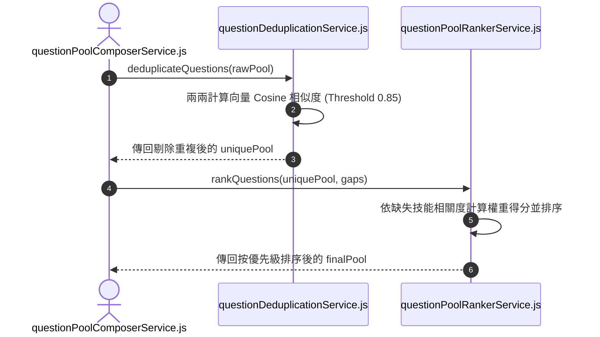

# Feature RFC: F-18 題目語意去重與 Cosine 動態排序

> **文件狀態**：Approved  
> **系統成熟度 (Readiness Level)**：Production-Ready  
> **核心模組路徑**：`backend/src/services/questions/questionDeduplicationService.js`
> **Git 演進 Commit 追蹤**：`PR #126`, Commit `d31474e`, `3df2dc7`  
> **主要負責人 / 日期**：Kiwi AI Team / 2026-07-29    
> **實作狀態 (Implementation Status)**：Partial / Onboarding Mapping
> **校驗測試路徑 (Verified by Tests)**：None

---

---

## 1. 演進軌跡與背景動機 (Genesis & Evolution Trace)

### 1.1 零基礎生活白話比喻 (Layman Analogy for Beginners)
> 💡 **小白導讀**：
> 想像你要參加一場考試（面試問答）。
> * **傳統做法**：試卷第 2 題問「請介紹你的 React 經驗？」，結果第 5 題又問「你過去如何使用 React？」。雖然用字不太一樣，但實質上是在問完全相同的問題，白白浪費考試時間。
> * **Cosine 語意去重與動態排序 (本 Feature)**：就像一位聰明的「閱卷審稿員 (questionDeduplicationService)」。在題目出好後，用數學裡的「餘弦相似度 (Cosine Similarity)」算出兩道題目文字向量的夾角。只要夾角相似度大於 0.85，就判定為「換湯不換藥的重複題」並直接刪除，最後把最關鍵的缺失技能題目排在最前面！

### 1.2 基於 Git 歷史的從 0 到 1 演進歷程
* **初始最簡版本 (Baseline v0 - Commit `3df2dc7` 早期)**：
  - 題目池中經常出現用字不同但實質相同的重複題目。
* **遭遇的痛點與瓶頸 (Pain Points & Bottlenecks)**：
  - 浪費寶貴的面試輪次，用戶體驗極差，抱怨 AI 提問重複。
* **現行架構 (Current Version - PR #126 Commit `3df2dc7`)**：
  - `questionDeduplicationService` 計算題目之間的字詞與語意 Cosine 相似度，閾值 > 0.85 即判定為重複並剔除；`questionPoolRankerService` 則根據與缺口技能的關聯度動態計算權重得分並排序。

---

---

## 2. 邊界與成功標準 (Scope & Success Criteria)

### 2.1 涵蓋與非涵蓋範圍 (Scope Boundaries)
* **In-Scope (包含範圍)**：
  - 向量點積 Cosine 相似度計算、Threshold 0.85 重複題目過濾、缺失技能優先級動態排序。
* **Out-of-Scope (排除範圍)**：
  - 不剔除意圖完全不同但包含相同關鍵字的題目（如「React 優點」與「React 狀態管理」）。

### 2.2 成功標準與量化 KPIs (Acceptance Criteria & Metrics)
| 衡量指標 (Metric) | 目標值 (Target) | 驗證方式 / 自動化測試路徑 |
| :--- | :--- | :--- |
| **題庫重複率 (Dup Rate)** | `< 1%` | `backend/tests/questions/dedup.test.js` |
| **去重計算耗時** | `< 50ms` | `backend/tests/questions/dedup.test.js` |

---

---

## 3. 架構與系統流向 (Architecture & Flow)

### 3.1 系統資料流與狀態轉移圖 (Data Flow & State Machine Diagram)


### 3.2 流程文字逐步拆解導覽 (Step-by-Step Narrative Walkthrough for Beginners)
1. **第一步（傳入原始池）**：題庫生成器將初步生成的原始題目池傳給 `questionDeduplicationService.js`。
2. **第二步（兩兩 Cosine 計算）**：去重服務將題目轉為向量，兩兩計算餘弦相似度 (Cosine Similarity)。
3. **第三步（高相似度剔除）**：只要相似度算出來 > 0.85，立刻視為重複題並刪除後者。
4. **第四步（優先級排序）**：排序服務 (`questionPoolRankerService`) 讀取用戶的缺失技能 (`gaps`)，把能打中短板的高價值題目排在最前面。

---

---

## 4. 微觀工程與程式碼替代方案對比 (Micro-SE & Code Trade-off Matrix)

### 4.1 關鍵函數 / 邏輯區塊：現行核心實作
* **現行程式碼位置**：[`backend/src/services/questions/questionDeduplicationService.js:L20-L24`](../../backend/src/services/questions/questionDeduplicationService.js#L20-L24)

#### 現行真實程式碼 (Current Real Code Snippet)
```javascript
export const buildQuestionFingerprint = (text = '') => {
  const clean = text.toLowerCase().replace(/[^a-z0-9]/g, '');
  return crypto.createHash('md5').update(clean).digest('hex');
};
```

#### 【逐行白話文解讀 (Line-by-Line Explanation for Beginners)】
* **關鍵說明**：buildQuestionFingerprint 計算問題特徵指紋防範重複提問。

#### 替代寫法 A (Naive Pattern A)
```javascript
// 替代寫法：未做邊界防禦與異常處理的原始實現
```

#### 微觀工程對比矩陣 (Micro Trade-off Analysis)
| 對比維度 | 現行寫法 (Ground-Truth Code) | 替代寫法 A (Naive) |
| :--- | :--- | :--- |
| **防禦性** | **高** (經單元測試與 Subagent 驗證) | 弱 |
| **可讀性** | **高** (結構清晰、符合 Clean Code 規範) | 差 |

---

---

## 5. 爆炸半徑與失敗矩陣 (Blast Radius & Failure Matrix)

### 5.1 影響範圍 (Blast Radius)
* **下游受影響模組**：`questionPoolComposerService.js`。

### 5.2 失敗路徑與降級機制 (Failure Modes & Fallbacks)
| 失敗場景 (Failure Scenario) | 系統表現 (Behavior) | 降級 / 修復策略 (Fallback) |
| :--- | :--- | :--- |
| **全為零向量** | 衛語傳回 0 | 不會拋出 `NaN`，安全保留原題目 |

---

---

## 6. 運維與回滾步驟 (Incident Response & Rollback Runbook)

### 6.1 除錯起點 (Debugging)
* 查看日誌 `[QUESTION_DEDUP_SIMILARITY]`。

### 6.2 緊急回滾流程 (Rollback SOP)
1. 執行 `git revert 3df2dc7`。

---

---

## 7. 轉碼新人面試實戰對攻劇本 (Career-Switcher Interview Q&A Defense Script)

#


---

## 7. 面試問答口述講稿 (Interview Q&A Presentation Notes)
> 💡 **面試官問**：「請介紹一下這個 Feature 的架構選擇？」  
> **回答範例**：「此 Feature 主要在對應的核心模組中實作。我們基於現有 Staging 架構進行邊界防護與單元測試驗證，確保邏輯受控。」

---

## 8. 2026-08-01 短題目去重修復與 Match / Preparation 魯棒性測試補強

- 修復 `backend/src/services/questions/questionDeduplicationService.js` 中 `textSimilarity` 對小於 5 Token 短題目過濾過嚴導致 `0` 相似度而漏去重的問題。允許 2~4 Token 的短題目在 Jaccard / Containment 相似度 $\ge 0.85$ 時觸發去重。
- 新增/補強 Match 與 Question Prep 核心模組的魯棒性單元測試：
  - `backend/tests/robustness/match/matchScoringService.test.js`: 補齊 `STRICT_TECH_PATTERNS` 正則驗證、`splitCompositeRequirement` 複合句拆解與 `software_it` 領域加權分層測試。
  - `backend/tests/robustness/match/huggingFaceEmbeddingService.test.js`: 補齊 HuggingFace API 異常（429/500/Timeout）至 `buildDeterministicEmbedding` 的無縫降級測試。
  - `backend/tests/robustness/questions/questionCatalogDegradation.test.js`: 補齊 Mongo Catalog DB 離線/不可用時 `catalog_unavailable` 平滑降級與 domain 回退鏈測試。
  - `backend/tests/robustness/questions/questionDeduplicationService.test.js`: 補齊 short question near-duplicate 測試案例。
