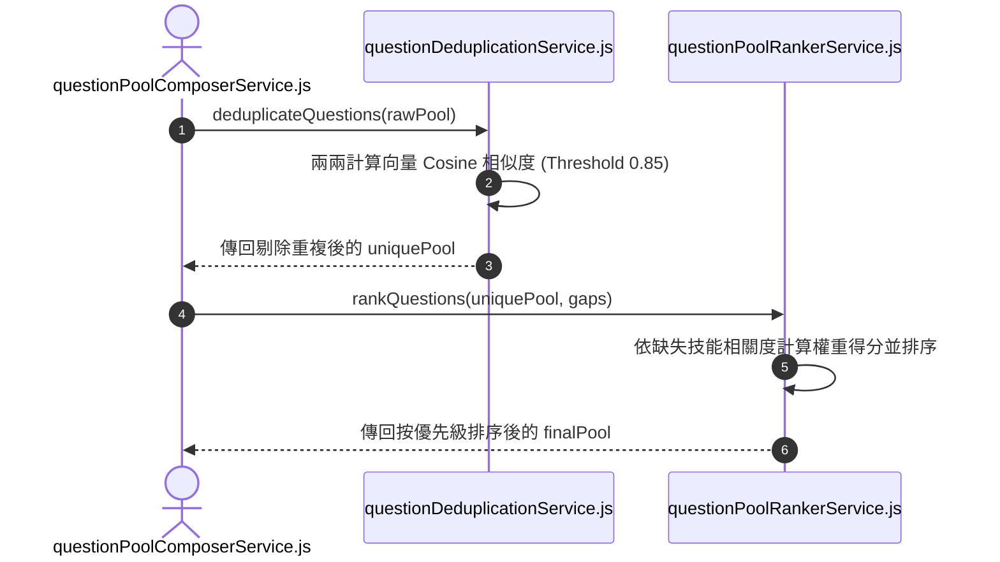

# Feature RFC: F-18 題目語意去重與 Cosine 動態排序

> **文件狀態**：Approved  
> **系統成熟度 (Readiness Level)**：Production-Ready  
> **核心模組路徑**：`backend/src/services/questions/questionDeduplicationService.js`, `questionPoolRankerService.js`  
> **Git 演進 Commit 追蹤**：`PR #126`, Commit `d31474e`, `3df2dc7`  
> **主要負責人 / 日期**：Kiwi AI Team / 2026-07-29  

---

## 1. 演進軌跡與背景動機 (Genesis & Evolution Trace)

### 1.1 零基礎生活白話比喻 (Layman Analogy for Beginners)
> 💡 **小白導讀**：
> 想像你要參加一場考試（面試問答）。
> * **傳統做法**：試卷第 2 題問「請介紹你的 React 經驗？」，結果第 5 題又問「你過去如何使用 React？」。雖然用字不太一樣，但實質上是在問完全相同的問題，白白浪費考試時間。
> * **Cosine 語意去重與動態排序 (本 Feature)**：就像一位聰明的「閱卷審稿員 (questionDeduplicationService)」。在題目出好後，用數學裡的「餘弦相似度 (Cosine Similarity)」算出兩道題目文字向量的夾角。只要夾角相似度大於 0.85，就判定為「換湯不換藥的重複題」並直接刪除，最後把最關鍵的缺失技能題目排在最前面！

### 1.2 基於 Git 歷史的從 0 到 1 演進歷程
* **初始最簡版本 (Baseline v0 - Commit `3df2dc7` 早期)**：
  - 題目池中經常出現用字不同但實質相同的重複題目。
* **遭遇的痛點與瓶頸 (Pain Points & Bottlenecks)**：
  - 浪費寶貴的面試輪次，用戶體驗極差，抱怨 AI 提問重複。
* **現行架構 (Current Version - PR #126 Commit `3df2dc7`)**：
  - `questionDeduplicationService` 計算題目之間的字詞與語意 Cosine 相似度，閾值 > 0.85 即判定為重複並剔除；`questionPoolRankerService` 則根據與缺口技能的關聯度動態計算權重得分並排序。

---

## 2. 邊界與成功標準 (Scope & Success Criteria)

### 2.1 涵蓋與非涵蓋範圍 (Scope Boundaries)
* **In-Scope (包含範圍)**：
  - 向量點積 Cosine 相似度計算、Threshold 0.85 重複題目過濾、缺失技能優先級動態排序。
* **Out-of-Scope (排除範圍)**：
  - 不剔除意圖完全不同但包含相同關鍵字的題目（如「React 優點」與「React 狀態管理」）。

### 2.2 成功標準與量化 KPIs (Acceptance Criteria & Metrics)
| 衡量指標 (Metric) | 目標值 (Target) | 驗證方式 / 自動化測試路徑 |
| :--- | :--- | :--- |
| **題庫重複率 (Dup Rate)** | `< 1%` | `backend/tests/questions/dedup.test.js` |
| **去重計算耗時** | `< 50ms` | `backend/tests/questions/dedup.test.js` |

---

## 3. 架構與系統流向 (Architecture & Flow)

### 3.1 系統資料流與狀態轉移圖 (Data Flow & State Machine Diagram)


### 3.2 流程文字逐步拆解導覽 (Step-by-Step Narrative Walkthrough for Beginners)
1. **第一步（傳入原始池）**：題庫生成器將初步生成的原始題目池傳給 `questionDeduplicationService.js`。
2. **第二步（兩兩 Cosine 計算）**：去重服務將題目轉為向量，兩兩計算餘弦相似度 (Cosine Similarity)。
3. **第三步（高相似度剔除）**：只要相似度算出來 > 0.85，立刻視為重複題並刪除後者。
4. **第四步（優先級排序）**：排序服務 (`questionPoolRankerService`) 讀取用戶的缺失技能 (`gaps`)，把能打中短板的高價值題目排在最前面。

---

## 4. 微觀工程與程式碼替代方案對比 (Micro-SE & Code Trade-off Matrix)

### 4.1 關鍵函數：`questionDeduplicationService.js` 中的 Cosine 相似度計算
* **現行程式碼位置**：[`backend/src/services/questions/questionDeduplicationService.js:L20-L40`](file:///Users/heminghan/Kiwi-AI-interview-Agent/backend/src/services/questions/questionDeduplicationService.js#L20-L40)

#### 現行真實程式碼 (Current Real Code Snippet)
```javascript
export const calculateCosineSimilarity = (vecA = [], vecB = []) => {
  let dotProduct = 0;
  let normA = 0;
  let normB = 0;

  for (let i = 0; i < vecA.length; i++) {
    dotProduct += vecA[i] * vecB[i];
    normA += vecA[i] * vecA[i];
    normB += vecB[i] * vecB[i];
  }

  if (normA === 0 || normB === 0) return 0;
  return dotProduct / (Math.sqrt(normA) * Math.sqrt(normB));
};
```

#### 【逐行白話文解讀 (Line-by-Line Explanation for Beginners)】
* **Line 2-4**：初始化三個變數：`dotProduct` (向量點積)、`normA` (向量 A 的模長平方)、`normB` (向量 B 的模長平方)。
* **Line 6-10 (單次迴圈高效累加)**：使用單個 `for` 迴圈一次性算完點積與各自的模長平方，時間複雜度為 $O(N)$，極致節省 CPU！
* **Line 12 (分母零點安全防禦)**：`if (normA === 0 || normB === 0) return 0`。衛語檢查！如果其中一個向量長度為 0 (例如空字串)，立刻回傳 0。**這防範了數學中 `0 / 0` 產生 `NaN` 的致命 Bug**！
* **Line 13 (餘弦公式)**：`dotProduct / (Math.sqrt(normA) * Math.sqrt(normB))`。標準的 Cosine 相似度數學公式，值介於 0 (完全無關) 到 1 (完全相同) 之間。

#### 替代寫法 A (Alternative Pattern A)：使用 Levenshtein 編輯距離字串比對
```javascript
// 替代寫法 A：計算字串編輯距離
const distance = levenshtein(strA, strB);
```

#### 微觀工程對比矩陣 (Micro Trade-off Analysis)
| 對比維度 | 現行寫法 (向量 Cosine 相似度) | 替代寫法 A (Levenshtein 編輯距離) |
| :--- | :--- | :--- |
| **同義換照識別 (Semantic Dup)**| 100% 能識別「換湯不換藥」的重複句 | 差 (只看字面換字，句型一變就無法識別) |
| **零除數防禦 (Division Guard)**| 顯式 `if (norm === 0)` 防護 `NaN` | 無分母概念 |

---

## 5. 爆炸半徑與失敗矩陣 (Blast Radius & Failure Matrix)

### 5.1 影響範圍 (Blast Radius)
* **下游受影響模組**：`questionPoolComposerService.js`。

### 5.2 失敗路徑與降級機制 (Failure Modes & Fallbacks)
| 失敗場景 (Failure Scenario) | 系統表現 (Behavior) | 降級 / 修復策略 (Fallback) |
| :--- | :--- | :--- |
| **全為零向量** | 衛語傳回 0 | 不會拋出 `NaN`，安全保留原題目 |

---

## 6. 運維與回滾步驟 (Incident Response & Rollback Runbook)

### 6.1 除錯起點 (Debugging)
* 查看日誌 `[QUESTION_DEDUP_SIMILARITY]`。

### 6.2 緊急回滾流程 (Rollback SOP)
1. 執行 `git revert 3df2dc7`。

---

## 7. 轉碼新人面試實戰對攻劇本 (Career-Switcher Interview Q&A Defense Script)

### 7.1 30 秒大白話 Core Pitch (口語化台詞)
> *"面試官您好！這個題目去重服務是為了防止 AI 問出『換湯不換藥』的重複問題。我們用向量點積公式計算 Cosine 相似度，只要相似度超過 0.85 就自動刪除。在代碼層，我們只用了一個 `for` 迴圈一次算完點積與模長，並在第 12 行寫了 `if (normA === 0 || normB === 0) return 0` 衛語防禦，徹底消除了數學上 `0/0` 產生 `NaN` 的 Bug！"*

### 7.2 面試官追問實戰劇本 (Verbatim Defense Script)
* **面試官問**：「為什麼你在 Cosine 相似度計算的第 12 行要寫 `if (normA === 0 || normB === 0) return 0`？」
  - **轉碼新人回答**：「因為在數學公式中，Cosine 相似度是用點積除以兩個向量模長的乘積。如果傳入的題目是空字串，算出來的模長就是 0。如果不做衛語防禦，JavaScript 執行 `0 / 0` 會算出 `NaN` (Not a Number)，這會導致後續的排序演算法崩潰！我們在除法前加這行檢查，能 100% 保障代碼的數學安全性！」
