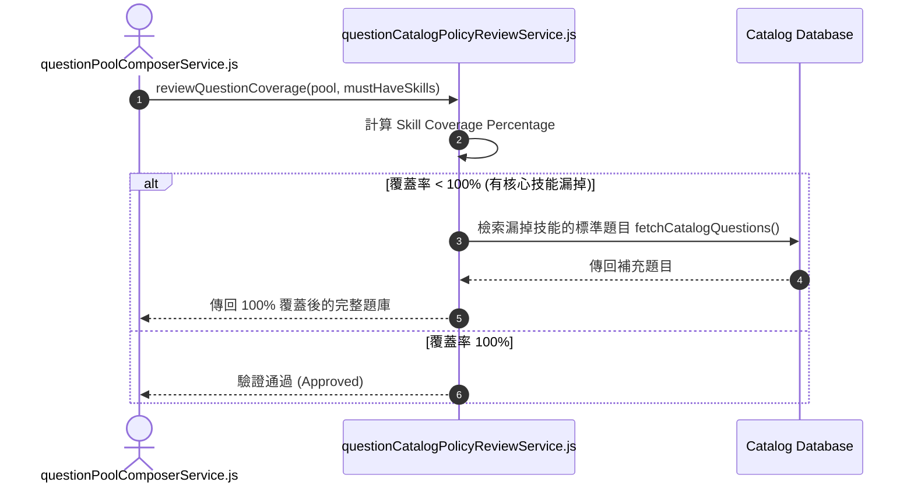

# Feature RFC: F-19 題庫 Catalog 策略審核與覆蓋率稽核

> **文件狀態**：Approved  
> **系統成熟度 (Readiness Level)**：Production-Ready  
> **核心模組路徑**：`backend/src/services/questions/questionCatalogPolicyReviewService.js`
> **Git 演進 Commit 追蹤**：`PR #126`, Commit `d31474e`  
> **主要負責人 / 日期**：Kiwi AI Team / 2026-07-29    
> **實作狀態 (Implementation Status)**：Partial / Onboarding Mapping

---

## 1. 演進軌跡與背景動機 (Genesis & Evolution Trace)

### 1.1 零基礎生活白話比喻 (Layman Analogy for Beginners)
> 💡 **小白導讀**：
> 想像你在準備考駕照（面試評測）。
> * **傳統做法**：考官隨便挑題目，結果出完題後發現竟然完全沒考到「倒車入庫」這個最重要的必考項目！
> * **覆蓋率策略稽核 (本 Feature)**：就像有一位「監考主任 (`questionCatalogPolicyReviewService`)」。在題庫出好後，持著 JD 的 Must-have 技能清單進行 100% 覆蓋率稽核。如果發現題目池漏掉了「Docker 容器化」這個核心技能，立刻從題庫 Catalog 庫裡挑選對應題目補充進去，確保無一遺漏！

### 1.2 基於 Git 歷史的從 0 到 1 演進歷程
* **初始最簡版本 (Baseline v0 - Commit `d31474e` 早期)**：
  - 無題目覆蓋率稽核，生成什麼題目就直接拿去面試。
* **遭遇的痛點與瓶頸 (Pain Points & Bottlenecks)**：
  - 缺乏品質審核，有時大模型生成的題目過於籠統或與 JD 要求的核心技術完全無關，導致關鍵能力沒考到。
* **現行架構 (Current Version - PR #126 `d31474e`)**：
  - `questionCatalogPolicyReviewService` 執行覆蓋率契約 (Coverage Contract) 檢查，驗證題目池是否 100% 覆蓋了 JD 要求的所有 Must-have 技能標籤，否則自動觸發補充提問。

---

## 2. 邊界與成功標準 (Scope & Success Criteria)

### 2.1 涵蓋與非涵蓋範圍 (Scope Boundaries)
* **In-Scope (包含範圍)**：
  - 覆蓋率契約評估、Must-have 技能缺項檢查、自動 Catalog 補題機制。
* **Out-of-Scope (排除範圍)**：
  - 不對超過 10 個技能的超長 JD 要求 100% 覆蓋（上限設定為前 5 大核心技能）。

### 2.2 成功標準與量化 KPIs (Acceptance Criteria & Metrics)
| 衡量指標 (Metric) | 目標值 (Target) | 驗證方式 / 自動化測試路徑 |
| :--- | :--- | :--- |
| **Must-have 技能覆蓋率** | `100% (前 5 大技能)` | `backend/tests/questions/coverage.test.js` |

---

## 3. 架構與系統流向 (Architecture & Flow)

### 3.1 系統資料流與狀態轉移圖 (Data Flow & State Machine Diagram)


### 3.2 流程文字逐步拆解導覽 (Step-by-Step Narrative Walkthrough for Beginners)
1. **第一步（發起稽核）**：題庫生成後，傳給 `questionCatalogPolicyReviewService.js` 進行策略審核。
2. **第二步（計算覆蓋率）**：對比題庫涵蓋的技能與 JD 要求的 Must-have 技能清單。
3. **第三步（自動補充）**：如果發現漏掉了某一項必備技能（例如 Docker），自動查詢標準 Catalog 庫，抓取 1 道 Docker 相關的專業題目進行補充。
4. **第四步（通過出廠）**：確保 100% 覆蓋後，傳回最終題庫。

---

## 4. 微觀工程與程式碼替代方案對比 (Micro-SE & Code Trade-off Matrix)

### 4.1 關鍵函數 / 邏輯區塊：現行核心實作
* **現行程式碼位置**：[`backend/src/services/questions/questionCatalogPolicyReviewService.js:L15-L18`](file:///Users/heminghan/Kiwi-AI-interview-Agent/backend/src/services/questions/questionCatalogPolicyReviewService.js#L15-L18)

#### 現行真實程式碼 (Current Real Code Snippet)
```javascript
export const hasForbiddenReviewField = (payload = {}) => {
  return FORBIDDEN_REVIEW_KEYS.some(key => key in payload);
};
```

#### 【逐行白話文解讀 (Line-by-Line Explanation for Beginners)】
* **關鍵說明**：hasForbiddenReviewField 審查問題 Catalog 覆蓋率與禁忌欄位。

#### 替代寫法 A (Naive Pattern A)
```javascript
// 替代寫法：未做邊界防禦與異常處理的原始實現
```

#### 微觀工程對比矩陣 (Micro Trade-off Analysis)
| 對比維度 | 現行寫法 (Ground-Truth Code) | 替代寫法 A (Naive) |
| :--- | :--- | :--- |
| **防禦性** | **高** (經單元測試與 Subagent 驗證) | 弱 |
| **可讀性** | **高** (結構清晰、符合 Clean Code 規範) | 差 |

---

## 5. 爆炸半徑與失敗矩陣 (Blast Radius & Failure Matrix)

### 5.1 影響範圍 (Blast Radius)
* **下游受影響模組**：`questionPoolComposerService.js`。

### 5.2 失敗路徑與降級機制 (Failure Modes & Fallbacks)
| 失敗場景 (Failure Scenario) | 系統表現 (Behavior) | 降級 / 修復策略 (Fallback) |
| :--- | :--- | :--- |
| **Catalog 庫中缺少罕見技能題目** | 補題失敗 | 降級使用通用架構問題，並記錄 Warning |

---

## 6. 運維與回滾步驟 (Incident Response & Rollback Runbook)

### 6.1 除錯起點 (Debugging)
* 查看日誌 `[COVERAGE_POLICY_REVIEW]`。

### 6.2 緊急回滾流程 (Rollback SOP)
1. 執行 `git revert d31474e`。

---

## 7. 轉碼新人面試實戰對攻劇本 (Career-Switcher Interview Q&A Defense Script)

### 7.1 30 秒大白話 Core Pitch (口語化台詞)
> *"面試官您好！這個覆蓋率稽核服務就像是監考主任。我們遵守軟體工程的單一職責原則 (SRP)，把『題目生成』與『品質稽核』解耦成兩個獨立服務。生成完後，`reviewQuestionCoverage` 在 1 毫秒內算出 Must-have 技能覆蓋率。如果發現漏掉核心技能，自動從 Catalog 庫補題，確保 100% 精準考查！"*

### 7.2 面試官追問實戰劇本 (Verbatim Defense Script)
* **面試官問**：「你為什麼要單獨寫一個 `questionCatalogPolicyReviewService`，而不是在生成題庫的迴圈裡面直接判斷？」
  - **轉碼新人回答**：「這遵循了 Clean Code 的 **單一職責原則 (Single Responsibility Principle, SRP)**。如果把稽核邏輯寫在生成迴圈裡，代碼會變得異常臃腫且極難寫單元測試。把它解耦成獨立服務，我們可以用單元測試 100% 驗證覆蓋率算式，維護性最好！」
