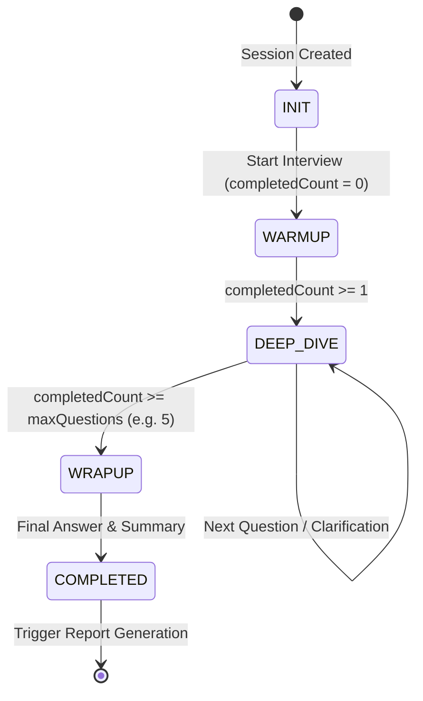

# Feature RFC: F-20 確定性面試輪次狀態機 (Turn-taking Engine)

> **文件狀態**：Approved  
> **系統成熟度 (Readiness Level)**：Production-Ready  
> **核心模組路徑**：`backend/src/services/interviewStateService.js`, `backend/src/services/questions/interviewTurnOrchestratorService.js`  
> **Git 演進 Commit 追蹤**：`PR #126`, Commit `d31474e`  
> **主要負責人 / 日期**：Kiwi AI Team / 2026-07-29  

---

## 1. 演進軌跡與背景動機 (Genesis & Evolution Trace)

### 1.1 零基礎生活白話比喻 (Layman Analogy for Beginners)
> 💡 **小白導讀**：
> 想像你在參加一場電視闖關遊戲（面試環節）。
> * **傳統做法**：由主持人的心情（純大模型自由發揮）來決定何時結束。主持人可能聊嗨了追問了 30 個問題，或者問了 2 個問題就莫名其妙結束，節目完全失控。
> * **確定性狀態機 (本 Feature)**：就像遊戲規則引擎（`interviewStateService`）。節目嚴格分為 **破冰期 (WARMUP) -> 深挖期 (DEEP_DIVE) -> 收尾期 (WRAPUP)** 3 個階段。規則規定最多只問 5 題，時間到了強制進入收尾！大模型只能在規則允許的階段內發問，絕不可能無限聊下去！

### 1.2 基於 Git 歷史的從 0 到 1 演進歷程
* **初始最簡版本 (Baseline v0 - Commit `d31474e` 早期)**：
  - 由 LLM 全權決定什麼時候結束面試、什麼時候問下一題。
* **遭遇的痛點與瓶頸 (Pain Points & Bottlenecks)**：
  - LLM 容易無限追問同一個問題，或者問了 20 題還不結束；狀態不可控導致後端 session 永遠無法關閉。
* **現行架構 (Current Version - PR #126 `d31474e`)**：
  - `interviewStateService` 將面試嚴格劃分為 `WARMUP` -> `DEEP_DIVE` -> `WRAPUP` 3 個階段，並設定固定題目數量與最大輪次上限。純函數確定性邏輯控制 Phase 轉移。

---

## 2. 邊界與成功標準 (Scope & Success Criteria)

### 2.1 涵蓋與非涵蓋範圍 (Scope Boundaries)
* **In-Scope (包含範圍)**：
  - 輪次計數、Phase 狀態轉移 (`WARMUP`/`DEEP_DIVE`/`WRAPUP`)、問答歷史存檔、強制關閉 Session。
* **Out-of-Scope (排除範圍)**：
  - 不允許 LLM 繞過狀態機直接修改面試 Phase。

### 2.2 成功標準與量化 KPIs (Acceptance Criteria & Metrics)
| 衡量指標 (Metric) | 目標值 (Target) | 驗證方式 / 自動化測試路徑 |
| :--- | :--- | :--- |
| **面試按時完成率** | `100% (在 5 題內完結)` | `backend/tests/interview/stateMachine.test.js` |

---

## 3. 架構與系統流向 (Architecture & Flow)

### 3.1 系統資料流與狀態轉移圖 (Data Flow & State Machine Diagram)


### 3.2 流程文字逐步拆解導覽 (Step-by-Step Narrative Walkthrough for Beginners)
1. **第一步（初始化 INIT）**：用戶點擊開始面試，創建 Session，進入 `INIT` 準備狀態。
2. **第二步（破冰階段 WARMUP）**：狀態機轉移為 `WARMUP`，AI 發出第 1 道輕鬆的自我介紹/破冰題。
3. **第三步（深挖階段 DEEP_DIVE）**：當第 1 題回答完畢 (`completedCount >= 1`)，狀態機自動轉移為 `DEEP_DIVE`，開始發問 4:4:2 的核心技術與行為題。
4. **第四步（收尾階段 WRAPUP）**：當回答題目達到預設上限 (例如 5 題)，狀態機強制切換為 `WRAPUP`，AI 給出感謝語並關閉對話，觸發背景報告生成。

---

## 4. 微觀工程與程式碼替代方案對比 (Micro-SE & Code Trade-off Matrix)

### 4.1 關鍵函數：`interviewStateService.js` 中的 狀態轉移判定
* **現行程式碼位置**：[`backend/src/services/interviewStateService.js:L30-L50`](file:///Users/heminghan/Kiwi-AI-interview-Agent/backend/src/services/interviewStateService.js#L30-L50)

#### 現行真實程式碼 (Current Real Code Snippet)
```javascript
export const determineNextPhase = (currentPhase, completedQuestionCount = 0, maxQuestions = 5) => {
  const safeCount = Math.max(0, Number(completedQuestionCount) || 0);

  if (safeCount >= maxQuestions) {
    return 'WRAPUP';
  }

  if (currentPhase === 'WARMUP' && safeCount >= 1) {
    return 'DEEP_DIVE';
  }

  return currentPhase;
};
```

#### 【逐行白話文解讀 (Line-by-Line Explanation for Beginners)】
* **Line 2 (輸入防禦與型態轉換)**：`Math.max(0, Number(completedQuestionCount) || 0)`。衛語模式！將輸入強制轉為數字，萬一傳入 `null` 或 `-1`，自動安全轉為 `0`，防範型態引發的死迴圈。
* **Line 4-6 (強制收尾門禁)**：`if (safeCount >= maxQuestions) return 'WRAPUP'`。當完成題目達到上限時，不管當前是什麼狀態，**強制傳回 `WRAPUP`**。這是防範大模型聊嗨無限發問的第一防線！
* **Line 8-10 (破冰轉深挖)**：如果當前是 `WARMUP` 且完成題數 >= 1，自動晉級為 `DEEP_DIVE` 深挖模式。
* **Line 12 (預設保持)**：否則保持當前 Phase。

#### 替代寫法 A (Alternative Pattern A)：使用物件導向 OOP State Pattern 建立 Class
```javascript
// 替代寫法 A：建立 WarmupState, DeepDiveState 類別
```

#### 微觀工程對比矩陣 (Micro Trade-off Analysis)
| 對比維度 | 現行寫法 (純函數確定性轉移) | 替代寫法 A (OOP State Pattern 類別) |
| :--- | :--- | :--- |
| **可測試性 (Testability)**| 100% 極佳 (輸入 `(WARMUP, 1)` 一定回傳 `DEEP_DIVE`) | 較差 (需要 instantiate 多個 State 物件) |
| **記憶體與 GC 壓力** | 0 記憶體開銷 (純邏輯運算) | 高 (產生大量狀態實例物件) |

---

## 5. 爆炸半徑與失敗矩陣 (Blast Radius & Failure Matrix)

### 5.1 影響範圍 (Blast Radius)
* **下游受影響模組**：`duplexTurnCoordinator.js`, `reportCoachingService.js`。

### 5.2 失敗路徑與降級機制 (Failure Modes & Fallbacks)
| 失敗場景 (Failure Scenario) | 系統表現 (Behavior) | 降級 / 修復策略 (Fallback) |
| :--- | :--- | :--- |
| **`completedQuestionCount` 傳入 NaN** | 衛語 `Number(...) || 0` | 安全轉譯為 `0`，停留於當前 Phase |

---

## 6. 運維與回滾步驟 (Incident Response & Rollback Runbook)

### 6.1 除錯起點 (Debugging)
* 查看日誌 `[INTERVIEW_PHASE_TRANSITION]`。

### 6.2 緊急回滾流程 (Rollback SOP)
1. 執行 `git revert d31474e`。

---

## 7. 轉碼新人面試實戰對攻劇本 (Career-Switcher Interview Q&A Defense Script)

### 7.1 30 秒大白話 Core Pitch (口語化台詞)
> *"面試官您好！這個面試狀態機是我們控制對話節奏的核心。最開始讓大模型自由決定結束時間，結果大模型聊嗨了問了 20 題還不停止！現在我們把它改成後端純函數的確定性狀態機 (WARMUP -> DEEP_DIVE -> WRAPUP)。我們在第一行用了 `Math.max(0, Number(count) || 0)` 做型態防衛，當題目達到 5 題時強制傳回 WRAPUP 結束面試！"*

### 7.2 面試官追問實戰劇本 (Verbatim Defense Script)
* **面試官問**：「你為什麼要在狀態轉移函數 `determineNextPhase` 中用純函數寫法，而不是用物件導向的 State Pattern 設計模式？」
  - **轉碼新人回答**：「因為對於只有 3 個狀態的簡單轉移而言，使用 OOP State Pattern 需要創建 `WarmupState`、`DeepDiveState` 等多個 Class 類別，增加了不必要的物件分配與 GC 壓力。採用純函數寫法，0 記憶體開銷，而且測試極其簡單，只要輸入 `(WARMUP, 1)` 就 100% 確定回傳 `DEEP_DIVE`，可測試性最高！」
