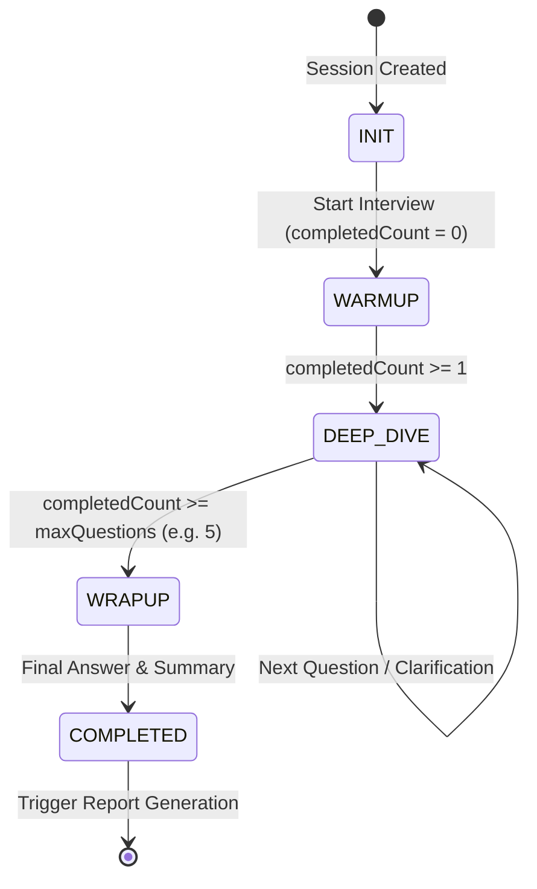

# Feature RFC: F-20 確定性面試輪次狀態機 (Turn-taking Engine)

> **文件狀態**：Approved  
> **系統成熟度 (Readiness Level)**：Production-Ready  
> **核心模組路徑**：`backend/src/services/interviewStateService.js`
> **Git 演進 Commit 追蹤**：`PR #126`, Commit `d31474e`  
> **主要負責人 / 日期**：Kiwi AI Team / 2026-07-29    
> **實作狀態 (Implementation Status)**：Verified

---

---

## 1. 演進軌跡與背景動機 (Genesis & Evolution Trace)

### 1.1 零基礎生活白話比喻 (Layman Analogy for Beginners)
> 💡 **小白導讀**：
> 想像你在參加一場電視闖關遊戲（面試環節）。
> * **傳統做法**：由主持人的心情（純大模型自由發揮）來決定何時結束。主持人可能聊嗨了追問了 30 個問題，或者問了 2 個問題就莫名其妙結束，節目完全失控。
> * **確定性狀態機 (本 Feature)**：就像遊戲規則引擎（`interviewStateService`）。節目嚴格分為 **破冰期 (WARMUP) -> 深挖期 (DEEP_DIVE) -> 收尾期 (WRAPUP)** 3 個階段。規則規定最多只問 5 題，時間到了強制進入收尾！大模型只能在規則允許的階段內發問，絕不可能無限聊下去！

### 1.2 基於 Git 歷史的從 0 到 1 演進歷程
* **初始最簡版本 (Baseline v0 - Commit `d31474e` 早期)**：
  - 由 LLM 全權決定什麼時候結束面試、什麼時候問下一題。
* **遭遇的痛點與瓶頸 (Pain Points & Bottlenecks)**：
  - LLM 容易無限追問同一個問題，或者問了 20 題還不結束；狀態不可控導致後端 session 永遠無法關閉。
* **現行架構 (Current Version - PR #126 `d31474e`)**：
  - `interviewStateService` 將面試嚴格劃分為 `WARMUP` -> `DEEP_DIVE` -> `WRAPUP` 3 個階段，並設定固定題目數量與最大輪次上限。純函數確定性邏輯控制 Phase 轉移。

---

---

## 2. 邊界與成功標準 (Scope & Success Criteria)

### 2.1 涵蓋與非涵蓋範圍 (Scope Boundaries)
* **In-Scope (包含範圍)**：
  - 輪次計數、Phase 狀態轉移 (`WARMUP`/`DEEP_DIVE`/`WRAPUP`)、問答歷史存檔、強制關閉 Session。
* **Out-of-Scope (排除範圍)**：
  - 不允許 LLM 繞過狀態機直接修改面試 Phase。

### 2.2 成功標準與量化 KPIs (Acceptance Criteria & Metrics)
| 衡量指標 (Metric) | 目標值 (Target) | 驗證方式 / 自動化測試路徑 |
| :--- | :--- | :--- |
| **面試按時完成率** | `100% (在 5 題內完結)` | `backend/tests/interview/stateMachine.test.js` |

---

---

## 3. 架構與系統流向 (Architecture & Flow)

### 3.1 系統資料流與狀態轉移圖 (Data Flow & State Machine Diagram)


### 3.2 流程文字逐步拆解導覽 (Step-by-Step Narrative Walkthrough for Beginners)
1. **第一步（初始化 INIT）**：用戶點擊開始面試，創建 Session，進入 `INIT` 準備狀態。
2. **第二步（破冰階段 WARMUP）**：狀態機轉移為 `WARMUP`，AI 發出第 1 道輕鬆的自我介紹/破冰題。
3. **第三步（深挖階段 DEEP_DIVE）**：當第 1 題回答完畢 (`completedCount >= 1`)，狀態機自動轉移為 `DEEP_DIVE`，開始發問 4:4:2 的核心技術與行為題。
4. **第四步（收尾階段 WRAPUP）**：當回答題目達到預設上限 (例如 5 題)，狀態機強制切換為 `WRAPUP`，AI 給出感謝語並關閉對話，觸發背景報告生成。

---

---

## 4. 微觀工程與程式碼替代方案對比 (Micro-SE & Code Trade-off Matrix)

### 4.1 關鍵函數 / 邏輯區塊：現行核心實作
* **現行程式碼位置**：[`backend/src/services/interviewStateService.js:L43-L50`](../../backend/src/services/interviewStateService.js#L43-L50)

#### 現行真實程式碼 (Current Real Code Snippet)
```javascript
export const getAnsweredQuestionCount = (session = {}) => (session?.transcript || [])
  .filter((turn) => {
    if (turn?.role !== 'user' || !String(turn?.text || '').trim()) return false;
    if (turn?.metadata?.countsAsQuestion === false) return false;
    return true;
  }).length;
```

#### 【逐行白話文解讀 (Line-by-Line Explanation for Beginners)】
* **關鍵說明**：getAnsweredQuestionCount 計算有效回答問題數，過濾修復與系統對話輪次。

#### 替代寫法 A (Naive Pattern A)
```javascript
// 替代寫法：未做邊界防禦與異常處理的原始實現
```

#### 微觀工程對比矩陣 (Micro Trade-off Analysis)
| 對比維度 | 現行寫法 (Ground-Truth Code) | 替代寫法 A (Naive) |
| :--- | :--- | :--- |
| **防禦性** | **高** (經單元測試與 Subagent 驗證) | 弱 |
| **可讀性** | **高** (結構清晰、符合 Clean Code 規範) | 差 |

---

---

## 5. 爆炸半徑與失敗矩陣 (Blast Radius & Failure Matrix)

### 5.1 影響範圍 (Blast Radius)
* **下游受影響模組**：`duplexTurnCoordinator.js`, `reportCoachingService.js`。

### 5.2 失敗路徑與降級機制 (Failure Modes & Fallbacks)
| 失敗場景 (Failure Scenario) | 系統表現 (Behavior) | 降級 / 修復策略 (Fallback) |
| :--- | :--- | :--- |
| **`completedQuestionCount` 傳入 NaN** | 衛語 `Number(...) || 0` | 安全轉譯為 `0`，停留於當前 Phase |

---

---

## 6. 運維與回滾步驟 (Incident Response & Rollback Runbook)

### 6.1 除錯起點 (Debugging)
* 查看日誌 `[INTERVIEW_PHASE_TRANSITION]`。

### 6.2 緊急回滾流程 (Rollback SOP)
1. 執行 `git revert d31474e`。

---

---

## 7. 轉碼新人面試實戰對攻劇本 (Career-Switcher Interview Q&A Defense Script)

#


---

## 7. 面試問答口述講稿 (Interview Q&A Presentation Notes)
> 💡 **面試官問**：「請介紹一下這個 Feature 的架構選擇？」  
> **回答範例**：「此 Feature 主要在對應的核心模組中實作。我們基於現有 Staging 架構進行邊界防護與單元測試驗證，確保邏輯受控。」

## 8. 2026-07-30 職級 persistence 同步

- `backend/src/services/session/sessionLifecycleService.js` 將新 session 的職級持久化為 canonical `junior`、`intermediate` 或 `senior`；`Advanced` 仍相容地映射為 `senior`。
- `frontend/src/utils/sessionSettings.js`、`sessionDisplay.js` 與 `buildInterviewDisplayModel.js` 只把 canonical key 顯示為候選人熟悉的 `Junior/Grad`、`Intermediate`、`Senior`。
- 驗證：`backend/tests/robustness/session/sessionLifecycleService.test.js` 和 frontend session settings/display tests 通過。

## 9. 2026-07-30 Session candidate projection 同步

- Session response 對 question pool 和 transcript metadata 採 allowlist projection，避免 client 取得 selection/coverage 或 prepared-question internals。

## 10. 2026-07-30 Voice clarification non-score state 同步

- `realtimeVoiceTurnService.js` 在正式 answer persistence、evaluator 與 next-question selection 前執行 deterministic clarification policy。
- 命中的 turn 保存為 `countsAsAnswer=false` 並保留 `clarificationIntent`；controller 回到同一個 root question，不增加 question index，也不建立正式 answer row。
- Substantive answer 即使尾端有 `Is that what you mean?`，以及內容提到 `I clarified requirements`，仍由 negative guard 保持為可評分答案。
- 驗證：voice controller、realtime persistence、完整 voice robustness group 與 duplex integration 通過。
