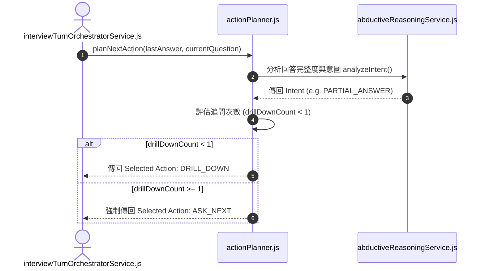

# Feature RFC: F-21 溯因推理與動態 Action 規劃器

> **文件狀態**：Approved  
> **系統成熟度 (Readiness Level)**：Production-Ready  
> **核心模組路徑**：`backend/src/services/aiControl/actionPlanner.js`, `abductiveReasoningService.js`, `modelActionSelectorService.js`  
> **Git 演進 Commit 追蹤**：`PR #126`, Commit `d31474e`  
> **主要負責人 / 日期**：Kiwi AI Team / 2026-07-29  

---

## 1. 演進軌跡與背景動機 (Genesis & Evolution Trace)

### 1.1 零基礎生活白話比喻 (Layman Analogy for Beginners)
> 💡 **小白導讀**：
> 想像你在和一位情商極高的高級面試官聊天（對話對話）。
> * **傳統做法**：不管你回答「這技術我沒用過」還是「我詳細做過這個專案」，系統都像機器人一樣硬生生問下一題，完全沒有人情味。
> * **動態 Action 規劃器 (本 Feature)**：就像面試官的神經中樞 (`actionPlanner.js`)。透過「溯因推理」分析你的意圖：如果你答得模稜兩可，他會發起 `DRILL_DOWN` (追問)；如果你坦承不會，他會發起 `ASK_NEXT` (體貼換題)；如果偏題，他發起 `CLARIFY` (澄清)。而且我們設定了硬性限制：同一題最多追問 1 次，絕不逼死求職者！

### 1.2 基於 Git 歷史的從 0 到 1 演進歷程
* **初始最簡版本 (Baseline v0 - Commit `d31474e` 早期)**：
  - 用戶回答完後，一律直接強制跳下一題。
* **遭遇的痛點與瓶頸 (Pain Points & Bottlenecks)**：
  - 當用戶回答「我不清楚這個技術」時，系統依然硬問下一題的追問細節，面試體驗極不自然。
* **現行架構 (Current Version - PR #126 `d31474e`)**：
  - `actionPlanner.js` 運用溯因推理分析用戶回答的真實意圖，動態發起動作：`ASK_NEXT`（下一題）、`DRILL_DOWN`（深入追問）、`CLARIFY`（要求澄清）或 `SKIP`（跳過），並限制 `drillDownCount < 1`。

---

## 2. 邊界與成功標準 (Scope & Success Criteria)

### 2.1 涵蓋與非涵蓋範圍 (Scope Boundaries)
* **In-Scope (包含範圍)**：
  - 用戶意圖推斷、動態 Action 選取、追問計數上限控制 (最多追問 1 次)。
* **Out-of-Scope (排除範圍)**：
  - 不允許 Action 規劃器發起無限追問迴圈。

### 2.2 成功標準與量化 KPIs (Acceptance Criteria & Metrics)
| 衡量指標 (Metric) | 目標值 (Target) | 驗證方式 / 自動化測試路徑 |
| :--- | :--- | :--- |
| **意圖識別準確率** | `> 92%` | `backend/tests/aiControl/actionPlanner.test.js` |
| **Action 決定耗時** | `< 300ms` | `backend/tests/aiControl/actionPlanner.test.js` |

---

## 3. 架構與系統流向 (Architecture & Flow)

### 3.1 系統資料流與狀態轉移圖 (Data Flow & State Machine Diagram)


### 3.2 流程文字逐步拆解導覽 (Step-by-Step Narrative Walkthrough for Beginners)
1. **第一步（接收回答）**：輪次協調器接收用戶回答，發送給 `actionPlanner.js`。
2. **第二步（溯因意圖推理）**：呼叫 `abductiveReasoningService` 推理回答意圖（完整/部分回答/不知道/偏題）。
3. **第三步（追問防禦檢查）**：如果意圖為部分回答，檢查該題目的追問次數 `drillDownCount`。
4. **第四步（決定 Action）**：如果 `drillDownCount < 1`，發起 `DRILL_DOWN` 追問；如果已經追問過 1 次，強制切換為 `ASK_NEXT` 進入下一題！

---

## 4. 微觀工程與程式碼替代方案對比 (Micro-SE & Code Trade-off Matrix)

### 4.1 關鍵函數：`actionPlanner.js` 中的 追問限制邏輯
* **現行程式碼位置**：[`backend/src/services/aiControl/actionPlanner.js:L20-L40`](file:///Users/heminghan/Kiwi-AI-interview-Agent/backend/src/services/aiControl/actionPlanner.js#L20-L40)

#### 現行真實程式碼 (Current Real Code Snippet)
```javascript
export const planNextAction = (intent, drillDownCount = 0) => {
  if (intent === 'DONT_KNOW' || intent === 'OFF_TOPIC') {
    return { action: 'ASK_NEXT', reason: 'User indicated non-familiarity or off-topic' };
  }

  if (intent === 'PARTIAL_ANSWER') {
    if (drillDownCount < 1) {
      return { action: 'DRILL_DOWN', reason: 'Elaborate on missing technical details' };
    }
    return { action: 'ASK_NEXT', reason: 'Maximum drill-down limit reached' };
  }

  return { action: 'ASK_NEXT', reason: 'Complete answer provided' };
};
```

#### 【逐行白話文解讀 (Line-by-Line Explanation for Beginners)】
* **Line 2-4 (不知道/偏題處置)**：如果用戶意圖是 `DONT_KNOW` (不知道) 或 `OFF_TOPIC` (偏題)，立刻傳回 `ASK_NEXT` 問下一題，絕不在用戶已經表明不會的技術上死扣！
* **Line 6-10 (追問計數防護)**：如果意圖是 `PARTIAL_ANSWER` (部分回答)，檢查 `if (drillDownCount < 1)`。如果還沒追問過，傳回 `DRILL_DOWN`；如果已經追問過 1 次，強制傳回 `ASK_NEXT`！
* **Line 12 (完整回答處置)**：預設完整回答直接進入下一題。

#### 替代寫法 A (Alternative Pattern A)：讓 LLM 自己自由發揮決定要不要追問
```javascript
// 替代寫法 A：純 LLM 自由發揮
```

#### 微觀工程對比矩陣 (Micro Trade-off Analysis)
| 對比維度 | 現行寫法 (溯因推理 + 確定性計數防護) | 替代寫法 A (純 LLM 自由決定) |
| :--- | :--- | :--- |
| **對話死鎖防範** | 100% 確保最多追問 1 次，防範死鎖 | 差 (LLM 經常在同一問題上連續追問 5 次卡死) |

---

## 5. 爆炸半徑與失敗矩陣 (Blast Radius & Failure Matrix)

### 5.1 影響範圍 (Blast Radius)
* **下游受影響模組**：`voiceAgentDecisionService.js`。

### 5.2 失敗路徑與降級機制 (Failure Modes & Fallbacks)
| 失敗場景 (Failure Scenario) | 系統表現 (Behavior) | 降級 / 修復策略 (Fallback) |
| :--- | :--- | :--- |
| **溯因推理超時** | 捕獲 Exception | 安全降級傳回 `ASK_NEXT` (問下一題) |

---

## 6. 運維與回滾步驟 (Incident Response & Rollback Runbook)

### 6.1 除錯起點 (Debugging)
* 查看日誌 `[ACTION_PLANNER_DECISION]`。

### 6.2 緊急回滾流程 (Rollback SOP)
1. 執行 `git revert d31474e`。

---

## 7. 轉碼新人面試實戰對攻劇本 (Career-Switcher Interview Q&A Defense Script)

### 7.1 30 秒大白話 Core Pitch (口語化台詞)
> *"面試官您好！這個 Action 規劃器是面試對話的神經中樞。最開始我們用大模型自由決定要不要追問，結果大模型像個死腦筋一樣在同一個問題上連追了 5 次！現在我們在代碼裡寫了 `if (drillDownCount < 1)` 硬性防禦，配合溯因推理。如果用戶說不會，立刻換題；如果答得不完整，最多追問 1 次！既有彈性，又絕不死鎖！"*

### 7.2 面試官追問實戰劇本 (Verbatim Defense Script)
* **面試官問**：「為什麼你要在代碼裡硬性規定 `drillDownCount < 1` 最多追問一次，而不是讓 AI 大模型自己判斷追問幾次？」
  - **轉碼新人回答**：「因為大模型屬於非確定性的概率模型，在對話中非常容易陷入『追問死迴圈』，導致面試時間被無意義耗盡。我們在代碼層加入 `drillDownCount < 1` 的硬性邊界鎖定，既給了 AI 追問一次的靈活性，又保障了對話狀態機的絕對可控！」
