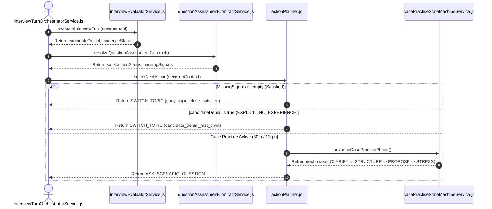

# Feature RFC: F-21 溯因推理與動態 Action 規劃器 (V6 Architecture)

> **文件狀態**：Approved  
> **系統成熟度 (Readiness Level)**：Production-Ready  
> **核心模組路徑**：`backend/src/services/aiControl/actionPlanner.js`  
> **Git 演進 Commit 追蹤**：`PR #126`, Commit `d31474e`, Master Plan Issues #132–#135  
> **主要負責人 / 日期**：Kiwi AI Team / 2026-07-31  
> **實作狀態 (Implementation Status)**：Verified / Automated Test Passed

---

## 1. 演進軌跡與背景動機 (Genesis & Evolution Trace)

### 1.1 零基礎生活白話比喻 (Layman Analogy for Beginners)
> 💡 **小白導讀**：
> 想像你在和一位情商極高的高級面試官聊天。
> * **動態 Action 規劃器 (本 Feature)**：就像面試官的神經中樞 (`actionPlanner.js`)。透過「溯因推理」與「Assessment Contract (信號契約)」分析你的意圖：
>   - 如果你回答已經完整證明了技術點，他會發起 `EARLY_TOPIC_CLOSE`（主動切換下一題）；
>   - 如果你坦承沒做過，他會發起 `FAST_PIVOT`（優雅體貼換題，不連續追問）；
>   - 如果是在 30 分鐘/12 題以上的 Technical/Combined 模式，他會啟動 4 輪的 `casePractice`（系統設計/情境個案演練）；
>   - 同時搭配前端 VAD 的 1.0 秒低延遲靜音斷句與思考片語（"Let me think..."）2.5 秒緩衝，達到兼具自然度與專業度的面試體驗。

### 1.2 基於 Git 歷史與 Issues #132–#135 的演進歷程
* **初始最簡版本 (Baseline v0)**：
  - 用戶回答完後，一律強制跳下一題，或進行缺乏結構的重複追問。
* **現行架構 (Issues #132, #133, #134, #135 - 2026-07-31)**：
  - **Issue #132 (Priority Order & Plan-Action Separation)**：重構 `actionPlanner.js` 優先級鏈：`Wrap Overrides` $\rightarrow$ `Repair/Clarification` $\rightarrow$ `Early Topic Close` $\rightarrow$ `Candidate Denial Fast Pivot` $\rightarrow$ `Seniority Stress Probing` $\rightarrow$ `Case Practice State Machine` $\rightarrow$ `Match Gap / Deep Dive`。
  - **Issue #133 (Assessment Contract & Technology Equivalence)**：擴展 `questionAssessmentContractService.js` 與 `fastAnswerUnderstandingService.js`。支援信號去重、`EXACT_MATCH` 與 `TRANSFERABLE_EVIDENCE` (如 Svelte 替代 React)，並區分 `EXPLICIT_NO_EXPERIENCE` (明確無經驗) 與 `INSUFFICIENT_EVIDENCE` (回答模糊)。
  - **Issue #134 (Seniority & Stress Probing)**：Senior 候選人允許第 3 次追問的 5 項嚴格條件判斷；Junior 聚焦於程式碼邊界與除錯 Stress 測試。
  - **Issue #135 (Case Practice Lifecycle)**：`casePracticeStateMachineService.js` 提供 4 Assessed Turns (`CLARIFY` $\rightarrow$ `STRUCTURE` $\rightarrow$ `PROPOSE` $\rightarrow$ `TRADE_OFF_STRESS`) + 1 Non-Counted Terminal (`WRAP`)。嚴格硬性阻斷 8 題 / 15 分鐘短面試與純 Behavioral 面試。
  - **VAD 1.0s SLA & Dynamic Pause Buffer**：前端 VAD 基礎靜音改為 1000ms，當 WebSocket 接收到 Backend `vocalized_pause_detected` 事件時動態延長 2500ms 緩衝。

---

## 2. 邊界與成功標準 (Scope & Success Criteria)

### 2.1 涵蓋與非涵蓋範圍 (Scope Boundaries)
* **In-Scope (包含範圍)**：
  * `actionPlanner.js` 決策鏈與 `questionAssessmentContractService.js` 信號契約。
  * `casePractice` 4 輪生命週期與 `dedicated` / `embedded` 雙模式識別。
  * `classifyTechnologyMatch` 5 級等價性與 `SKIPPED_CANDIDATE_DENIAL` 報告透傳。
  * 前端 VAD 1.0 秒 SLA 與 2.5 秒思考緩衝。
* **Out-of-Scope (排除範圍)**：
  * 不在 8 題 / 15 分鐘短面試中開啟 Case Practice。
  * 澄清 Turn / 復原 Turn 不佔用 Case Assessed Turn 數。

### 2.2 成功標準與量化 KPIs (Acceptance Criteria & Metrics)
| 衡量指標 (Metric) | 目標值 (Target) | 驗證方式 / 自動化測試路徑 |
| :--- | :--- | :--- |
| **意圖與契約決策準確率** | `100% PASS` | `backend/tests/robustness/agent/actionPlannerPriorityChain.test.js` |
| **信號契約與等價性辨識** | `100% PASS` | `backend/tests/robustness/questions/questionAssessmentContractService.test.js` |
| **Case State Machine** | `100% PASS` | `backend/tests/robustness/questions/casePracticeStateMachineService.test.js` |
| **VAD SLA & 緩衝延長** | `100% PASS` | `frontend/src/utils/__tests__/voiceActivityDetectionCore.test.js` |

---

## 3. 架構與系統流向 (Architecture & Flow)



---

## 4. 關鍵程式碼核心實作 (Current Real Code Snippets)

* **現行程式碼位置**：[`backend/src/services/aiControl/actionPlanner.js`](file:///Users/heminghan/Kiwi-AI-interview-Agent/backend/src/services/aiControl/actionPlanner.js)

```javascript
  const assessmentContract = decisionContext.assessmentContract || evaluatorState.assessmentContract || {};
  const isAssessmentSatisfied = assessmentContract.satisfactionStatus === 'satisfied' || (Array.isArray(assessmentContract.missingSignals) && assessmentContract.missingSignals.length === 0 && Array.isArray(assessmentContract.requiredSignals) && assessmentContract.requiredSignals.length > 0);

  if (isAssessmentSatisfied || evaluatorState.closeCurrentIntent || interviewStructure.currentTopicState?.exhausted) {
    return finalizePlan({
      selectedAction: AGENT_ACTION_TYPES.SWITCH_TOPIC,
      rationale: isAssessmentSatisfied
        ? 'The assessment contract is fully satisfied (missingSignals length is 0), so the controller executes an early topic close.'
        : 'The current topic is already sufficiently covered or has reached the follow-up limit, so the controller should move to the next fresh question.',
      confidence: 0.92,
      actionInput: {
        targetTopic: interviewStructure.forceCategory || coverageState.missingTopics?.[0] || targetTopic,
        probeType: isAssessmentSatisfied ? 'early_topic_close_satisfied' : 'close_topic',
        forceEvidence: false,
        freshOnly: true,
        category: interviewStructure.forceCategory || null,
      },
    });
  }

  if (evaluatorState.candidateDenial || evaluatorState.evidenceStatus === 'EXPLICIT_NO_EXPERIENCE') {
    return finalizePlan({
      selectedAction: AGENT_ACTION_TYPES.SWITCH_TOPIC,
      rationale: 'The candidate explicitly denied experience on this topic (candidate_denial / EXPLICIT_NO_EXPERIENCE), so the controller executes a fast pivot to preserve candidate experience.',
      confidence: 0.93,
      actionInput: {
        targetTopic: coverageState.missingTopics?.[0] || 'next_topic',
        probeType: 'candidate_denial_fast_pivot',
        forceEvidence: false,
        freshOnly: true,
        category: interviewStructure.forceCategory || null,
      },
      allowModelSelection: false,
    });
  }
```

---

## 5. 驗證與自動化測試套件 (Verification Suites)

* **Backend Robustness Suites**:
  - `backend/tests/robustness/questions/questionAssessmentContractService.test.js`
  - `backend/tests/robustness/agent/fastAnswerUnderstandingRobustness.test.js`
  - `backend/tests/robustness/questions/casePracticeStateMachineService.test.js`
  - `backend/tests/robustness/agent/actionPlannerPriorityChain.test.js`
* **Frontend VAD Suites**:
  - `frontend/src/utils/__tests__/voiceActivityDetectionCore.test.js`
  - `frontend/src/hooks/__tests__/useDuplexVoiceSocket.test.js`
