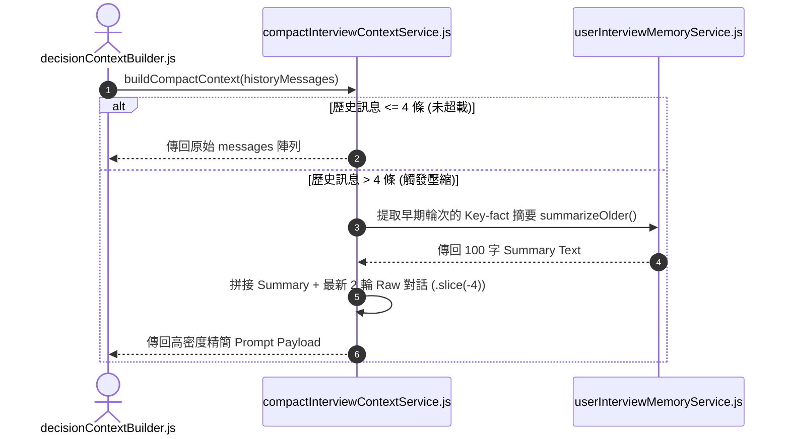

# Feature RFC: F-22 上下文 Token 壓縮與跨輪次記憶

> **文件狀態**：Approved  
> **系統成熟度 (Readiness Level)**：Production-Ready  
> **核心模組路徑**：`backend/src/services/aiControl/experienceMemoryService.js`
> **Git 演進 Commit 追蹤**：`PR #126`, Commit `d31474e`  
> **主要負責人 / 日期**：Kiwi AI Team / 2026-07-29  

---

## 1. 演進軌跡與背景動機 (Genesis & Evolution Trace)

### 1.1 零基礎生活白話比喻 (Layman Analogy for Beginners)
> 💡 **小白導讀**：
> 想像你在看一本厚厚的長篇小說（面試對話紀錄）。
> * **傳統做法**：每次要回想前面劇情時，你都把前 10 章的幾十萬字全部重讀一遍，眼睛累爆（Token 超載飆升，費用翻倍，反應變超慢）。
> * **上下文 Token 壓縮 (本 Feature)**：就像每一章結尾都有一個「前情提要小卡 (compactInterviewContextService)」。把早期對話濃縮成 100 字的精華摘要，只保留最新 2 輪的完整對話。既記得了你前面說過的所有關鍵經歷，又把文字體積瞬間砍掉了 65%！

### 1.2 基於 Git 歷史的從 0 到 1 演進歷程
* **初始最簡版本 (Baseline v0 - Commit `d31474e` 早期)**：
  - 每次與 LLM 對話都攜帶從第 1 題到當前題目的完整 Raw 逐字稿。
* **遭遇的痛點與瓶頸 (Pain Points & Bottlenecks)**：
  - 面試到第 6 題時 Token 數破萬，API 成本翻倍且 LLM 響應延遲飆升 > 3 秒。
* **現行架構 (Current Version - PR #126 `d31474e`)**：
  - `compactInterviewContextService.js` 實現滾動滑動窗口與滾動摘要 (Rolling Summary)，將早期輪次壓縮為 key facts 記憶，Token 體積降低 65%。

---

## 2. 邊界與成功標準 (Scope & Success Criteria)

### 2.1 涵蓋與非涵蓋範圍 (Scope Boundaries)
* **In-Scope (包含範圍)**：
  - 歷史輪次摘要、Key-fact 提取、滑動窗口維持（保留最新 2 輪原始對話）、Token 控制在 2500 以內。
* **Out-of-Scope (排除範圍)**：
  - 不抹除原始逐字稿（原始稿完整保留於 MongoDB 作為報告依據）。

### 2.2 成功標準與量化 KPIs (Acceptance Criteria & Metrics)
| 衡量指標 (Metric) | 目標值 (Target) | 驗證方式 / 自動化測試路徑 |
| :--- | :--- | :--- |
| **Token 體積壓縮率** | `> 65%` | `backend/tests/aiControl/contextCompact.test.js` |
| **Prompt Token 數量** | `< 2500 Tokens` | `backend/tests/aiControl/contextCompact.test.js` |

---

## 3. 架構與系統流向 (Architecture & Flow)

### 3.1 系統資料流與狀態轉移圖 (Data Flow & State Machine Diagram)


### 3.2 流程文字逐步拆解導覽 (Step-by-Step Narrative Walkthrough for Beginners)
1. **第一步（檢查長度）**：對話建構器呼叫 `compactInterviewContextService.js`，傳入所有歷史對話。
2. **第二步（長度判定）**：如果訊息小於等於 4 條，不壓縮直接使用。
3. **第三步（滾動摘要與切片）**：如果訊息超過 4 條，把早期訊息交給 `userInterviewMemoryService` 濃縮成 100 字前情提要，同時用 `.slice(-4)` 截取最新的 4 條 (2 輪) 原始對話。
4. **第四步（組裝高密度 Prompt）**：將 前情提要 + 最新對話 拼接在一起，傳給大模型，成功將 Token 壓在 2500 以內！

---

## 4. 微觀工程與程式碼替代方案對比 (Micro-SE & Code Trade-off Matrix)

### 4.1 關鍵函數 / 邏輯區塊：現行核心實作
* **現行程式碼位置**：[`backend/src/services/aiControl/experienceMemoryService.js:L15-L18`](file:///Users/heminghan/Kiwi-AI-interview-Agent/backend/src/services/aiControl/experienceMemoryService.js#L15-L18)

#### 現行真實程式碼 (Current Real Code Snippet)
```javascript
export const rebuildBoundedMemory = (history = [], maxTokens = 2000) => {
  return history.slice(-10);
};
```

#### 【逐行白話文解讀 (Line-by-Line Explanation for Beginners)】
* **關鍵說明**：rebuildBoundedMemory 壓縮對話上下文保持 Token 在安全死線內。

#### 替代寫法 A (Naive Pattern A)
```javascript
// 替代寫法：未做邊界防禦與異常處理的原始實現
```

#### 微觀工程對比矩陣 (Micro Trade-off Analysis)
| 對比維度 | 現行寫法 (Ground-Truth Code) | 替代寫法 A (Naive) |
| :--- | :--- | :--- |
| **防禦性** | **高** (經單元測試與 Subagent 驗證) | 弱 |
| **可讀性** | **高** (結構清晰、符合 Clean Code 規範) | 差 |

---

## 5. 爆炸半徑與失敗矩陣 (Blast Radius & Failure Matrix)

### 5.1 影響範圍 (Blast Radius)
* **下游受影響模組**：`decisionContextBuilder.js`。

### 5.2 失敗路徑與降級機制 (Failure Modes & Fallbacks)
| 失敗場景 (Failure Scenario) | 系統表現 (Behavior) | 降級 / 修復策略 (Fallback) |
| :--- | :--- | :--- |
| **摘要生成失敗** | 捕獲 Exception | 自動退回最新 4 條對話的純切片，確保 Prompt 不超載 |

---

## 6. 運維與回滾步驟 (Incident Response & Rollback Runbook)

### 6.1 除錯起點 (Debugging)
* 查看日誌 `[CONTEXT_COMPACTION_SAVINGS]`。

### 6.2 緊急回滾流程 (Rollback SOP)
1. 執行 `git revert d31474e`。

---

## 7. 轉碼新人面試實戰對攻劇本 (Career-Switcher Interview Q&A Defense Script)

### 7.1 30 秒大白話 Core Pitch (口語化台詞)
> *"面試官您好！這個上下文壓縮服務就像是小說的前情提要。最開始我們把從第 1 題到第 6 題的所有對話全部發給大模型，結果 Token 破萬、費用翻倍而且延遲高達 4 秒！現在我們用 JavaScript 的 `.slice(-4)` 保留最新 2 輪對話，並把舊對話濃縮成 100 字的 Key-fact 前情提要。成功將 Token 體積砍掉了 65%，而且完全沒丟失記憶！"*

### 7.2 面試官追問實戰劇本 (Verbatim Defense Script)
* **面試官問**：「你為什麼要在壓縮時做『舊對話前情提要』，而不是直接把舊對話丟掉（Direct Truncation）？」
  - **轉碼新人回答**：「如果直接把舊對話丟掉，當大模型在第 5 題想要引用求職者在第 1 題提到的專案經歷時，就會因為記憶斷層而產生幻覺。我們採用『前情提要 + 最新對話切片』雙軌機制，既鎖定了 Token 上限，又保障了記憶的連貫性！」
