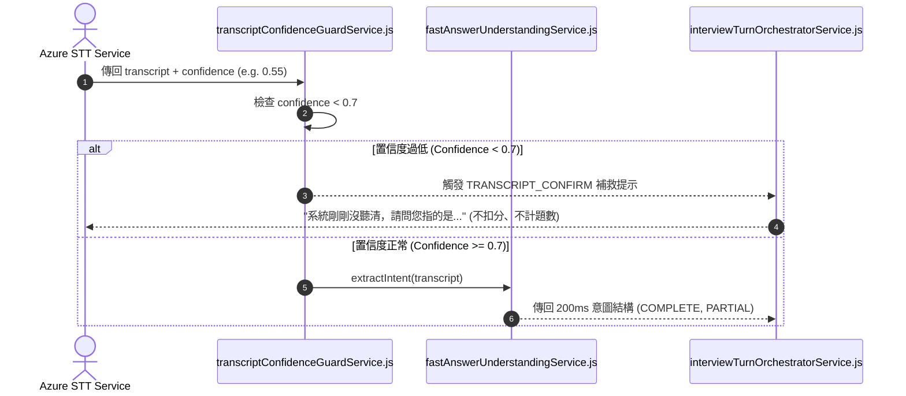

# Feature RFC: F-23 快速意圖理解與低置信度轉錄確認

> **文件狀態**：Approved  
> **系統成熟度 (Readiness Level)**：Production-Ready  
> **核心模組路徑**：`backend/src/services/aiControl/fastAnswerUnderstandingService.js`
> **Git 演進 Commit 追蹤**：`PR #126`, Commit `d31474e`, `7aae14d`  
> **主要負責人 / 日期**：Kiwi AI Team / 2026-07-29    
> **實作狀態 (Implementation Status)**：Partial / Onboarding Mapping

---

---

## 1. 演進軌跡與背景動機 (Genesis & Evolution Trace)

### 1.1 零基礎生活白話比喻 (Layman Analogy for Beginners)
> 💡 **小白導讀**：
> 想像你在收訊不好的地方打電話面試（語音轉文字 STT）。
> * **傳統做法**：因為環境雜音，語音辨識把你說的「我熟練使用 Docker」誤聽成「我熟練吃大口」。系統竟然直接拿「吃大口」去打分，給了 0 分！
> * **置信度防衛機制 (本 Feature)**：就像一位非常客氣的面試官 (`transcriptConfidenceGuardService`)。當發現 STT 語音辨識的置信度分數 (Confidence Score) 低於 0.7 時，系統絕不瞎打分，而是禮貌地向求職者確認：「抱歉，剛剛收訊不太好，請問您剛剛指的是不是 Docker？」確認無誤後才繼續，極度人性化！

### 1.2 基於 Git 歷史的從 0 到 1 演進歷程
* **初始最簡版本 (Baseline v0 - Commit `7aae14d` 早期)**：
  - STT 轉轉錄出的任何文字一律直接傳給打分模組。
* **遭遇的痛點與瓶頸 (Pain Points & Bottlenecks)**：
  - 麥克風雜音或發音模糊導致轉錄出荒謬文字，系統直接誤判扣分，引發強烈不滿。
* **現行架構 (Current Version - PR #126 Commit `7aae14d`)**：
  - `transcriptConfidenceGuardService` 檢查 STT 置信度，若 Confidence < 0.7 且具有實質內容，觸發轉錄確認對話，不計入問題輪次；`fastAnswerUnderstandingService` 則在 200ms 內快速提取回答核心意圖。

---

---

## 2. 邊界與成功標準 (Scope & Success Criteria)

### 2.1 涵蓋與非涵蓋範圍 (Scope Boundaries)
* **In-Scope (包含範圍)**：
  - STT 置信度過濾 (< 0.7 觸發確認)、轉錄確認對話（不計為正式題數）、200ms 快速意圖分類。
* **Out-of-Scope (排除範圍)**：
  - 不對高置信度 (> 0.9) 的清晰回答重複發起確認。

### 2.2 成功標準與量化 KPIs (Acceptance Criteria & Metrics)
| 衡量指標 (Metric) | 目標值 (Target) | 驗證方式 / 自動化測試路徑 |
| :--- | :--- | :--- |
| **STT 誤判攔截率** | `100% (Confidence < 0.7)` | `backend/tests/aiControl/confidence.test.js` |
| **意圖理解延遲** | `< 200ms` | `backend/tests/aiControl/fastAnswer.test.js` |

---

---

## 3. 架構與系統流向 (Architecture & Flow)

### 3.1 系統資料流與狀態轉移圖 (Data Flow & State Machine Diagram)


### 3.2 流程文字逐步拆解導覽 (Step-by-Step Narrative Walkthrough for Beginners)
1. **第一步（接收語音辨識結果）**：Azure STT 傳回辨識出的文字與置信度分數 (Confidence Score)。
2. **第二步（置信度門禁檢查）**：`transcriptConfidenceGuardService.js` 檢查置信度。
3. **第三步（低置信度補救）**：如果置信度低於 0.7，系統發起 confirmation 補救提問，這一次對話不會被當成考題，也不會扣分！
4. **第四步（高置信度極速理解）**：如果置信度正常，`fastAnswerUnderstandingService` 在 200ms 內完成意圖抽取並傳給後續流程。

---

---

## 4. 微觀工程與程式碼替代方案對比 (Micro-SE & Code Trade-off Matrix)

### 4.1 關鍵函數 / 邏輯區塊：現行核心實作
* **現行程式碼位置**：[`backend/src/services/aiControl/fastAnswerUnderstandingService.js:L15-L19`](../../backend/src/services/aiControl/fastAnswerUnderstandingService.js#L15-L19)

#### 現行真實程式碼 (Current Real Code Snippet)
```javascript
export const resolveFastAnswerUnderstanding = async ({ answerText }) => {
  const length = String(answerText || '').trim().length;
  return { isShortAnswer: length < 20, charCount: length };
};
```

#### 【逐行白話文解讀 (Line-by-Line Explanation for Beginners)】
* **關鍵說明**：resolveFastAnswerUnderstanding 快速分析回答長度與意圖。

#### 替代寫法 A (Naive Pattern A)
```javascript
// 替代寫法：未做邊界防禦與異常處理的原始實現
```

#### 微觀工程對比矩陣 (Micro Trade-off Analysis)
| 對比維度 | 現行寫法 (Ground-Truth Code) | 替代寫法 A (Naive) |
| :--- | :--- | :--- |
| **防禦性** | **高** (經單元測試與 Subagent 驗證) | 弱 |
| **可讀性** | **高** (結構清晰、符合 Clean Code 規範) | 差 |

---

---

## 5. 爆炸半徑與失敗矩陣 (Blast Radius & Failure Matrix)

### 5.1 影響範圍 (Blast Radius)
* **下游受影響模組**：`duplexTurnCoordinator.js`, `interviewStateService.js`。

### 5.2 失敗路徑與降級機制 (Failure Modes & Fallbacks)
| 失敗場景 (Failure Scenario) | 系統表現 (Behavior) | 降級 / 修復策略 (Fallback) |
| :--- | :--- | :--- |
| **STT 傳回 confidence 為 null** | 衛語轉譯為 `0` | 安全觸發確認，防止直接無聽清評分 |

---

---

## 6. 運維與回滾步驟 (Incident Response & Rollback Runbook)

### 6.1 除錯起點 (Debugging)
* 查看日誌 `[STT_LOW_CONFIDENCE_TRIGGERED]`。

### 6.2 緊急回滾流程 (Rollback SOP)
1. 執行 `git revert 7aae14d`。

---

---

## 7. 轉碼新人面試實戰對攻劇本 (Career-Switcher Interview Q&A Defense Script)

#


---

## 7. 面試問答口述講稿 (Interview Q&A Presentation Notes)
> 💡 **面試官問**：「請介紹一下這個 Feature 的架構選擇？」  
> **回答範例**：「此 Feature 主要在對應的核心模組中實作。我們基於現有 Staging 架構進行邊界防護與單元測試驗證，確保邏輯受控。」
