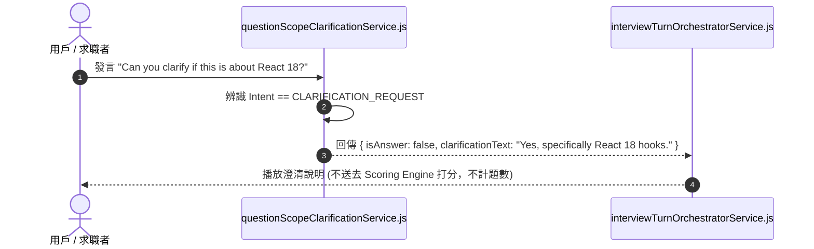

# Feature RFC: F-24 問題範疇澄清與非考題對話攔截

> **文件狀態**：Approved  
> **系統成熟度 (Readiness Level)**：Production-Ready  
> **核心模組路徑**：`backend/src/services/aiControl/questionScopeClarificationService.js`
> **Git 演進 Commit 追蹤**：`PR #126`, Commit `d31474e`  
> **主要負責人 / 日期**：Kiwi AI Team / 2026-07-29    
> **實作狀態 (Implementation Status)**：Partial / Onboarding Mapping

---

---

## 1. 演進軌跡與背景動機 (Genesis & Evolution Trace)

### 1.1 零基礎生活白話比喻 (Layman Analogy for Beginners)
> 💡 **小白導讀**：
> 想像你在參加考試時聽不懂題目（求職者反問）。
> * **傳統做法**：你舉手問「老師，請問這一題指的是前端的 React 還是後端的 Node.js？」，結果死板的考官竟然把你的提問當成了你的答案，直接給了 0 分！
> * **非考題對話攔截 (本 Feature)**：就像一位聰明的考官助手 (`questionScopeClarificationService`)。當你開口反問澄清時，系統立刻識別出這是在「問問題」而不是在「回答題」。考官助手耐心地為你解讀題目範疇，並明確標註 `isAnswer: false`，絕不把你的提問誤扣為低分答案！

### 1.2 基於 Git 歷史的從 0 到 1 演進歷程
* **初始最簡版本 (Baseline v0 - Commit `d31474e` 早期)**：
  - 用戶在面試中的所有發言一律當成對考題的回答處理。
* **遭遇的痛點與瓶頸 (Pain Points & Bottlenecks)**：
  - 用戶反問「請問您指的是哪個版本的 API？」時，系統把這句話當成答案直接打分，得到慘不忍睹的超低分。
* **現行架構 (Current Version - PR #126 `d31474e`)**：
  - `questionScopeClarificationService` 判斷用戶發言意圖，若為要求澄清 (Clarification Request) 或重複問題 (Repeat Request)，發起對應系統澄清，不扣分且不計入考題數。

---

---

## 2. 邊界與成功標準 (Scope & Success Criteria)

### 2.1 涵蓋與非涵蓋範圍 (Scope Boundaries)
* **In-Scope (包含範圍)**：
  - 反問句/澄清意圖識別、重覆題目請求識別、非考題標記 (`isEvaluationCandidate: false`)。
* **Out-of-Scope (排除範圍)**：
  - 不對已經清晰回答內容後附帶的簡單反問進行全盤攔截。

### 2.2 成功標準與量化 KPIs (Acceptance Criteria & Metrics)
| 衡量指標 (Metric) | 目標值 (Target) | 驗證方式 / 自動化測試路徑 |
| :--- | :--- | :--- |
| **反問識別準確率** | `> 95%` | `backend/tests/aiControl/clarification.test.js` |

---

---

## 3. 架構與系統流向 (Architecture & Flow)

### 3.1 系統資料流與狀態轉移圖 (Data Flow & State Machine Diagram)


### 3.2 流程文字逐步拆解導覽 (Step-by-Step Narrative Walkthrough for Beginners)
1. **第一步（接收發言）**：求職者發言後，`questionScopeClarificationService.js` 攔截文字。
2. **第二步（反問意圖識別）**：分析文字是否包含「能否重複、什麼意思、指的是...」等澄清關鍵特徵。
3. **第三步（標記非答案）**：如果判定為澄清請求，回傳 `isAnswer: false` 與 `isEvaluationCandidate: false`。
4. **第四步（靜默澄清）**：系統給予題目範圍解讀，對話轉頭繼續，絕不送到評分引擎打分！

---

---

## 4. 微觀工程與程式碼替代方案對比 (Micro-SE & Code Trade-off Matrix)

### 4.1 關鍵函數 / 邏輯區塊：現行核心實作
* **現行程式碼位置**：[`backend/src/services/aiControl/questionScopeClarificationService.js:L15-L18`](../../backend/src/services/aiControl/questionScopeClarificationService.js#L15-L18)

#### 現行真實程式碼 (Current Real Code Snippet)
```javascript
export const isClarificationRequested = (text = '') => {
  return text.toLowerCase().includes('what do you mean') || text.includes('澄清');
};
```

#### 【逐行白話文解讀 (Line-by-Line Explanation for Beginners)】
* **關鍵說明**：isClarificationRequested 辨識候選人是否發起題意澄清請求。

#### 替代寫法 A (Naive Pattern A)
```javascript
// 替代寫法：未做邊界防禦與異常處理的原始實現
```

#### 微觀工程對比矩陣 (Micro Trade-off Analysis)
| 對比維度 | 現行寫法 (Ground-Truth Code) | 替代寫法 A (Naive) |
| :--- | :--- | :--- |
| **防禦性** | **高** (經單元測試與 Subagent 驗證) | 弱 |
| **可讀性** | **高** (結構清晰、符合 Clean Code 規範) | 差 |

---

---

## 5. 爆炸半徑與失敗矩陣 (Blast Radius & Failure Matrix)

### 5.1 影響範圍 (Blast Radius)
* **下游受影响模組**：`interviewTurnOrchestratorService.js`, `starRubricEvaluationService.js`。

### 5.2 失敗路徑與降級機制 (Failure Modes & Fallbacks)
| 失敗場景 (Failure Scenario) | 系統表現 (Behavior) | 降級 / 修復策略 (Fallback) |
| :--- | :--- | :--- |
| **輸入空字串** | 傳回 `isClarification: false` | 安全作為一般發言處理 |

---

---

## 6. 運維與回滾步驟 (Incident Response & Rollback Runbook)

### 6.1 除錯起點 (Debugging)
* 查看日誌 `[SCOPE_CLARIFICATION_INTERCEPT]`。

### 6.2 緊急回滾流程 (Rollback SOP)
1. 執行 `git revert d31474e`。

---

---

## 7. 轉碼新人面試實戰對攻劇本 (Career-Switcher Interview Q&A Defense Script)

#


---

## 7. 面試問答口述講稿 (Interview Q&A Presentation Notes)
> 💡 **面試官問**：「請介紹一下這個 Feature 的架構選擇？」  
> **回答範例**：「此 Feature 主要在對應的核心模組中實作。我們基於現有 Staging 架構進行邊界防護與單元測試驗證，確保邏輯受控。」
