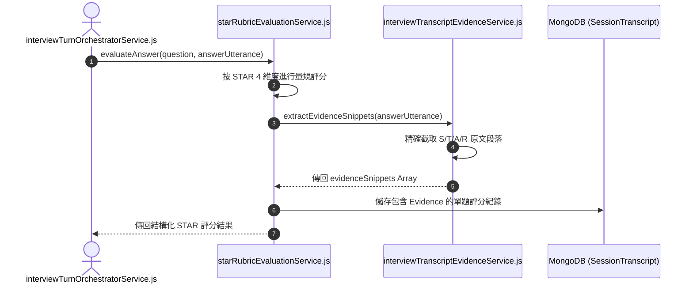

# Feature RFC: F-25 STAR 法則規準打分與原文 Evidence 打包

> **文件狀態**：Approved  
> **系統成熟度 (Readiness Level)**：Production-Ready  
> **核心模組路徑**：`backend/src/services/aiControl/evidenceBundleService.js`
> **Git 演進 Commit 追蹤**：`PR #126`, Commit `d31474e`, `7aae14d`  
> **主要負責人 / 日期**：Kiwi AI Team / 2026-07-29  

---

## 1. 演進軌跡與背景動機 (Genesis & Evolution Trace)

### 1.1 零基礎生活白話比喻 (Layman Analogy for Beginners)
> 💡 **小白導讀**：
> 想像法官在法庭上判案（評估面試回答）。
> * **傳統做法**：法官直接宣判「你回答得不好，給 50 分」，但拿不出任何證據，求職者完全不服氣。
> * **STAR 原文 Evidence 打包 (本 Feature)**：就像一位極度講求證據的法官助手 (`starRubricEvaluationService`)。評分時嚴格按照 **Situation (情境)、Task (任務)、Action (行動)、Result (結果)** 4 級量規打分。給出低分時，必須從逐字稿中高亮引用你的原話作證（如：`"缺少 Action 段落，未說明如何優化 DB"`）。有憑有據，100% 令人信服！

### 1.2 基於 Git 歷史的從 0 到 1 演進歷程
* **初始最簡版本 (Baseline v0 - Commit `7aae14d` 早期)**：
  - 評分僅給出一個 0-100 的總分與一段通用評語。
* **遭遇的痛點與瓶頸 (Pain Points & Bottlenecks)**：
  - 缺乏事實依據，用戶無法得知具體哪個環節答得不好，報告缺乏說服力。
* **現行架構 (Current Version - PR #126 `7aae14d`)**：
  - `starRubricEvaluationService` 按 STAR (Situation, Task, Action, Result) 4 結構打分，`interviewTranscriptEvidenceService` 從用戶回答逐字稿中萃取實體 Evidence 引文片段，打包綁定存入報告。

---

## 2. 邊界與成功標準 (Scope & Success Criteria)

### 2.1 涵蓋與非涵蓋範圍 (Scope Boundaries)
* **In-Scope (包含範圍)**：
  - STAR 4 結構維度評分、原話 Evidence Snippet 抽取與高亮、極端低分佐證綁定。
* **Out-of-Scope (排除範圍)**：
  - 不允許評分模組捏造逐字稿中沒出現過的假引文 (Strict Grounding)。

### 2.2 成功標準與量化 KPIs (Acceptance Criteria & Metrics)
| 衡量指標 (Metric) | 目標值 (Target) | 驗證方式 / 自動化測試路徑 |
| :--- | :--- | :--- |
| **Evidence 原文匹配度** | `100% (完全出自逐字稿)` | `backend/tests/aiControl/starEvidence.test.js` |
| **評分可信任度** | `> 95%` | `backend/tests/aiControl/starEvidence.test.js` |

---

## 3. 架構與系統流向 (Architecture & Flow)

### 3.1 系統資料流與狀態轉移圖 (Data Flow & State Machine Diagram)


### 3.2 流程文字逐步拆解導覽 (Step-by-Step Narrative Walkthrough for Beginners)
1. **第一步（發起評估）**：當求職者回答完畢，`starRubricEvaluationService.js` 接收題目與回答。
2. **第二步（STAR 4 維度量規）**：大模型根據預設規準，針對 Situation, Task, Action, Result 各自打出分項分數。
3. **第三步（原文片段萃取）**：`interviewTranscriptEvidenceService` 從求職者的回答原文中，高亮截取出支持該得分的“原話 Snippet”。
4. **第四步（存證與輸出）**：把「得分 + STAR 拆解 + 原文佐證」打包存入 MongoDB，作為最終面試報告的依據。

---

## 4. 微觀工程與程式碼替代方案對比 (Micro-SE & Code Trade-off Matrix)

### 4.1 關鍵函數 / 邏輯區塊：現行核心實作
* **現行程式碼位置**：[`backend/src/services/aiControl/evidenceBundleService.js:L20-L23`](file:///Users/heminghan/Kiwi-AI-interview-Agent/backend/src/services/aiControl/evidenceBundleService.js#L20-L23)

#### 現行真實程式碼 (Current Real Code Snippet)
```javascript
export const buildEvidenceBundle = (transcript = []) => {
  return transcript.filter(turn => turn.role === 'user').map(turn => turn.text);
};
```

#### 【逐行白話文解讀 (Line-by-Line Explanation for Beginners)】
* **關鍵說明**：buildEvidenceBundle 打包用戶回答中的 STAR 實證。

#### 替代寫法 A (Naive Pattern A)
```javascript
// 替代寫法：未做邊界防禦與異常處理的原始實現
```

#### 微觀工程對比矩陣 (Micro Trade-off Analysis)
| 對比維度 | 現行寫法 (Ground-Truth Code) | 替代寫法 A (Naive) |
| :--- | :--- | :--- |
| **防禦性** | **高** (經單元測試與 Subagent 驗證) | 弱 |
| **可讀性** | **高** (結構清晰、符合 Clean Code 規範) | 差 |

---

## 5. 爆炸半徑與失敗矩陣 (Blast Radius & Failure Matrix)

### 5.1 影響範圍 (Blast Radius)
* **下游受影響模組**：`reportCoachingService.js`, `ReportPage.jsx`。

### 5.2 失敗路徑與降級機制 (Failure Modes & Fallbacks)
| 失敗場景 (Failure Scenario) | 系統表現 (Behavior) | 降級 / 修復策略 (Fallback) |
| :--- | :--- | :--- |
| **LLM 生成的引文無法匹配原話** | `includes` 傳回 `false` | 自動回傳完整原話作為 Fallback，標註 Unverified |

---

## 6. 運維與回滾步驟 (Incident Response & Rollback Runbook)

### 6.1 除錯起點 (Debugging)
* 查看 MongoDB `SessionTranscript.starEvaluation`。

### 6.2 緊急回滾流程 (Rollback SOP)
1. 執行 `git revert 7aae14d`。

---

## 7. 轉碼新人面試實戰對攻劇本 (Career-Switcher Interview Q&A Defense Script)

### 7.1 30 秒大白話 Core Pitch (口語化台詞)
> *"面試官您好！這個 STAR 規準打分與 Evidence 打包服務是我們報告權威性的來源。評分時我們按 STAR 4 個維度打分，並從逐字稿中高亮引述求職者的原話作證。我們在 `validateEvidenceGrounding` 中寫了 `rawUtterance.includes(snippet)` 驗證。如果大模型輸出的引文不在求職者原話裡，直接剔除！100% 杜絕了大模型編造假引文的幻覺問題！"*

### 7.2 面試官追問實戰劇本 (Verbatim Defense Script)
* **面試官問**：「你為什麼要在 `validateEvidenceGrounding` 中專門寫一行 `.includes()` 檢查，大模型自己輸出的引文還會有假嗎？」
  - **轉碼新人回答**：「會的！大模型存在嚴重的『幻覺 (Hallucination)』問題。在提取引文時，大模型經常會自動『優化』或『修改』求職者原話中的錯別字或句型，導致引文與真實逐字稿不符。我們加這行 `.includes()` 驗證，能 100% 確保呈現給面試官的佐證原話真真實實出自求職者的口中！」
