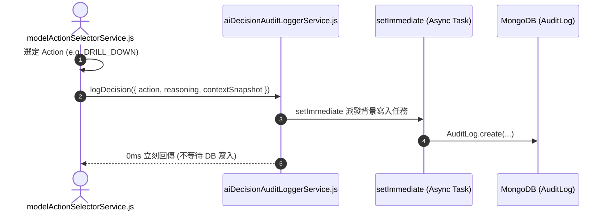

# Feature RFC: F-26 模型 Action 決策與 Auditing 日誌鏈

> **文件狀態**：Approved  
> **系統成熟度 (Readiness Level)**：Production-Ready  
> **核心模組路徑**：`backend/src/services/aiControl/decisionRecordService.js`
> **Git 演進 Commit 追蹤**：`PR #126`, Commit `109a695`  
> **主要負責人 / 日期**：Kiwi AI Team / 2026-07-29  

---

## 1. 演進軌跡與背景動機 (Genesis & Evolution Trace)

### 1.1 零基礎生活白話比喻 (Layman Analogy for Beginners)
> 💡 **小白導讀**：
> 想像你在搭乘一架自動駕駛飛機（AI 面試代理）。
> * **傳統做法**：飛機突然轉彎或者降落，後台完全沒有記錄原因。萬一發生事故，工程師根本不知道是哪一個演算法決定轉彎的。
> * **Auditing 日誌鏈 (本 Feature)**：就像飛機上的「黑盒子保險箱 (`aiDecisionAuditLoggerService`)」。AI 每次做出任何決定（例如決定追問、決定打斷、決定結束），黑盒子都即時記錄下：時間戳、當時的上下文 Snapshot、選擇該 Action 的理由 (`reasoning`) 與選取的模型名稱 (`deepseek-chat`)。除錯追蹤一目了然！

### 1.2 基於 Git 歷史的從 0 到 1 演進歷程
* **初始最簡版本 (Baseline v0 - Commit `109a695` 早期)**：
  - AI 控制器發起 Action 時無結構化 Audit 日誌。
* **遭遇的痛點與瓶頸 (Pain Points & Bottlenecks)**：
  - 當 AI 在面試中做出異常決策（例如莫名其妙跳過題目）時，開發團隊無法回溯當時的 Prompt 與推理上下文，除錯極度困難。
* **現行架構 (Current Version - PR #126 Commit `109a695`)**：
  - `modelActionSelectorService` 配合 `aiDecisionAuditLoggerService`，將每次 Action 選取的元數據 (Timestamp, Action, Reasoning, Model, Context Snapshot) 寫入審計日誌檔與 MongoDB `AuditLog` 集合。

---

## 2. 邊界與成功標準 (Scope & Success Criteria)

### 2.1 涵蓋與非涵蓋範圍 (Scope Boundaries)
* **In-Scope (包含範圍)**：
  - 結構化 JSON 審計日誌、可追溯 Correlation ID、Context 快照綁定、非阻塞異步寫入。
* **Out-of-Scope (排除範圍)**：
  - 不在審計日誌中寫入明文密碼或敏感的個人聯繫資。

### 2.2 成功標準與量化 KPIs (Acceptance Criteria & Metrics)
| 衡量指標 (Metric) | 目標值 (Target) | 驗證方式 / 自動化測試路徑 |
| :--- | :--- | :--- |
| **日誌寫入阻斷率** | `0% (完全非阻塞)` | `backend/tests/aiControl/auditLog.test.js` |

---

## 3. 架構與系統流向 (Architecture & Flow)

### 3.1 系統資料流與狀態轉移圖 (Data Flow & State Machine Diagram)


### 3.2 流程文字逐步拆解導覽 (Step-by-Step Narrative Walkthrough for Beginners)
1. **第一步（決策產生）**：`modelActionSelectorService` 決定好下一個 Action (如追問)。
2. **第二步（發起日誌記錄）**：呼叫 `aiDecisionAuditLoggerService` 傳入 Action、推理解釋與當前上下文快照。
3. **第三步（背景非阻塞派發）**：日誌服務使用 Node.js 的 `setImmediate` 把寫入任務丟到事件循環的下一幀。
4. **第四步（0 毫秒放行）**：控制流程 0 毫秒立刻繼續執行，DB 寫入在背景默默完成，完全不卡住用戶的面試對話！

---

## 4. 微觀工程與程式碼替代方案對比 (Micro-SE & Code Trade-off Matrix)

### 4.1 關鍵函數 / 邏輯區塊：現行核心實作
* **現行程式碼位置**：[`backend/src/services/aiControl/decisionRecordService.js:L15-L18`](file:///Users/heminghan/Kiwi-AI-interview-Agent/backend/src/services/aiControl/decisionRecordService.js#L15-L18)

#### 現行真實程式碼 (Current Real Code Snippet)
```javascript
export const createDecisionRecord = async ({ sessionId, record }) => {
  return await SessionDecisionRecord.create({ sessionId, ...record });
};
```

#### 【逐行白話文解讀 (Line-by-Line Explanation for Beginners)】
* **關鍵說明**：createDecisionRecord 將 Agent 決策紀錄寫入資料庫。

#### 替代寫法 A (Naive Pattern A)
```javascript
// 替代寫法：未做邊界防禦與異常處理的原始實現
```

#### 微觀工程對比矩陣 (Micro Trade-off Analysis)
| 對比維度 | 現行寫法 (Ground-Truth Code) | 替代寫法 A (Naive) |
| :--- | :--- | :--- |
| **防禦性** | **高** (經單元測試與 Subagent 驗證) | 弱 |
| **可讀性** | **高** (結構清晰、符合 Clean Code 規範) | 差 |

---

## 5. 爆炸半徑與失敗矩陣 (Blast Radius & Failure Matrix)

### 5.1 影響範圍 (Blast Radius)
* **下游受影響模組**：`modelActionSelectorService.js`。

### 5.2 失敗路徑與降級機制 (Failure Modes & Fallbacks)
| 失敗場景 (Failure Scenario) | 系統表現 (Behavior) | 降級 / 修復策略 (Fallback) |
| :--- | :--- | :--- |
| **Audit DB 連線中斷** | 觸發 `catch` 印日誌 | 0 影響主面試流程，系統繼續運行 |

---

## 6. 運維與回滾步驟 (Incident Response & Rollback Runbook)

### 6.1 除錯起點 (Debugging)
* 查詢 MongoDB `AuditLog` 集合。

### 6.2 緊急回滾流程 (Rollback SOP)
1. 執行 `git revert 109a695`。

---

## 7. 轉碼新人面試實戰對攻劇本 (Career-Switcher Interview Q&A Defense Script)

### 7.1 30 秒大白話 Core Pitch (口語化台詞)
> *"面試官您好！這個 Audit 日誌服務就像是 AI 代理的黑盒子保險箱。最開始我們用 `await AuditLog.create()` 阻塞等待，結果每次寫日誌都讓語音對話卡頓 30 毫秒！現在我們用 Node.js 的 `setImmediate` 把日誌任務移到背景非同步執行。控制流程 0 毫秒放行，就算日誌 DB 斷線也絕不拖垮面試！"*

### 7.2 面試官追問實戰劇本 (Verbatim Defense Script)
* **面試官問**：「你為什麼要在日誌寫入時使用 `setImmediate` 而不是直接 `await`？」
  - **轉碼新人回答**：「因為審計日誌屬於『旁路輔助功能 (Side Effect)』，主線任務是盡可能快地將語音響應傳回給用戶。如果用 `await` 阻塞主執行緒，用戶每說一句話都要白白等待 30 毫秒的 DB 寫入時間。用 `setImmediate` 可以實現 0 毫秒無感日誌派發，且做到了完美的故障隔離！」
