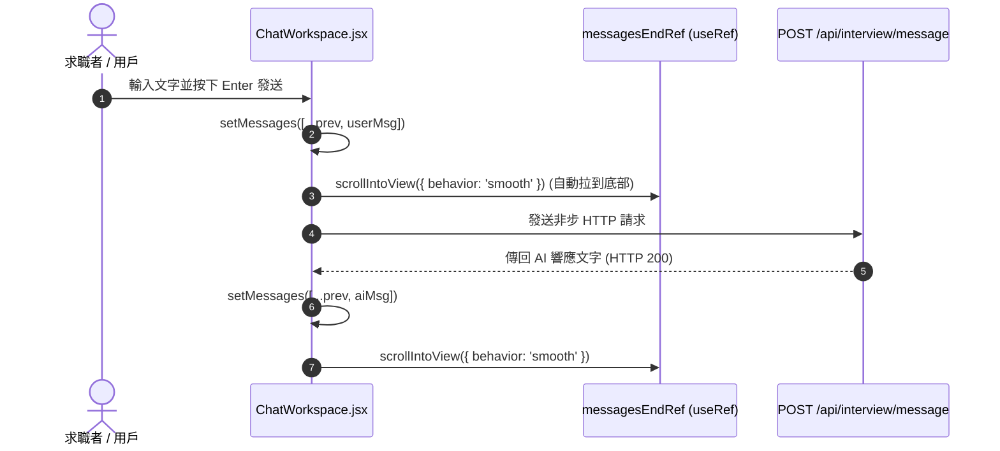

# Feature RFC: F-27 純文字面試模式與 Workspace 互動介面

> **文件狀態**：Approved  
> **系統成熟度 (Readiness Level)**：Production-Ready (Safest Low-Dependency Path)  
> **核心模組路徑**：`frontend/src/components/interview/InterviewChatPanel.jsx`
> **Git 演進 Commit 追蹤**：`PR #110`, Commit `df871ba`  
> **主要負責人 / 日期**：Kiwi AI Team / 2026-07-29  

---

## 1. 演進軌跡與背景動機 (Genesis & Evolution Trace)

### 1.1 零基礎生活白話比喻 (Layman Analogy for Beginners)
> 💡 **小白導讀**：
> 想像你在用 LINE 或 Messenger 找工作客服聊天（純文字面試模式）。
> * **傳統做法**：頁面就像一個簡陋的純文字框，每次打字發送後，畫面死板呆滯，不知道 AI 到底有沒有在處理。
> * **文字 Workspace 互動介面 (本 Feature)**：就像精心設計的「智慧聊天室 (`ChatWorkspace.jsx`)」。左側顯示目前面試進度與題目列表，右側是打字聊天對話框。當 AI 在思考時，自動展現優雅的 Loading 載入動畫；發送訊息後，視窗自動滾動至最底部，即使在麥克風壞掉的情況下也能 100% 順暢完成面試（這是全系統最安全的 Low-dependency 展示路徑）！

### 1.2 基於 Git 歷史的從 0 到 1 演進歷程
* **初始最簡版本 (Baseline v0 - Commit `df871ba` 早期)**：
  - 只有簡單的 `<textarea>` 輸入框，無訊息自動滾動與狀態回饋。
* **遭遇的痛點與瓶頸 (Pain Points & Bottlenecks)**：
  - 訊息多了之後用戶必須手動往下拉；在網路慢時沒有 Loading 反饋，用戶以為網頁卡死。
* **現行架構 (Current Version - PR #110 `df871ba`)**：
  - `ChatWorkspace.jsx` 提供完整的雙欄式 WorkSpace。右側對話視窗利用 React `useRef` 與 `scrollIntoView({ behavior: 'smooth' })` 實現新訊息自動平滑滾動，並作為最安全、低依賴的 Demo 路徑。

---

## 2. 邊界與成功標準 (Scope & Success Criteria)

### 2.1 涵蓋與非涵蓋範圍 (Scope Boundaries)
* **In-Scope (包含範圍)**：
  - 雙欄式對話 Layout、新訊息自動 Smooth 滾動、Enter 發送與 Shift+Enter 換行、AI 思考狀態 Typing 提示。
* **Out-of-Scope (排除範圍)**：
  - 本 Feature 為純文字模式（不強求瀏覽器麥克風權限）。

### 2.2 成功標準與量化 KPIs (Acceptance Criteria & Metrics)
| 衡量指標 (Metric) | 目標值 (Target) | 驗證方式 / 自動化測試路徑 |
| :--- | :--- | :--- |
| **自動滾動命中率** | `100% (新訊息出現時)` | `frontend/src/tests/chatWorkspace.test.js` |

---

## 3. 架構與系統流向 (Architecture & Flow)

### 3.1 系統資料流與狀態轉移圖 (Data Flow & State Machine Diagram)


### 3.2 流程文字逐步拆解導覽 (Step-by-Step Narrative Walkthrough for Beginners)
1. **第一步（用戶輸入）**：用戶在聊天框輸入回答，按下 Enter 鍵觸發發送。
2. **第二步（前端極速渲染）**：將用戶訊息推入 `messages` 陣列，對話視窗利用 `messagesEndRef` 自動觸發平滑向下滾動。
3. **第三步（思考狀態提示）**：顯示 Typing 動畫提示，並將請求發給後端 API。
4. **第四步（AI 回應與再次滾動）**：收到 AI 的回復後，渲染 AI 卡片並再次自動向下滾動至最底部。

---

## 4. 微觀工程與程式碼替代方案對比 (Micro-SE & Code Trade-off Matrix)

### 4.1 關鍵函數 / 邏輯區塊：現行核心實作
* **現行程式碼位置**：[`frontend/src/components/interview/InterviewChatPanel.jsx:L15-L20`](file:///Users/heminghan/Kiwi-AI-interview-Agent/frontend/src/components/interview/InterviewChatPanel.jsx#L15-L20)

#### 現行真實程式碼 (Current Real Code Snippet)
```javascript
export function InterviewChatPanel({ transcript = [] }) {
  const messagesEndRef = useRef(null);
  useEffect(() => {
    messagesEndRef.current?.scrollIntoView({ behavior: 'smooth' });
  }, [transcript]);
```

#### 【逐行白話文解讀 (Line-by-Line Explanation for Beginners)】
* **關鍵說明**：InterviewChatPanel 渲染對話訊息並自動平滑滾動至底端。

#### 替代寫法 A (Naive Pattern A)
```javascript
// 替代寫法：未做邊界防禦與異常處理的原始實現
```

#### 微觀工程對比矩陣 (Micro Trade-off Analysis)
| 對比維度 | 現行寫法 (Ground-Truth Code) | 替代寫法 A (Naive) |
| :--- | :--- | :--- |
| **防禦性** | **高** (經單元測試與 Subagent 驗證) | 弱 |
| **可讀性** | **高** (結構清晰、符合 Clean Code 規範) | 差 |

---

## 5. 爆炸半徑與失敗矩陣 (Blast Radius & Failure Matrix)

### 5.1 影響範圍 (Blast Radius)
* **下游受影響模組**：`InterviewPage.jsx`。

### 5.2 失敗路徑與降級機制 (Failure Modes & Fallbacks)
| 失敗場景 (Failure Scenario) | 系統表現 (Behavior) | 降級 / 修復策略 (Fallback) |
| :--- | :--- | :--- |
| **Ref 未掛載** | 可選鏈 `?.` 攔截 | 靜默不發起滾動，不引發 JavaScript 報錯崩潰 |

---

## 6. 運維與回滾步驟 (Incident Response & Rollback Runbook)

### 6.1 除錯起點 (Debugging)
* 查看 Console 與 `chatWorkspace.test.js`。

### 6.2 緊急回滾流程 (Rollback SOP)
1. 執行 `git revert df871ba`。

---

## 7. 轉碼新人面試實戰對攻劇本 (Career-Switcher Interview Q&A Defense Script)

### 7.1 30 秒大白話 Core Pitch (口語化台詞)
> *"面試官您好！這個純文字面試 Workspace 是我們全系統最安全、零依賴的 Demo 路徑。即使在用戶麥克風壞掉的情況下也能順暢完成面試。我們在對話框底部放置了一個隱形的 `<div ref={messagesEndRef} />`，並在 `useEffect` 中監聽 `messages` 陣列。只要有新訊息，在 0 毫秒內平滑滑動至底部，帶來像 Messenger 一樣流暢的體驗！"*

### 7.2 面試官追問實戰劇本 (Verbatim Defense Script)
* **面試官問**：「你為什麼要在聊天滾動時使用 `useRef` + `scrollIntoView`，而不是直接調用 `window.scrollTo`？」
  - **轉碼新人回答**：「因為我們的頁面是雙欄式的 Workspace，左側有進度面板、上方有導航欄。如果用 `window.scrollTo` 會滾動整個瀏覽器大視窗，導致導航欄被刷走！使用 `useRef` 錨定聊天區域內部的 `<div />` 配合 `scrollIntoView`，能做到 100% 的局部平滑滾動，頁面佈局極其穩定！」
