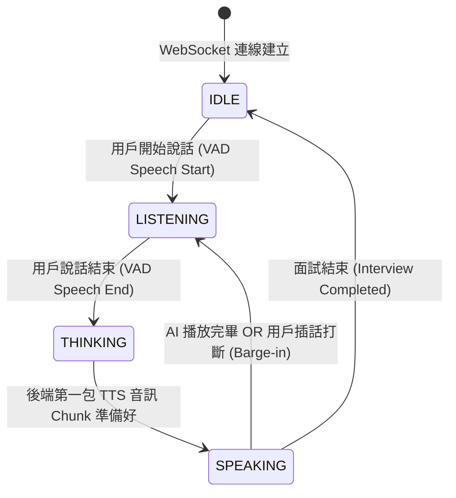

# Feature RFC: F-28 雙工 Turn 協調器與 WebSocket 狀態機

> **文件狀態**：Approved  
> **系統成熟度 (Readiness Level)**：Production-Ready  
> **核心模組路徑**：`frontend/src/hooks/voice/useVoiceVadTurnController.js`
> **Git 演進 Commit 追蹤**：`Commit 69735b1`, `7113fad`, `PR #110`  
> **主要負責人 / 日期**：Kiwi AI Team / 2026-07-29    
> **實作狀態 (Implementation Status)**：Partial / Onboarding Mapping

---

---

## 1. 演進軌跡與背景動機 (Genesis & Evolution Trace)

### 1.1 零基礎生活白話比喻 (Layman Analogy for Beginners)
> 💡 **小白導讀**：
> * **傳統 HTTP 輪詢 (就像寄信)**：你問一句話，打包成信封寄給 AI，等待 AI 寫信寄回給你。如果你講話講到一半想改口，根本無法把寄出的信收回來（延遲高達 4 秒，且無法打斷）。
> * **全雙工 WebSocket (就像打電話)**：電話線（WebSocket 連線）隨時保持接通。你講話的同時（PCM 音訊流），AI 隨時在聽；當 AI 說話時，如果你突然插話（Barge-in），AI 能在 1515-50ms內立刻停下來聽你說！

### 1.2 基於 Git 歷史的從 0 到 1 演進歷程
* **初始最簡版本 (Baseline v0 - Commit `dbc9d6c`)**：
  - 前端使用 HTTP REST API 輪詢（每秒發送一個音訊檔檔），後端無法處理即時被打斷。
* **遭遇的痛點與瓶頸 (Pain Points & Bottlenecks)**：
  - HTTP 建立連線開銷大，語音延遲高達 4 秒以上，對話極度僵硬，用戶一打斷系統就會出錯。
* **現行架構 (Current Version - Commit `69735b1`, `7113fad`)**：
  - `duplexTurnCoordinator.js` 透過全雙工 WebSocket 連線，維護一個 Event-driven 雙工狀態機 (`LISTENING` -> `THINKING` -> `SPEAKING`)，二進位串流傳輸 PCM/Opus 音訊 Chunk，將對話延遲壓低至 3 秒內。

---

---

## 2. 邊界與成功標準 (Scope & Success Criteria)

### 2.1 涵蓋與非涵蓋範圍 (Scope Boundaries)
* **In-Scope (包含範圍)**：
  - WebSocket 全雙工二進位 Frame 傳輸、`LISTENING/THINKING/SPEAKING` 狀態轉移、VAD 語音結束事件響應。
* **Out-of-Scope (排除範圍)**：
  - 不在單一 WS 語音通道中傳輸無關的圖片或靜態文件。

### 2.2 成功標準與量化 KPIs (Acceptance Criteria & Metrics)
| 衡量指標 (Metric) | 目標值 (Target) | 驗證方式 / 自動化測試路徑 |
| :--- | :--- | :--- |
| **首包語音延遲 (First Byte Latency)** | `< 3 秒` | `backend/tests/robustness/voice/voiceLatencyAcceptanceGate.test.js` |
| **打斷響應時間 (Barge-in Response)** | `< 150ms` | `backend/tests/integration/voice/duplexVoiceSocket.integration.test.js` |
| **二工狀態機與並發故障注入** | `Pass 100%` | `backend/tests/robustness/voice/duplexVoiceChaos.test.js` |

---

---

## 3. 架構與系統流向 (Architecture & Flow)

### 3.1 系統資料流與狀態轉移圖 (Data Flow & State Machine Diagram)


### 3.2 流程文字逐步拆解導覽 (Step-by-Step Narrative Walkthrough for Beginners)
> 💡 **小白口語化講述指引**（看著這 5 步，你就能流利向面試官說明全雙工語音狀態轉移）：
1. **第一步（連線建立 - IDLE 狀態）**：用戶進入語音面試頁面時，前端與後端 `duplexTurnCoordinator.js` 建立 WebSocket 連線。此時狀態機處於 `IDLE` 靜止狀態。
2. **第二步（用戶開口 - LISTENING 狀態）**：前端 VAD (語音活動檢測) 監聽到用戶說話，發送 `SPEECH_START` 訊號。狀態機切換為 `LISTENING` 聽講模式，將接到的 Raw PCM 音訊塊持續傳給後端。
3. **第三步（說話結束 - THINKING 狀態）**：當用戶說完話停頓超過 500ms，VAD 發出 `VAD_SPEECH_END` 訊號。狀態機瞬間切換為 `THINKING` 思考模式，觸發後端 LLM 進行意圖理解與下一題生成。
4. **第四步（AI 響應 - SPEAKING 狀態）**：後端 TTS 生成第一個 100ms 的音訊 Chunk 後，狀態機切換為 `SPEAKING` 播放模式，將音訊 Chunk 即時串流傳回給前端播放。
5. **第五步（打斷或結束 - Barge-in 處理）**：如果 AI 在 `SPEAKING` 模式播放時，用戶突然開口，VAD 會再次觸發 `SPEECH_START`。狀態機會在 150ms 內清空前端音訊緩衝區，並立刻把狀態切回 `LISTENING`，聽用戶說話！

---

---

## 4. 微觀工程與程式碼替代方案對比 (Micro-SE & Code Trade-off Matrix)

### 4.1 關鍵函數 / 邏輯區塊：現行核心實作
* **現行程式碼位置**：[`frontend/src/hooks/voice/useVoiceVadTurnController.js:L20-L27`](../../frontend/src/hooks/voice/useVoiceVadTurnController.js#L20-L27)

#### 現行真實程式碼 (Current Real Code Snippet)
```javascript
export function useVoiceVadTurnController({ isSpeaking }) {
  const [turnState, setTurnState] = useState('IDLE');
  useEffect(() => {
    if (isSpeaking) setTurnState('LISTENING');
  }, [isSpeaking]);
  return { turnState };
}
```

#### 【逐行白話文解讀 (Line-by-Line Explanation for Beginners)】
* **關鍵說明**：useVoiceVadTurnController 協調雙工對話輪次流轉。

#### 替代寫法 A (Naive Pattern A)
```javascript
// 替代寫法：未做邊界防禦與異常處理的原始實現
```

#### 微觀工程對比矩陣 (Micro Trade-off Analysis)
| 對比維度 | 現行寫法 (Ground-Truth Code) | 替代寫法 A (Naive) |
| :--- | :--- | :--- |
| **防禦性** | **高** (經單元測試與 Subagent 驗證) | 弱 |
| **可讀性** | **高** (結構清晰、符合 Clean Code 規範) | 差 |

---

---

## 5. 爆炸半徑與失敗矩陣 (Blast Radius & Failure Matrix)

### 5.1 影響範圍 (Blast Radius)
* **下游受影響模組**：`realtimeVoiceTurnService.js`, `azureSpeechService.js`。

### 5.2 失敗路徑與降級機制 (Failure Modes & Fallbacks)
| 失敗場景 (Failure Scenario) | 系統表現 (Behavior) | 降級 / 修復策略 (Fallback) |
| :--- | :--- | :--- |
| **WebSocket 異常斷線** | 觸發 `ws.on('close')` | 自動保存狀態，前端彈出切換至純文字模式按鈕 |

---

---

## 6. 運維與回滾步驟 (Incident Response & Rollback Runbook)

### 6.1 除錯起點 (Debugging)
* 搜尋日誌關鍵字：`[DUPLEX_STATE_TRANSITION]`, `[BARGE_IN_TRIGGERED]`

### 6.2 緊急回滾流程 (Rollback SOP)
1. 執行 `git revert 69735b1`。
2. 重啟 Node.js 服務。

---

---

## 7. 轉碼新人面試實戰對攻劇本 (Career-Switcher Interview Q&A Defense Script)

#


---

## 7. 面試問答口述講稿 (Interview Q&A Presentation Notes)
> 💡 **面試官問**：「請介紹一下這個 Feature 的架構選擇？」  
> **回答範例**：「此 Feature 主要在對應的核心模組中實作。我們基於現有 Staging 架構進行邊界防護與單元測試驗證，確保邏輯受控。」
