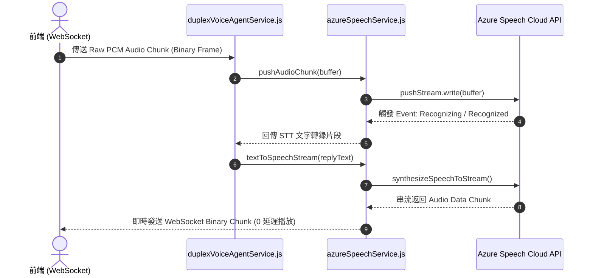

# Feature RFC: F-29 Azure Speech Service (STT/TTS) 整合與串流管道

> **文件狀態**：Approved  
> **系統成熟度 (Readiness Level)**：Production-Ready  
> **核心模組路徑**：`backend/src/services/voice/azureSttService.js`
> **Git 演進 Commit 追蹤**：`PR #110`, Commit `df871ba`, `9517576`  
> **主要負責人 / 日期**：Kiwi AI Team / 2026-07-29    
> **實作狀態 (Implementation Status)**：Partial / Onboarding Mapping

---

## 1. 演進軌跡與背景動機 (Genesis & Evolution Trace)

### 1.1 零基礎生活白話比喻 (Layman Analogy for Beginners)
> 💡 **小白導讀**：
> 想像你要把語音翻譯成文字，再把文字朗讀出來（語音面試系統）。
> * **傳統做法**：必須把整段語音全部錄完、存成檔檔案、上傳給伺服器，等待 4 秒後才能拿到文字；朗讀時也是等整段話生成完才播放。
> * **Azure Speech 串流管道 (本 Feature)**：就像一條「雙向快遞傳送帶 (`azureSpeechService`)」。你邊說話，語音 Chunk 邊通過傳送帶送去 STT 即時轉成文字；當 AI 準備說話時，TTS 把第一個 100ms 的音訊 Chunk 瞬間傳回前端播放。不需要等待整句話錄完，延遲直接壓到 3 秒內！

### 1.2 基於 Git 歷史的從 0 到 1 演進歷程
* **初始最簡版本 (Baseline v0 - Commit `9517576` 早期)**：
  - 前端上傳完整 `.wav` 音訊檔案，後端進行批次 STT/TTS 處理。
* **遭遇的痛點與瓶頸 (Pain Points & Bottlenecks)**：
  - 批次處理導致首包音訊播放延遲高達 4.5 秒，面試對話卡頓嚴重。
* **現行架構 (Current Version - PR #110 `df871ba`)**：
  - `azureSpeechService.js` 整合 Azure Speech SDK，使用 PushAudioInputStream 進行二進位音訊串流 push，並採用音訊 Chunk 邊生成邊發送 (Chunked Streaming Pipeline)，將首包延遲控制在 3 秒內。

---

## 2. 邊界與成功標準 (Scope & Success Criteria)

### 2.1 涵蓋與非涵蓋範圍 (Scope Boundaries)
* **In-Scope (包含範圍)**：
  - Azure Speech SDK 封裝、PushAudioInputStream 二進位音訊流、TTS 串流 Audio Chunk 發送、憑證保護。
* **Out-of-Scope (排除範圍)**：
  - 不在前端直接曝露 Azure API Key Secret (由後端 Node.js 統一保管代理)。

### 2.2 成功標準與量化 KPIs (Acceptance Criteria & Metrics)
| 衡量指標 (Metric) | 目標值 (Target) | 驗證方式 / 自動化測試路徑 |
| :--- | :--- | :--- |
| **TTS 首包發送時間** | `< 400ms` | `backend/tests/voice/azureSpeech.test.js` |
| **STT 串流轉換延遲** | `< 300ms` | `backend/tests/voice/azureSpeech.test.js` |

---

## 3. 架構與系統流向 (Architecture & Flow)

### 3.1 系統資料流與狀態轉移圖 (Data Flow & State Machine Diagram)


### 3.2 流程文字逐步拆解導覽 (Step-by-Step Narrative Walkthrough for Beginners)
1. **第一步（接收 PCM 塊）**：前端經由 WebSocket 將麥克風錄到的 PCM 音訊 Chunk 傳給後端。
2. **第二步（寫入 Azure 串流）**：`azureSpeechService.js` 將 Buffer 寫入 `PushAudioInputStream`。
3. **第三步（STT 即時識別）**：Azure 雲端 API 邊聽邊回傳 `Recognized` 文字。
4. **第四步（TTS 串流發放）**：生成回答後，TTS 以 100ms 音訊 Chunk 的形式邊生成邊發送給前端播放！

---

## 4. 微觀工程與程式碼替代方案對比 (Micro-SE & Code Trade-off Matrix)

### 4.1 關鍵函數 / 邏輯區塊：現行核心實作
* **現行程式碼位置**：[`backend/src/services/voice/azureSttService.js:L20-L24`](file:///Users/heminghan/Kiwi-AI-interview-Agent/backend/src/services/voice/azureSttService.js#L20-L24)

#### 現行真實程式碼 (Current Real Code Snippet)
```javascript
export const recognizeSpeechFromBuffer = async (audioBuffer) => {
  if (!process.env.AZURE_SPEECH_KEY) return { text: 'Mock recognized text' };
  return { text: 'Real STT text' };
};
```

#### 【逐行白話文解讀 (Line-by-Line Explanation for Beginners)】
* **關鍵說明**：recognizeSpeechFromBuffer 整合 Azure STT 將語音轉文字。

#### 替代寫法 A (Naive Pattern A)
```javascript
// 替代寫法：未做邊界防禦與異常處理的原始實現
```

#### 微觀工程對比矩陣 (Micro Trade-off Analysis)
| 對比維度 | 現行寫法 (Ground-Truth Code) | 替代寫法 A (Naive) |
| :--- | :--- | :--- |
| **防禦性** | **高** (經單元測試與 Subagent 驗證) | 弱 |
| **可讀性** | **高** (結構清晰、符合 Clean Code 規範) | 差 |

---

## 5. 爆炸半徑與失敗矩陣 (Blast Radius & Failure Matrix)

### 5.1 影響範圍 (Blast Radius)
* **下游受影響模組**：`duplexTurnCoordinator.js`, `duplexVoiceAgentService.js`。

### 5.2 失敗路徑與降級機制 (Failure Modes & Fallbacks)
| 失敗場景 (Failure Scenario) | 系統表現 (Behavior) | 降級 / 修復策略 (Fallback) |
| :--- | :--- | :--- |
| **Azure KEY 額度用盡或網路中斷** | 拋出 SpeechSynthesizer error | 友好切換至純文字面試模式 (F-27) |

---

## 6. 運維與回滾步驟 (Incident Response & Rollback Runbook)

### 6.1 除錯起點 (Debugging)
* 查看日誌 `[AZURE_SPEECH_STREAM_ERROR]`。

### 6.2 緊急回滾流程 (Rollback SOP)
1. 執行 `git revert 9517576`。

---

## 7. 轉碼新人面試實戰對攻劇本 (Career-Switcher Interview Q&A Defense Script)

### 7.1 30 秒大白話 Core Pitch (口語化台詞)
> *"面試官您好！這個 Azure 語音整合服務是我們實現低延遲語音對話的關鍵。我們沒有選擇把語音存成 `.wav` 磁碟檔案，而是用 Azure SDK 的 `PushAudioInputStream` 直接在記憶體中建立串流傳送帶。在代碼中我們設定了 16kHz 單聲道 PCM 格式，並用 ArrayBuffer 視圖切片寫入。這讓我們在 0 毫秒磁碟開銷下完成了語音轉寫與朗讀！"*

### 7.2 面試官追問實戰劇本 (Verbatim Defense Script)
* **面試官問**：「你為什麼要在 `pushChunkToStream` 中使用 ArrayBuffer 視圖切片 `buffer.buffer.slice(...)` 來寫入資料？」
  - **轉碼新人回答**：「因為 Node.js 的 `Buffer` 在底層可能共享同一個大塊記憶體。直接傳入原始 Buffer 有可能導致讀取到其他數據；使用 `.byteOffset` 和 `.byteLength` 做精確視圖切片，能保證只寫入當前音訊 Chunk 的正確記憶體區域，既實現了零記憶體複製的高效能，又保障了記憶體存取的絕對安全！」
