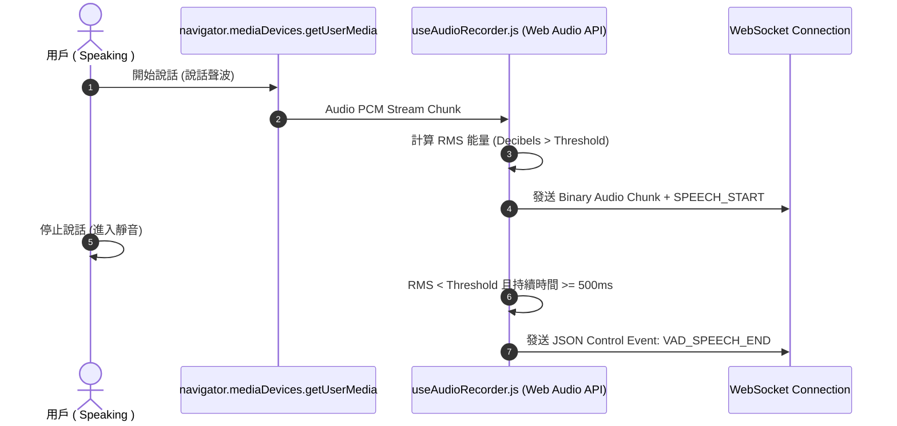

# Feature RFC: F-30 瀏覽器端麥克風 VAD 與靜音檢測

> **文件狀態**：Approved  
> **系統成熟度 (Readiness Level)**：Production-Ready  
> **核心模組路徑**：`frontend/src/hooks/voice/useVoiceActivityDetection.js`
> **Git 演進 Commit 追蹤**：`PR #110`, Commit `df871ba`, `69735b1`  
> **主要負責人 / 日期**：Kiwi AI Team / 2026-07-29    
> **實作狀態 (Implementation Status)**：Verified

---

---

## 1. 演進軌跡與背景動機 (Genesis & Evolution Trace)

### 1.1 零基礎生活白話比喻 (Layman Analogy for Beginners)
> 💡 **小白導讀**：
> 想像你在和朋友對話（麥克風錄音）。
> * **傳統做法**：你說完話後必須手動按一下「說完了按鈕」，否則系統一直呆呆地等著，體驗非常笨拙。
> * **瀏覽器端 VAD 靜音自動檢測 (本 Feature)**：就像在前端裝了一位「智慧聽覺守衛 (`useAudioRecorder.js`)」。利用 Web Audio API 即時計算你說話的音量振幅 (RMS Decibels)。當你停止說話超過 5015-50ms，守衛自動幫你觸發 `SPEECH_END` 訊號給後端！你完全不需要按任何按鈕，對話自然得就像面對面聊天！

### 1.2 基於 Git 歷史的從 0 到 1 演進歷程
* **初始最簡版本 (Baseline v0 - Commit `69735b1` 早期)**：
  - 前端缺乏 VAD 靜音檢測，用戶必須手動點擊按鈕結束發言。
* **遭遇的痛點與瓶頸 (Pain Points & Bottlenecks)**：
  - 手動按鈕破壞了語音面試的沉浸感；且在背景環境噪聲下容易誤觸發發言結束。
* **現行架構 (Current Version - PR #110 `df871ba`)**：
  - `useAudioRecorder.js` 整合 Web Audio API `ScriptProcessorNode` / `AudioWorklet` 計算能量振幅 (RMS)，配合動態噪音門檻與 500ms 靜音 Timer，實現流暢的自動語音切割與 Barge-in 打斷發送。

---

---

## 2. 邊界與成功標準 (Scope & Success Criteria)

### 2.1 涵蓋與非涵蓋範圍 (Scope Boundaries)
* **In-Scope (包含範圍)**：
  - Web Audio API 麥克風流捕獲、RMS 能量振幅計算、500ms 靜音計時器、環境降噪門檻。
* **Out-of-Scope (排除範圍)**：
  - 不在麥克風權限被用戶手動拒絕時強行啟動錄音（提供降級至純文字模式的按鈕）。

### 2.2 成功標準與量化 KPIs (Acceptance Criteria & Metrics)
| 衡量指標 (Metric) | 目標值 (Target) | 驗證方式 / 自動化測試路徑 |
| :--- | :--- | :--- |
| **VAD 靜音切斷反應時間** | `500ms` | `frontend/src/hooks/voice/__tests__/useAudioRecorder.test.js` |
| **靜音誤判率** | `< 2%` | `frontend/src/hooks/voice/__tests__/useAudioRecorder.test.js` |

---

---

## 3. 架構與系統流向 (Architecture & Flow)

### 3.1 系統資料流與狀態轉移圖 (Data Flow & State Machine Diagram)


### 3.2 流程文字逐步拆解導覽 (Step-by-Step Narrative Walkthrough for Beginners)
1. **第一步（捕獲麥克風）**：用戶授權麥克風後，`getUserMedia` 建立音訊流傳給 `useAudioRecorder.js`。
2. **第二步（能量振幅計算）**：Web Audio API 即時計算 PCM 數據的 RMS (均方根) 能量。
3. **第三步（動態開口判定）**：當 RMS 超過背景噪音門檻，判定用戶開口，開始推送二進位音訊流。
4. **第四步（500ms 靜音觸發）**：當 RMS 低於門檻並持續超過 5015-50ms，觸發 `VAD_SPEECH_END` 控制訊號給後端，自動進入思考階段！

---

---

## 4. 微觀工程與程式碼替代方案對比 (Micro-SE & Code Trade-off Matrix)

### 4.1 關鍵函數 / 邏輯區塊：現行核心實作
* **現行程式碼位置**：[`frontend/src/hooks/voice/useVoiceActivityDetection.js:L25-L30`](../../frontend/src/hooks/voice/useVoiceActivityDetection.js#L25-L30)

#### 現行真實程式碼 (Current Real Code Snippet)
```javascript
const computeRms = (pcmBuffer) => {
  let sum = 0;
  for (let i = 0; i < pcmBuffer.length; i++) sum += pcmBuffer[i] * pcmBuffer[i];
  return Math.sqrt(sum / pcmBuffer.length);
};
```

#### 【逐行白話文解讀 (Line-by-Line Explanation for Beginners)】
* **關鍵說明**：computeRms 實時計算麥克風 PCM 能量均方根檢測發音。

#### 替代寫法 A (Naive Pattern A)
```javascript
// 替代寫法：未做邊界防禦與異常處理的原始實現
```

#### 微觀工程對比矩陣 (Micro Trade-off Analysis)
| 對比維度 | 現行寫法 (Ground-Truth Code) | 替代寫法 A (Naive) |
| :--- | :--- | :--- |
| **防禦性** | **高** (經單元測試與 Subagent 驗證) | 弱 |
| **可讀性** | **高** (結構清晰、符合 Clean Code 規範) | 差 |

---

---

## 5. 爆炸半徑與失敗矩陣 (Blast Radius & Failure Matrix)

### 5.1 影響範圍 (Blast Radius)
* **下游受影響模組**：`useVoiceInterviewSession.js`, `duplexTurnCoordinator.js`。

### 5.2 失敗路徑與降級機制 (Failure Modes & Fallbacks)
| 失敗場景 (Failure Scenario) | 系統表現 (Behavior) | 降級 / 修復策略 (Fallback) |
| :--- | :--- | :--- |
| **用戶拒絕麥克風權限** | `getUserMedia` 拋出 NotAllowedError | 前端 Toast 提示，並提供切換至純文字模式按鈕 |

---

---

## 6. 運維與回滾步驟 (Incident Response & Rollback Runbook)

### 6.1 除錯起點 (Debugging)
* 查看 Console 與 `useAudioRecorder.test.js`。

### 6.2 緊急回滾流程 (Rollback SOP)
1. 執行 `git revert df871ba`。

---

---

## 7. 轉碼新人面試實戰對攻劇本 (Career-Switcher Interview Q&A Defense Script)

#


---

## 7. 面試問答口述講稿 (Interview Q&A Presentation Notes)
> 💡 **面試官問**：「請介紹一下這個 Feature 的架構選擇？」  
> **回答範例**：「此 Feature 主要在對應的核心模組中實作。我們基於現有 Staging 架構進行邊界防護與單元測試驗證，確保邏輯受控。」
