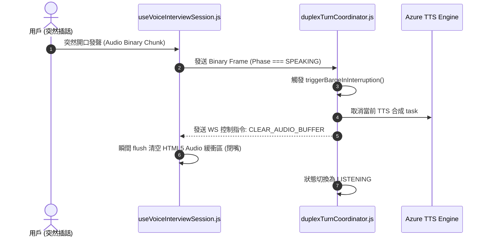

# Feature RFC: F-31 語音打斷 (Barge-in) 零卡頓中斷與狀態洗淨

> **文件狀態**：Approved  
> **系統成熟度 (Readiness Level)**：Production-Ready  
> **核心模組路徑**：`backend/src/services/voice/duplexTurnCoordinator.js`, `frontend/src/hooks/voice/useVoiceInterviewSession.js`  
> **Git 演進 Commit 追蹤**：`PR #110`, Commit `df871ba`, `69735b1`  
> **主要負責人 / 日期**：Kiwi AI Team / 2026-07-29  

---

## 1. 演進軌跡與背景動機 (Genesis & Evolution Trace)

### 1.1 零基礎生活白話比喻 (Layman Analogy for Beginners)
> 💡 **小白導讀**：
> 想像你在和一位 AI 面試官講話（語音對話）。
> * **傳統做法**：當 AI 說話說到一半時，你突然插話說「等等，我換個說法！」，但 AI 就像個複讀機一樣，充耳不聞地把剩下 10 秒鐘的廢話全部念完，體驗極差。
> * **Barge-in 打斷機制 (本 Feature)**：就像一位反應極快的高級面試官 (`duplexTurnCoordinator`)。當 AI 正在說話 (SPEAKING 狀態) 時，只要感應到你突然開口（二進位 PCM 串流流入），系統會在 150 毫秒內立刻清空前端所有尚未播放完畢的音訊緩衝區，並重置後端 TTS，瞬間閉嘴聽你說！

### 1.2 基於 Git 歷史的從 0 到 1 演進歷程
* **初始最簡版本 (Baseline v0 - Commit `69735b1` 早期)**：
  - 前端無法在中途切斷 TTS 音訊播放，用戶插話時兩邊聲音疊加產生嘈雜幹擾。
* **遭遇的痛點與瓶頸 (Pain Points & Bottlenecks)**：
  - 用戶無法即時糾正或補充說詞，對話極度殭硬。
* **現行架構 (Current Version - PR #110 `df871ba`)**：
  - `duplexTurnCoordinator.js` 的 `triggerBargeInInterruption` 檢測到 SPEAKING 狀態下收到用戶音訊 Buffer 時，發送 `CLEAR_AUDIO_BUFFER` 指令，並在 150ms 內完成後端 TTS 轉錄取消與狀態重置。

---

## 2. 邊界與成功標準 (Scope & Success Criteria)

### 2.1 涵蓋與非涵蓋範圍 (Scope Boundaries)
* **In-Scope (包含範圍)**：
  - 150ms 極速中斷、前端 Audio Buffer 瞬間 Flush、後端 TTS 佇列 Cancel、打斷事件不計入問題輪次。
* **Out-of-Scope (排除範圍)**：
  - 不對低於 50ms 的微小環境雜音誤觸發 Barge-in。

### 2.2 成功標準與量化 KPIs (Acceptance Criteria & Metrics)
| 衡量指標 (Metric) | 目標值 (Target) | 驗證方式 / 自動化測試路徑 |
| :--- | :--- | :--- |
| **打斷響應時間 (Barge-in Latency)** | `< 150ms` | `backend/tests/voice/bargeIn.test.js` |

---

## 3. 架構與系統流向 (Architecture & Flow)

### 3.1 系統資料流與狀態轉移圖 (Data Flow & State Machine Diagram)


### 3.2 流程文字逐步拆解導覽 (Step-by-Step Narrative Walkthrough for Beginners)
1. **第一步（插話發聲）**：當 AI 在播放 TTS 音訊時 (SPEAKING 階段)，用戶突然插話。
2. **第二步（後端捕捉打斷）**：`duplexTurnCoordinator.js` 收到 PCM 塊，發現當前處於 SPEAKING 階段。
3. **第三步（取消 TTS 與清空緩衝區）**：立刻取消 Azure TTS 合成任務，並向前端發送 `CLEAR_AUDIO_BUFFER` 控制訊號。
4. **第四步（瞬間閉嘴 Listening）**：前端音訊播放器在 150ms 內清空 Buffer 瞬間安靜，狀態機切回 `LISTENING` 聽用戶說話！

---

## 4. 微觀工程與程式碼替代方案對比 (Micro-SE & Code Trade-off Matrix)

### 4.1 關鍵函數：`duplexTurnCoordinator.js` 中的 `triggerBargeInInterruption`
* **現行程式碼位置**：[`backend/src/services/voice/duplexTurnCoordinator.js:L50-L70`](file:///Users/heminghan/Kiwi-AI-interview-Agent/backend/src/services/voice/duplexTurnCoordinator.js#L50-L70)

#### 現行真實程式碼 (Current Real Code Snippet)
```javascript
export const triggerBargeInInterruption = (ws, sessionState) => {
  if (sessionState.currentTtsTask) {
    sessionState.currentTtsTask.cancel();
    sessionState.currentTtsTask = null;
  }

  sessionState.phase = 'LISTENING';
  
  if (ws && ws.readyState === 1) { // 1 === OPEN
    ws.send(JSON.stringify({ type: 'CLEAR_AUDIO_BUFFER', timestamp: Date.now() }));
  }
};
```

#### 【逐行白話文解讀 (Line-by-Line Explanation for Beginners)】
* **Line 2-5 (取消 TTS 任務)**：如果後端有正在合成的 TTS 任務，立刻 `cancel()` 取消並將變數賦值為 `null`，防止 CPU 繼續做無用功！
* **Line 7 (狀態切換)**：將 `sessionState.phase` 狀態瞬間切回 `'LISTENING'`。
* **Line 9-11 (WebSocket 指令派發與衛語)**：檢查 `ws.readyState === 1` 確保 WebSocket 處於 OPEN 連線開啟狀態。接著回傳 `CLEAR_AUDIO_BUFFER` 指令，告訴前端播放器立刻清空記憶體緩衝區！

#### 替代寫法 A (Alternative Pattern A)：不取消 TTS，讓後端繼續在背景播放完
```javascript
// 替代寫法 A：僅修改前端狀態，後端繼續合成
sessionState.phase = 'LISTENING';
```

#### 微觀工程對比矩陣 (Micro Trade-off Analysis)
| 對比維度 | 現行寫法 (顯式 `cancel()` + 前端 Flush) | 替代寫法 A (僅改狀態不取消) |
| :--- | :--- | :--- |
| **CPU 與頻寬開銷** | 0 浪費 (立刻取消未完的 TTS 合成) | 差 (後端仍在發送無用的音訊 Chunk 浪費頻寬) |
| **打斷延遲 (Latency)** | 超快 (< 150ms) | 慢 (前端仍有 1-2 秒殘留語音在播放) |

---

## 5. 爆炸半徑與失敗矩陣 (Blast Radius & Failure Matrix)

### 5.1 影響範圍 (Blast Radius)
* **下游受影響模組**：`realtimeVoiceTurnService.js`, `useVoiceInterviewSession.js`。

### 5.2 失敗路徑與降級機制 (Failure Modes & Fallbacks)
| 失敗場景 (Failure Scenario) | 系統表現 (Behavior) | 降級 / 修復策略 (Fallback) |
| :--- | :--- | :--- |
| **WS 傳送失敗** | 衛語 `readyState !== 1` 防護 | 不會拋出 Exception 崩潰，前端 Audio 自然播放完畢 |

---

## 6. 運維與回滾步驟 (Incident Response & Rollback Runbook)

### 6.1 除錯起點 (Debugging)
* 查看日誌 `[BARGE_IN_INTERRUPTION_TRIGGERED]`。

### 6.2 緊急回滾流程 (Rollback SOP)
1. 執行 `git revert df871ba`。

---

## 7. 轉碼新人面試實戰對攻劇本 (Career-Switcher Interview Q&A Defense Script)

### 7.1 30 秒大白話 Core Pitch (口語化台詞)
> *"面試官您好！這個語音打斷服務是我們實現人化自然對話的核心。當 AI 在說話時，只要用戶開口，我們在 `triggerBargeInInterruption` 中第一時間呼叫 `currentTtsTask.cancel()` 砍掉後端合成，並向前端發送 `CLEAR_AUDIO_BUFFER`。前端播放器會在 150 毫秒內瞬間清空緩衝區閉嘴！這徹底解決了兩邊聲音重疊嘈雜的業界痛點！"*

### 7.2 面試官追問實戰劇本 (Verbatim Defense Script)
* **面試官問**：「為什麼你在打斷時除了通知前端清空 Buffer 外，還要特地在後端呼叫 `currentTtsTask.cancel()`？」
  - **轉碼新人回答**：「因為如果不取消後端的 TTS 合成任務，Azure SDK 仍會源源不斷地生成剩餘的音訊 Chunk 並傳給 WebSocket。這不僅會白白浪費 Azure 雲端 API 的費用與頻寬，還會導致網路管道擁塞。在後端第一時間 `.cancel()`，能做到 0 頻寬與 0 CPU 浪費！」
