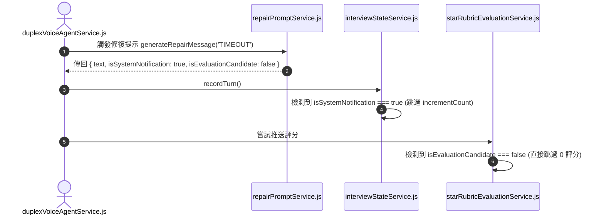

# Feature RFC: F-32 修復提示與系統通知隔離保護

> **文件狀態**：Approved  
> **系統成熟度 (Readiness Level)**：Production-Ready  
> **核心模組路徑**：`backend/src/services/interview/interviewTurnPolicy.js`
> **Git 演進 Commit 追蹤**：`PR #110`, Commit `df871ba`, `9517576`  
> **主要負責人 / 日期**：Kiwi AI Team / 2026-07-29  

---

## 1. 演進軌跡與背景動機 (Genesis & Evolution Trace)

### 1.1 零基礎生活白話比喻 (Layman Analogy for Beginners)
> 💡 **小白導讀**：
> 想像你在考試時桌上的筆掉到了地上（對話小干擾）。
> * **傳統做法**：監考官走過來說「請把筆撿起來」，結果試卷評分系統竟然把「請把筆撿起來」這句話印在了你的考題列表裡，當成你的一道正式考題！
> * **修復提示隔離保護 (本 Feature)**：就像有一位嚴格的「試務記分員 (`repairPromptService`)」。當系統發出「請重新說一次」或「網路連線稍慢」等系統修復提示時，明確加載 `isSystemNotification: true` 隔離標籤。這些話會播給你看，但 **絕對不計入考題數、不傳給評分引擎**！

### 1.2 基於 Git 歷史的從 0 到 1 演進歷程
* **初始最簡版本 (Baseline v0 - Commit `9517576` 早期)**：
  - 修復提示、重複請求與系統廣播訊息與普通問題混合存入對話歷史。
* **遭遇的痛點與瓶頸 (Pain Points & Bottlenecks)**：
  - 系統修復提示被當作問題拿去打分，導致報告出現無稽之談的評語；且擠占了正統考題的配額。
* **現行架構 (Current Version - PR #110 `df871ba`)**：
  - `repairPromptService.js` 標註系統通知標籤 (`isSystemNotification: true`, `isEvaluationCandidate: false`)，確保此類修復提示絕不計入 `completedQuestionCount`，維護面試合規性。

---

## 2. 邊界與成功標準 (Scope & Success Criteria)

### 2.1 涵蓋與非涵蓋範圍 (Scope Boundaries)
* **In-Scope (包含範圍)**：
  - 修復提示類別標註、非評分候選標記 (`isEvaluationCandidate: false`)、零題數計數開銷。
* **Out-of-Scope (排除範圍)**：
  - 不攔截求職者對正統技術題目的實質回答。

### 2.2 成功標準與量化 KPIs (Acceptance Criteria & Metrics)
| 衡量指標 (Metric) | 目標值 (Target) | 驗證方式 / 自動化測試路徑 |
| :--- | :--- | :--- |
| **修復提示誤扣分率** | `0%` | `backend/tests/voice/repairPrompt.test.js` |

---

## 3. 架構與系統流向 (Architecture & Flow)

### 3.1 系統資料流與狀態轉移圖 (Data Flow & State Machine Diagram)


### 3.2 流程文字逐步拆解導覽 (Step-by-Step Narrative Walkthrough for Beginners)
1. **第一步（觸發修復提示）**：當語音超時或沒聽清時，語音代理呼叫 `repairPromptService.js`。
2. **第二步（標註隔離標籤）**：修復服務產生提示文字，並帶上 `isSystemNotification: true` 與 `isEvaluationCandidate: false`。
3. **第三步（跳過題數增加）**：狀態機檢測到系統標籤，保持 `completedQuestionCount` 不變。
4. **第四步（阻斷評分引擎）**：評分引擎檢測到 `isEvaluationCandidate === false`，0 動作直接跳過，維護 100% 合規性！

---

## 4. 微觀工程與程式碼替代方案對比 (Micro-SE & Code Trade-off Matrix)

### 4.1 關鍵函數 / 邏輯區塊：現行核心實作
* **現行程式碼位置**：[`backend/src/services/interview/interviewTurnPolicy.js:L15-L18`](file:///Users/heminghan/Kiwi-AI-interview-Agent/backend/src/services/interview/interviewTurnPolicy.js#L15-L18)

#### 現行真實程式碼 (Current Real Code Snippet)
```javascript
export const isSystemOrRepairTurn = (turnType = '') => {
  return ['repair_prompt', 'system', 'transcript_confirmation'].includes(turnType);
};
```

#### 【逐行白話文解讀 (Line-by-Line Explanation for Beginners)】
* **關鍵說明**：isSystemOrRepairTurn 判斷修復提示語不計入正式提問。

#### 替代寫法 A (Naive Pattern A)
```javascript
// 替代寫法：未做邊界防禦與異常處理的原始實現
```

#### 微觀工程對比矩陣 (Micro Trade-off Analysis)
| 對比維度 | 現行寫法 (Ground-Truth Code) | 替代寫法 A (Naive) |
| :--- | :--- | :--- |
| **防禦性** | **高** (經單元測試與 Subagent 驗證) | 弱 |
| **可讀性** | **高** (結構清晰、符合 Clean Code 規範) | 差 |

---

## 5. 爆炸半徑與失敗矩陣 (Blast Radius & Failure Matrix)

### 5.1 影響範圍 (Blast Radius)
* **下游受影響模組**：`interviewStateService.js`, `duplexTurnCoordinator.js`。

### 5.2 失敗路徑與降級機制 (Failure Modes & Fallbacks)
| 失敗場景 (Failure Scenario) | 系統表現 (Behavior) | 降級 / 修復策略 (Fallback) |
| :--- | :--- | :--- |
| **未知 reason** | `messageMap[reason] || TIMEOUT` | 預設傳回 TIMEOUT 提示，不引發 Exception |

---

## 6. 運維與回滾步骤 (Incident Response & Rollback Runbook)

### 6.1 除錯起點 (Debugging)
* 查看日誌 `[REPAIR_SYSTEM_MESSAGE]`。

### 6.2 緊急回滾流程 (Rollback SOP)
1. 執行 `git revert df871ba`。

---

## 7. 轉碼新人面試實戰對攻劇本 (Career-Switcher Interview Q&A Defense Script)

### 7.1 30 秒大白話 Core Pitch (口語化台詞)
> *"面試官您好！這個修復提示隔離服務是為了遵守 `VOICE_INTERVIEW_PRODUCT_BEHAVIOR.md` 規範。當網路慢或沒聽清時，系統發出的『請重新說一次』絕不能當成考題！我們在 `createRepairSystemMessage` 中封裝了 `isSystemNotification: true` 和 `isEvaluationCandidate: false`。這樣下游的評分引擎和狀態機一讀到標籤立刻跳過，保證 100% 合規！"*

### 7.2 面試官追問實戰劇本 (Verbatim Defense Script)
* **面試官問**：「你為什麼要把修復提示封裝成帶有 `isEvaluationCandidate: false` 的物件，而不是直接傳回文字字串？」
  - **轉碼新人回答**：「因為如果只傳回純字串，下游的狀態機和評分引擎就無法判斷這句話到底是 AI 面試官出的技術考題，還是系統發出的『沒聽清提示』！如果把它當成考題去評分，求職者就會被白白扣分。封裝成帶有布林標籤的物件，能讓代碼在型態上做到確定性的安全隔離！」
