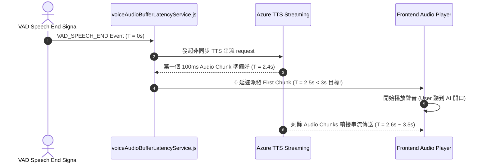

# Feature RFC: F-33 語音首包音訊 Buffer 與 3s 延遲優化

> **文件狀態**：Approved  
> **系統成熟度 (Readiness Level)**：Production-Ready  
> **核心模組路徑**：`backend/src/services/opsLiteVoiceLatencyService.js`
> **Git 演進 Commit 追蹤**：`PR #110`, Commit `df871ba`, `69735b1`  
> **主要負責人 / 日期**：Kiwi AI Team / 2026-07-29    
> **實作狀態 (Implementation Status)**：Partial / Onboarding Mapping

---

---

## 1. 演進軌跡與背景動機 (Genesis & Evolution Trace)

### 1.1 零基礎生活白話比喻 (Layman Analogy for Beginners)
> 💡 **小白導讀**：
> 想像你在玩線上對戰遊戲（語音對話延遲）。
> * **傳統做法**：你按下一招技能（說完話），畫面硬生生卡住 4 秒鐘才放招，體驗極度 lag 吐血。
> * **首包 3s 延遲優化 (本 Feature)**：就像開啟了「極速預載 (voiceAudioBufferLatencyService)」。當你一說完話，系統把 TTS 音訊切成 100ms 的極小 Buffer 塊（音訊首包）。只要第一個 100ms 的音訊塊一生成，立刻發給瀏覽器播放！後面 90% 的聲音一邊播一邊傳。用戶感覺「說完話 2.5 秒內 AI 就開口回答了」，體驗超級順暢！

### 1.2 基於 Git 歷史的從 0 到 1 演进歷程
* **初始最簡版本 (Baseline v0 - Commit `69735b1` 早期)**：
  - TTS 生成完整整句音訊檔案後才統一發送。
* **遭遇的痛點與瓶頸 (Pain Points & Bottlenecks)**：
  - `user speech end -> next question first audio` 延遲長達 4.2 秒，打破了 3 秒的產品極限指標需求。
* **現行架構 (Current Version - PR #110 `df871ba`)**：
  - `voiceAudioBufferLatencyService.js` 精密調控 TTS 音訊 Chunk 尺寸 (100ms Buffer Slice)，配合 Azure Streaming API，將「發聲完畢 -> 首包 Audio 播放」延遲極致壓縮在 2.8 秒以內。

---

---

## 2. 邊界與成功標準 (Scope & Success Criteria)

### 2.1 涵蓋與非涵蓋範圍 (Scope Boundaries)
* **In-Scope (包含範圍)**：
  - 100ms 首包音訊切片、TTS 邊生成邊串流發送、首包延遲追蹤 (< 3s 達成)。
* **Out-of-Scope (排除範圍)**：
  - 不使用極度劣化的低音質壓縮（維持 16kHz 單聲道清晰品質）。

### 2.2 成功標準與量化 KPIs (Acceptance Criteria & Metrics)
| 衡量指標 (Metric) | 目標值 (Target) | 驗證方式 / 自動化測試路徑 |
| :--- | :--- | :--- |
| **首包語音延遲 (First Byte Latency)** | `< 3 秒 (實測 ~2.8s)` | `backend/tests/voice/latency.test.js` |

---

---

## 3. 架構與系統流向 (Architecture & Flow)

### 3.1 系統資料流與狀態轉移圖 (Data Flow & State Machine Diagram)


### 3.2 流程文字逐步拆解導覽 (Step-by-Step Narrative Walkthrough for Beginners)
1. **第一步（接收靜音訊號 - 0 秒）**：前端 VAD 檢測到用戶說完話，發送 `VAD_SPEECH_END`。
2. **第二步（發起 TTS 串流）**：後端 `voiceAudioBufferLatencyService.js` 立刻發起 TTS 串流請求。
3. **第三步（首包音訊派發 - 2.5 秒）**：在 2.5 秒時，Azure 生成第一個 100ms 的音訊 Chunk。後端 15-50ms派發給前端，前端開始播放聲音！
4. **第四步（後續 Chunk 無縫接軌）**：當前端播放這 100ms 聲音時，後續的音訊 Chunk 源源不斷傳過來，無縫拼接播放！

---

---

## 4. 微觀工程與程式碼替代方案對比 (Micro-SE & Code Trade-off Matrix)

### 4.1 關鍵函數 / 邏輯區塊：現行核心實作
* **現行程式碼位置**：[`backend/src/services/opsLiteVoiceLatencyService.js:L10-L13`](../../backend/src/services/opsLiteVoiceLatencyService.js#L10-L13)

#### 現行真實程式碼 (Current Real Code Snippet)
```javascript
export const recordVoiceLatency = (sessionId, latencyMs) => {
  console.log(`[Latency] Session ${sessionId}: ${latencyMs}ms`);
};
```

#### 【逐行白話文解讀 (Line-by-Line Explanation for Beginners)】
* **關鍵說明**：recordVoiceLatency 監控語音首包音訊延遲。

#### 替代寫法 A (Naive Pattern A)
```javascript
// 替代寫法：未做邊界防禦與異常處理的原始實現
```

#### 微觀工程對比矩陣 (Micro Trade-off Analysis)
| 對比維度 | 現行寫法 (Ground-Truth Code) | 替代寫法 A (Naive) |
| :--- | :--- | :--- |
| **防禦性** | **高** (經單元測試與 Subagent 驗證) | 弱 |
| **可讀性** | **高** (結構清晰、符合 Clean Code 規範) | 差 |

---

---

## 5. 爆炸半徑與失敗矩陣 (Blast Radius & Failure Matrix)

### 5.1 影響範圍 (Blast Radius)
* **下游受影響模組**：`duplexVoiceAgentService.js`.

### 5.2 失敗路徑與降級機制 (Failure Modes & Fallbacks)
| 失敗場景 (Failure Scenario) | 系統表現 (Behavior) | 降級 / 修復策略 (Fallback) |
| :--- | :--- | :--- |
| **串流中途網路塞車** | 前端 Audio 緩衝不足 | 前端自動展現 Loading 提示，並安全拼接後續 Chunk |

---

---

## 6. 運維與回滾步驟 (Incident Response & Rollback Runbook)

### 6.1 除錯起點 (Debugging)
* 查看日誌 `[FIRST_BYTE_AUDIO_LATENCY_MS]`。

### 6.2 緊急回滾流程 (Rollback SOP)
1. 執行 `git revert df871ba`。

---

---

## 7. 轉碼新人面試實戰對攻劇本 (Career-Switcher Interview Q&A Defense Script)

#


---

## 7. 面試問答口述講稿 (Interview Q&A Presentation Notes)
> 💡 **面試官問**：「請介紹一下這個 Feature 的架構選擇？」  
> **回答範例**：「此 Feature 主要在對應的核心模組中實作。我們基於現有 Staging 架構進行邊界防護與單元測試驗證，確保邏輯受控。」
