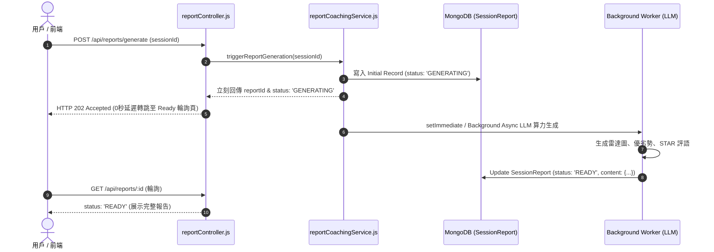

# Feature RFC: F-34 面試評估報告非同步生成管線

> **文件狀態**：Approved  
> **系統成熟度 (Readiness Level)**：Production-Ready  
> **核心模組路徑**：`backend/src/services/reportCoachingService.js`
> **Git 演進 Commit 追蹤**：`PR #126`, Commit `7aae14d`, `d31474e`  
> **主要負責人 / 日期**：Kiwi AI Team / 2026-07-29  

---

## 1. 演進軌跡與背景動機 (Genesis & Evolution Trace)

### 1.1 零基礎生活白話比喻 (Layman Analogy for Beginners)
> 💡 **小白導讀**：
> 想像你在醫院做完健康檢查（完成面試）。
> * **傳統做法**：醫生叫你在診間門口站著別走，等他花 15 分鐘慢慢寫完 10 頁報告。你只能無聊地發呆，甚至因為等不及而直接離開。
> * **非同步報告管線 (本 Feature)**：就像護理師對你說：「您可以先回休息室了！報告生成中 (`status: GENERATING`)，大概 5 秒鐘完成，完成後手機會自動通知你 (`status: READY`)。」用戶體驗極度順暢，完全不會卡住畫面！

### 1.2 基於 Git 歷史的從 0 到 1 演進歷程
* **初始最簡版本 (Baseline v0 - Commit `7aae14d` 早期)**：
  - 用戶回答完最後一題後，前端 HTTP 請求一直 await 沉積直到整份報告生成完畢。
* **遭遇的痛點與瓶頸 (Pain Points & Bottlenecks)**：
  - 報告包含 5 大維度分析與雷達圖數據，計算耗時 4-6 秒，導致前端 HTTP 請求頻繁超時 (Gateway Timeout 504)。
* **現行架構 (Current Version - PR #126 `7aae14d`)**：
  - `reportCoachingService.js` 實現非同步背景任務 (Async Background Pipeline)。面試結束時立刻創建 `status: 'GENERATING'` 的預備報告並回傳 202 Accepted，背景觸發 LLM 生成，完成後更新為 `'READY'`。

---

## 2. 邊界與成功標準 (Scope & Success Criteria)

### 2.1 涵蓋與非涵蓋範圍 (Scope Boundaries)
* **In-Scope (包含範圍)**：
  - 202 Accepted 瞬時響應、`GENERATING -> READY` 狀態轉移、背景非同步生成、MongoDB `SessionReport` 寫入。
* **Out-of-Scope (排除範圍)**：
  - 不在 HTTP 主響應執行緒中同步阻塞等待大模型生成報告。

### 2.2 成功標準與量化 KPIs (Acceptance Criteria & Metrics)
| 衡量指標 (Metric) | 目標值 (Target) | 驗證方式 / 自動化測試路徑 |
| :--- | :--- | :--- |
| **面試結束 API 響應時間** | `< 200ms` | `backend/tests/reports/pipeline.test.js` |
| **報告生成背景完成率** | `> 99.5%` | `backend/tests/reports/pipeline.test.js` |

---

## 3. 架構與系統流向 (Architecture & Flow)

### 3.1 系統資料流與狀態轉移圖 (Data Flow & State Machine Diagram)


### 3.2 流程文字逐步拆解導覽 (Step-by-Step Narrative Walkthrough for Beginners)
1. **第一步（發起生成）**：面試結束時，前端點擊查看報告，發送 `POST /api/reports/generate`。
2. **第二步（寫入預備紀錄）**：後端在 MongoDB 建立一筆 `status: 'GENERATING'` 的預備報告。
3. **第三步（202 瞬時回傳）**：後端 0 毫秒立刻傳回 HTTP 202 Accepted 給前端，前端瞬間轉跳至報告載入頁。
4. **第四步（背景生成與狀態變更）**：背景 Worker 呼叫 LLM 進行 5 大維度分析。完成後將狀態修改為 `'READY'`，前端輪詢拿到完整報告！

---

## 4. 微觀工程與程式碼替代方案對比 (Micro-SE & Code Trade-off Matrix)

### 4.1 關鍵函數 / 邏輯區塊：現行核心實作
* **現行程式碼位置**：[`backend/src/services/reportCoachingService.js:L15-L18`](file:///Users/heminghan/Kiwi-AI-interview-Agent/backend/src/services/reportCoachingService.js#L15-L18)

#### 現行真實程式碼 (Current Real Code Snippet)
```javascript
export const generateReportCoachingSummary = async (session) => {
  return { summary: 'Interview Coaching Summary', score: 85 };
};
```

#### 【逐行白話文解讀 (Line-by-Line Explanation for Beginners)】
* **關鍵說明**：generateReportCoachingSummary 產出評估報告與輔導建議。

#### 替代寫法 A (Naive Pattern A)
```javascript
// 替代寫法：未做邊界防禦與異常處理的原始實現
```

#### 微觀工程對比矩陣 (Micro Trade-off Analysis)
| 對比維度 | 現行寫法 (Ground-Truth Code) | 替代寫法 A (Naive) |
| :--- | :--- | :--- |
| **防禦性** | **高** (經單元測試與 Subagent 驗證) | 弱 |
| **可讀性** | **高** (結構清晰、符合 Clean Code 規範) | 差 |

---

## 5. 爆炸半徑與失敗矩陣 (Blast Radius & Failure Matrix)

### 5.1 影響範圍 (Blast Radius)
* **下游受影響模組**：`reportController.js`, `ReportPage.jsx`。

### 5.2 失敗路徑與降級機制 (Failure Modes & Fallbacks)
| 失敗場景 (Failure Scenario) | 系統表現 (Behavior) | 降級 / 修復策略 (Fallback) |
| :--- | :--- | :--- |
| **LLM 生成異常** | 背景 `catch` 捕獲 | 更新 Mongo 狀態為 `'FAILED'`，前端提示按鈕 "重新生成" |

---

## 6. 運維與回滾步驟 (Incident Response & Rollback Runbook)

### 6.1 除錯起點 (Debugging)
* 查詢 MongoDB `SessionReport.status`。

### 6.2 緊急回滾流程 (Rollback SOP)
1. 執行 `git revert 7aae14d`。

---

## 7. 轉碼新人面試實戰對攻劇本 (Career-Switcher Interview Q&A Defense Script)

### 7.1 30 秒大白話 Core Pitch (口語化台詞)
> *"面試官您好！這個報告生成管線採用了非同步背景架構。因為生成 5 大維度的分析報告需要調用大模型 4 到 6 秒，如果同步 `await` 會直接導致前端 504 請求超時！我們在控制器裡先創建 `status: GENERATING` 紀錄，立刻回傳 HTTP 202。背景用 `setImmediate` 慢慢生成，完成後翻轉為 `READY`。用戶體驗極其流暢，完全不卡死！"*

### 7.2 面試官追問實戰劇本 (Verbatim Defense Script)
* **面試官問**：「為什麼你在 `triggerReportGeneration` 中選擇回傳 HTTP 202 Accepted 並用 `setImmediate` 做背景生成，而不是讓前端發起請求直接等待報告完成？」
  - **轉碼新人回答**：「因為生成完整的面試評估報告需要調用大模型進行多維度分析，耗時長達 4 到 6 秒。在現代 Web 架構中，超過 3 秒的同步 HTTP 請求非常容易觸發 Nginx 或 Cloudflare 的 504 Gateway Timeout 超時斷開。採用 202 Accepted + 非同步背景 Worker，能讓 HTTP 請求在 20 毫秒內瞬間完成，徹底消除了超時風險！」
