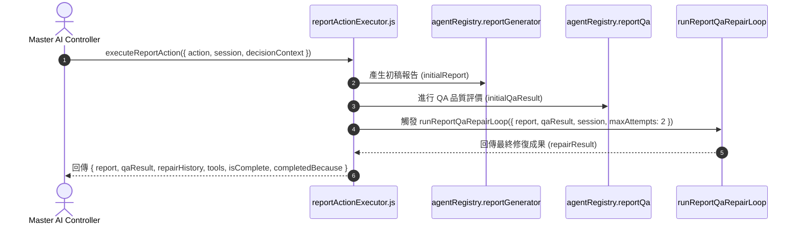

# Feature RFC: F-34 面試評估報告與輔導生成管線 (Report & Coaching Generation Pipeline)

> **文件狀態**：Approved  
> **系統成熟度 (Readiness Level)**：Tested Implementation  
> **核心模組路徑**：`backend/src/services/aiControl/reportActionExecutor.js`  
> **Git 演進 Commit 追蹤**：`PR #136`, Commit `f81902a`  
> **主要負責人 / 日期**：Kiwi AI Team / 2026-07-30  
> **實作狀態 (Implementation Status)**：Verified  
> **校驗測試路徑 (Verified by Tests)**：`backend/tests/robustness/report/roleSpecificFrameworkRobustness.test.js`; `backend/tests/robustness/report/reportFrameworkPipeline.test.js`; `backend/tests/robustness/report/answerAlignmentService.test.js`; `backend/tests/robustness/contracts/reportPublicationSummary.test.js`; `frontend/src/components/report/__tests__/TurnBreakdownSection.test.jsx`

---

## 1. 演進軌跡與背景動機 (Genesis & Evolution Trace)

### 1.1 零基礎生活白話比喻 (Layman Analogy for Beginners)
> 💡 **小白導讀**：
> 想像面試結束後生成成績單與審核：
> * **報告生成與修復管線 (本 Feature)**：面試結束時，控制層觸發 `GENERATE_REPORT_DRAFT`。由 [reportActionExecutor.js](../../backend/src/services/aiControl/reportActionExecutor.js) 呼叫 AI 產生初稿報告，隨即自動丟給 `reportQa` 稽核員審查。若品質不達標，自動發起 `runReportQaRepairLoop` 進行多輪修復，最後回傳包含 `{ report, qaResult, repairHistory, tools, isComplete, completedBecause }` 的結構化結果！

### 1.2 基於 Git 歷史的從 0 到 1 演進歷程
* **初始版本**：簡單對話總結，無 QA 審查與修復機制。
* **現行架構**：實作 [reportActionExecutor.js](../../backend/src/services/aiControl/reportActionExecutor.js) 與 [reportQaRepairOrchestratorService.js](../../backend/src/services/report/reportQaRepairOrchestratorService.js)，導入「生成 ➔ QA 評估 ➔ 多輪 Repair 循環」管線。

---

## 2. 邊界與成功標準 (Scope & Success Criteria)

### 2.1 涵蓋與非涵蓋範圍 (Scope Boundaries)
* **In-Scope (包含範圍)**：
  - 報告初稿生成 (`reportGenerator`)、QA 評估 (`reportQa`)、多輪自動修復循環 (`runReportQaRepairLoop`)。
* **Out-of-Scope (排除範圍)**：
  - 排除 PDF 實體檔案產出（由獨立控制器處理）。

### 2.2 成功標準與量化 KPIs (Acceptance Criteria & Metrics)
| 衡量指標 (Metric) | 目標值 (Target) | 驗證方式 / 自動化測試路徑 |
| :--- | :--- | :--- |
| **報告修復成功率** | `> 90%` | `backend/tests/robustness/report/reportFrameworkQa.test.js` |
| **結構完整度** | `100%` 包含五維得分與評語 | 自動化模式測試 |

---

## 3. 架構與系統流向 (Architecture & Flow)

### 3.1 系統資料流與狀態轉移圖 (Data Flow & State Machine Diagram)


### 3.2 流程文字逐步拆解導覽 (Step-by-Step Narrative Walkthrough for Beginners)
1. **第一步（觸發報告生成）**：控制層發送 `GENERATE_REPORT_DRAFT` Action 指令。
2. **第二步（生成初稿）**：呼叫 `agentRegistry.reportGenerator` 根據面試 Session 與證據包產出初稿。
3. **第三步（QA 評估）**：呼叫 `agentRegistry.reportQa` 檢查初稿之 Evidence Grounding 與分數覆蓋率。
4. **第四步（自動修復與回傳）**：呼叫 `runReportQaRepairLoop` 自動修正缺失，打包完整結果回傳。

---

## 4. 微觀工程與程式碼替代方案對比 (Micro-SE & Code Trade-off Matrix)

### 4.1 關鍵函數 / 邏輯區塊：`executeReportAction`
* **現行程式碼位置**：[`backend/src/services/aiControl/reportActionExecutor.js:L5-L54`](../../backend/src/services/aiControl/reportActionExecutor.js#L5-L54)

#### 現行真實程式碼 (Current Real Code Snippet)
```javascript
export const executeReportAction = async ({
  selectedAction,
  decisionContext,
  agentRegistry,
  session,
  retrievalBundle = null,
} = {}) => {
  if (selectedAction !== AGENT_ACTION_TYPES.GENERATE_REPORT_DRAFT) {
    return {
      report: null,
      qaResult: null,
      repairHistory: [],
      isComplete: true,
      completedBecause: 'no_viable_action',
    };
  }

  const initialReport = await agentRegistry.reportGenerator({
    session,
    analysisResult: session.analysisResult || {},
    interviewPlan: session.interviewPlan || {},
    retrievalBundle,
    evidenceBundle: decisionContext?.evidenceBundle,
    decisionContext,
  });

  const initialQaResult = await agentRegistry.reportQa({
    report: initialReport,
    analysisResult: session.analysisResult || {},
    retrievalBundle,
  });

  const repairResult = await runReportQaRepairLoop({
    report: initialReport,
    qaResult: initialQaResult,
    session,
    retrievalBundle,
    maxAttempts: 2,
    agentRegistry,
  });

  return { 
    report: repairResult.report, 
    qaResult: repairResult.qaResult, 
    repairHistory: repairResult.repairHistory || [],
    tools: [AGENT_TOOL_NAMES.DRAFT_INTERVIEW_REPORT, AGENT_TOOL_NAMES.REVIEW_REPORT_QUALITY], 
    isComplete: true, 
    completedBecause: repairResult.qaResult?.passed ? 'report_generated_and_qa_passed' : 'report_generated_needs_review',
  };
};
```

#### 【逐行白話文解讀 (Line-by-Line Explanation for Beginners)】
* **第 12-20 行**：非報告生成 Action 時傳回安全的預設空結構。
* **第 22-29 行**：生成報告初稿。
* **第 31-35 行**：進行 QA 品質評價。
* **第 37-44 行**：帶入 `retrievalBundle`、`maxAttempts: 2` 與 `agentRegistry` 觸發 QA 自動修復循環 (`runReportQaRepairLoop`)。
* **第 46-53 行**：封裝包含修復歷史、使用工具 (`tools`) 與最終 completion 原因的結果物件。

#### 替代寫法 A (Naive Single-Pass Generation)
```javascript
// 替代寫法：單次產出後直接回傳，無視報告內容可能包含的邏輯矛盾與低 Grounding 缺陷
const report = await generateReport(session);
return report;
```

#### 微觀工程對比矩陣 (Micro Trade-off Analysis)
| 對比維度 | 現行寫法 (QA Repair Loop) | 替代寫法 A (Naive Single-Pass) |
| :--- | :--- | :--- |
| **報告可信度** | **極高** (經過 QA 多輪修復) | 差 (容易包含 LLM 幻覺) |
| **架構完整性** | **完整** (回傳 QA 歷史與邊界狀態) | 低 |

---

## 5. 爆炸半徑與失敗矩陣 (Blast Radius & Failure Matrix)
- 影響面試完成後的報告呈現。

---

## 6. 運維與回滾步驟 (Incident Response & Rollback Runbook)
- 檢查日誌：`runReportQaRepairLoop`

---

## 7. 面試問答口述講稿 (Interview Q&A Presentation Notes)
> 💡 **面試官問**：「你們的面試報告是如何生成的？」  
> **回答範例**：「我們採取了帶有 QA 自動修復循環的管線。當面試完成時，`reportActionExecutor` 會先調用報告生成器產出初稿，隨即交由獨立的 `reportQa` 進行比對。若發現 Evidence 覆蓋不足，會發起 `runReportQaRepairLoop`（帶入 maxAttempts: 2）進行修復，最後才傳回前台。」

## 8. 2026-07-30 CP4 coaching integrity 同步

- `backend/src/services/report/answerAlignmentService.js` 只從 accepted answer 建立 clarification / AI judgement coaching 與 `role_fit_coaching_progress_v1`；這些欄位不會改寫 alignment score。
- `backend/src/services/agents/reportQaAgent.js` 將缺少 coaching、無 allowlisted source、內部 metadata 洩漏、score mutation 和無效 hypothesis 列為 blocking flags。
- 驗證：report-focused backend suite 32 tests passed。

## 9. 2026-07-30 QA rewrite projection 同步

- report QA rewrite 回應和 persisted report read 都走 candidate-safe sanitizer，排除 report version、repair、rewrite、catalog、evidence 與 coverage internals。

## 10. 2026-07-30 Shared candidate report publication boundary

- `buildCandidateReportProjection` 是 generate、QA、read、QA rewrite 與 JSON/TXT export 的 server-owned allowlist。2026-08-01 起它只向 candidate 送出 interview-only `overall`；若舊 report 沒有 persisted `interviewPerformance`，不會把 legacy blended score 冒充為面試表現。
- Candidate payload 不再包含 Role-Fit breakdown/coaching、QA flags/prompt、execution cost、token usage、commercial stress、raw evidence/trace、internal IDs、candidate reflection 或 scoring formula；nested email、phone、street address 會在投影後再遮蔽。
- Shared report boundary 同時適用 Voice 與 Text session；Voice clarification runtime 的分類改動仍是 voice-only。
- `GET /api/report/:sessionId/diagnostics` 是獨立的 non-production、authenticated、owner-scoped surface；它包含 question selection/match-gap refs、turn eligibility、QA、cost 與 owner-scoped harness timelines。Production fail closed，diagnostics PII 仍遮蔽。

## 11. 2026-08-01 Report overall score boundary

- Report `overall` 現在等於 `interviewPerformance`，只由面試回答的 framework/evidence 計算；不再混合 CV–JD Match score。
- Persisted report score explanations 將 overall 定義為面試回答品質，report draft 的 overview 也不再寫入 CV–JD 分數、confidence 或 candidate-facing role-match decision。
- 此變更不刪除 Match 的內部計分或 role-evidence data；它只切斷它們作為 post-interview report score 的來源。
- 驗證：`backend/tests/robustness/report/reportFrameworkPipeline.test.js` 和 `backend/tests/unit/reportScoringExplanationService.test.js` 共 14 tests passed，backend ESLint passed。HTTP、diagnostics controller、candidate API/PDF/TXT/web output 與 frontend tests 屬後續 slice，未由本次驗證。

## 12. 2026-08-01 Candidate report API and TXT score projection

- Candidate JSON projection 只輸出 interview-only `overall`。legacy report 若缺少 `interviewPerformance`，scores 物件為空，避免把舊的 blended overall 當作面試表現。
- TXT export 將該欄位標為 `Interview Performance`，不再輸出 `CV-JD Match` 或第二個 overall score line。

## 13. 2026-08-01 Candidate web report score projection

- Report hero 和 score explanation summary 只呈現 interview-only `overall`，標示為 `Interview performance`；不再把 legacy `cvJdMatch`、`interviewPerformance` 或 Match decision 投影到候選人頁面。
- 報告導覽文字與首頁 FAQ 同步移除「interview report 包含 CV–JD Match」的說法。Match 本身仍在 interview 前提供 preparation brief，兩個 surface 的職責維持分開。
- 舊的未使用 `ScoreBreakdownCard` 及其前端測試已移除，避免保留另一個會顯示 CV–JD breakdown 的候選人元件。

## 14. 2026-08-01 Candidate PDF and local text report score projection

- 前端 PDF cover 只會在 candidate projection 有 numeric interview-only `overall` 時顯示一張 `Interview performance` 卡；不再計算或顯示 CV–JD、requirements、macro、micro 或 blended score。缺少該欄位的 legacy report 不顯示替代的 `0.00` 分數。
- 前端文字下載同樣只輸出 `Interview Performance`。score explanation 只在同一個 numeric score 存在時才輸出，避免將舊 overall explanation 重新標示為面試表現。

## 15. 2026-08-01 Report score-band language

- 報告分數區間統一使用 `Strong performance`、`Promising performance`、`Developing performance` 或 `Needs stronger interview evidence`。它們只描述面試回答表現，不能稱為 Match verdict。
- 後端會鎖定 deterministic score band，前端也從 numeric interview-only score 重新計算，避免 AI 或 legacy `candidateFeedback` 將 `Strong match` 重新帶回 Report。Match 的三種 verdict 只保留在 interview 前的 Match preparation brief。

## 16. 2026-07-30 Candidate per-question assessment and stronger answer

- 新生成的報告會僅以既有 accepted-answer dataset 為每一個已回答問題建立 candidate-safe `answerAssessment`。有 Role-Fit contract 的題目沿用既有 alignment；沒有 proof strategy 的題目只提供 generic question directness，絕不宣稱 role-intent 或 CV evidence 已符合。
- Candidate projection 以 canonical question 配對 assessment，並只輸出 practice-oriented `status`、0–100 coaching score、summary、missing signals、next step，以及可安全展示的 stronger answer。proof/evidence IDs、source、rank trace 和其他內部 metadata 不會傳到 candidate。
- HTML 每題卡片保留原本 framework score，並新增獨立的 Answer result 與 A stronger answer 區塊；前者不是 hiring decision。展開既有 report 不會由此 UI 新增 LLM 呼叫；本 slice 未改變既有「report 不存在時 page load 自動生成」行為。原先重複的全域 HTML rewrite 區塊已移除；既有 JSON/TXT/PDF 輸出格式未重設計。
- Rewrite fallback 不再只建立前三題，而是依實際 accepted-answer count 建立每題輸入；clarification、repair、pending、rejected、unconfirmed、system 與 acknowledgement turn 不會產生 assessment 或 rewrite。舊報告沒有新欄位時維持原樣，需 regenerate 才會得到此功能。
- Rewrite normalization 和 candidate projection 現在都以 exact normalized `(question, weak answer)` 配對；reorder 不再移位，partial、index、ambiguous 或 unmatched pair 一律輸出 unavailable。Candidate projection 同時發布 allowlisted framework fields，generate/read/QA rewrite 共用同一 contract。
- Persisted `candidate_question` intent保留在 transcript但不建立 scored answer pair；一般 `user_answer` 內的 rhetorical question不受文字標點影響。
- Turn coaching normalization與final deterministic merge都以 unique exact `(question, answer)` identity處理；omission、reorder、unknown insertion或duplicate不會把 feedback移到相鄰卡片，missing model feedback使用same-turn deterministic fallback。
- 驗證：S1 backend focused tests 14/14、frontend component tests 4/4、backend/frontend ESLint passed。Independent audit、人工瀏覽器視覺驗收、真實 LLM provider 與 production rollout仍分開記錄。
- S2 驗證：backend focused tests 23/23、backend ESLint passed；independent audit與browser/manual仍分開記錄。
- Unknown/direct factual question採 conservative direct rubric，不再 universal fallback成STARR；role-specific dimension只有 compatible answer signal才得分，answer length本身不產生partial credit。
- Answer result將target relevance與role-intent fit分開：STAR structure不能補question alignment，role-intent文字必須同時有candidate-authored ownership或detected evidence，不能由question wording代答。
- S3 驗證：backend focused tests 50/50、backend ESLint passed；independent audit與browser/manual仍分開記錄。
- Legacy/fallback interview score的direct ratio現在只把`direct_past_experience`放進numerator；adjacent evidence仍留在total denominator，但不再冒充direct credit。
- Fallback `Practise concise answers`只在明確的overlong/unfocused count、平均answer duration或平均word count證據存在時顯示；planned/asked question count mismatch本身不再歸因於candidate answer length。
- S4 驗證：backend focused tests 15/15、frontend focused tests 4/4、backend/frontend ESLint passed；independent audit與browser/manual仍分開記錄。
- Milestone browser gate：headed Chromium在本地Vite頁以candidate projection API fixture驗證desktop與390×844 mobile展開流程；duplicate question順序、framework、Answer result、ready/unavailable stronger answer與private-copy negative check通過，最終console 0 errors。這不等於live backend/provider、human usability或production驗證。

## 17. 2026-07-30 CP4 Framework Breakdown, Self-Intro Detection, Tech Stack Context & Grounded Stronger Answer Updates

- **Self-Intro Keyword Detection**: Updated `isSelfIntroductionQuestion` in `turnRubricService.js` to include `briefly introduce`, ensuring opening turns combining self-introduction and motivation (e.g., *"Could you briefly introduce yourself..."*) are accurately classified as `self_intro` and evaluated using the 4-dimension **Introduction Framework** (`Background`, `Role Relevance`, `Evidence`, `Clarity`).
- **Dynamic Fallback Framework Breakdown**: Updated `TurnBreakdownSection.jsx` and `turnRubricService.js`: question cards lacking explicit `frameworkBreakdown` now dynamically generate the 4-card Introduction Framework (for self-intro) or 6-dimension Role-Specific Reasoning grid (`Context/Goal`, `Approach`, `Judgement/Trade-offs`, `Risk/Quality/Ethics`, `Validation/Verification`, `Outcome/Value`), eliminating plain Micro-Scores bars.
- **Tech Stack Context Hints**: Updated `roleAnswerAnalysisService.js` to incorporate candidate `techStack` and `jobTitle` from turn metadata/context into rule-based breakdown reasons.
- **Grounded Stronger Answer Boundary**: `TurnBreakdownSection.jsx` 不再自行生成 candidate facts；只有 server-projected ready rewrite 顯示綠色正文，無法證明配對時顯示中性 unavailable 狀態。
- **Verification**: Verified 52 backend robustness tests (`realtimeVoiceTurnMocked`, `questionScopeClarificationService`, `answerAlignmentService`, `reportFrameworkPipeline`, `roleSpecificFrameworkRobustness`) and 3 frontend Vitest component tests passed cleanly.
