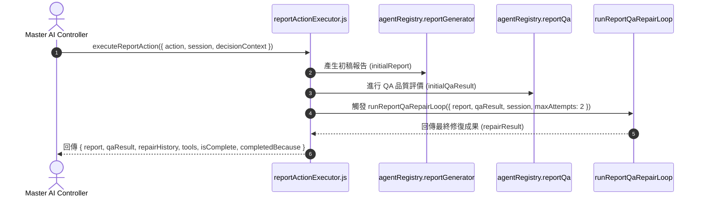

# Feature RFC: F-34 面試評估報告與輔導生成管線 (Report & Coaching Generation Pipeline)

> **文件狀態**：Approved  
> **系統成熟度 (Readiness Level)**：Tested Implementation  
> **核心模組路徑**：`backend/src/services/aiControl/reportActionExecutor.js`  
> **Git 演進 Commit 追蹤**：`PR #136`, Commit `f81902a`  
> **主要負責人 / 日期**：Kiwi AI Team / 2026-07-30  
> **實作狀態 (Implementation Status)**：Verified  
> **校驗測試路徑 (Verified by Tests)**：`backend/tests/robustness/report/reportFrameworkPipeline.test.js`  

---

## 1. 演進軌跡與背景動機 (Genesis & Evolution Trace)

### 1.1 零基礎生活白話比喻 (Layman Analogy for Beginners)
> 💡 **小白導讀**：
> 想像面試結束後生成成績單與審核：
> * **報告生成與修復管線 (本 Feature)**：面試結束時，控制層觸發 `GENERATE_REPORT_DRAFT`。由 [reportActionExecutor.js](../../backend/src/services/aiControl/reportActionExecutor.js) 呼叫 AI 產生初稿報告，隨即自動丟給 `reportQa` 稽核員審查。若品質不達標，自動發起 `runReportQaRepairLoop` 進行多輪修復，最後回傳包含 `{ report, qaResult, repairHistory, tools, isComplete, completedBecause }` 的結構化結果！

### 1.2 基於 Git 歷史的從 0 到 1 演進歷程
* **初始版本**：簡單對話總結，無 QA 審查與修復機制。
* **現行架構**：實作 [reportActionExecutor.js](../../backend/src/services/aiControl/reportActionExecutor.js) 與 [reportQaRepairOrchestratorService.js](../../backend/src/services/report/reportQaRepairOrchestratorService.js)，導入「生成 ➔ QA 評估 ➔ 多輪 Repair 循環」管線。

---

## 2. 邊界與成功標準 (Scope & Success Criteria)

### 2.1 涵蓋與非涵蓋範圍 (Scope Boundaries)
* **In-Scope (包含範圍)**：
  - 報告初稿生成 (`reportGenerator`)、QA 評估 (`reportQa`)、多輪自動修復循環 (`runReportQaRepairLoop`)。
* **Out-of-Scope (排除範圍)**：
  - 排除 PDF 實體檔案產出（由獨立控制器處理）。

### 2.2 成功標準與量化 KPIs (Acceptance Criteria & Metrics)
| 衡量指標 (Metric) | 目標值 (Target) | 驗證方式 / 自動化測試路徑 |
| :--- | :--- | :--- |
| **報告修復成功率** | `> 90%` | `backend/tests/robustness/report/reportFrameworkQa.test.js` |
| **結構完整度** | `100%` 包含五維得分與評語 | 自動化模式測試 |

---

## 3. 架構與系統流向 (Architecture & Flow)

### 3.1 系統資料流與狀態轉移圖 (Data Flow & State Machine Diagram)


### 3.2 流程文字逐步拆解導覽 (Step-by-Step Narrative Walkthrough for Beginners)
1. **第一步（觸發報告生成）**：控制層發送 `GENERATE_REPORT_DRAFT` Action 指令。
2. **第二步（生成初稿）**：呼叫 `agentRegistry.reportGenerator` 根據面試 Session 與證據包產出初稿。
3. **第三步（QA 評估）**：呼叫 `agentRegistry.reportQa` 檢查初稿之 Evidence Grounding 與分數覆蓋率。
4. **第四步（自動修復與回傳）**：呼叫 `runReportQaRepairLoop` 自動修正缺失，打包完整結果回傳。

---

## 4. 微觀工程與程式碼替代方案對比 (Micro-SE & Code Trade-off Matrix)

### 4.1 關鍵函數 / 邏輯區塊：`executeReportAction`
* **現行程式碼位置**：[`backend/src/services/aiControl/reportActionExecutor.js:L5-L54`](../../backend/src/services/aiControl/reportActionExecutor.js#L5-L54)

#### 現行真實程式碼 (Current Real Code Snippet)
```javascript
export const executeReportAction = async ({
  selectedAction,
  decisionContext,
  agentRegistry,
  session,
  retrievalBundle = null,
} = {}) => {
  if (selectedAction !== AGENT_ACTION_TYPES.GENERATE_REPORT_DRAFT) {
    return {
      report: null,
      qaResult: null,
      repairHistory: [],
      isComplete: true,
      completedBecause: 'no_viable_action',
    };
  }

  const initialReport = await agentRegistry.reportGenerator({
    session,
    analysisResult: session.analysisResult || {},
    interviewPlan: session.interviewPlan || {},
    retrievalBundle,
    evidenceBundle: decisionContext?.evidenceBundle,
    decisionContext,
  });

  const initialQaResult = await agentRegistry.reportQa({
    report: initialReport,
    analysisResult: session.analysisResult || {},
    retrievalBundle,
  });

  const repairResult = await runReportQaRepairLoop({
    report: initialReport,
    qaResult: initialQaResult,
    session,
    retrievalBundle,
    maxAttempts: 2,
    agentRegistry,
  });

  return { 
    report: repairResult.report, 
    qaResult: repairResult.qaResult, 
    repairHistory: repairResult.repairHistory || [],
    tools: [AGENT_TOOL_NAMES.DRAFT_INTERVIEW_REPORT, AGENT_TOOL_NAMES.REVIEW_REPORT_QUALITY], 
    isComplete: true, 
    completedBecause: repairResult.qaResult?.passed ? 'report_generated_and_qa_passed' : 'report_generated_needs_review',
  };
};
```

#### 【逐行白話文解讀 (Line-by-Line Explanation for Beginners)】
* **第 12-20 行**：非報告生成 Action 時傳回安全的預設空結構。
* **第 22-29 行**：生成報告初稿。
* **第 31-35 行**：進行 QA 品質評價。
* **第 37-44 行**：帶入 `retrievalBundle`、`maxAttempts: 2` 與 `agentRegistry` 觸發 QA 自動修復循環 (`runReportQaRepairLoop`)。
* **第 46-53 行**：封裝包含修復歷史、使用工具 (`tools`) 與最終 completion 原因的結果物件。

#### 替代寫法 A (Naive Single-Pass Generation)
```javascript
// 替代寫法：單次產出後直接回傳，無視報告內容可能包含的邏輯矛盾與低 Grounding 缺陷
const report = await generateReport(session);
return report;
```

#### 微觀工程對比矩陣 (Micro Trade-off Analysis)
| 對比維度 | 現行寫法 (QA Repair Loop) | 替代寫法 A (Naive Single-Pass) |
| :--- | :--- | :--- |
| **報告可信度** | **極高** (經過 QA 多輪修復) | 差 (容易包含 LLM 幻覺) |
| **架構完整性** | **完整** (回傳 QA 歷史與邊界狀態) | 低 |

---

## 5. 爆炸半徑與失敗矩陣 (Blast Radius & Failure Matrix)
- 影響面試完成後的報告呈現。

---

## 6. 運維與回滾步驟 (Incident Response & Rollback Runbook)
- 檢查日誌：`runReportQaRepairLoop`

---

## 7. 面試問答口述講稿 (Interview Q&A Presentation Notes)
> 💡 **面試官問**：「你們的面試報告是如何生成的？」  
> **回答範例**：「我們採取了帶有 QA 自動修復循環的管線。當面試完成時，`reportActionExecutor` 會先調用報告生成器產出初稿，隨即交由獨立的 `reportQa` 進行比對。若發現 Evidence 覆蓋不足，會發起 `runReportQaRepairLoop`（帶入 maxAttempts: 2）進行修復，最後才傳回前台。」
