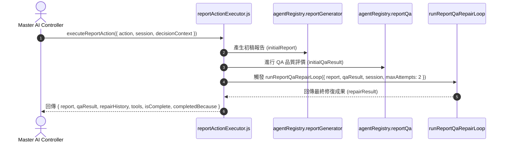

# Feature RFC: F-34 面試評估報告與輔導生成管線 (Report & Coaching Generation Pipeline)

> **文件狀態**：Approved  
> **系統成熟度 (Readiness Level)**：Tested Implementation  
> **核心模組路徑**：`backend/src/services/aiControl/reportActionExecutor.js`  
> **Git 演進 Commit 追蹤**：`PR #136`, Commit `f81902a`  
> **主要負責人 / 日期**：Kiwi AI Team / 2026-07-30  
> **實作狀態 (Implementation Status)**：Verified  
> **校驗測試路徑 (Verified by Tests)**：`backend/tests/robustness/report/roleSpecificFrameworkRobustness.test.js`; `backend/tests/robustness/report/reportFrameworkPipeline.test.js`; `backend/tests/robustness/report/impactFirstAnalysisService.test.js`; `backend/tests/robustness/report/impactFirstReportDiagnostic.test.js`; `backend/tests/robustness/contracts/reportPublicationSummary.test.js`; `backend/tests/unit/reportFrameworkSchema.test.js`; `frontend/src/components/report/__tests__/TurnBreakdownSection.test.jsx`

---

## 1. 演進軌跡與背景動機 (Genesis & Evolution Trace)

### 1.1 零基礎生活白話比喻 (Layman Analogy for Beginners)
> 💡 **小白導讀**：
> 想像面試結束後生成成績單與審核：
> * **報告生成與修復管線 (本 Feature)**：面試結束時，控制層觸發 `GENERATE_REPORT_DRAFT`。由 [reportActionExecutor.js](../../../backend/src/services/aiControl/reportActionExecutor.js) 呼叫 AI 產生初稿報告，隨即自動丟給 `reportQa` 稽核員審查。若品質不達標，自動發起 `runReportQaRepairLoop` 進行多輪修復，最後回傳包含 `{ report, qaResult, repairHistory, tools, isComplete, completedBecause }` 的結構化結果！

### 1.2 基於 Git 歷史的從 0 到 1 演進歷程
* **初始版本**：簡單對話總結，無 QA 審查與修復機制。
* **現行架構**：實作 [reportActionExecutor.js](../../../backend/src/services/aiControl/reportActionExecutor.js) 與 [reportQaRepairOrchestratorService.js](../../../backend/src/services/report/reportQaRepairOrchestratorService.js)，導入「生成 ➔ QA 評估 ➔ 多輪 Repair 循環」管線。
* **2026-08-09 Phase 1**：在既有 accepted-answer dataset 與 deterministic turn breakdown 之間加入 canonical voice-duration assessment；這是內部證據層資料，不改變現行 overall score、candidate projection 或 voice runtime。
* **2026-08-15 report contract correction**：修正 candidate report framework breakdown 的 ownership 與呈現契約。Backend framework-specific breakdown 現在是正式來源；舊有 client-side semantic fallback 已移除。Impact-first evaluator 直接發布 framework `scorePercent` 與六個 dimension 的 `level`/`scorePercent`；candidate projection 只發布這些 candidate-safe metrics 與理由，不發布 `normalizedScore`、`score`、`weight` 或 `earnedPoints`。若既有 Impact-first report 缺少六個完整 numeric metrics，projection 會保留 breakdown、標記 `needs_review`、加入 `regenerate_report` limitation，不把 `status`/`reason` 轉成分數。其他 framework 若 dimension 缺少 `level` 或 `scorePercent`，仍保留該 dimension 並顯示 `Level unavailable`；若沒有 actual STARR/starBreakdown 且沒有 formal renderable dimensions，HTML/TXT/PDF 顯示 framework label + `unavailable`。此同步不代表 browser、live provider 或 production release 已驗證。

---

## 2. 邊界與成功標準 (Scope & Success Criteria)

### 2.1 涵蓋與非涵蓋範圍 (Scope Boundaries)
* **In-Scope (包含範圍)**：
  - 報告初稿生成 (`reportGenerator`)、QA 評估 (`reportQa`)、多輪自動修復循環 (`runReportQaRepairLoop`)。
  - Phase 1：對 accepted substantive root voice answers 產生 90–120 秒 canonical duration assessment，並將它放入 report dataset、interview metrics 與 deterministic per-turn breakdown。
* **Out-of-Scope (排除範圍)**：
  - 排除 PDF 實體檔案產出（由獨立控制器處理）。
  - Phase 1 不把 duration points 合併進 overall score；text timing、frontend rendering、public schema、coaching copy、voice runtime、DB schema 與 human calibration 留待後續 phase。

### 2.2 成功標準與量化 KPIs (Acceptance Criteria & Metrics)
| 衡量指標 (Metric) | 目標值 (Target) | 驗證方式 / 自動化測試路徑 |
| :--- | :--- | :--- |
| **報告修復成功率** | `> 90%` | `backend/tests/robustness/report/reportFrameworkQa.test.js` |
| **結構完整度** | `100%` 包含五維得分與評語 | 自動化模式測試 |

Phase 1 的 acceptance contract 是：只有 accepted、root、voice-mode 且有 per-turn `speakingDurationSeconds` 的 answer 進入 duration denominator；`90 <= seconds <= 120` 為 Level 5 / 10 points。資料缺失、text、follow-up、unknown mode、unconfirmed 或 excluded turn 一律保留為 non-applicable，不轉成 candidate zero。

---

## 3. 架構與系統流向 (Architecture & Flow)

### 3.1 系統資料流與狀態轉移圖 (Data Flow & State Machine Diagram)


### 3.2 流程文字逐步拆解導覽 (Step-by-Step Narrative Walkthrough for Beginners)
1. **第一步（觸發報告生成）**：控制層發送 `GENERATE_REPORT_DRAFT` Action 指令。
2. **第二步（生成初稿）**：呼叫 `agentRegistry.reportGenerator` 根據面試 Session 與證據包產出初稿。
3. **第三步（QA 評估）**：呼叫 `agentRegistry.reportQa` 檢查初稿之 Evidence Grounding 與分數覆蓋率。
4. **第四步（自動修復與回傳）**：呼叫 `runReportQaRepairLoop` 自動修正缺失，打包完整結果回傳。

---

## 4. 微觀工程與程式碼替代方案對比 (Micro-SE & Code Trade-off Matrix)

### 4.1 關鍵函數 / 邏輯區塊：`executeReportAction`
* **現行程式碼位置**：[`backend/src/services/aiControl/reportActionExecutor.js:L5-L54`](../../../backend/src/services/aiControl/reportActionExecutor.js#L5-L54)

#### 現行真實程式碼 (Current Real Code Snippet)
```javascript
export const executeReportAction = async ({
  selectedAction,
  decisionContext,
  agentRegistry,
  session,
  retrievalBundle = null,
} = {}) => {
  if (selectedAction !== AGENT_ACTION_TYPES.GENERATE_REPORT_DRAFT) {
    return {
      report: null,
      qaResult: null,
      repairHistory: [],
      isComplete: true,
      completedBecause: 'no_viable_action',
    };
  }

  const initialReport = await agentRegistry.reportGenerator({
    session,
    analysisResult: session.analysisResult || {},
    interviewPlan: session.interviewPlan || {},
    retrievalBundle,
    evidenceBundle: decisionContext?.evidenceBundle,
    decisionContext,
  });

  const initialQaResult = await agentRegistry.reportQa({
    report: initialReport,
    analysisResult: session.analysisResult || {},
    retrievalBundle,
  });

  const repairResult = await runReportQaRepairLoop({
    report: initialReport,
    qaResult: initialQaResult,
    session,
    retrievalBundle,
    maxAttempts: 2,
    agentRegistry,
  });

  return { 
    report: repairResult.report, 
    qaResult: repairResult.qaResult, 
    repairHistory: repairResult.repairHistory || [],
    tools: [AGENT_TOOL_NAMES.DRAFT_INTERVIEW_REPORT, AGENT_TOOL_NAMES.REVIEW_REPORT_QUALITY], 
    isComplete: true, 
    completedBecause: repairResult.qaResult?.passed ? 'report_generated_and_qa_passed' : 'report_generated_needs_review',
  };
};
```

#### 【逐行白話文解讀 (Line-by-Line Explanation for Beginners)】
* **第 12-20 行**：非報告生成 Action 時傳回安全的預設空結構。
* **第 22-29 行**：生成報告初稿。
* **第 31-35 行**：進行 QA 品質評價。
* **第 37-44 行**：帶入 `retrievalBundle`、`maxAttempts: 2` 與 `agentRegistry` 觸發 QA 自動修復循環 (`runReportQaRepairLoop`)。
* **第 46-53 行**：封裝包含修復歷史、使用工具 (`tools`) 與最終 completion 原因的結果物件。

#### 替代寫法 A (Naive Single-Pass Generation)
```javascript
// 替代寫法：單次產出後直接回傳，無視報告內容可能包含的邏輯矛盾與低 Grounding 缺陷
const report = await generateReport(session);
return report;
```

#### 微觀工程對比矩陣 (Micro Trade-off Analysis)
| 對比維度 | 現行寫法 (QA Repair Loop) | 替代寫法 A (Naive Single-Pass) |
| :--- | :--- | :--- |
| **報告可信度** | **極高** (經過 QA 多輪修復) | 差 (容易包含 LLM 幻覺) |
| **架構完整性** | **完整** (回傳 QA 歷史與邊界狀態) | 低 |

### 4.2 Phase 1 canonical voice-duration assessment

* **規則唯一來源**：`backend/src/services/report/voiceDurationAssessmentService.js` 的 `mapVoiceDurationToLevel`、`buildVoiceDurationAssessment` 與 `summarizeVoiceDurationAssessments`。
* **資料流**：`reportTurnDatasetService.js` 先沿用既有 question/answer eligibility，再以 `buildQuestionHistory` 的 `turnKind` 判斷 root/follow-up；assessment 只在 accepted pair 建立一次。`reportEvidenceAnalysis.js` 只發布 nested summary，`reportGeneratorAgent.js` 將 deterministic assessment 帶入 breakdown，model output 不具備覆寫權。
* **五級邊界**：`<60` 或 `>150` = Level 1；`60–<70` 或 `>140–150` = Level 2；`70–<80` 或 `>130–140` = Level 3；`80–<90` 或 `>120–130` = Level 4；`90–120` = Level 5。分數為 `0 / 2.5 / 5 / 7.5 / 10`。

### 4.3 Candidate projection 與 rendering ownership

- `backend/src/utils/schemaHelpers.js` 保留 framework breakdown 的 server-published `level`、`scorePercent`、dimension `reason`、`weight` 與 `earnedPoints`；`level` bounded 到 `1–5`，`scorePercent` bounded 到 `0–100`。numeric `0` 是有效值；`null`、blank string 與 boolean 不會被轉成 `0`。
- `backend/src/services/report/reportPublicationSummaryService.js` 以 allowlist 投影 framework/dimension 的 `level`、有效來源的 `scorePercent`、`reason`/`scoreReason`。server-side compatibility mapping 可以讀取既有 `normalizedScore`、`score`/`weight`，但 candidate projection 不發布這些 source fields，也不發布 `earnedPoints`。`assessmentIntent`、`assessmentIntentSource`、`parentAssessmentIntent` 等 assessment lineage 不發布給 candidate。
- `reportPublicationSummaryService.js` 可在 server projection boundary 對既有 numeric source 做 bounded compatibility mapping 以產生 `scorePercent`；HTML/TXT/PDF 只讀 projection 後的 `scorePercent`，client 不做 mapping 或 rescoring。這不是 legacy semantic `business`/`logic`/`evidence` fallback。
- `backend/src/services/agents/reportGeneratorAgent.js` 先依 deterministic framework routing/lineage 建立 breakdown，再合併 model output；candidate projection 不暴露該內部 lineage。`assessmentIntent` 為 `impact_first_past_example` 且 `evidenceMode=past_example` 的 exact role-specific question 保留 impact-first 的六個 content dimensions；不同 framework 不合併。
- `frontend/src/components/report/TurnBreakdownSection.jsx`、`frontend/src/utils/reportHelpers.js` 與 `frontend/src/utils/reportPdf/reportPdfTemplate.js` 直接讀 server-published `level`、`scorePercent`、`reason`。framework/dimension/duration 不顯示 `/10` 或 `earnedPoints/maxPoints`；Answer Result 與 overall 的 `/100` summary 保留，STARR 與各 framework 的原生 dimensions 也保留。
- Candidate report 不再由 legacy `scores.business`、`scores.logic`、`scores.evidence` 合成 Introduction 或 Role-specific 六維度。若沒有 actual STARR/starBreakdown 且沒有 formal renderable dimensions，HTML/TXT/PDF 顯示 framework label + `unavailable`；eligible duration 仍獨立顯示 `Duration Level N/5`，actual STARR 存在時不加 framework unavailable。Impact-first legacy report 若缺少六個完整 `level`/`scorePercent`，candidate report 會顯示需重新生成的 limitation 並降為 `needs_review`；不從 `status`/`reason` 或 legacy score 合成分數。其他 dimension 缺少 `level` 或 `scorePercent` 任一欄位時，三個 surface 保留該 dimension 並顯示 `Level unavailable`。

---

## 5. 爆炸半徑與失敗矩陣 (Blast Radius & Failure Matrix)
- 影響面試完成後的報告呈現。
- Phase 1 的 blast radius 限定在 report dataset、內部 metrics 與 deterministic turn breakdown；`reportScoreService.js`、candidate projection、frontend、voice runtime 與 persistence schema 沒有修改。
- 缺失或未驗證的 duration 會輸出 `eligible: false`、`earnedPoints: null` 與 reason code，不會以 `0` 分污染平均值或既有總分。
- 若沒有 actual STARR/starBreakdown 且沒有 formal renderable dimensions，HTML/TXT/PDF 都顯示 framework label + `unavailable`；`durationAssessment.eligible` 時另顯示獨立的 `Duration Level N/5`，不會被 framework unavailable 吃掉。actual STARR 存在時不加 framework unavailable。Impact-first legacy breakdown 缺少完整 numeric metrics 時，candidate projection 會標記 `needs_review` 並要求 `regenerate_report`；其他 dimension 缺少 `level` 或 `scorePercent` 任一欄位時，三個 surface 保留該 dimension 並顯示 `Level unavailable`，不從 legacy score 合成或推算分數；這個 failure path 不會把 `null`、blank 或 boolean 變成 numeric zero。
- Compatibility numeric fields 只作為 server projection 的輸入，不會出現在 candidate projection；candidate HTML/TXT/PDF 不以這些 internal values 呈現 framework、dimension 或 duration 的 `/10`、points 或 `/maxPoints`。內部 assessment lineage 若出現在 report 內，也會在 candidate projection boundary 被排除。

---

## 6. 運維與回滾步驟 (Incident Response & Rollback Runbook)
- 檢查日誌：`runReportQaRepairLoop`
- 若 Phase 1 assessment 造成問題，回滾其新增 service、dataset annotation、metrics/breakdown handoff 與對應 tests/docs；既有 report scoring 與 public report contract 應保持可運作。
- 若 framework-specific breakdown 或 candidate projection 出現缺欄，先檢查 backend source/projection 與 `schemaHelpers.js`、`reportPublicationSummaryService.js` 及三個 candidate renderers 的 field contract；frontend 不補算或重建 score。Impact-first legacy report 應顯示 `needs_review`/`regenerate_report`，其他缺欄狀態才依 source state 顯示 framework label + `unavailable`，或保留該 dimension 並顯示 `Level unavailable`。eligible duration 仍獨立顯示 `Duration Level N/5`，actual STARR 存在時不加 framework unavailable；不重新引入 client-side semantic fallback。若需恢復行為，應由對應 backend owner 修正 server field source，再重新執行 focused tests。
- 本次文件同步本身不宣稱 browser、live AI/provider、Mongo persistence 或 production rollback 已執行；這些是獨立的後續驗證 gate。文件回滾只應移除本次 2026-08-15 contract correction，不能被當成 code rollback 證據。
- 驗證邊界：重新執行 `backend/tests/robustness/report`、`backend/tests/robustness/voice` 與 backend ESLint；不要用 live provider 或 production report 來替代 focused regression evidence。

---

## 7. 面試問答口述講稿 (Interview Q&A Presentation Notes)
> 💡 **面試官問**：「你們的面試報告是如何生成的？」  
> **回答範例**：「我們採取了帶有 QA 自動修復循環的管線。當面試完成時，`reportActionExecutor` 會先調用報告生成器產出初稿，隨即交由獨立的 `reportQa` 進行比對。若發現 Evidence 覆蓋不足，會發起 `runReportQaRepairLoop`（帶入 maxAttempts: 2）進行修復，最後才傳回前台。」

Phase 1 的補充口述：
> 「我們先在 accepted-answer pairing 的地方建立 canonical duration evidence。只有真正的 root voice answer、且 VAD 已提供 per-turn duration，才會進入 90–120 秒的五級 assessment；text、follow-up、未確認 transcript 和缺失資料會標示為 N/A。這一階段只建立可追溯的內部證據，不先偷偷改 overall score。」

## 8. 2026-07-30 CP4 coaching integrity 同步

- `backend/src/services/report/answerAlignmentService.js` 只從 accepted answer 建立 clarification / AI judgement coaching 與 `role_fit_coaching_progress_v1`；這些欄位不會改寫 alignment score。
- `backend/src/services/agents/reportQaAgent.js` 將缺少 coaching、無 allowlisted source、內部 metadata 洩漏、score mutation 和無效 hypothesis 列為 blocking flags。
- 驗證：report-focused backend suite 32 tests passed。

## 9. 2026-07-30 QA rewrite projection 同步

- report QA rewrite 回應和 persisted report read 都走 candidate-safe sanitizer，排除 report version、repair、rewrite、catalog、evidence 與 coverage internals。

## 10. 2026-07-30 Shared candidate report publication boundary

- `buildCandidateReportProjection` 是 generate、QA、read、QA rewrite 與 JSON/TXT export 的 server-owned allowlist。2026-08-01 起它只向 candidate 送出 interview-only `overall`；若舊 report 沒有 persisted `interviewPerformance`，不會把 legacy blended score 冒充為面試表現。
- Candidate payload 不再包含 Role-Fit breakdown/coaching、QA flags/prompt、execution cost、token usage、commercial stress、raw evidence/trace、internal IDs、candidate reflection 或 scoring formula；nested email、phone、street address 會在投影後再遮蔽。
- Shared report boundary 同時適用 Voice 與 Text session；Voice clarification runtime 的分類改動仍是 voice-only。
- `GET /api/report/:sessionId/diagnostics` 是獨立的 non-production、authenticated、owner-scoped surface；它包含 question selection/match-gap refs、turn eligibility、QA、cost 與 owner-scoped harness timelines。Production fail closed，diagnostics PII 仍遮蔽。

## 11. 2026-08-01 Report overall score boundary

- Report `overall` 現在等於 `interviewPerformance`，只由面試回答的 framework/evidence 計算；不再混合 CV–JD Match score。
- Persisted report score explanations 將 overall 定義為面試回答品質，report draft 的 overview 也不再寫入 CV–JD 分數、confidence 或 candidate-facing role-match decision。
- 此變更不刪除 Match 的內部計分或 role-evidence data；它只切斷它們作為 post-interview report score 的來源。
- 驗證：`backend/tests/robustness/report/reportFrameworkPipeline.test.js` 和 `backend/tests/unit/reportScoringExplanationService.test.js` 共 14 tests passed，backend ESLint passed。HTTP、diagnostics controller、candidate API/PDF/TXT/web output 與 frontend tests 屬後續 slice，未由本次驗證。

## 12. 2026-08-01 Candidate report API and TXT score projection

- Candidate JSON projection 只輸出 interview-only `overall`。legacy report 若缺少 `interviewPerformance`，scores 物件為空，避免把舊的 blended overall 當作面試表現。
- TXT export 將該欄位標為 `Interview Performance`，不再輸出 `CV-JD Match` 或第二個 overall score line。

## 13. 2026-08-01 Candidate web report score projection

- Report hero 和 score explanation summary 只呈現 interview-only `overall`，標示為 `Interview performance`；不再把 legacy `cvJdMatch`、`interviewPerformance` 或 Match decision 投影到候選人頁面。
- 報告導覽文字與首頁 FAQ 同步移除「interview report 包含 CV–JD Match」的說法。Match 本身仍在 interview 前提供 preparation brief，兩個 surface 的職責維持分開。
- 舊的未使用 `ScoreBreakdownCard` 及其前端測試已移除，避免保留另一個會顯示 CV–JD breakdown 的候選人元件。

## 14. 2026-08-01 Candidate PDF and local text report score projection

- 前端 PDF cover 只會在 candidate projection 有 numeric interview-only `overall` 時顯示一張 `Interview performance` 卡；不再計算或顯示 CV–JD、requirements、macro、micro 或 blended score。缺少該欄位的 legacy report 不顯示替代的 `0.00` 分數。
- 前端文字下載同樣只輸出 `Interview Performance`。score explanation 只在同一個 numeric score 存在時才輸出，避免將舊 overall explanation 重新標示為面試表現。

## 15. 2026-08-01 Report score-band language

- 報告分數區間統一使用 `Strong performance`、`Promising performance`、`Developing performance` 或 `Needs stronger interview evidence`。它們只描述面試回答表現，不能稱為 Match verdict。
- 後端會鎖定 deterministic score band，前端也從 numeric interview-only score 重新計算，避免 AI 或 legacy `candidateFeedback` 將 `Strong match` 重新帶回 Report。Match 的三種 verdict 只保留在 interview 前的 Match preparation brief。

## 16. 2026-07-30 Candidate per-question assessment and stronger answer

- 新生成的報告會僅以既有 accepted-answer dataset 為每一個已回答問題建立 candidate-safe `answerAssessment`。有 Role-Fit contract 的題目沿用既有 alignment；沒有 proof strategy 的題目只提供 generic question directness，絕不宣稱 role-intent 或 CV evidence 已符合。
- Candidate projection 以 canonical question 配對 assessment，並只輸出 practice-oriented `status`、0–100 coaching score、summary、missing signals、next step，以及可安全展示的 stronger answer。proof/evidence IDs、source、rank trace 和其他內部 metadata 不會傳到 candidate。
- HTML 每題卡片保留原本 framework score，並新增獨立的 Answer result 與 A stronger answer 區塊；前者不是 hiring decision。展開既有 report 不會由此 UI 新增 LLM 呼叫；本 slice 未改變既有「report 不存在時 page load 自動生成」行為。原先重複的全域 HTML rewrite 區塊已移除；既有 JSON/TXT/PDF 輸出格式未重設計。
- Rewrite fallback 不再只建立前三題，而是依實際 accepted-answer count 建立每題輸入；clarification、repair、pending、rejected、unconfirmed、system 與 acknowledgement turn 不會產生 assessment 或 rewrite。舊報告沒有新欄位時維持原樣，需 regenerate 才會得到此功能。
- Rewrite normalization 和 candidate projection 現在都以 exact normalized `(question, weak answer)` 配對；reorder 不再移位，partial、index、ambiguous 或 unmatched pair 一律輸出 unavailable。Candidate projection 同時發布 allowlisted framework fields，generate/read/QA rewrite 共用同一 contract。
- Persisted `candidate_question` intent保留在 transcript但不建立 scored answer pair；一般 `user_answer` 內的 rhetorical question不受文字標點影響。
- Turn coaching normalization與final deterministic merge都以 unique exact `(question, answer)` identity處理；omission、reorder、unknown insertion或duplicate不會把 feedback移到相鄰卡片，missing model feedback使用same-turn deterministic fallback。
- 驗證：S1 backend focused tests 14/14、frontend component tests 4/4、backend/frontend ESLint passed。Independent audit、人工瀏覽器視覺驗收、真實 LLM provider 與 production rollout仍分開記錄。
- S2 驗證：backend focused tests 23/23、backend ESLint passed；independent audit與browser/manual仍分開記錄。
- Unknown/direct factual question採 conservative direct rubric，不再 universal fallback成STARR；role-specific dimension只有 compatible answer signal才得分，answer length本身不產生partial credit。
- Answer result將target relevance與role-intent fit分開：STAR structure不能補question alignment，role-intent文字必須同時有candidate-authored ownership或detected evidence，不能由question wording代答。
- S3 驗證：backend focused tests 50/50、backend ESLint passed；independent audit與browser/manual仍分開記錄。
- Legacy/fallback interview score的direct ratio現在只把`direct_past_experience`放進numerator；adjacent evidence仍留在total denominator，但不再冒充direct credit。
- Fallback `Practise concise answers`只在明確的overlong/unfocused count、平均answer duration或平均word count證據存在時顯示；planned/asked question count mismatch本身不再歸因於candidate answer length。
- S4 驗證：backend focused tests 15/15、frontend focused tests 4/4、backend/frontend ESLint passed；independent audit與browser/manual仍分開記錄。
- Milestone browser gate：headed Chromium在本地Vite頁以candidate projection API fixture驗證desktop與390×844 mobile展開流程；duplicate question順序、framework、Answer result、ready/unavailable stronger answer與private-copy negative check通過，最終console 0 errors。這不等於live backend/provider、human usability或production驗證。

## 17. 2026-07-30 CP4 Framework Breakdown, Self-Intro Detection, Tech Stack Context & Grounded Stronger Answer Updates

- **Self-Intro Keyword Detection**: Updated `isSelfIntroductionQuestion` in `turnRubricService.js` to include `briefly introduce`, ensuring opening turns combining self-introduction and motivation (e.g., *"Could you briefly introduce yourself..."*) are accurately classified as `self_intro` and evaluated using the 4-dimension **Introduction Framework** (`Background`, `Role Relevance`, `Evidence`, `Clarity`).
- **Dynamic Fallback Framework Breakdown（歷史描述已由 2026-08-15 correction 取代）**: 舊版曾在 `TurnBreakdownSection.jsx` 以 legacy client-side semantic fallback，從缺少 explicit `frameworkBreakdown` 的題目合成 Introduction 或 Role-Specific dimensions；這條 fallback 已移除。現在由 backend framework-specific breakdown 提供正式欄位：若沒有 actual STARR/starBreakdown 且沒有 formal renderable dimensions，HTML/TXT/PDF 顯示 framework label + `unavailable`，但 eligible duration 仍另顯示 `Duration Level N/5`；actual STARR 存在時不加 framework unavailable；dimension 缺少 `level` 或 `scorePercent` 任一欄位時保留該 dimension 並顯示 `Level unavailable`，不再把 legacy micro-scores 重新解讀成 semantic dimensions。
- **Intent-Based Routing (Phase 2)**: Replaced legacy regex text-matching heuristics in `turnRubricService.js` with strict semantic routing based on the canonical `assessmentIntent` provided by `masterAiService.js`.
- **Universal LLM Evaluation Engine (Phase 3)**: Fully migrated `impact_first_past_example` from legacy STARR heuristics to a deterministic LLM-powered evaluation. The new `impactFirstAnalysisService.js` asynchronously evaluates 6 core dimensions (`Outcome evidence`, `Problem solving`, `Personal role`, `Approaches / actions / decisions`, `Learning`, `Outcome-first placement`) and assigns a grounded 1-5 level score.
- **Asynchronous Pipeline Refactor**: Updated `analyzeTurnStructure` and `buildDeterministicTurnBreakdowns` in `reportGeneratorAgent.js` to execute asynchronously to support LLM evaluation. Legacy test suites spanning `reportGroundingRobustness`, `roleSpecificFrameworkRobustness`, and `reportFrameworkPipeline` were migrated to support the new asynchronous signatures.
- **Tech Stack Context Hints**: Updated `roleAnswerAnalysisService.js` to incorporate candidate `techStack` and `jobTitle` from turn metadata/context into rule-based breakdown reasons.
- **Grounded Stronger Answer Boundary**: `TurnBreakdownSection.jsx` 不再自行生成 candidate facts；只有 server-projected ready rewrite 顯示綠色正文，無法證明配對時顯示中性 unavailable 狀態。
- **Verification**: Verified 52 backend robustness tests (`realtimeVoiceTurnMocked`, `questionScopeClarificationService`, `answerAlignmentService`, `reportFrameworkPipeline`, `roleSpecificFrameworkRobustness`) and 3 frontend Vitest component tests passed cleanly.

## 18. 2026-08-09 Phase 1 canonical voice-duration assessment foundation

### Changed / Added

- Added `backend/src/services/report/voiceDurationAssessmentService.js` as the single owner of the five continuous duration bands and `0 / 2.5 / 5 / 7.5 / 10` points. The canonical target is inclusive `90–120` seconds.
- Extended `backend/src/services/report/reportTurnDatasetService.js` so accepted question/answer pairs carry `questionTurnKind` and one deterministic `voiceDurationAssessment`; the dataset also exposes eligible-only summary counts and averages.
- Extended `backend/src/services/agents/reportGenerator/reportEvidenceAnalysis.js` with a nested `voiceDurationAssessmentSummary` and `backend/src/services/agents/reportGeneratorAgent.js` with deterministic per-turn handoff. Model-provided duration fields cannot replace the measured assessment.
- Kept `reportScoreService.js`, frontend/public schema, coaching copy, voice runtime, database schema and text timing outside this phase. Duration points are not yet part of the overall interview score.

### Eligibility and failure boundary

- Eligible means: accepted substantive answer pair, root question, `realtime_voice` or `duplex_voice`, and finite positive `answerTurn.metadata.voiceDelivery.speakingDurationSeconds`.
- Follow-up, text, unknown mode, missing/zero/invalid duration, unconfirmed transcript, repair prompt and candidate-question intent remain non-applicable or excluded. They do not enter eligible averages and do not become candidate zero.

### Verification

- Focused Vitest: 3 files / 51 tests passed after Cycle 3 coverage repair.
- Report robustness: 23 files / 166 tests passed after Cycle 3 coverage repair.
- Voice robustness: 41 files / 183 tests passed. The first sandboxed attempt was blocked by `listen EPERM` in an existing local lifecycle test; the same suite passed after a controlled local-listener rerun.
- Backend ESLint passed; `git diff --check` passed.
- Independent Cycle 3 audit: same clean-context auditor returned a final 10/10 PASS matrix after the stale-plan-state and bounded coverage repairs; no blocking finding remained.
- Browser/manual calibration, live voice/provider, real AI evaluation, frontend rendering, Mongo persistence and production rollout were not run in this phase.

## 19. 2026-08-14 Phase 9 Universal LLM Evaluation Engine Rollout

### Changed / Added / Deprecated

- **Removed Legacy Regex Scoring**: Permanently DEPRECATED and REMOVED `roleAnswerAnalysisService.js` and all regex string-matching heuristics for scoring frameworks.
- **Universal LLM Evaluation**: Introduced `universalLlmEvaluationService.js` as the new core evaluation engine for all 15 non-STAR/non-Impact-First evaluation dimension variants (e.g., Self Intro, Motivation, Role-Specific Reasoning, Scenario Case Reasoning).
- **Collision-Safe BARS Mapping**: Consolidated 40+ dimension permutations into 15 unique, collision-safe Behavioral Anchored Rating Scales (BARS).
- **XML-Formatted Prompt Contract**: Evaluator prompts now use a strict `<instructions>`, `<memory>`, `<knowledge>`, `<bars_definitions>` XML schema to prevent LLM hallucination and ensure scoring aligns cleanly to the 5-point math contract (L1=0, L2=25%, L3=50%, L4=75%, L5=100%).

### Verification

- Focused Vitest: Updated `roleSpecificFrameworkRobustness.test.js` and created `universalLlmEvaluationService.test.js` with mocked LLM deterministic behavior. 28/28 tests passed.
- Fully validated that system degrades gracefully to Level 1 and prevents pipeline crashes during LLM JSON schema errors or timeouts.

## 20. 2026-08-14 Phase 4 Report Scoring Math & Schema Version Update

### Changed / Added

- **90/10 Voice Score Math**: Updated `computeInterviewPerformanceScore` in `reportScoreService.js` to blend content (90%) and voice duration (10%) for eligible voice root turns. Text turns fallback to 100% content weight.
- **Score Scaling**: Adjusted math to ensure the `normalizedScore` (out of 10) correctly scales up to a 100-point basis.
- **Turn Root Injection**: Extended `buildDeterministicTurnBreakdowns` and `mergeTurnBreakdownsWithRubrics` in `reportGeneratorAgent.js` to ensure `voiceDurationAssessment` propagates to the root of the deterministic breakdown object.
- **Schema Validation**: Updated `schemaHelpers.js` to whitelist `voiceDurationAssessment` in the breakdown schema structure to prevent sanitization drops.
- **String Versioning**: Bumped target algorithm string version to `v2026.2` in `reportScoringExplanationService.js`.

### Verification

- Focused Vitest: Updated `reportFrameworkPipeline.test.js`, `reportScoringExplanationService.test.js`, and `reportFrameworkSchema.test.js` to assert the 90/10 math, 100% fallback, genuine 0-score inclusions, and schema integrity. 100% passed.

## 21. 2026-08-14 Phase 5 Past-example question wording and controlled follow-ups

### Changed / Added

- **6-Part XML System Prompt**: Rewrote Deepseek system prompt in `interviewMicroPlanningService.js` using strict XML schema (`<instructions>`, `<knowledge>`, `<memory>`, `<examples>`, `<tools>`, `<guardrails>`).
- **Outcome-First Prompting**: Refactored behavioral prompts in `questionCatalogSeed2026_1.js` and `questionCatalogSeed2026_2.js` to ensure questions explicitly ask candidates to start with the final outcome before explaining the process.
- **Targeted Probing Construction**: Updated `interviewerAgentQuestionBuilder.js` to ingest `missingEvidence` dimensions (e.g., `personal_ownership`, `result_or_validation`) from the turn plan and conditionally synthesize precise probing follow-ups, preventing generic "tell me more" questions.
- **Evidence Signal Mapping**: Verified `interviewTurnOrchestratorService.js` correctly orchestrates missing evidence propagation from `buildCheapAnswerSignals` down to the agent question builder, preserving `rootQuestionId`.

### Verification

- Focused Vitest: `questionCatalog2026_2.test.js`, `followUpQuestionService.test.js`, and `rootFollowUpRuntimeFlow.test.js`. 100% passed cleanly.

## 22. 2026-08-14 Phase 6 Candidate-safe report contract and coaching

### Changed / Added

- **Candidate-Safe Fields**: Updated `projectFrameworkBreakdown` in `reportPublicationSummaryService.js` to securely project framework/dimension `level`, valid-source `scorePercent`, and `reason`/`scoreReason`. Raw `score`, `normalizedScore`, `weight` and `earnedPoints` may be read for server-side compatibility mapping, but are stripped from the candidate projection.
- **Duration Assessment Exposure**: Implemented `projectDurationAssessment` to safely expose deterministic duration fields (`eligible`, `reason`, `seconds`, `level`, `earnedPoints`, `maxPoints`) on the candidate payload, blocking private evidence keys. Candidate-facing framework/dimension/duration renderers do not display `earnedPoints/maxPoints`.
- **Framework unavailable boundary**: If there is no actual STARR/starBreakdown and no formal renderable dimensions, HTML/TXT/PDF show framework label + `unavailable`; eligible duration remains separate as `Duration Level N/5`, and actual STARR suppresses framework unavailable. A dimension missing `level` or `scorePercent` remains visible as `Level unavailable`.
- **Removed Weak Proxies**: Refactored `buildCoachingAdvice` in `reportCoachingBuilder.js` to eliminate question-count causality (using `interviewerQuestionCount !== plannedQuestionCount`) as a trigger for concise answer advice.
- **Deterministic 90-120s Coaching**: Advice is now deterministically triggered based on the actual measured `durationAssessment` band, and outputs the target canonical duration: `90-120 seconds` (replacing all legacy `60-90` or `under 90` strings).

### Verification

- Focused Vitest: `reportPublicationSummary.test.js` and `reportCoachingAndStarReview.test.js` passed 100%. Legacy payloads gracefully fail safe without fabricating missing fields.

## 23. 2026-08-14 Phase 7 Candidate UI and export consistency

### Changed / Added

- **Turn Breakdown UI**: Updated `TurnBreakdownSection.jsx` to render server-published framework/dimension `level` and `scorePercent`, with reasons and eligible duration level, without client-side rescoring or `/10`/points presentation. If there is no actual STARR/starBreakdown and no formal renderable dimensions, HTML/TXT/PDF show framework label + `unavailable`; eligible duration remains separately visible as `Duration Level N/5`, actual STARR does not receive framework unavailable, and a dimension missing `level` or `scorePercent` remains as `Level unavailable`.
- **Coaching Fallbacks**: Fixed fallback text logic in `frontend/src/utils/reportView/coaching.js` to target `> 120` seconds instead of `> 90`, and standardized all generic advice strings to "90-120 seconds".
- **PDF Export Consistency**: Refactored `buildTurnFrameworkMeta` in `frontend/src/utils/reportPdf/reportPdfTemplate.js` to consume the same server-published level/percentage/reason contract for PDF export, without emitting framework/dimension/duration points or `/10` values.
- **Text Export Consistency**: Enhanced `formatReportAsText` in `frontend/src/utils/reportHelpers.js` to consume the same `frameworkBreakdown` dimensions and duration fields as HTML/PDF. The Answer Result and overall `/100` summary remain separate from framework rendering.
- **Framework separation**: `impact_first_past_example` exact role-specific questions with `evidenceMode=past_example` retain the impact-first six content dimensions; STARR and other framework dimensions remain their own breakdowns and are not merged.

### Verification

- Focused Vitest: `TurnBreakdownSection.test.jsx`, `reportTurnFrameworkFormatter.test.js`, and `reportHelpers.test.js` passed 100%. Legacy payloads correctly render neutrally without throwing errors.

## 24. 2026-08-15 Candidate report framework contract correction

### Changed / Added

- **Schema ownership**: `backend/src/utils/schemaHelpers.js` now preserves framework breakdown fields and bounded-normalizes server-published `level` (`1–5`) and `scorePercent` (`0–100`), including dimension `reason`, `weight` and `earnedPoints`. Numeric zero remains meaningful; `null`, blank and boolean values are not coerced to zero.
- **Candidate projection ownership**: `backend/src/services/report/reportPublicationSummaryService.js` allowlists framework/dimension `level`, valid-source `scorePercent`, and `reason`/`scoreReason`. Raw compatibility numeric fields are used only inside the server projection boundary and are not published to candidates. Internal `assessmentIntent` lineage is not published to candidates.
- **Deterministic framework ownership**: `backend/src/services/agents/reportGeneratorAgent.js` gives deterministic framework routing/lineage (`assessmentIntent`, `assessmentIntentSource`, `parentAssessmentIntent`) precedence over model output. The candidate projection hides that internal lineage.
- **Rendering consistency**: HTML, TXT and PDF read server-published `level`/`scorePercent`/`reason` directly. The legacy client-side semantic `buildFallbackFrameworkBreakdown` path was removed; without actual STARR/starBreakdown, a missing formal framework object or no renderable dimensions shows framework label + `unavailable`, while eligible duration remains separate as `Duration Level N/5`; actual STARR does not add framework unavailable. An existing dimension missing `level` or `scorePercent` remains visible as `Level unavailable`. Framework/dimension/duration do not display `/10` or `earnedPoints/maxPoints`; Answer Result and overall `/100` summaries remain, and the client performs no inference.
- **Compatibility mapping boundary**: `reportPublicationSummaryService` can apply bounded compatibility mapping to existing `normalizedScore` or `score`/`weight` at the server projection boundary to produce `scorePercent`; HTML/TXT/PDF only read the projected `scorePercent`, and the client performs no mapping or rescoring. This is not the legacy semantic `business`/`logic`/`evidence` fallback.
- **Framework isolation**: An exact role-specific question with `evidenceMode=past_example` routes to `impact_first_past_example` and keeps the impact-first six content dimensions. Different frameworks are not merged.

### Failure / rollback boundary

- Without actual STARR/starBreakdown, if the formal framework object is missing or has no renderable dimensions, candidate rendering shows framework label + `unavailable`; an eligible duration still renders separately as `Duration Level N/5`. Actual STARR does not add framework unavailable. If an Impact-first legacy turn lacks the six complete numeric metrics, the candidate projection marks `needs_review` and requests `regenerate_report`; other dimensions that lack `level` or `scorePercent` remain visible as `Level unavailable`. The frontend never infers a score. Compatibility numeric fields and internal lineage must not be described as candidate-facing semantic scores.
- This is a documentation synchronization for already implemented behavior. Browser, live AI/provider, Mongo persistence and production execution were not run; none is evidence of a production release or rollback.

### Verification

- Backend Phase 1 focused checks: 2 files, 15 tests passed.
- Backend Phase 2 focused checks: 2 files, 46 tests passed.
- Backend final focused regression: 4 files / 61 tests passed（由 Phase 1 2 files / 15 + Phase 2 2 files / 46 組成）。
- 2026-08-15 Impact-first follow-up：6 backend files / 66 focused tests passed；Q3 routing metadata、Q5 incomplete-report guard、candidate projection allowlist 與 controller publication status 同步均已檢查。
- Frontend report focused regression: 3 files / 20 tests passed。
- Backend/frontend lint passed；`git diff --check` passed。
- Browser/manual、live AI/provider、Mongo persistence、production execution/rollback 未執行。
